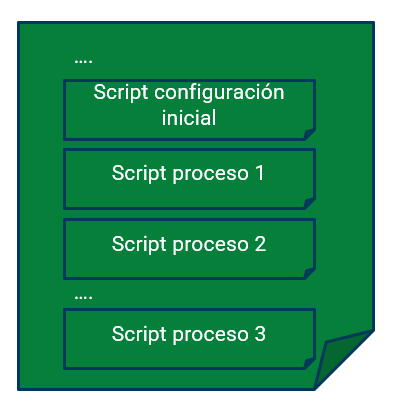
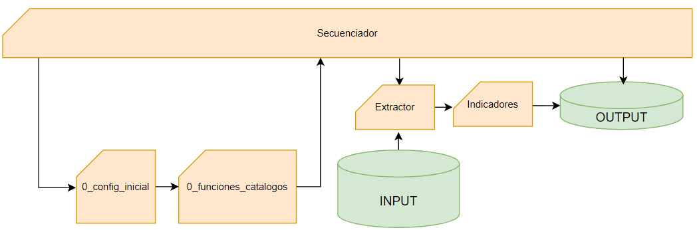
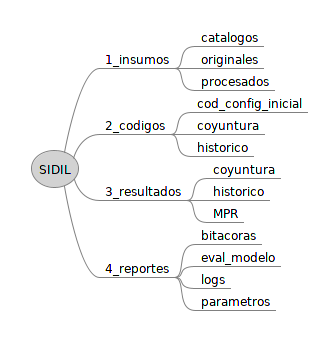

---
output:
  html_document: default
---

# Elementos generales del procesamiento de datos {#elementosgenerales}

## Estructura de Scripts {#estructurascripts}

Para el desarrollo de todas las funciones del SIDIL se utilizan instrucciones de manejo de datos en diferentes lenguajes de programación que permiten la carga, transformación, procesamiento, generación y guardado de información. Todos estos procesos, para fines prácticos se han dividido en una serie de "scripts", esto es de paquetes de instrucciones que se corren para lograr un fin determinado.

Típicamente, en cada script se incluyen múltiples instrucciones al procesador, entre las que destacan la lectura de archivos, la manipulación de variables, la definición de parámetros, etc. Es buena práctica dividir los scripts por conjuntos de tareas. La delimitación exacta no obedece a una regla determinada que es independiente del contexto. Dicho de otra forma, depende de cada proyecto cómo se agrupan las diferentes instrucciones en diferentes scripts.

En coordinación con la STPS, al interior de cada módulo se dividieron las instrucciones en los siguientes grupos de scripts que, en línea general, caracterizan la ejecución de los diferentes procesos a lo largo de los módulos del SIDIL. El criterio principal fue que en los diferentes scripts del SIDIL se dividieran los diferentes procesos de tal forma que se refleje un balance entre minimizar el número de scripts que un usuario debe ejecutar a la vez que se mantiene una coherencia en el contenido y alcance de lo que contengan los respectivos scripts.

El SIDIL contempla más de 20 diferentes scripts. Los scripts podrían ser clasificados de diversas maneras y muchos de ellos son de un alcance muy específico por lo que la gran mayoría de ellos se presenta específicamente en el contexto de cada módulo, en las secciones posteriores. En el anexo 1 se ofrece una presentación tabular de todos los scripts, siguiendo el módulo y el orden en el que generalmente se utilizan.

Sin embargo, hay dos scripts cuya explicación se realiza en esta sección, dado su carácter más general. Estos son el script de configuración inicial y los scripts secuenciadores, a saber:

### Script de configuración inicial y script de funciones y catálogos {#configinicial}

**Hay un único script de configuración inicial y éste es ejecutado con cada actualización de cualquier módulo, directamente a través de los scripts secuenciadores que se escribieron en lenguaje R.** El script tiene como propósito centralizar en un único lugar las definiciones fundamentales que son homogéneas y consistentes a lo largo de todo el SIDIL. Concentrar toda esta información en un solo lugar facilita el mantenimiento y actualización de la información.

En concreto, el script de configuración inicial, identificado con el nombre estable de *0_config_inicial*, ejecuta y define los siguientes aspectos.

-   Carga de paquetes y librerías (ver Anexo 1: R y RStudio)

-   Generación de carpetas y subcarpetas para el funcionamiento del sistema.

-   Parámetros de ejecución, tales como la fecha y hora de ejecución, características del usuario que ejecuta el proceso, mismo que se presenta a lo largo de este documento.

-   *PATH* o direcciones de enlace o acceso a la información (en caso de que requieran ajustes específicos)

-   Parámetros de procesamiento, tales como los niveles de agregación, lista de indicadores, etc.

A su vez, es desde el script de configuración inicial que se ejecuta de manera automática un segundo script de carácter general. Este es el script llamado *0_funciones_catalogos* y como su nombre sugiere cumple dos propósitos

-   Lectura de catálogos de información para el procesamiento, descripción o clasificación de la información, así como la definición de valores umbrales que no están catalogados (tales como el salario mínimo vigente según el municipio y año). Ver sección 3.9 -- página [30](#catálogos-de-información).

-   Funciones definidas para el procesamiento de la información.

**El script de configuración inicial se ejecuta antes de iniciar el procesamiento de cada módulo o proceso en particular**, de manera automática desde los scripts secuenciadores. Esto provee una estructura de información y definición de parámetros armonizada a lo largo de todo el SIDIL, sin importar si se ejecuta uno o varios módulos del sistema.

El motivo por el cual el script que lee catálogos y define funciones no está directamente contenido en el de configuración inicial reside en que para la ejecución de ciertos procesos en la interfaz de automatización se requiere únicamente la lectura de catálogos y funciones. Sin embargo, no afecta a la conclusión de que el script de configuración inicial es de menester importancia y se ejecuta en todos los procesos del SIDIL que se realizan con R.

[@@Propuesta de capsula: tour rapido por config inicial y 0 funciones:
@@ sobre todo importante porque habra cambios importantes para acomodar las apps de las interfaces.
@@posiblemente mas o menos por aqui se incorpore todavía un parrafo al respecto]{.mark}


### Scripts secuenciadores {#secuenciadores}

**Hay once scripts secuenciadores a lo largo del SIDIL, pues su alcance es específico para un proceso determinado dentro de cada módulo.** El propósito es centralizar la ejecución de diversos scripts, asegurando el procesamiento de la información en el orden adecuado, en pro de la coherencia de la información. El script secuenciador llama al procesamiento de otros scripts sin la necesidad de ejecutar cada uno de ellos individualmente.

**Las ventajas de tener un script secuenciador se encuentran en que reducen la atención de una persona a un menor número de scripts para la actualización de ciertas partes de un módulo.** Además, permite que el "aislamiento" de ciertos procesos en scripts muy específicos mantenga una coherencia, toda vez que estos scripts específicos son ejecutados desde el secuenciador, entre otros. Como se observa en la siguiente ilustración, el script secuenciador puede realizar diferentes procesamientos de manera secuencial, por ejemplo, "llamar y ejecutar" el script de configuración inicial, luego realizar lo mismo para otros scripts propios de la fuente de información, a la vez que va generando procesos con la información generada por estos (este tipo de códigos se identifican en la siguiente imagen con los tres puntos (...)).

Ilustración 4 Presentación genérica de un script secuenciador

```{r scriptsecuenciador,echo=FALSE, fig.cap="Presentación esquematizada del funcionamiento de un script secuenciador"}

```

¿Cuántos scripts secuenciadores existen? El número total asciende a once porque actualmente hay un script secuenciador para la actualización de indicadores de la ENOE, otro para indicadores del IMSS, otro para indicadores del Censo Económico y otro tres para el módulo II, concretamente para consulta al DNE, SIAPI y el matching:

Módulo I

1)  Script secuenciador para ENOE

2)  Script secuenciador para IMSS

3)  Script secuenciador para Censo

Módulo II

4)  Script secuenciador de consulta al DNE

5)  Script secuenciador de matching coyuntural

6)  Script secuenciador de predicción de riesgo

Módulo IV

7)  Script secuenciador para ENOE

8)  Script secuenciador para IMSS[^02-elementos_generales-1]

9)  Script secuenciador de consulta de histórico de inspecciones

10) Script secuenciador de matching histórico

11) Script secuenciador de entrenamiento de modelo

[^02-elementos_generales-1]: El lector percibirá que no hay un script secuenciador del censo económico histórico. Esto se debe a que dichos indicadores no entran al entrenamiento del modelo, como se describe en el módulo IV.

En sentido estricto, un análisis más minucioso de los contenidos de este script permitiría sostener que algunos de los scripts arriba definidos como secuenciadores (en el sentido de que organizan el procesamiento de la información recurriendo a otros scripts para la consecución sus objetivos) realmente no tienen esta característica específica de "llamar" a otros scripts, sin embargo, a fines de presentación se simplifica su sistematización llamándolos como tal.

Así, uniendo los conceptos descritos en este y el anterior apartado, se puede presentar la ilustración \@ref(fig:secConfigInicial) en la que se observa cómo un script secuenciador llama al script de configuración inicial, éste a su vez llama al *0_funciones_catalogos* para luego a partir de un script de extracción se lamen los inputs para su transformación, y luego, cuando aplique, los scripts del cálculo de los indicadores, para dar con el output final.

```{r secConfigInicial,echo=FALSE, fig.cap="Presentación esquematizada de la relación "}

```

## Estructura de carpetas y sintaxis de archivos {#estructuracarpetas}

Dada la división de instrucciones en los diferentes scripts que fueron enunciados de manera genérica en la sección anterior, la estructura de las carpetas con que trabaja el SIDIL se describe en esta sección.

La organización de archivos en estas carpetas es agnóstica al sistema operativo y ubicación del SIDIL, siempre y cuando se transfiera el conjunto de carpetas sin realizar modificaciones. De realizarse cambios en los nombres de las carpetas, es muy probable que muchos scripts no funcionen, toda vez que los nombres de las carpetas son parte sustantiva de la identificación de inputs, scripts y outputs que se deben correr. De la misma manera, el cambio en el nombre de algunos archivos, particularmente los catálogos que no llevan una versión en el nombre del archivo, puede requerir ajustes en el código.[^02-elementos_generales-2]

[^02-elementos_generales-2]: En estos casos, para mantener el control de versiones, al resguardar la versión anterior del catálogo, se le agrega la fecha de resguardo de dicha versión "anterior" al nombre del archivo. Ver Recuadro 8.

En algunas carpetas específicas, particularmente las de la subcarpeta de insumos, la estructura ramificada incluye una subcarpeta final llamada "anteriores" que permite almacenar versiones anteriores de los objetos. Esto es particularmente útil para el procesamiento de catálogos toda vez que el código de lectura de catálogos busca específicamente un nombre determinado y todas las versiones anteriores a dicho catálogo deben estar almacenadas en la subcarpeta anteriores.

Cuarto, hay un script que genera esta estructura de carpetas a partir del catálogo de carpetas, el cual crea las carpetas, de no existir alguna de estas.

Hay cuatro grandes carpetas: 1_insumos, 2_codigos, 3_resultados, 4_reportes.

```{r organizacioncatalogos, echo=FALSE, fig.cap ="Organización básica de las principales carpetas"}
#Nota, los nombre de referencia no pueden tener guion bajo




```

Al interior de 1_insumos se encuentran tres subcarpetas:

-   La primera, *catalogos*, reúne los diferentes archivos que sistematizan y etiquetan la información. Sobre ello se profundiza en la sección 3.9.

-   La segunda es *originales* y sirve para depositar las fuentes de información sin procesamiento previo, por ejemplo, los archivos originales en formato dbf que componen la ENOE, o los archivos separados por tabulados que componen los registros administrativos del IMSS.

-   En la tercer subcarpeta, de nombre *procesados*, se almacenan los resultados del procesamiento que ya forma parte del SIDIL, concretamente, el resultado de la extracción y transformación de cada fuente de información, siempre que se requiera el guardado de los temporales procesados. Notar que un criterio que determina si los resultados se resguardan aquí, en esta carpeta, o en *3_resultados* es que siempre que los resultados sean consultados por otro módulo entonces se guardan en *3_resultados*. 

    -   Notar que en el caso de la ENOE, dado que su procesamiento no demanda mucha RAM, no se escribe a disco en esta carpeta. En contraste, para el procesamiento del IMSS se escriben tanto archivos temporales intermedios (que se borran luego de su utilización de manera automática) como también el guardado de los procesados "finales" (sin que estos sean resultados, sino que únicamente "preprocesados" que reducen las dimensiones y "limpian" algunos campos de los insumos).
    
[@@ idea capsula
breve tour por las carpetas dentro de 1_insumos]{.mark}

Al interior de *2_codigos*, existen tres principales subcarpetas:

-   *cod_config_inicial*: almacena el script *0_config_inicial*, y el script *0_funciones_catalogos* que se corren de manera anidada como parte de la ejecución de los scripts secuenciadores

-   *coyuntura:* almacena en sus respectivas subcarpetas, los scripts que se requieren para la explotación de las diferentes fuentes de información. Por ejemplo, para la explotación de las fuentes de información ENOE e IMSS hay carpetas asignadas para almacenar, respectivamente, el script secuenciador, el script de extracción y transformación, los scripts de indicadores y los scripts de reportes.

-   *historico:* lo mismo que *coyuntura* pero a fines de la construcción histórica de los indicadores.

En la carpeta *3_resultados* se distinguen tres subcarpetas:

-   *coyuntura*: contiene subcarpetas para los cálculos de indicadores y las consultas al DNE

-   *historico:* similar al caso anterior, pero con la consideración histórica

-   *MPR:* El principal resultado del SIDIL, todas las versiones de ellas.

En la carpeta *4_reportes* se albergan cuatro subcarpetas

-   *bitacoras:* contiene dos archivos, ambos en formato tabular: Una bitácora donde se registran todas las ejecuciones de todos los scripts secuenciadores, y una bitácora de estatus donde se registra únicamente la última ejecución de cada script. El primero hace a la trazabilidad del sistema, mientras que el segundo permite mantener actualizada una tabla que se despliega en la interfaz de consulta y que informa, justamente, la última ejecución de cada proceso. Estos archivos, respectivamente, se llaman bitácora y bitácora_estatus y están en formato csv.

-   *eval_modelo:* contiene los reportes de evaluación del modelo entrenado

-   *Logs:* resguarda los logs (archivos .txt) que contienen los resultados y mensajes de la consola cuando se ejecutan los scripts

-   *parametros: es la exportación de los parámetros que se definen en el script de configuración inicial.*


[@@ idea video capsula:
breve tour por las carpetas dentro de 4_resultados
particularmente mostrar la diferencia entre las dos bitacoras.
mostrar también cómo se lee el log 
]{.mark}


## Sobre la temporalidad {#temporalidad}

A lo largo de la operación del SIDIL la persona usuaria podrá encontrar referencias a un periodo o momento exacto en el tiempo:

-   Por un lado, está la referencia a la temporalidad que corresponde al periodo de representatividad de la medición o estimación de un fenómeno laboral. Por ejemplo, el primer trimestre de la ENOE, o el 31 de marzo de cierto año para los registros administrativos del IMSS.

-   Por otro lado, está la referencia a la versión de un elemento, sea un script, output o incluso input, que da cuenta de la fecha de su creación y/o última modificación. Por ejemplo, un script puede sufrir cambios y, para asegurar la trazabilidad de cada cálculo, debe guardarse con una versión distinta a la anterior.

El SIDIL, a lo largo de los diferentes módulos, está configurado para procesar o utilizar la última versión de un objeto, independientemente de su periodo de referencia. Es decir, toma la fecha de modificación que forma parte del nombre del archivo. Por eficiencia, lo más sensato es recurrir a la fecha de modificación.

En cambio, el formato de la referencia al periodo temporal es específico para cada fuente de información, toda vez que la frecuencia de actualización y representatividad es específica a cada fuente. Así por ejemplo la tabla con la información sociodemográfica de las personas encuestadas en la ENOE contiene en su nombre "1t2022" haciendo referencia al primer trimestre de 2022. En cambio, para el IMSS; cuya información original es de frecuencia mensual, la referencia es 2022131 (que representa la fecha de corte al 31 de enero de 2022).


```{r versionadoelementos, class.source='myClass', echo=FALSE, out.width="50px", fig.cap="Versionado de elementos", out.extra='style="float:left; background-color: #f5f5f5; padding-right:1em"'}
knitr::include_graphics("images-1/important-icon.svg")
# htmltools::HTML(fn('Nombre del recuadro desde DIV...'))
```

 

```{block, type='rmdcomment', fig.cap="test numeracion block"}
**El principio de versionado para todos los elementos en SIDIL es que la última versión de dicho elemento es la que se debe utilizar,** motivo por el cual, en el nombre del elemento (así como se guarda en las carpetas referidas) se debe incluir la fecha.  

 El formato de definición de la fecha que se utiliza para identificar la versión únicamente será el siguiente: *aaaa_mm_dd_hhmm*, es decir, cuatro dígitos para el año, seguido de un guion bajo, luego dos dígitos para el mes, otro guion bajo, luego dos dígitos para el día, otro guion bajo, y dos dígitos de la hora  y dos de la hora juntos. Notar que la hora es en formato 24 horas. Por ejemplo: 2022_11_03_0901 (año 2022, mes noviembre, día 03, 09 horas con 01 minutos). Este versionado se actualiza y genera automáticamente mediante el script de configuración inicial. La fecha y hora se obtiene directamente del sistema.     
 
 
Para los scripts, el versionado también se incluye en el nombre del script al guardarlo; no es necesario incluir la hora y minuto del guardado pero sí mantener la estructura *aaaa_mm_dd* de la fecha. Notar que el guardado de scripts se realiza de manera manual, toda vez que se consideran relativamente estables en el SIDIL y que justamente por eso el versionado de scripts no lleva horas ni minutos Es decir, cada cambio que se realice al script, se sugiere enfáticamente, debe culminar con el guardado de una nueva versión con una fecha posterior (al menos un día) a la versión anterior. El SIDIL está configurado para que scripts como el secuenciador, busquen la última versión de los diferentes scripts. En consecuencia:  si hay dos elementos con el mismo nombre, se utiliza el que tenga la fecha de edición más reciente. Esta regla aplica para toda lectura de insumos. 

Esto debe distinguirse del periodo de referencia, cuyo formato es específico a las fuentes de información utilizadas. Por ejemplo, en la ENOE se utiliza 1t2022, mientras que en el IMSS se utiliza 2022131 para enero de 2022. 

```
 El versionado de los archivos no solo permite la trazabilidad (ver subsección siguiente) sino que además es indispensable para el funcionamiento adecuado del SIDIL. Dos ejemplos: primero, la lectura de scripts de cálculo de indicadores en el módulo I requiere la identificación de fecha (tan solo para poder aplicarlo, pero además para identificar la versión más reciente). De la misma manera, la interfaz de explotación de datos requiere del adecuado versionado de la MPR para poder identificar la versión más reciente y ofrecer la predicción de riesgos más actualizada.

## Sobre trazabilidad: bitácora, log y parámetros {#trazabilidad}

En el diseño del SIDIL se tomó en consideración la necesidad de asegurar la trazabilidad de la información generada. A tal fin se incorporaron los siguientes elementos al procesamiento de la información a través de los scripts.

-   Bitácora: existe una única bitácora en el SIDIL en la cual se registran *todas* las ejecuciones de los scripts secuenciadores, recuperando la siguiente información sobre el procesamiento de ciertos scripts[\^5], al concluirse su ejecución de manera exitosa.

    -   La información que se registra en la bitácora es la siguiente:

        -   Fecha y hora de la ejecución

        -   Usuario responsable de la ejecución

        -   Nombre del script corrido

        -   Resultado obtenido: mensaje que se genera específicamente para cada script

        -   Liga al archivo de log (lo observado en la consola durante el procesamiento)

        -   Liga a los parámetros (aquellos definidos por configuración inicial o los que surgieron durante el procesamiento de un script).

    -   Por otro lado, existe una segunda bitácora, llamada *bitacora_estatus* donde únicamente se registra la última ejecución de algunos procesos, los cuales se informan en la interfaz de automatización.

-   Log de cada script: como se puntualiza en el anexo, la ejecución de un script, sea en R o Python, genera mensajes que se imprimen a la consola. Esto permite al usuario analizar el avance de la ejecución, detectar posibles inconsistencias, atender diferentes mensajes de errores, advertencias e información errores, etc.

-   Archivo de parámetros definidos: son los objetos generados que se utilizan en los diferentes scripts y que se generan desde el script de configuración inicial.

-   Reportes de la evaluación del modelo: Para los reportes asociados a la evaluación de los modelos, se generarán sólo cuando haya más de un modelo a evaluar, por lo que se exportan en formato tabular los resultados para las diferentes submaterias, según diferentes umbrales, dichos datos se exportan en formato .html, con la etiqueta del umbral usado. Estos reportes se encuentran en *4_reportes/eval_modelo*

## Mensajes al usuario {#mensajesGeneral}

Esta sección adelanta algunos detalles que, independientemente de la ejecución a partir de una interfaz paraguas para la ejecución (semi)automatizada de los diferentes procesos (Ver sección xxx), ya pueden ser confirmados.

A lo largo de su ejecución, los diversos procedimientos reportan mensajes al usuario a través de la consola del software. Estos mensajes pueden ser clasificados en los siguientes grupos:

### Mensajes de error {#mensajesError}

Estos mensajes surgen cuando la ejecución del código no es como se espera y el proceso probablemente falle en una(s) parte(s) o toda su ejecución. Casi con seguridad no se cumplió con el propósito del proceso y el mismo se interrumpió.

En algunos casos el mensaje de error puede reunir dos o tres elementos. Como se observa en el ejemplo a continuación, un primer elemento es el que está escrito en español. Esto es porque en este caso se pudo prever que este tipo de error pudiera surgir. El segundo elemento es el que empieza con "Error in ..." y esta es la información de error que genera el propio sistema. El tercer elemento es el que empieza con "Warning message...", cuya aparición depende del tipo de error. Sobre esto último es importante notar que la aparición de un mensaje de "warning" por si sólo en muchas ocasiones no es un error y sólo es una advertencia del propio sistema. El SIDIL anticipa mucho de estos warning a partir de "encapsular" ciertas partes del código en un TryCatch.

> *"2022-12-22 13:19:13 \*\*\*ERROR\*\*\*: No fue posible guardar el ultimo insumo de Accidentes (STPS_RT_202212.xlsx) debido a: Error in gzfile(file, mode): cannot open the connection*

*Warning message:*

> *In gzfile(file, mode) : cannot open compressed file '.../SIDIL_impaq/1_insumos/procesados/coy_IMSS_acac/accidentes_202212_2022_12_22_09_37_50.Rds', probable reason 'No such file or directory'"*

Notar que no siempre estarán los tres elementos en un mensaje de error. Podría ser un error no previsto, en cuyo caso no habrá un texto en español, o bien el propio sistema podría no arrojar el tercer elemento ("*Warning...*") toda vez que no lo prevé así este lenguaje.

### Mensajes de advertencia {#mensajesAdvertencia}

Son mensajes que requieren la atención del usuario pero que no necesariamente implican que algo haya salido mal, y que no impiden que el procedimiento se desarrolle. Por ejemplo, en el procesamiento de los insumos más recientes de los registros administrativos del IMSS, se notifica al usuario si los periodos de referencia de los dos insumos que se deben "cruzar" (puestos asegurados y patrones registrados) no se refieren al mismo periodo de referencia. En dicho caso, el mensaje se despliega como:

> *"2022-12-22 12:45:15 \*\*\*ADVERTENCIA\*\*\*: el periodo de referencia para insumos Patrones y Puestos no coincide."*

Como se explica más adelante, esto pudiera ser intencional o no y requiere la atención de una persona especialista para evaluar si es pertinente o se requieren ajustar, en este caso, los insumos puestos a disposición del SIDIL.

Notar que tanto los mensajes de error como de advertencia son acompañados, cuando previstos por el sistema, con tres asteriscos antes y después del tipo de error. Esto para propiciar su identificación en la consola.

### Mensajes de información o de confirmación {#mensajesConfirmacion}

Son mensajes que en la mayoría de las veces sólo informan al usuario el inicio o conclusión de algún proceso, mismo que anticipa qué estará procesando la computadora. Un ejemplo es:

> *2022-12-22 12:49:34 INFO: Se comienza lectura de insumo Accidentes: STPS_RT_202212.xlsx - periodo: 202212. El archivo pesa: 0.017 Mb*

En este caso en particular, el peso del archivo puede ser indicativo del tiempo esperado para la ejecución completa de esta sección del código.

## Software para el procesamiento de datos

El conjunto de scripts sobre los cuales descansa el SIDIL han sido desarrollados en R o Python, con el objetivo de aprovechar al máximo las ventajas que ofrecen ambos tipos de lenguaje de programación. La selección de estos lenguajes de programación obedece a la necesidad de escoger software libre, en línea con la Estrategia Digital Nacional (DOF 2021). Además, existen muchas razones por las que R y Python son populares en el área de la ciencia de datos, entre ellas, la disponibilidad de paquetes y librerías especializadas en la ciencia de datos que ahorran tiempo de programación a un usuario; una amplia comunidad de usuarios y una gran cantidad de recursos disponibles en línea, incluyendo libros, tutoriales y documentación; la posibilidad de integrar, a futuro, estos lenguajes con otras herramientas y plataformas como gestores de bases de datos, herramientas de visualización de datos, etc.

En el caso R, se utiliza la versión 2022.07.2+576 o superior (la última disponible a diciembre 2022 es 2022.12.0+353). Para más información ver Anexo 1. 8. En el caso de Python se utiliza la versión 3.10.8.

## Catálogos de información {#catalogos}

A lo largo del SIDIL se utilizan diversos catálogos de información que contienen información necesaria para la ejecución de los procesos. A excepción del catálogo de catálogos en particular, todos los catálogos se encuentran en su respectiva subcarpeta al interior de *1_insumos/catalogos*. El catálogo de catálogos (*cat_catalogos*) tiene como propósito caracterizar el contenido y ubicación de los diferentes catálogos, lo cual se aprovecha para la lectura de estos. Es un insumo clave para que la interfaz de automatización de la operación del SIDIL pueda resguardar adecuadamente potenciales nuevas versiones que reemplacen los catálogos anteriores.

El resto de los catálogos están organizados en subcarpetas según el tipo de información que contienen. Los nombres de las subcarpetas se indican en paréntesis.

1.  Relativos a la clasificación industrial (subcarpeta: *clasificacion_industrial*):

    a.  Catálogo de correspondencia entre SCIAN Hogares y SCIAN México (subcarpeta *SCIAN_HOGARES*, archivo: *cat_scianHOGARES*): este catálogo establece la relación entre el catálogo de clasificación industrial SCIAN para hogares 2018, utilizado en la ENOE, y el catálogo SCIAN a nivel nacional 2018 a 3 dígitos. Si se llega a actualiza el catálogo SCIAN nacional es muy probable que se actualice también el catálogo SCIAN para hogares, por lo que se tendrá que realizar nuevamente esta homologación (conservando el mismo nombre del archivo).

    b.  Catálogo de correspondencia entre IMSS y SCIAN México (subcarpeta *IMSS_SCIAN*, archivo: *cat_correspondencia_IMSS4_SCIAN2ySCIAN3_2018*): Este catálogo establece una relación unidireccional entre la clasificación de actividades siguiendo la taxonomía del IMSS y la del SCIAN 2018 a nivel nacional, a dos y tres dígitos. Es decir, dado el campo de clasificación de actividades que ofrecen los registros administrativos del IMSS, a través de este catálogo se reclasifica dicha actividad para expresarla en la taxonomía del SCIAN. Este catálogo resume los diferentes esfuerzos de comparativa de taxonomías realizados tanto en la STPS como en AIR.

    c.  Catálogo de clasificación de actividades industriales siguiendo el sistema del IMSS (subcarpeta *IMSS*, archivo: *cat_actividades_IMSS*): Este catálogo es, en esencia, la información contenida en el diccionario de datos del IMSS llamado "Diccionario de datos puestos de trabajo afiliados y asegurados sin un empleo asociado / Diccionario de datos asegurados" disponible en IMSS (2023)

    d.  Catálogo de clasificación de actividades siguiendo el SCIAN 2018 (subcarpeta *SCIAN*, archivo: *cat_activ_SCIAN*), conforme publicado por INEGI (2018a). Consultar también las tablas comparativas en INEGI (2018b)

2.  Relativos a campos en las fuentes de información (*fuentes_informacion*)

    a.  Catálogo de campos (subcarpeta *nombres_campos*, archivo: *cat_nombre_campos*): es una tabla para ENOE e IMSS que permite asociar de manera unívoca diferentes nombres del mismo concepto, para, por ejemplo, atender a cambios que ocurrieron en las bases originales a lo largo del tiempo. Por poner un caso: en algunas bases más antiguas (aproximadamente año 2019) el IMSS llamaba como "cve_patron" al campo "registro patronal", nombre que sostiene desde el año 2020. El catálogo permite unificar todas las diferentes versiones de nombre del mismo campo a uno solo. Así, de presentarse nuevos cambios a los campos, sólo es necesario actualizar este catálogo y no todos los códigos. Imagine modificar más de 30 veces el nombre del campo "registro" y asegurar su consistencia a lo largo del tiempo. En este catálogo, el campo *nombre_anterior* refiere al nombre que originalmente es proporcionado por la fuente de información en la versión original de los datos. El campo *nombre_nuevo* registra el nombre con el que se procesará la información a lo largo del código.

    b.  Catálogo de fuentes de información (subcarpeta *fuentes*, archivo: *cat_fuentes*). Este catálogo estipula parámetros que se requieren para que la interfaz de automatización resguarde adecuadamente los insumos de datos, a su vez que se debe mantener actualizado para que, a partir de este archivo, se permita la incorporación de nuevas fuentes de información.

3.  Relativos a información generada durante el procesamiento de información (*procesamiento_informacion*)

    a.  El catálogo de organización de carpetas (subcarpeta *organización_carpetas*, archivo *cat_organizacion_carpetas*). Este catálogo contiene toda la estructura de carpetas del SIDIL, el cual es consultado para verificar la existencia de las carpetas o, si es el caso, crearlas. Este es el único catálogo que no se encuentra en la carpeta de insumos, sino que se alberga junto con el proyecto R.

    b.  Catálogo de indicadores (subcarpeta *indicadores,* archivo *cat_indicadores*). Este catálogo contiene los indicadores calculados que se utilizan en el SIDIL para el entrenamiento y la predicción del riesgo de los CT. Consta de las siguientes columnas: *fuente*, *indicador* (nombre que le fue asignado), *etiqueta* (breve descripción del indicador), *entra_al_modelo* (con opciones de si y no que indica aquellos indicadores que toma en cuenta el modelo predictivo), *especificación* (a qué tipo de combinación de tablas aplica en la fuente de información original, específicamente para indicadores del IMSS). *umbral_cv* representa el máximo nivel del coeficiente de variación que se acepta en una estimación puntual, particularmente importante para la explotación de muestras complejas. *referencia* es el nivel de significancia para la detección de outliers al comparar estimaciones puntuales coyunturales contra valores de referencia construiídos a partir de *etiqueta_MPR* y *descripcion_MPR* son para la caracterización en la MPR. Notar que cualquier cambio en los indicadores (supresión o incorporación de nuevos indicadores o cambios en alguno de los campos) debe ser reflejado en este archivo.

    c.  Catálogo de niveles de agregación (subcarpeta *niveles_agregacion*, archivo *cat_niveles_agregacion*): especifica los diferentes niveles de agregación según la especificidad de los campos de clasificación industrial (a dos y tres dígitos, *scian2018_2* y *scian2018_3*, respectivamente), de geografía (geo2- a nivel estatal- y geo5 - municipal) y de categoría de tamaño (*cat_tamanio*).

    d.  Catálogo de categorías de tamaño (subcarpeta *tamanio*, archivo: *cat_tamanio)*: el catálogo contiene las seis categorías de tamaño de los CT estipulados en el SIDIL. La tabla cuenta con cinco columnas: *cat_tamanio* (enumeración del 1 al 6), *etiq_cat_tamanio* (la etiqueta del rango de tamaño para cada enumeración), *estrato_censo_economico* (la homologación entre el campo *estrato* del Censo Económico y el campo *cat_tamanio*), *p3q_en_enoe* (la homologación entre el campo *p3q* de la ENOE y el campo *cat_tamanio*) y *corte_numerico* (la homologación entre los datos del IMSS y el campo *cat_tamanio*). Si llegase a cambiar alguna de las categorías de alguna de las fuentes, los cambios correspondientes se deben hacer directamente en este catálogo.

    e.  Catálogo de campos del DNE (subcarpeta *campor_DNE*, archivo: *cat_campos_DNE).* El catálogo contiene los campos que serán recuperados del DNE a lo largo de los diferentes scripts. Cuenta con cinco columnas: *fuente* (DNE en todos los casos), *indicador* (con el nombre del campo), *etiqueta* y *entra_al_modelo* (con opciones de si y no para entrar al modelo predictivo), *tabla* (la entidad dentro de la base de datos relacional). Con el campo *tipo* se escpecifica que tipo de filtro aplica al explotar estos campos (que luego en la MPR son atributos de los CT del DNE) a través de la interfaz de consulta.

    f.  Catálogo de campos del SIAPI SIPAS (subcarpeta *campos_SIAPISIPAS*, archivo: *cat_campos_SIAPISIPAS*): Contiene los campos y ubicación de los mismos dentro del sistema SIAPI SIPAS.

    g.  Catálogo de procesos (directamente en la subcarpeta *procesamiento_informacion*): Este catálogo identifica los procesos que se pueden ejecutar desde la interfaz de automatización.

4.  Relativos al marco geoestadístico (subcarpeta *marco_geoestadistico)*:

    a.  Catálogo de entidades y municipios IMSS e INEGI (subcarpeta *municipiosIMSS_INEGI,* archivo*: municipios_imss_inegi*). El IMSS utiliza una clasificación de municipios distinta al marco geoestadístico del INEGI, motivo por el cual este catálogo establece la relación unidireccional de municipios siguiendo la taxonomía del IMSS a municipios siguiendo la taxonomía del INEGI.

    b.  Catálogo de entidades y municipios DNE e INEGI (subcarpeta *municipios_dne_inegi,* archivo*: cat_municipiosDNE_INEGI*). El DNE utiliza una clasificación de municipios distinta al marco geoestadístico del INEGI, motivo por el cual este catálogo establece la relación unidireccional de municipios hacia la taxonomía del INEG.

    c.  Municipios frontera norte (subcarpeta: *municipios_fn*, archivo: *cat_municipiosFronteraNorte*): los centros de trabajo operando en municipios en la Zona Libre de la Frontera Norte tienen estipulado un salario mínimo distinto al del resto del país. Este catálogo expresa con una variable indicativa dicha pertenencia. La información original viene de este [enlace](https://www.gob.mx/se/acciones-y-programas/zona-libre-de-la-frontera-norte).

    d.  Áreas urbanas (subcarpeta *áreas_urbanas*, archivo: *areasurbanas*): este catálogo identifica los municipios que, según el INEGI, forman parte de un área urbana. Es, fundamentalmente, utilizado para el cálculo de concentración de mercado.

    e.  Correspondencia de municipios entre el DNE y el INEGI (subcarpeta *municipios_dne_inegi*, archivo *cat_municipiosDNE_INEGI*): Esto atiende a la realidad de que en el DNE no se utilizó el marco geoestadístico oficial. Por lo que este catálogo permite transitar de la clave de municipio registrada en DNE al marco geoestadístico oficial en México. Actualmente se encuentra asociado al marco geoestadístico de INEGI versión 2023/01, disponible en INEGI (2023).

5.  Relativo al marco normativo

    a.  Catálogo de materias y submaterias que forman parte del potencial alcance de una inspección (subcarpeta *marco_normativo*, archivo: *cat_submaterias)*. Establece la relación entre el código identificador de submaterias y materias de inspección con las etiquetas.


```{r cambioscatalogos, class.source='myClass', echo=FALSE, out.width="50px", fig.cap="Versiones de archivos de catálogos.", out.extra='style="float:left; background-color: #f5f5f5; padding-right:1em"'}
knitr::include_graphics("images-1/important-icon.svg")
# htmltools::HTML(fn('Nombre del recuadro desde DIV...'))
```

```{block, type='rmdcomment', fig.cap="test numeracion block"}
 Si se requiere hacer algún cambio sobre la información que abarca los catálogos este se debe hacer directamente en los mismos catálogos, pero se sugiere sea de la siguiente manera:
 
1) Resguardar una copia del catálogo desactualizado en la subcarpeta *anteriores_descartar* que se encuentra en su respectiva carpeta. Se sugiere guardarlo con la fecha en la que dicho catalogo fue reemplazado.                       

2) Modificar y/o reemplazar el catálogo, para que esta sea procesada correctamente por los scripts, sin cambiar el nombre del archivo del catálogo.          
 
Por ejemplo, si se desarrolla un nuevo indicador que quiere ser integrado al SIDIL, no solo se deben desarrollar sus códigos y guardarlos en las carpetas correspondientes, también debe ser agregado al catálogo de indicadores (*cat_indicadores*), o si cambia el marco normativo, este se debe actualizar en su respectiva carpeta de catálogos (*marco_normativo*).


De ser necesario, es posible resguardar la versión anterior del catálogo, entonces puede resguardarse en la subcarpeta *anteriores*. Lo importante es que el script de configuración inicial, siempre *buscará* el mismo nombre de archivo insumo para cada catálogo, independientemente de su contenido o vigencia.

Precisando esto último, la carga de los diferentes catálogos será a partir de la información resguardada en el catálogo de catálogos, mismo que se encuentra en la raíz del proyecto. Esto es importante porque la consistencia de nombres que se estipula a lo largo del SIDIL también requiere tomar este archivo en consideración.
```


## La Matriz de Predicción de Riesgo

La Matriz de Predicción de Riesgo (MPR) es un producto crítico del sistema. La MPR es la tabla que reúne el universo actualizado de centros de trabajo disponibles en el DNE (una fila de la matriz por cada centro de trabajo), junto con sus atributos más importantes, los indicadores atribuidos a ellos a partir de la explotación de diferentes fuentes de información, y por supuesto, la predicción de riesgo asociada a ciertas submaterias y una predicción de riesgo general (todo ello en las columnas de la matriz). Es, en esencia, el principal producto del SIDIL previo a la priorización de un subconjunto del universo de CT realizada por quien esté a cargo de la programación de inspecciones.

La MPR es un punto crítico porque:

1)  Es el producto con el cual culmina el proceso a cargo de la DGIET, es decir, en donde concluye el procesamiento de información.

2)  Contiene el resumen de toda la información extraída, generada o procesada a lo largo del ciclo del SIDIL para los centros de trabajo.

3)  Junto con los metadatos asociados a la MPR, es el único insumo imprescindible para el funcionamiento de la interfaz de consulta.

4)  Contiene toda la información que, a través de filtros y consultas, permitirá generar los universos susceptibles de ser inspeccionados, priorizados por riesgo de incumplimiento en las diferentes submaterias.


[@@idea capsula:
breve tour por una MPR mostrando que el nro de filas depende del número de CT activos en MPR, y los diferentes tipos de columnas que hay y como se relacionan estos con los catalogos de campos_DNE  y cat_indicadores ]{.mark}