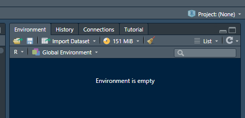
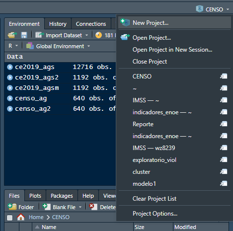
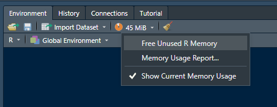

---
output:
  html_document: default
---

```{r setup03, include=FALSE, echo=FALSE}
fn = local({
  i = 0
  function(x) {
    i <<- i + 1
    paste('Recuadro ', '4.', i, ': ', x, sep = '')
  }
})
```

```{r echo = FALSE, results = 'asis', include = FALSE}
library(dplyr)
library(kableExtra, warn.conflicts = TRUE)
library(readxl)
```  


# Anexo: R, RStudio y Python

En este anexo se presentan, fundamentalmente, los conceptos y prácticas básicas en la utilización de la interfaz de RStudio. También se presentan algunos aspectos relevantes de Python, pero que si bien requiere tenerse instalado, desde la perspectiva de SIDIL, no requiere ser ejecutado en una interfaz distinta a Rstudio

## R y RStudio

La gran mayoría de los algoritmos que constituyen el SIDIL se desarrollaron y mantendrán en el lenguaje R.[^05-anexorstudio-1] Esto es independiente de que a través de una interfaz "paraguas" se pudieran automatizar hasta cierto punto la secuencia de los scripts. R es el lenguaje de programación de uso libre desarrollado para el análisis estadístico y gráfico. Afortunadamente existe un ambiente integrado de desarrollo que se llama RStudio (que recientemente cambió su nombre a Posit[^05-anexorstudio-2]) y que facilita la programación, compilación y visualización de desarrollos en el lenguaje R. SIDIL prevé que el usuario procese la información con R Studio, y para que este último funcione se requiere tener R instalado. A continuación, se ofrecen detalles sobre las principales características de R y RStudio.

[^05-anexorstudio-1]: <https://www.r-project.org/about.html>

[^05-anexorstudio-2]: <https://posit.co/>

## El entorno de RStudio

El entorno de RStudio está conformado por cuatro partes (ver ilustración \@ref(fig:entornoRStudio)):

1.  Scripts: En esta parte se generan o cargan los scripts o archivos de código que se van a ejecutar. Se pueden abrir varios scripts a la vez. Todos los scripts, independientemente de que estén en pestañas separadas, utilizan y cargan objetos del mismo ambiente (a menos que se configure distinto, cosa que no sucede en SIDIL). Para correr una línea de un script se debe poner el cursor sobre la línea que se desee correr y presionar la tecla Control (Ctrl) + Intro o se puede presionar el botón "Run" en la parte izquierda superior de esta sección. Para ejecutar el script completo se debe presionar Ctrl + Shift + Intro. Se pueden seleccionar con el cursor las líneas que se deseen correr y presionar Ctrl+Intro o la tecla Run. Para aquellas/os lectores más familiarizados con Stata, el equivalente a un script en dicho software es el "do file".

2.  Ambiente (Environment): En el ambiente se muestran todos los objetos generados por los códigos. Es importante mencionar que los objetos que se alojan en el ambiente no están guardados en el disco rígido del equipo de cómputo, únicamente están disponibles en esta sección mientras se ejecutan los scripts. Para el guardado de los elementos se debe generar el comando correspondiente en el script o consola, determinando el cómo se quiere guardar el objeto generado. Para eliminar un objeto del ambiente se utiliza el comando rm(). Por ejemplo, rm(resultados_analisis). Si se quiere remover todo tipo de objeto en el ambiente, el comando es: "rm(list = ls())". En el ambiente se encuentran diferentes tipos de objetos:

-   Tabla de datos (data): En primer lugar, se presentan los objetos que son tablas de datos. En el ambiente en R se le conoce como data frame y de aquí en adelante se usará de manera intercambiable.
-   Listas: son colecciones ordenadas de objetos que pueden ser del mismo tipo o de diferentes tipos.
-   Vectores: son colecciones de objetos del mismo tipo. o Valores (values): Elementos o conjuntos de elementos que se nombran objetos. Vectores de diferentes tamaños.
-   Funciones (functions): Las funciones son un conjunto de instrucciones que se establecen y que pueden ser llamadas para ser aplicadas a otros objetos.

En esta sección también se pueden importar manualmente datos, ver, establecer conexiones a bases de datos tipo SQL, ajustar el uso de memoria y seleccionar y eliminar elementos del ambiente manualmente. A su vez, se encuentra un acceso a tutoriales con temas específicos de R.

3.  Consola: La consola muestra los resultados de los códigos ejecutados por los scripts, así como posibles errores y advertencias (o warnings). Es importante la distinción entre estos dos tipos de avisos en la consola: mientras que el error implica que el script no se terminó de ejecutar debido a un error, la advertencia o warning solo es un aviso que brinda el programa, pero no implica que la ejecución del código se detenga. En ambos casos, se mostrará en la consola la información del comando sobre el que se generó el error o el warning. En la consola también se pueden ejecutar códigos que no se quedarán guardados en los scripts. También en la consola, a su izquierda arriba, se observa la versión de R que se tiene instalado en el sistema. Actualmente SIDIL está operando con la versión 4.2.0. La buena práctica sugiere siempre mantener actualizado R y RStudio, para lo cual ambos están preconfigurados para advertir al usuario que existe una nueva versión. Se sugiere enfáticamente aceptar las solicitudes de actualización.

4.  Ubicación de archivos, gráficas, paqueterías, ayuda y visualizador: Esta sección que cuenta con varias pestañas sirve para visualizar distintas herramientas. La primera y la cual es de mayor utilidad para este proyecto es la de ubicación de archivos, en esta se pueden observar las carpetas y archivos que se encuentran en la ruta en la que está alojado el proyecto, es de gran utilidad para monitorear los archivos guardados y generados de ser necesario. Las otras pestañas sirven para visualizar gráficas que generen los scripts, paqueterías cargas, ayuda (online) y otros elementos.

```{r entornoRStudio, echo=FALSE, fig.cap ="Entorno de RStudio"}
#Nota, los nombre de referencia no pueden tener guion bajo

knitr::include_graphics("images-1/06/RStudio.png")
```

## Procedimiento para ejecutar proyectos y scripts en RStudio

Abrir el proyecto SIDIL: Esto es fundamental, porque los proyectos en R Studio mantienen de manera ordenada en una misma ruta todos los elementos necesarios para que los códigos se ejecuten de manera correcta, de igual manera albergan los resultados que se producen de dichos códigos.

Lo importante es primero abrir el proyecto SIDIL, sea desde el Explorador de Windows o desde RStudio.

-   Si se abre desde el explorador de archivos, se podrá identificar el proyecto por el logo de R y por el tipo de archivo .Rproj. Si se ha abierto con anterioridad el proyecto, este podría desplegar los scripts que se hayan utilizado con anteriormente, si no, será necesario abrir los scripts que se deseen ejecutar o editar en la primera sección de la pantalla (I. Scripts) o seleccionándolos directamente en la sección IV de ubicación de archivos.

-   Si se abre desde el programa RStudio, primero se debe asegurar que no esté ningún proyecto cargado. En la parte superior derecha (sección II de la pantalla), se puede identificar el proyecto en el que se está trabajando. En la ilustración \@ref(fig:RStudioProyectoVacio) se observa que en el ambiente no se muestra ningún proyecto. Al hacer clic sobre la flecha señalando hacia abajo se despliega el menú que permite seleccionar "Open Project..." (ilustración \@ref(fig:RStudioOpenProject)) , navegar hasta la ubicación del proyecto *SIDIL.Rproj* seleccionarlo y abrirlo para.

```{r RStudioProyectoVacio, echo=FALSE, fig.cap ="Vista del ambiente sin proyecto"}
#Nota, los nombre de referencia no pueden tener guion bajo


```

```{r RStudioOpenProject, echo=FALSE, fig.cap ="Vista del ambiente sin proyecto"}
#Nota, los nombre de referencia no pueden tener guion bajo


```

Si hubiera algún proyecto previamente cargado, se debe cerrar desplegando el menú del proyecto y seleccionando "Close Project" (tercera opción en la ilustración \@ref(fig:RStudioOpenProject)).

El siguiente paso es abrir el script que se desea correr o editar, o bien, generar un nuevo script: Los archivos de códigos que utiliza el proyecto SIDIL en el ambiente RStudio puede ser de dos tipos: R Script (tipo. R) o R Markdown (tipo .Rmd). Para abrir un archivo ya existente o generar uno nuevo se puede realizar desde la primera sección de la pantalla (I. Scripts), donde el primer ícono despliega las opciones de nuevos documentos que se quieren creen, y el tercero abre el explorador de archivos para seleccionar alguno de los documentos ya existentes. Un script ya existente también se puede abrir desde la sección IV del programa RStudio, únicamente hace clic sobre el archivo. R o .Rmd que se desee abrir.

Una parte primordial para la ejecución de los scripts es la instalación y el llamado de las paqueterías que se utilizarán, ya que estas albergan los comandos que se utilizan en los archivos de códigos. Si bien R Studio cuenta con algunos comandos básicos, la versatilidad del programa permite importar y utilizar cientos de paqueterías que facilitan la generación de códigos con sus comandos. A continuación, se presentan las paqueterías que utiliza el proyecto SIDIL junto con algunos de los principales comandos de cada una. Esta lista de principales comandos no es exhaustiva y muchas paqueterías pueden contener cientos de comandos.

```{r echo = FALSE, results = 'asis'}
tabla1 <- read_excel("./data/tablas05.xlsx", sheet = "tabla1")
kable(tabla1, caption = "Principales paqueterías de R utilizadas en el SIDIL") %>%
  kable_styling(bootstrap_options = c("striped", "hover"), full_width = T, font_size = 14) %>%
    scroll_box(width = "100%", height = "600px")
```


Existen algunos comandos que se usan con más frecuencia y que resultan muy importantes para la lectura y procesamiento de la información. Algunos de estos son:

-   Comandos read_excel() y read_csv(): Estos comandos permite leer y cargar archivos de formato .xlsx y .csv al ambiente de RStudio. Ejemplo:

``` r
correspondencia_cat_scianHOGARES <- read_excel("I:/CALLE/Data/SIDIL/1_insumos/catálogos/clasificacion_industrialcat_scianHOGARES.xlsx")
```

Notar que en Rstudio los separadores diagonales o slash deben estar inclinados a la derecha (/).

-   El comando here(): permite establecer la ruta donde se ejecutarán los archivos, suele ser la misma donde se localiza el proyecto R. Es muy útil para cargar y guardar archivos, ya que únicamente se tendrá que utilizar el comando here() para reemplazar toda la ruta, que de otra manera tendría que ser escrita en su totalidad. Ejemplo:

``` r
correspondencia_cat_scianHOGARES <-read_excel(here(), "1_insumos","catálogos","clasificacion_industrial","cat_scianHOGARES.xlsx")
```

-   Los comandos paste() y paste0(): Estos comandos funcionan para concatenar elementos. El primero permite determinar un separador entre los elementos. Ejemplo:

``` r
bitacora <- read_csv(paste(here(),"4_reportes","bitacoras","bitacora.csv",sep = "/"))
``` 

-   El comando source(): Este comando permite llamar y correr otros archivos script .R y .Rmd desde otro script. En otras palabras, el comando facilita la ejecución de múltiples scripts desde uno solo. Ejemplo:

``` r
source(here("2_codigos","cod_config_inicial","0_config_inicial.R"))
``` 

-   El operador pipe " %\>% ": este operador permite concatenar diversas líneas de código sobre un mismo objeto, sin necesidad de volverlo a"llamar" o nombrar. Ejemplo:

``` r
enoe <- ENOEN_sdemycoes %>% mutate(contrato_escrito=ifelse(contrato_escrito==1,1,0))
``` 
-   Los comandos \_join: comprende left_join(), right_join(), full_join(), semi_join(), inner_join() y anti_join(). Este grupo de comandos se utiliza para unir dos data frames o tablas. Ejemplo:

``` r
ENOEN_sdemycoes <-left_join(ENOEN_sdemycoes, correspondencia_cat_scianHOGARES, by=c("p4a_tres"="scian_hogares_2018")
``` 

-   El comando mutate(): sirve para crear nuevas variables o campos dentro de un data frame o tabla, es muy importante para la transformación de la información. Ejemplo:

``` r
enoe <- ENOEN_sdemycoes %>% mutate(ing_min=ifelse(ing7c==1,1,0))
``` 

-   El comando filter(): permite filtrar información de una variable o campo excluyendo una o muchas de sus categorías o rangos. Ejemplo:

``` r
ENOEN_sdemycoes <- ENOEN_sdemycoes %>% filter(p3h==1)
``` 

-   El comando select(): selecciona una o más variables o campos de un data frame o tabla. Ejemplo:

``` r
ENOEN_sdemycoes <- ENOEN_sdemycoes %>% filter(p3h==1)
``` 

-   El comando select(): selecciona una o más variables o campos de un data frame o tabla. Ejemplo:

``` r
ENOEN_sdemycoes <- ENOEN_sdemycoes %>% filter(p3h==1)
``` 

-   El comando case_when(): funciona para clasificar o reclasificar categorías de una variable o campo (cuando a, entonces b; cuando c, entonces (simbolizado por " \~ ") d; etc.). Este comando permite hacer comparaciones entre categorías de la misma variable o entre diferentes variables utilizando símbolos de igualdad y desigualdad como"=","\>","\<","!=" (diferente) para crear las nuevas categorías. Ejemplo:

``` r
ENOEN_sdemycoes <- ENOEN_sdemycoes %>% 
mutate(cat_tamanio= as.factor(case_when(
  cat_tamanio<= 3~'1', 
  cat_tamanio==4~'2', 
  cat_tamanio>=5 & cat_tamanio<=7~'3', 
  cat_tamanio==8~'4', 
  cat_tamanio==9~'5', 
  cat_tamanio>=10~'6')))
``` 

Notar que el case_when clasifica las situaciones con la jerarquía con la que sucede la ocurrencia: Es decir, si una observación cumple con dos "casos" entonces al evaluarse el primer caso y cumplirse, ya no se evalúa el segundo caso.

-   El comando if_else() o ifelse(): Al igual que el comando anterior, funciona para reclasificar categorías de variables o campos, aunque esta función permite solo dos opciones de clasificación (si sucede x, entonces y). Ejemplo:

``` r
enoe <- ENOEN_sdemycoes %>% mutate(presta_soc=ifelse(pre_asa==1,1,0))
```

-   El comando for(): Este comando permite hacer iteraciones de uno o más comandos sobre los elementos declarados, estos elementos pueden ser pertenecientes a un vector o lista. Ejemplo:

``` r
for (i in lista_indicadores_enoe){
dir.create(paste0(here("3_resultados/coyuntura/res_coy_ENOE", i))), ENOE"))}
```

-   Comandos sub(), gsub(), y aquellos que inician con stri\_() o str\_(): Estos comandos sirven para transformar e identificar patrones en cadenas de texto (o procesamiento de lenguaje natural) utilizando diversos códigos. Ejemplo:

``` r
filter(str_detect(nombre_archivo,"SDEM"))
```

-   Comando as_survey_design(): este comando se utiliza para declarar una base de datos como encuesta a partir de sus variables muestrales. Ejemplo:

``` r
enoesvyset <- enoe %>% as_survey_design(strata = estrato, weights = peso, id = upm, nest=TRUE)
```

-   Comandos que empiezan con svy\_() o survey\_(): Estos comandos toman en cuenta la encuesta declarada para hacer cálculos sobre la misma considerando su diseño muestral. Entre estos podemos encontrar: survey_mean() y survey_ratio(). Estos comandos brindan la opción de obtener el error estándar (se), los intervalos de confianza (ci), la varianza (var), y los coeficientes de variación (vi) de las estimaciones calculadas. Ejemplo:

``` r
valor=survey_mean(ing_min, vartype = c("cv"), na.rm=T)
```

-   Comando try_catch(): Este comando permite poner condiciones a la ejecución de otros comandos en R. Suele utilizarse para mostrar errores y warnigs que se deben tener en cuenta, por ejemplo, si no se encontró algún archivo o script. Usualmente el comando impide que se detenga la ejecución del código ante posibles errores, aunque se debe prestar especial atención a los mensajes de error y warnings que se produzcan en la consola. Ejemplo:

``` r
municipios_frontera_norte <-
tryCatch(
suppressMessages(read_csv(paste(path_a_marco_geo,"municipios_fn","municipiosFronteraNorte.csv",sep="/"),
error= function(e) {cat(crayon::red("\n","\n",paste("*** ERROR *** No se ha cargado: Catalogo de municipios en la frontera norte.")),"\n","\n")})))
```

-   Comando saveRDS(): este comando permite guardar data frames en formato .Rds. Ejemplo:
``` r
saveRDS(enoe_temp,paste0(here(),"/", "3_resultados/coyuntura/res_coy_ENOE","/" ,nombre,"/enoe\_",nombre,"\_",periodo,anio,"\_",v,".Rds"))
```
  Existen otros comandos para guardar las bases de datos en otros formatos: write.csv(), write.dta(), entre otros.

Además de estos, se utilizan muchos otros comandos de las paqueterías cargadas, no obstante, estos son los que se utilizan con más frecuencia ya que son los básicos para la carga, transformación y guardado de la información que utiliza el SIDIL. Si surge alguna duda, o si se requiere profundizar en estos u otros comandos, existe amplia información en internet que incluye explicaciones y ejemplos sobre el uso de los diversos comandos en el ambiente de RStudio, dos de las principales fuentes de consulta son: www. cran.r-project.org y [www.stackoverflow.com](http://www.stackoverflow.com), o bien con el comando help(package="\_\_"), poniendo entre las comillas el nombre de la paquetería que se desea buscar. De igual manera, si se desea buscar información sobre algún comando, se puede utilizar la línea de código help(\_\_, package="\_\_"), poniendo en el primer argumento el comando en cuestión y en el segundo la paquetería al que pertenece.

## Tipos de errores que se pudieran presentar

Típicamente se pueden presentar los siguientes errores al trabajar en RStudio.

1)  Errores de lectura de información

    a.  Ubicación de los archivos mal escrito: este suele el error más frecuente para la lectura de archivos. Se debe asegurar que la ubicación y el nombre de los archivos se escriba correctamente para su optima apertura.

    b.  Tipo de archivos: De igual manera, se debe asegurar que se esté utilizando el comando correcto para cada tipo de archivo. Es decir, si se quiere abrir un archivo .csv se debe utilizar el comando "read_csv", mientras que si se quiere abrir un archivo .Rds se debe utilizar el comando "readRDS".

2)  Errores de procesamiento de información

    a.  Problemas con los campos

        i.  Campos que no se encuentran: Este error puede estar relacionado con problemas de cambio de los nombres de los campos o que directamente se dejaron de incluir por diversas razones en la fuente de información original

        ii. Problemas con el tipo de variables o campos del data frame: No todas las transformaciones se pueden hacer a todos los tipos de variables o campos, es por esto por lo que primero se debe asegurar que el campo a transformar sea el que deseamos. Para esto, se puede utilizar el comando class(dataframe\$campo). Para realizar un cambio en el tipo de un campo se pueden utilizar los comandos que inician as.\_(), por ejemplo: as.double(dataframe\$campo), as.character(dataframe\$campo), entre otros.

    b.  Insuficiencia de memoria RAM para el procesamiento

        i.  Este es un error que reporta directamente el RStudio con el mensaje *"cannot allocate vector...."*

            1.  Hay dos posibles causas:

                a.  Que en efecto el procesamiento de la información sea el adecuado, pero quizá, incluso por otros procesos en curso, la computadora no cuenta con la memoria suficiente. Para esto se deben finalizar en el administrador de tareas los programas que no estén en uso, y desde la consola de RStudio, desplegar el menú de memoria en uso del ambiente, y liberal memoria que no esté en uso, como muesta la ilustración \@ref(fig:memoriaRstudio).

```{r memoriaRstudio, echo=FALSE, fig.cap ="Liberación de memoria en RStudio"}
#Nota, los nombre de referencia no pueden tener guion bajo


```

b.  Que el algoritmo no esté procesando la información en la estructura predefinida lo que genera objetos cuyas dimensiones no son las correctas y consumen excesiva memoria. Por ejemplo, duplicidades innecesarias en algunos registros que se pretenden unir entre diferentes bases con la misma información.

> Si el error es debido a lo anterior, se debe asegurar que los insumos utilizados en los procedimientos sean los correctos.

3)  De error en el lenguaje:

    i.  Mal escrito el código: Es muy frecuente que los errores se den porque, al insertar líneas de códigos hay algún error de tipeo.

    ii. La paquetería ya no incluye el comando sugerido

        1.  Pudiera ser un warning, que desde CRAN no se informa la falta de mantenimiento/seguimiento a dicho comando/paquete. Esta advertencia no detendrá el proceso, pero se debe hacer seguimiento a dicho comando en caso de que se deje de incluir definitivamente

        2.  Podría ser un error en el cual, por diversos motivos, ya no se incluye el comando en la paquetería seleccionada. Usualmente cuando esto sucede la propia consola de R muestra los nuevos códigos con los que fue reemplazado el código en desuso

La consola de RStudio siempre mostrará el error y alguna información extra, esta debe ser tenida en cuenta ya que muestra la naturaleza del error y, algunas veces, la solución, de no ser así, se puede rastrear el error y solucionarlo con ayuda de internet.

## Python

A continuación, se dará una breve descripción de las principales librerías de Python usadas para el SIDIL. Entre paréntesis se indica el número de versión que se utiliza de cada librería.

-   Numpy (1.23.4) proporciona soporte para el cálculo numérico y la manipulación de datos en forma de arrays y matrices. Es muy útil para realizar cálculos matemáticos y estadísticos de forma eficiente, y es una de las librerías más utilizadas en el área de la ciencia de datos.

-   Pandas (1.4.4) se utiliza para la manipulación y análisis de datos. Ofrece una serie de herramientas para importar, limpiar, transformar y visualizar datos de forma sencilla y rápida. Es muy útil para el procesamiento y análisis de conjuntos de datos de gran tamaño y complejidad.

-   Scikit-learn (1.1.2) proporciona una amplia gama de algoritmos de aprendizaje automático y herramientas para el análisis de datos. Incluye una gran variedad de modelos de aprendizaje automático, como árboles de decisión, regresión lineal y SVM, y proporciona una interfaz sencilla y consistente para su uso.

-   PyTorch (1.12.1) para el desarrollo de redes neuronales y aprendizaje automático profundo. Ofrece una amplia gama de herramientas y funcionalidades para el diseño y entrenamiento de modelos de aprendizaje automático profundo (*Deep* *learning*). Además esta librería permite acceder al modelo tabnet que es la primera variante al modelo Random forest que resultó ser el esocigod tcon base en las métricas de performance.

-   Matplotlib (3.6.2): se utiliza para crear gráficos y visualizaciones interactivas de datos en 2D y 3D. Matplotlib ofrece una amplia variedad de tipos de gráficos, como líneas, barras, histogramas, dispersión, gráficos de torta, entre otros.

-   Yellowbrick (1.5): se enfoca en la visualización y diagnóstico de modelos de aprendizaje automático. Proporciona una variedad de gráficos y herramientas interactivas para evaluar y entender el rendimiento y el comportamiento de los modelos de aprendizaje automático. Es una herramienta útil para el análisis y mejora de modelos, lo que ayuda a tomar decisiones más informadas en el proceso de desarrollo de algoritmos de aprendizaje automático.

-   Pydotplus (2.0.2): se utiliza para la generación y visualización de gráficos de redes y árboles en Python. Se utiliza principalmente para visualizar estructuras de datos jerárquicas, como árboles de decisión generados por algoritmos de aprendizaje automático.

-   Clean-text (0.6.0): se utiliza en la limpieza y preprocesamiento de datos de texto. Proporciona una variedad de funciones para eliminar caracteres especiales, eliminar stopwords, realizar lematización y más.

-   Pyreadr (0.4.7): es una librería para facilitar la lectura y escritura de archivos en diversos formatos, como CSV, Excel y más. Proporciona funciones para cargar y guardar datos en diferentes formatos, lo que simplifica la manipulación de conjuntos de datos almacenados en archivos externos.

-   Shap (SHapley Additive exPlanations, 0.41.0): se utiliza para explicar las predicciones de modelos de aprendizaje automático. Se basa en la teoría de juegos y proporciona un marco de trabajo para calcular la importancia de cada característica (atributo) en el resultado de un modelo. Shap es una herramienta útil para interpretar y entender el comportamiento de modelos de aprendizaje automático, lo que puede ayudar a aumentar la confianza en sus predicciones y detectar posibles sesgos.
