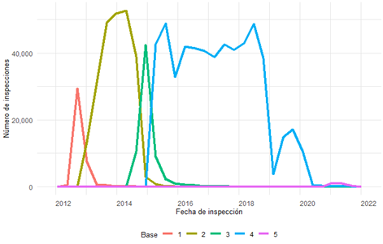
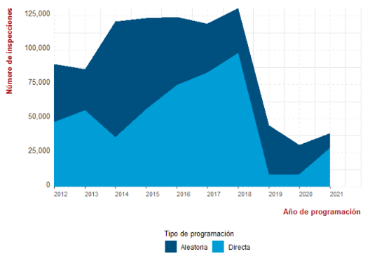
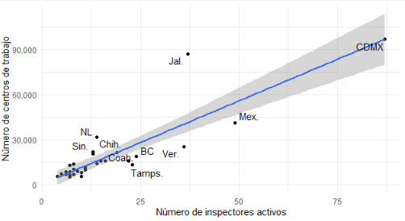
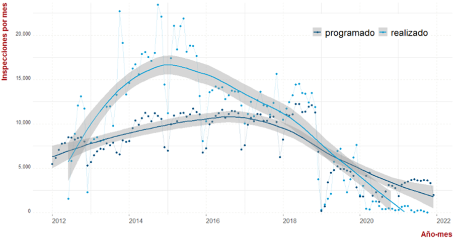
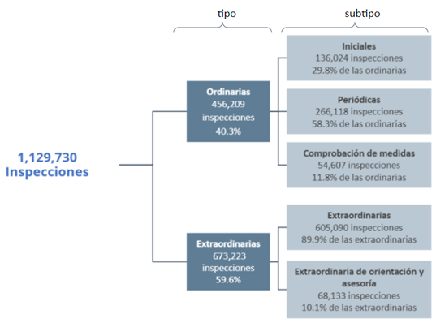
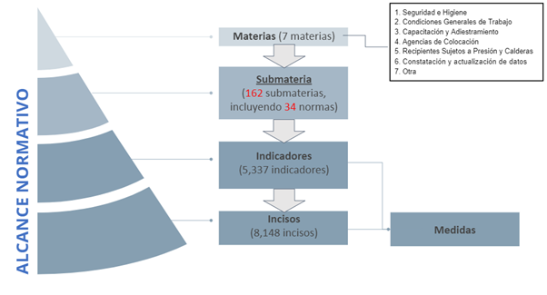
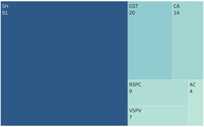
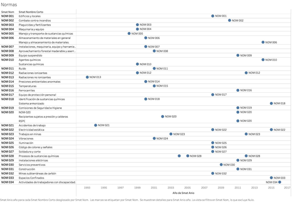
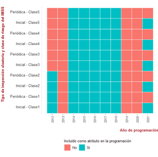

---
output:
  html_document: default
---

# Conceptos y hallazgos clave en la exploración del SIAPI-SIPAS

Esta sección presenta el análisis que AIR hizo sobre los sistemas con los que cuenta la STPS para el apoyo a la inspección laboral (SIAPI) y al proceso sancionador (SIPAS), con dos principales propósitos. Primero, profundizar en algunos de los conceptos que resultan críticos en la explotación de los registros administrativos de la inspección. Esto para homologar un único vocabulario e interpretación del alcance del SIDIL en lo que refiere a la inspecciones; segundo, para dar cuenta del volumen de información y la calidad de la misma y que el SIDIL consume a efectos de realizar las predicciones.

La sección está organizada de la siguiente manera:

## Conceptos y clasificaciones relevantes.

Conviene comenzar por la importancia de la explotación de los registros administativos. Quizá la principal información que interesa extraerse del SIAPI es si la inspección ha detectado violaciones a la normativa laboral porque es, justamente, lo que el modelo busca predecir. **La variable dependiente que entra en el entrenamiento del modelo predictivo será aquel aspecto para el cual luego el modelo, al aplicarlo, buscará predecir su ocurrencia.** Seleccionar otra información como variable dependiente, implicará que el modelo prediga sobre esa otra información de entrada.

**Como se ha mencionado al explicar el [entrenamiento](#procesamientoModIVSIAPI) del modelo, éste toma como variable dependiente la detección de violaciones que proceden, una vez que las inspecciones son calificadas por la [UTD]{.mark} y se acepta como procedente para iniciar el procedimiento de sanción**. Pues bien, este anexo guia a el / la lector/a a identificar cómo es que se arriba a esta definición y cómo se mide, para lo cual el recorrido no es del todo lineal ni evidente para aquellas personas menos familiarizadas con el sistema. **Notar que, mientras que la explotación de los registros administrativos obedece fundamentalmente a la necesidad de *entrenar* el modelo a partir de los centros de trabajo que fueron inspeccionados, la predicción del mismo, se realiza sobre el universo total de los mismos, independientemente de su historial de inspecciones.**

Una importante precisión es que en la STPS los sistemas de apoyo a la inspección han tenido a lo largo de los años diferentes "instancias" o "cortes", que se condicen con cada uno de los cambios importantes en la normatividad de la inspección. Esto se debe a que las herramientas utilizadas para apoyar los procesos de inspección no contaban hasta ahora con mecanismos que permitan el manejo y administración de diferentes versiones del marco normativo en una sola instancia del sistema. Por lo cual, ante un nuevo reglamento de inspección o ante una modificación sustantiva a la las leyes y normas en la materia, se requirió copiar el sistema en una nueva instancia en la cual se pudieran reflejar la situación normativa derivada de esa modificación.[^07-anexosiapi-1]

[^07-anexosiapi-1]: Como parte de su colaboración con STPS, AIR ha desarrollado un gestor de normativ

Son cinco los "cortes" que se han realizado a la base de datos, mismos que se han integrado para realizar el análisis que se presenta a continuación. Los 5 "cortes" representan la totalidad de la base de datos y la integración selectiva de los diferentes casos (inspecciones) a lo largo de los diferentes "cortes" previene de duplicar la información y la tergiversación de los hallazgos, se ha requerido un importante trabajo de análisis para la unificación de bases de datos y generar el universo global de las inspecciones realizadas. Esta tarea requirió por supuesto entender la lógica en que se debe hacer la agregación de las inspecciones y ha dado como resultado un universo de cerca de un millón cien mil inspecciones totales en el período, conformándose así el universo de análisis. Cabe agregar que, por lo general, con los diferentes cortes que se realizan se generan pequeños cambios en las taxonomías de algunas variables, y, en menor medida, surgen nuevas tablas al interior de la base de datos.

El volumen de información que se encuentra en cada uno de los "cortes" varía, y como se observa en la ilustración \@ref(fig:volumeninspecciones), de los cinco "cortes" distintos que se realizaron a la base de datos, el primero consta de cerca de 60 mil inspecciones, con inspecciones que se realizaron entre junio 2012 y abril 2015, mientras que el último corte es el que incorpora las inspecciones realizadas entre enero 2020 y octubre 2021.

```{r volumeninspecciones, echo=FALSE, fig.cap ="Módulos que componen el SIDIL"}
#Nota, los nombre de referencia no pueden tener guion bajo


```

Recuadro [xx1]{.mark}: Conformación del *índice* de inspecciones

+----------------------------------------------------------------------------------------------------------------------------------------------------------------------------------------------------------------------------------------------------------------------------------------------------------------------------------------------------------------------------------------------------------------------------------------------------------------------------------------------------------------------------------------------------------------------------------------------------------------------------------------------------------------------------------------------------------------------------------------------------------------------------------------------------------------------------------------------------------------------------------------------------------------------------------------------------------------------------------------------------------------------------------------------------------------------------------------+
| La existencia de múltiples instancias de la base de datos del SIAPI obliga a conformar un índice de inspecciones para evitar su conteo duplicado. La lógica es que, de no hacerlo, una misma inspección podría incorporarse hasta 5 veces en la base de entrenamiento.                                                                                                                                                                                                                                                                                                                                                                                                                                                                                                                                                                                                                                                                                                                                                                                                                 |
|                                                                                                                                                                                                                                                                                                                                                                                                                                                                                                                                                                                                                                                                                                                                                                                                                                                                                                                                                                                                                                                                                        |
| A tal efecto, el algoritmo *4_query_violaciones_inspecciones\_* realiza en un primer momento una explotación de todos los campos *inspeccion_id* de todas las instancias del SIAPI. De cada instancia recupera todas las inspecciones que ésta contenga. Acto seguido, identifica para cada inspección la primera instancia en la que *aparece* esta inspección. Ésta será la instancia a la que se asociará la inspección. En todas las consultas y emparejamientos subsecuentes se buscará únicamente la información sobre la inspección que haya sido registrada en dicha instancia. De haber información que erroneamente se haya registrado sobre la inspección en otra instancia, ésta no será tomada en cuenta. La lógica detrás, validada con la UTD, es que el marco normativo con el que nace la inspección es el que se mantendrá vigente a lo largo de todo el proceso inspectivo, motivo por el cual, toda información que se genera en las diversas etapas del procedimiento serán recuperadas de esa instancia donde por primera vez *nace´* la inspección, únicamente. |
+:=======================================================================================================================================================================================================================================================================================================================================================================================================================================================================================================================================================================================================================================================================================================================================================================================================================================================================================================================================================================================================================================================================================+
|                                                                                                                                                                                                                                                                                                                                                                                                                                                                                                                                                                                                                                                                                                                                                                                                                                                                                                                                                                                                                                                                                        |
+----------------------------------------------------------------------------------------------------------------------------------------------------------------------------------------------------------------------------------------------------------------------------------------------------------------------------------------------------------------------------------------------------------------------------------------------------------------------------------------------------------------------------------------------------------------------------------------------------------------------------------------------------------------------------------------------------------------------------------------------------------------------------------------------------------------------------------------------------------------------------------------------------------------------------------------------------------------------------------------------------------------------------------------------------------------------------------------+


Dada la posibilidad de la coexistencia de diferentes marcos normativos (ver recuadro [XXX 1 XX]{.mark}) existe una intersección temporal entre los diferentes “cortes", explicando además que el volumen de inspecciones que representa el “corte” 4, mismo que va de diciembre 2012 a septiembre 2021, represente al 56% de las inspecciones registradas,  como se observa en la tabla [xxx1xxx]{.mark} Ambos aspectos se explican por la misma causa: los “cortes” representan cambios al marco normativo, mientras que cada proceso de  inspección debe por lógica corresponder con un único marco normativo (la inspección que “nace” bajo un marco normativo se sostiene en ese ámbito, incluso cuando éste marco jurídico es reemplazado por uno nuevo). Por ello mientras se va concluyendo el proceso inspectivo de un caso, es posible que ante un nuevo cambio normativo coexistan temporalmente diferentes versiones del sistema. 

Tabla xxx1xxx. Distribución de las inspecciones, por fecha de inspección y “corte” de la base.
[PENDIENTE hacer tabla ]{.mark}
Corte de la base	Fecha inicial	Fecha final	Número de inspecciones 
1	15/08/2012	27/11/2012	59,879
2	23/04/2013	05/08/2014	318,772
3	09/10/2014	12/03/2015	115,109
4	03/07/2015	14/11/2018	633,176
5	28/01/2021	31/07/2021	2,794
Total	1,129,730

**Fuente: Elaboración propia a partir del SIAPI-SIPAS. Nota: las fechas iniciales y fecha finales comprenden al decil 1 y al decil 9, respectivamente de cada base de datos, es decir, pueden encontrarse fechas anteriores y posteriores a las indicadas, pero son excepciones. **


### Planeación de la inspección
 
Si bien el SIDIL es una herramienta estratégica para la programación de inspecciones en el marco de operativos de inspección (por definición, son inspecciones del *tipo* *extraordinario*), la información que se explota para el entrenamiento del modelo no se limita a este tipo de inspecciones. 

La planeación del año se realiza conforme a la disponibilidad de recursos y las prioridades de política pública. Por lo general, a finales de cada año se realiza una planeación anual de las inspecciones para determinar las metas anuales para el año fiscal siguiente, conforme a la disponibilidad de inspectores por oficina, tomando además en cuenta las prioridades de política pública de la gestión. En promedio, entre 2012 y 2021 se estableció una meta anual de 91,026 inspecciones por año. A grandes rasgos se observan tres fases distintas en cuanto a este promedio, como se presenta en la ilustración \@ref(fig:Metasanualesinspeccion): entre 2012 y 2013, la meta anual osciló entre 86,000 y 89,000 inspecciones anuales; de 2014 a 2017 se ubicó entre 119,000 y 124,000 seguido por un máximo observado en 2018 con 130,000 inspecciones y de 2019 en adelante, la meta se redujo a la mitad e incluso hasta un tercio de los niveles de 2012 y 2013. En 2019 la meta alcanzó las 45,061 inspecciones, en 2020 las 30,721 inspecciones y en 2021 39,198 inspecciones. Como se observará más adelante, hay una discrepancia entre la meta anual y lo realizado de hecho, motivo por lo cual sería precipitado concluir en una reducción del volumen de la carga de trabajo. 

La meta anual de inspecciones se distribuye en dos grandes tipos: las de programación aleatoria y las de programación directa. La programación aleatoria es la que se asocia con inspecciones del tipo ordinario, mientras que las de programación directa corresponde a las inspecciones del tipo extraordinario. Se suma un tercer tipo que es el de programación automática y que abarca las inspecciones de comprobación de medidas, como se explicará más adelante.


El conjunto de las inspecciones de programación aleatoria se compone de inspecciones iniciales y periódicas. Mientras que las inspecciones iniciales son las que se realizan por primera vez a un centro de trabajo (CT) o por ampliación o modificación de éstos , las periódicas tienen cierta frecuencia predeterminada según los resultados de las inspecciones anteriores realizadas al mismo CT, “tomando en consideración la rama industrial, la naturaleza de las actividades que realicen, su grado de riesgo, número de trabajadores y ubicación geográfica” . Ambas conforman buena parte de las inspecciones del tipo ordinaria, sumándose a este grupo las inspecciones de comprobación de medidas  en materia de Seguridad e higiene, como se detalla más adelante.


Por su parte, las inspecciones de programación directa incluyen, pero no se limitan, a las inspecciones realizadas en el marco de un determinado operativo. Los operativos, como se verá más adelante, son un tipo de programación de inspección de un alcance específico que atiende a temáticas o prioridades predefinidas. 
A lo largo de la década analizada el 54.9% de las inspecciones realizadas fueron de programación directa, y el 45.1% de programación aleatoria (ver ilustración 3). Esto no ocurrió sin cierta cierta variación de un año a otro: En 2018 fue cuando la programación directa tuvo el mayor peso (75%), mientras que su menor participación fue en 2019, con tan sólo 20% de la meta anual.


```{r Metasanualesinspeccion, echo=FALSE, fig.cap ="Metas anuales de inspección, por tipo de inspección"}
#Nota, los nombre de referencia no pueden tener guion bajo


```

### Meta y realización de inspecciones a realizar por tipo, estado y por oficina

En el SIAPI se identificaron 109 oficinas responsables de las inspecciones o Unidades responsables  (UR) distribuídas a lo largo de las 32 entidades federativas, sumándose 27 otras UR de carácter federal que corresponden a otras áreas de la STPS, como por ejemplo la DG de Inspección Federal del Trabajo, la DG de Asuntos Jurídicos, etc.. Las 109 UR típicamente toman la forma de una Oficina de Representación Federal del Trabajo (ORFT), de una Subdelegación Federal del Trabajo, de una Oficina Federal del Trabajo, de una Delegación Federal del Trabajo o de una Unidad Subalterna de la ORFT. Se asume que a efectos de la operación de las inspecciones como el seguimiento del proceso sancionador, no existen diferencias sustantivas en cuanto a las atribuciones que tiene cada una de ellas.


En promedio, en cada entidad federativa hay 3.4 UR, siendo Veracruz la entidad con mayor número de UR con 15 oficinas, y habiendo 17 entidades federativas con solamente 2 UR en su delimitación geográfica. Hay otras 14 entidades federativas que tienen entre 4 y 6 UR (\@ref(fig:InspectoresUR). El número de inspectores por cada UR varía entre 3 y 4 en Baja California Sur y Aguascalientes, respectivamente,  y 49 y 87 en el Estado de México y la Ciudad de México. La ilustración  da cuenta de la correlación positiva entre el número de centros de trabajo y el número de inspectores activos. Se observa que algunas entidades, como el Estado de México, Veracruz, Tamaulipas, presentan un número proporcionalmente menor de inspectores, mientras que Jalisco y Nuevo León superan la tendencia estatal. 


```{r InspectoresUR, echo=FALSE, fig.cap ="Número de inspectores activos y CT cubiertos, por UR, a 2021."}
#Nota, los nombre de referencia no pueden tener guion bajo


```


La interacción entre la meta anual de inspecciones y el número de inspectores disponibles determina la carga de trabajo que se asigna a los inspectores. La planeación anual toma en consideración la disponibilidad de inspectores que se reporta a nivel descentralizado en cada una de las unidades responsables a través de las oficinas de representación, mismas que en su agregación conforman el total de número de inspectores disponibles. Sin embargo, a efectos de la programación de operativos, la disponibilidad de corto plazo de los inspectores no es algo que se pueda capturar en el sistema. **Es en este punto en donde el SIDIL, con la información disponible en el sistema, no puede incorporar de manera automatizada la disponibilidad de inspectores para la conformación de un universo de CT priorizados por riesgos (y atributos e indicadores) *estratificado* o *acotado* a la disponibilidad de inspectores en cada UR - toda vez que la información al respecto en el sistema no se actualiza en tiempo real.** 


Establecida la meta anual de inspecciones se realiza su distribución a lo largo de tres dimensiones, la temporal, la geográfica y la temática o de alcance, de la siguiente manera: por un lado, la meta anual de inspecciones se distribuye en los doce meses del año (dimensión temporal), y a su vez, se le asigna el volumen a las oficinas que integran cada una de las entidades federativas (dimensión geográfica). Lo anterior aplica tanto para las inspecciones de programación aleatoria como de programación directa. por último, en cuanto a la temática, como se verá más adelante, se trata de la materia sustantiva sobre la que versará la inspección, que en el marco de este reporte se define como alcance, compuesto por materias, submaterias, indicadores e incisos, como se describe en la sección “Alcance de la inspección”, más adelante y que se asigna, sólo en algunos de los casos, al momento de establecer las metas anuales.

Conviene aclarar, que a efectos de este reporte se define a una inspección como registrada, cuando ésta es programada y por lo tanto aparece en el sistema con un identificador único e intransferible, independientemente de la etapa o estatus en el que se encuentre esta inspección. Esta definición es importante, toda vez que más adelante se distinguirá entre inspecciones realizadas y no realizadas, siendo ambas parte de las inspecciones registradas.

Considerando la totalidad del país, se observa que la tendencia del número de inspecciones realizadas es superior al número de inspecciones programadas, pero sólo desde 2013 a 2018 inclusive. A partir de 2019 se registra un déficit en el número de inspecciones realizadas con respecto a la planeación anual, mismo que puede estar explicado por el cambio de administración a fines de 2018, como por la irrupción en México de la pandemia de COVID-19 en el año 2020. Complementando lo anterior, en la ilustración 9 se presenta la evolución mensual de ambas variables a lo largo de la década 2012-2021. Además de justificar la afirmación anterior, esta ilustración da cuenta de que ambas variables presentan una elevada volatilidad (cambios abruptos de un mes a otro) y ciclicidad (los meses de diciembre y enero son, por lo general, los de menor volumen).


```{r programadorealizado, echo=FALSE, fig.cap ="Módulos que componen el SIDIL"}
#Nota, los nombre de referencia no pueden tener guion bajo


```


###Tipos y subtipos de inspección

Hay dos grandes tipos de inspección: las inspecciones ordinarias y las extraordinarias. A su vez, al interior de las inspecciones ordinarias se encuentran tres subtipos:  iniciales, periódicas y de comprobación de medidas; mientras, las inspecciones extraordinarias comprenden a las inspecciones de subtipo homónimo (extraordinarias) y las  extraordinarias de orientación y asesoría.

El tipo de actuación de una inspección se corresponde en términos generales con el tipo de programación: las inspecciones de programación aleatoria se corresponden con las inspecciones del tipo ordinaria, pero no incluyen a las inspecciones de comprobación de medidas, pues estas son de programación automática - como se explicará más adelante. Las inspecciones de programación directa son las inspecciones extraordinarias. 

Como se puede ver en el recuadro \@ref(fig:tipossubtipos), en el universo de más de un millón de inspecciones realizadas entre 2012 y 2021, se encuentra un 40.4% (456,209 inspecciones) que son del tipo ordinarias. 59.6% (673,521) de ese total son extraordinarias. Menos del 0.1% de las inspecciones realizadas no tienen un tipo asignado, mismo que puede ser un error de sistema. A su interior la gran mayoría de las inspecciones ordinarias son del tipo periódicas (266,118 inspecciones que representan 58.3% de las ordinarias y 23.6% del total), seguido por las iniciales (136,024 inspecciones, 29.8% de las ordinarias  y 12% del total) y, por último, las de comprobación de medidas (54,607 inspecciones, 11.8% de las ordinarias y 4.8% del total). Por su parte, el 59.6% del total de las inspecciones y que son extraordinarias, son en su mayoría del subtipo extraordinarias (605,090 inspecciones,  89.9% de las extraordinarias y 53.5% del total). Una fracción menor corresponde a las inspecciones del subtipo extraordinaria de orientación y asesoría (68,133 inspecciones, 10.1% de las extraordinarias y 6% del total).

En cuanto a las inspecciones de comprobación de medida, si bien son del tipo ordinarias, se distinguen por ser de seguimiento a inspecciones realizadas previamente y que concluyeron con el emplazamiento de medidas. Las medidas son consecuencia de una inspección en la materia de Seguridad e higiene y las dicta un inspector cuando, en la evaluación de los reactivos encuentra incumplimientos por parte del centro trabajo que deben ser atendidos y, además, verificados con una inspección posterior, es decir, en la visita de comprobación de medidas. En caso de que la comprobación de medidas determine el incumplimiento de las medidas dictadas, se dicta la violación, misma que, de ratificarse en la calificación pasa a la sanción.


```{r tipossubtipos, echo=FALSE, fig.cap ="Universo de inspecciones registradas, según su tipo y subtipo, 2012-2021"}
#Nota, los nombre de referencia no pueden tener guion bajo


```

## Alcance de la inspección

En las materias reguladas por la legislación laboral los inspectores federales del trabajo, en el ámbito de sus respectivas competencias, vigilan a los Centros de Trabajo y brindan apoyo, asesoría y orientación a los trabajadores y patrones (DOF 2014, capítulo primero). Hay siete materias principales:

* Seguridad e Higiene (SH)
* Condiciones Generales de Trabajo (CGT)
* Capacitación y Adiestramiento (CA)
* Agencias de Colocación (AC)
* Recipientes Sujetos a Presión y Calderas )RSPC)
* Constatación y Actualización de Datos (CAD)
* Otras (materias reguladas por la legislación laboral)

Las materias se organizan en submaterias, indicadores e incisos, como se muestra en el recuadro \@ref(fig:marconormativo) y se describe a continuación.


```{r marconormativo, echo=FALSE, fig.cap ="Definición conceptual del alcance de las inspecciones"}
#Nota, los nombre de referencia no pueden tener guion bajo


```

Estas materias a su vez se dividen en submaterias que permiten asignar alcances más específicos para orientar de manera más eficiente las inspecciones. A continuación se presentan el número de submaterias por cada tipo de materia.  

```{r submaterias, echo=FALSE, fig.cap ="Definición conceptual del alcance de las inspecciones"}
#Nota, los nombre de referencia no pueden tener guion bajo


```

En el caso de la materia de Seguridad e Higiene, es posible indicar en la submateria que se asigna a la inspección, si al centro de trabajo que se inspeccionará le aplican Normas específicas expedidas por la STPS u otras dependencias de la Administración Pública Federal, conforme a lo dispuesto en la Ley Federal sobre Metrología y Normalización. Cabe destacar que estas normas (NOM) están en constante evolución y actualización como lo muestra el recuadro \@ref(fig:)


```{r submateriasSH, echo=FALSE, fig.cap ="Definición conceptual del alcance de las inspecciones"}
#Nota, los nombre de referencia no pueden tener guion bajo


```


A cada submateria le corresponden indicadores: preguntas o reactivos utilizadas por los inspectores para determinar violaciones o faltas. Un ejemplo de ello es el siguiente: en la materia “Condiciones Generales de Trabajo” encontramos una submateria que tienen que ver con el “Trabajo de menores”, que a su vez tiene un indicador que tiene que ver con si el patrón “Cuenta con trabajadores menores de 18 años que laboren en condiciones peligrosas o insalubres”. 

Finalmente, en algunos de los indicadores encontramos un nivel mayor de desagregación, que son los incisos. Los incisos de un indicador son preguntas que lo desagregan y que buscan especificar con un mayor nivel de detalle las características que se requiere revisar en una inspección laboral. Cada indicador puede tener ninguno, uno o varios incisos a los cuales se les debe indicar una respuesta en el momento de la inspección (en general la respuesta posible es positiva, negativa o no aplica). Continuando el ejemplo mencionado anteriormente, si en la submateria “Trabajo de menores” hay un indicador acerca de “Los contratos individuales de trabajo”, este indicador a su vez tiene un inciso que pregunta acerca de “la duración de la jornada”.

Cabe enfatizar aquí que, derivado de la estructura ramificada (materias, submaterias, indicadores, incisos) en total se presentan 8,148 reactivos distintos que forman parte del universo de aspectos que un inspector podría vigilar en la visita a un centro de trabajo. Por supuesto, hay una delimitación ex ante de la inspección que acota el alcance. 

En el caso de las inspecciones del tipo ordinarias, la delimitación del alcance es a nivel materia y submateria, evaluando la totalidad de los indicadores e incisos que componen cada una de las submaterias. 

En el caso de las inspecciones extraordinarias, el alcance es más específico, derivado de la propia naturaleza de este tipo de programación. El caso de los operativos, por ejemplo, presenta un alcance específico que puede atender ciertas combinaciones y selección específica de diversas materias, submaterias, indicadores e incisos, sin que tenga que evaluarse la totalidad de los componentes al interior de cada uno de ellos. 


### Criterios de selección utilizados antes del SIDIL.


Dados los objetivos del SIDIL y más allá del ejemplo en particular, lo que conviene resaltar aquí es que actualmente la STPS ya cuenta con un conjunto de criterios que le permiten crear universos (subconjuntos) de empresas que reúnen ciertos atributos en común y sobre los cuales posteriormente se realiza una selección aleatoria para determinar qué centros de trabajo serán sujetos de inspección. Según el art. 27 fracción II del RGITAS (DOF 2014: p. 72) y la operación del sistema las inspecciones iniciales y las periódicas son las que se programan de manera aleatoria.  

**Dicha selección aleatoria se realiza sobre subconjuntos de empresas generados en el DNE a partir de la aplicación de filtros sobre los atributos de los CT en materia de rama industrial, clase de riesgo, tamaño de la empresa, la utilización de ciertas sustancias líquidas y pirofóricos, etc.** 

Para cada uno de dichos atributos se definen valores límite - pudiendo ser porcentajes, rangos, valores mínimos o máximos o una variable dicotómica (si/no). Estos parámetros serán utilizados como filtro para identificar los CT sobre los cuales se realizará la selección aleatoria de las empresas. 

Pongamos un ejemplo: todos los CT tienen una clase de riesgo (de I a V) en el sistema del IMSS, según la actividad económica, el historial de accidentes registrados y el Catálogo de Actividades del propio IMSS (ver \@ref(fig:tetrisprogramacion). A menor clase, menor riesgo para la persona trabajadora. El criterio de clase de riesgo del IMSS está incluido, aunque no de manera consistente, en la generación de subconjuntos de CT a lo largo de la década analizada. En la ilustración 13 se observa que en el año 2012 sólamente se seleccionaron CT con clases de riesgo I y II. En 2013 ninguna clase y entre 2014 y 2018 se incluyeron los CT de cualquier clase de riesgo. En 2019 y 2020 (al igual que en 2013) no se incluyó este criterio, y en 2021 sólo se utilizó a efectos de las inspecciones aleatorias. No quedan claros los motivos de estos cambios en la utilización de estos criterios, pero lo que es evidente es que la clase de riesgo ha sido, en diferentes momentos, un criterio para la selección del universo de empresas a inspeccionar.  Se observa la “activación” (“si”) versus la “desactivación” (“no”) de las diferentes clases de riesgo en el IMSS para los dos subtipos de inspección aleatoria, periódicas e iniciales.


```{r tetrisprogramacion, echo=FALSE, fig.cap ="Aplicación del  atributo *clase de riesgo en el IMSS* para la generación de subconjuntos de CT sobre los cuales se aleatorizan, 2012-2021"}
#Nota, los nombre de referencia no pueden tener guion bajo


```


Es importante resaltar que actualmente en la programación anual se utiliza la información preexistente de los CT a efectos de crear subconjuntos del universo total de los mismos sobre los cuales se seleccionará un porcentaje determinado para la realización de visitas de inspección.

Lo anterior resalta el potencial y pertinencia del proyecto de desarrollo del sistema de analítica de datos para la inspección laboral (SIDIL). Éste precisamente pretende explotar diferentes fuentes de información para construir una herramienta de planeación versátil que permita reflejar e informar las cambiantes prioridades de política pública. En este contexto, la apuesta del SIDIL es justamente el desarrollo de nuevos indicadores que reflejen los resultados de las inspecciones en conjunción con más información obtenida de otras fuentes de información, manteniendo la posibilidad de ponderarlos de manera selectiva. 

Más aun, el SIDIL propone que la incorporación de ciertos atributos, indicadores y predicción se mantenga actualizada con cierta frecuencia. Cuando menos cada tres meses, se realiza una consulta al DNE para obtener el universo de los CT activos, luego se les imputa el valor más reciente de las diversas fuentes de información, a la vez que se toma esta información como input para la actualización de las respectivas predicciones de riesgo a nivel submateria. 

Sin embargo, sí cabe señalar que aquellos campos que únicamente se encuentran disponibles en el DNE (y no son actualizables con ninguna otra fuente, como por ejemplo, si el CT tiene sustancias químicas), se mantendrán tal y como vienen registrados en el DNE, reconociendo que en la actualidad muchos campos no son  actualizados.

En este sentido, el principal valor agregado del SIDIL es que permite, a efectos de la selección de CT para una programación de operativos, generar una predicción de riesgo a nivel submateria que reúne el efecto que cada uno de los campos asociados a los CT (atributos e indicadores) tiene sobre la probabilidad de detectar violaciones que proceden en la determinada submateria.

## Aspectos pendientes y posibles extensiones a futuro

### Limitaciones en la construcción de la variable dependiente

### Posibles alternativas como variable dependiente

### 
