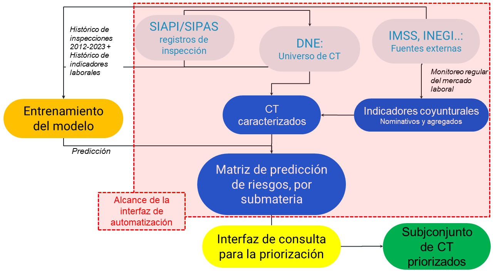
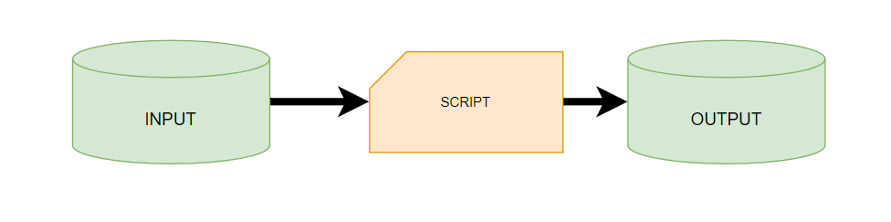
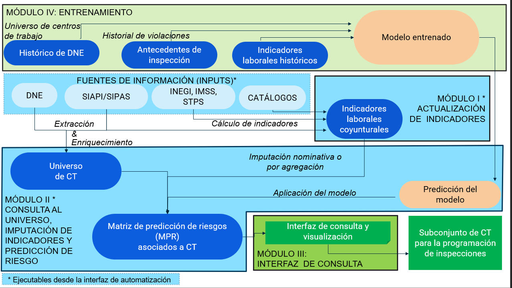
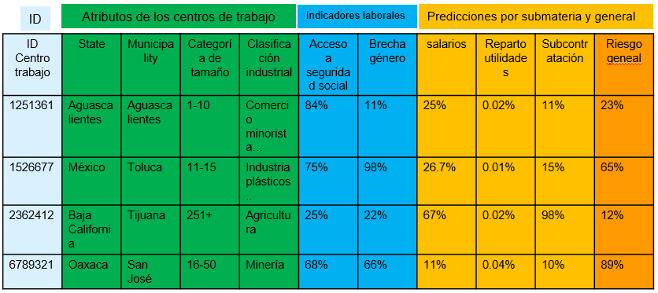
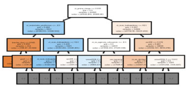

---
output:
  html_document: default
---

# Estructura y flujos de trabajo del SIDIL

Esta sección describe a detalle y para una audiencia técnica los algoritmos computacionales, las fuentes de información y los metadatos que las caracterizan, para la tarea de lograr el cálculo de una predicción de riesgo de incumplimiento de la normatividad en materia laboral e imputarlos a los CT del Directorio Nacional de Empresas (DNE) de la STPS. Se ofrece información respecto a:

1)  **El *flujo de información*** establecido para el funcionamiento del SIDIL.

2)  **El *propósito* de** cada uno de los módulos, procesos y productos contenidos en el SIDIL.

3)  **Las *actividades*** que se deben realizar en cada uno de los módulos para mantener actualizado el SIDIL.

La principal audiencia de este documento es el personal de la STPS, particularmente de la Dirección General de Investigación y Estadísticas del Trabajo (DGIET), la cual será responsable de mantener actualizado el SIDIL, particularmente en lo que respecta al procesamiento de datos para la producción de la Matriz de Predicción de Riesgo (MPR). De hecho, tanto el alcance del SIDIL, como el de este documento en general incorpora como un requisito la estrecha colaboración que se ha sostenido entre la Dirección de Estrategia e Innovación de AIR y la Dirección General de Investigación y Estadísticas del Trabajo (DGIET) de la STPS. Se han sostenido un gran número de sesiones de trabajo técnico y reuniones ejecutivas que, reflejando los intereses y capacidades de la STPS, dieron forma a la configuración actual del sistema.

La estructura de este apartado sigue en buena medida el diseño modularizado del SIDIL. Se presentan las cuestiones generales del sistema, haciéndolo en dos diferentes niveles: por un lado para una audiencia menos técnica se detallan algunos aspectos sustantivos comunes a los diferentes elementos del sistema; por otro lado se presentan aquellas especificaciones que, si bien más técnicas, tienen implicaciones para los diferentes módulos del sistema y que se enuncian sólo una vez en esta sección para evitar su repetición en los capítulos restantes del documento. Del mismo modo se presentan los módulos en los que suceden todos los procesos para mantener actualizada la predicción de riesgos en diferentes submaterias a un universo de naturaleza dinámica de centros de trabajo consultados del Directorio Nacional de Empresas (DNE). También se ofrecen detalles del diseño y operación de la interfaz de consulta, que constituye el módulo III y que, tomando la Matriz de predicción de Riesgos (MPR), resultado del proesamiento, permite a un usuario de la UTD, seleccionar a los CT con base en la predicción de riesgo por submaterias, atributos observados e indicadores imputados a todos los CT que se encuentran en el DNE. Finalmente se presenta el modelo predictivo utilizado, mismo que emana de combinar los hallazgos de todas las inspecciones laborales realizadas por la UTD con todos los indicadores laborales calculados de manera histórica, según la disponibilidad temporal de las fuentes de información.

(\#fig:pipelsimplaaificado2)Pipeline simplificado del SIDIL  (versión simplificada)

## Elementos básicos del SIDIL

**El objetivo del SIDIL es construir una predicción de riesgo de incumplimiento a la normativa laboral vigente de los centros de trabajo de las empresas, a partir de la explotación de diferentes fuentes de información.** De esta manera, con esta predicción de riesgo y otros indicadores y atributos asociados a los centros de trabajo, se pueden construir universos con mayor probabilidad de incumplimiento en determinadas submaterias que forman parte del alcance normativo de las inspecciones laborales.

Para dicho objetivo, el SIDIL explota diferentes fuentes de información de una manera sistematizada. **El SIDIL se basa en un conjunto ordenado y sincronizado de algoritmos (scripts) que a partir de información contenida en archivos de entrada (inputs) crea otros archivos de salida (outputs)**, a partir de un proceso modularizado conectado.

(\#fig:scriptinputoutput)Relación input-script-output

Definamos los tres elementos presentados en la ilustración \@ref(fig:scriptinputoutput):

**Entradas o Inputs**: son tablas de información con campos y observaciones de interés para el SIDIL. Existen tres tipos de inputs.

-   Inputs exógenos: fuente de información "original" o "cruda" no producida por el SIDIL, pero relevante para su funcionamiento. Por ejemplo, la Encuesta Nacional de Ocupación y Empleo del INEGI que se utiliza para la obtención de indicadores. También pueden ser registros administrativos como lo son el DNE de la propia STPS o el patrón de empleadores registrados ante el IMSS, entre otros.

-   Catálogos: dan sentido, facilitan el mantenimiento e interpretación, y homologan los campos presentados en otras fuentes de información. Por ejemplo, las etiquetas asociadas al marco geoestadístico de municipios y entidades del país, producido por INEGI.

-   Inputs que provienen de datos generados en una etapa anterior: por consistencia, el SIDIL, al procesar una fuente de información exógena, con o sin apoyarse en catálogos, genera outputs que, al ser parte de un sistema modularizado o compartimental, sirven de inputs para una siguiente etapa. Por ejemplo, el acervo de indicadores laborales generados a partir de la ENOE son un output del módulo I de actualización de indicadores - que sirve de input para el módulo de imputación de indicadores al universo de centros de trabajo, como se describirá más adelante.

**Scripts**: son documentos (textos) que contienen instrucciones para la ejecución de algoritmos de cómputo (secuencias de comandos) que instruyen a un procesador para cargar, transformar y generar información. Los scripts toman la información de los inputs y, mediante diversas operaciones transforman la información, generando outputs que servirán de insumo para etapas posteriores o como resultado final. En esencia los scripts conforman la médula espinal del SIDIL, toda vez que su contenido e interacción permite procesar la información de manera consistente a lo largo del tiempo. Existen varios tipos de scripts. Entre ellos hay algunos de carácter general y otros específicos para cada fuente de información. Los primeros se detallan en la sección 3.3, mientras que los segundos se profundizan en las secciones correspondientes de cada módulo.

**Salidas o Outputs**: Son resultado de aplicar uno o más scripts a una o más fuente de información o inputs. Contienen información considerada relevante, procesada, y estructurada para su interpretación humana o bien como un insumo para una próxima etapa en el SIDIL. Es decir, como referido anteriormente, un output de una etapa puede ser un input de otra etapa.

A partir de los tres elementos presentados anteriormente: inputs, scripts y outputs, queda claro que el SIDIL es un sistema de procesamiento de información que descansa sobre la coherencia y consistencia entre estos tres elementos.

## Módulos que conforman el SIDIL {#modulosqueconformanSIDIL}

En esta sección se describen de manera general los propósitos y procesos que se realizan en cada uno de los módulos del SIDL, a fin de ofrecer una explicación de sus principales características.

Conviene enfatizar la importancia y motivación de tener un SIDIL compuesto por módulos diferenciados, ya que gracias a su modularidad el SIDIL es más sostenible, toda vez que aísla potenciales problemas en el procesamiento entre los diferentes módulos. Es decir, ante la eventual imposibilidad de correr un módulo, si bien puede implicar la no actualización de dicha información, no afecta la actualización de otros módulos.

A su vez, la compartimentalización se observa, cuando es posible, al interior mismo de los módulos. Por ejemplo, si hubiera un cambio en uno de los campos de una fuente de información que impidiera el cálculo de cierto indicador, esto no inhibe la actualización de otros indicadores de dicha fuente de información.

Así mismo, la modularización abona a la facilidad de dar mantenimiento a los diferentes componentes del SIDIL. La ejecución de los módulos por separado (en contraste con una ejecución única de todos los módulos) hace que, de presentarse problemas o de ser necesarias una revisión, ésta pueda concentrarse en los módulos en donde fuera de interés sin afectar a los demás módulos. La modularización permite aprovechar posibles ventajas comparativas, áreas de especialización e incluso atribuciones heterogéneas al interior de la STPS, permitiendo limitar el acceso a ciertas carpetas o subcarpetas en las que se alojan los inputs o scripts de ciertos módulos.

(\#fig:modulosSIDIL)Módulos que componen el SIDIL

El SIDIL tiene cuatro módulos, tal como se muestra en la ilustración \@ref(fig:modulosSIDIL): El [primer módulo](#moduloIexplicaciongeneral) es el de actualización de indicadores, mismo que explota las fuentes de información exógenas; el [segundo módulo](#moduloIIexplicaciongeneral) es el de consulta al universo de CT registrados en el DNE, la imputación de indicadores y de predicción de riesgo, que incorpora los resultados del módulo anterior. Estos dos módulos son operables a través de una [interfaz de automatización](#moduloIyIIexplicaciongeneral), misma que a su vez permite de una manera muy simple, asegurando coherencia y consistencia, la incorporación y actualización de catálogos y fuentes de información.

Así, la interfaz de automatización abarca el desarrollo de los procesos que están en color azul en esta ilustración. Luego, el tercer módulo es el de la [interfaz de consulta](#interfazConsultaexplicaciongeneral), que explota el principal resultado del módulo anterior (la Matriz de Predicción de Riesgos, MPR). Esta consulta está esquematizada en el área verde de la figura, y da como resultado un *listado de centros de trabajo priorizados*, listos para ser incorporados a la programación de inspecciones. Por último, el cuarto módulo, de entrenamiento, es el que permite reentrenar el modelo para actualizar la forma en la que se realizará la predicción. El módulo cuarto arroja un modelo predictivo entrenado (llamémoslo "parámetros del modelo") que el módulo II consulta para la predicción del modelo sobre el universo de CT enriquecido con los indicadores. A continuación, se ofrecen las principales características de estos módulos.

<!-- Recuadro 1:  -->

<!-- >El SIDIL está compuesto por diferentes módulos. Adicional a las ventajas mencionadas, conviene enfatizar que el SIDIL permite a los usuarios actualizar los diferentes módulos por separado. Esto es, diferentes usuarios (supongamos, especializados por fuentes de información) pueden, en distintos momentos del tiempo, actualizar un módulo sin necesidad de realizar la actualización de los demás módulos en el mismo momento. Esto, si bien no se reflejará en una actualización de la matriz de predicción de riesgos a menos que se actualice el módulo II, permite dividir las tareas entre diferentes personas. -->

<!-- >En ese sentido, una situación que podría ocurrir es la siguiente: el módulo I se actualiza cada tres meses. Pero en el caso del módulo II, al depender del universo de CT registrado en el DNE, puede ameritar actualizarse con mayor frecuencia, toda vez que dicho registro administrativo está en constante cambio (nuevos CT que se incorporan o modificaciones que se realizan a CT preexistentes). No es necesario (ni abonaría nuevos indicadores) volver a correr el módulo I porque el DNE haya sufrido cambios. La información sería la misma. -->

<!-- >De la misma manera, la modularización permite aislar la tarea más compleja del SIDIL: la actualización del módulo IV de entrenamiento del modelo. Esta tarea es la más intensiva en tiempo, toma de decisiones y acceso a información a la vez que, de mantenerse el mismo modelo, no resultaría en sustantivas diferencias si la actualización se realizara con elevada frecuencia. -->

Recuadro 1: Modularización del SIDIL

+:----------------------------------------------------------------------------------------------------------------------------------------------------------------------------------------------------------------------------------------------------------------------------------------------------------------------------------------------------------------------------------------------------------------------------------------------------------------------------------------------------------------------------------------------------------------------------------------------------------------------------+
| El SIDIL está compuesto por diferentes módulos. Adicional a las ventajas mencionadas, conviene enfatizar que el SIDIL permite a los usuarios actualizar los diferentes módulos por separado. Esto es, diferentes usuarios (supongamos, especializados por fuentes de información) pueden, en distintos momentos del tiempo, actualizar un módulo sin necesidad de realizar la actualización de los demás módulos en el mismo momento. Esto, si bien no se reflejará en una actualización de la matriz de predicción de riesgos a menos que se actualice el módulo II, permite dividir las tareas entre diferentes personas. |
|                                                                                                                                                                                                                                                                                                                                                                                                                                                                                                                                                                                                                             |
| En ese sentido, una situación que podría ocurrir es la siguiente: el módulo I se actualiza cada tres meses. Pero en el caso del módulo II, al depender del universo de CT registrado en el DNE, puede ameritar actualizarse con mayor frecuencia, toda vez que dicho registro administrativo está en constante cambio (nuevos CT que se incorporan o modificaciones que se realizan a CT preexistentes).  No es necesario (ni abonaría nuevos indicadores) volver a correr el módulo I porque el DNE haya sufrido cambios. La información sería la misma.                                                                   |
|                                                                                                                                                                                                                                                                                                                                                                                                                                                                                                                                                                                                                             |
| De la misma manera, la modularización permite aislar la tarea más compleja del SIDIL: la actualización del módulo IV de entrenamiento del modelo. Esta tarea es la más intensiva en tiempo, toma de decisiones y acceso a información a la vez que, de mantenerse el mismo modelo, no resultaría en sustantivas diferencias si la actualización se realizara con elevada frecuencia.                                                                                                                                                                                                                                        |
+-----------------------------------------------------------------------------------------------------------------------------------------------------------------------------------------------------------------------------------------------------------------------------------------------------------------------------------------------------------------------------------------------------------------------------------------------------------------------------------------------------------------------------------------------------------------------------------------------------------------------------+

### Módulo I: actualización de indicadores {#moduloIexplicaciongeneral .unnumbered}

En este módulo se explotan las diversas fuentes de información que sirven como input. **El objetivo de este módulo es poder medir fenómenos laborales a través de indicadores que permiten caracterizar las condiciones vigentes en los centros de trabajo.** Para tal fin los scripts extraen y transforman los inputs para mantener actualizados dichos indicadores. Es en este módulo en donde, a futuro, es posible agregar o quitar indicadores laborales según surjan nuevas fuentes de información o entren en desuso otras.

Todas las estimaciones puntuales (valores) de los indicadores se calculan para diferentes "niveles de agregación": ***entiéndase por nivel de agregación aquella combinación de campos de tamaño del centro de trabajo, clasificación industrial y ubicación geográfica que caracterizan a cada centro de trabajo.** Hay 18 niveles de agregación según se incorporen estos campos. A mayor combinación de campos y/o especificidad en la utilización de los mismos, mayor es el nivel de agregación y más específica es la estimación puntual. Para más información consultar la sección 4.1.3.1 de este documento.*

Recuadro 2: El aprovechamiento de los niveles de agregación en el cálculo de indicadores.

+:----------------------------------------------------------------------------------------------------------------------------------------------------------------------------------------------------------------------------------------------------------------------------------------------------------------------------------------------------------------------------------------------------------------------------------------------------------------------------------------------------------------------------------------------------------------------------------------------------------------------------------------------------------------------------------------------------------------------------------------------------------------------------------------------------------------------------------------------------------------------------------------------------------------------------------------------------------------------------------------------------------------------------------------------------------------------------------------------------------------------------------------------------------------------------------------------------------------------------------------------------------------------------------------------------------------------------------------------------------------------------------------------------------------------------------------------------------------------------------------------------------------------------------------------------------------------------------------------------------------------------------------------------------------------------------------------------------------------------------------------------------------------------------------------------------+
| Sirve dar un ejemplo de la utilidad de calcular las estimaciones puntuales de los indicadores a diferentes niveles de agregación: Para el cálculo de la media de la tasa de prevalencia de asalariados percibiendo hasta 105% del salario mínimo (uno de los indicadores desarrollados) a nivel nacional, el promedio asciende a 12.8% de los puestos asegurados. Esto significa que casi 13% de los asegurados en el IMSS perciben hasta 105% del salario mínimo. Este es el promedio nacional y es el nivel de agregación de menor granularidad o especificidad. Pero detrás de este promedio hay una elevada heterogeneidad: tan solo observando el siguiente nivel de agregación que distingue por categoría de tamaño se percibe que los centros de trabajo (CT) de hasta 10 personas aseguradas tienen una prevalencia del 21.7%, mientras que las de 251 o más asegurados se reduce a 0.77%. Si además a los CT de menor tamaño se les distingue por la clasificación industrial a dos dígitos, se estima que aquellas en la categoría industrial SCIAN: 11 (Agricultura, cría y explotación de animales) tienen un promedio de 21.3% pero las SCIAN 21 (minería) un promedio de 16.9%. Este último nivel de agregación ya recupera la información de dos campos (tamaño y clasificación industrial a dos dígitos), pero puede profundizarse aún más incorporando la dimensión geográfica (entidad federativa y municipio) y además llevar a 3 dígitos la clasificación industrial. De esta manera, a mayor incorporación de dimensiones, o mientras más específicas sean éstas más preciso es el dato. A mayor precisión, mayor la posible heterogeneidad en la caracterización de los CT y mayor poder predictivo de los indicadores (sobre este punto se ofrecen más detalles en la sección 6). |
+-----------------------------------------------------------------------------------------------------------------------------------------------------------------------------------------------------------------------------------------------------------------------------------------------------------------------------------------------------------------------------------------------------------------------------------------------------------------------------------------------------------------------------------------------------------------------------------------------------------------------------------------------------------------------------------------------------------------------------------------------------------------------------------------------------------------------------------------------------------------------------------------------------------------------------------------------------------------------------------------------------------------------------------------------------------------------------------------------------------------------------------------------------------------------------------------------------------------------------------------------------------------------------------------------------------------------------------------------------------------------------------------------------------------------------------------------------------------------------------------------------------------------------------------------------------------------------------------------------------------------------------------------------------------------------------------------------------------------------------------------------------------------------------------------------------+

------------------------------------------------------------------------

El cálculo de un determinado indicador se realiza para cada uno de los diferentes niveles de agregación. Esto para permitir que a un CT se le pueda imputar una mejor estimación de riesgo si se conoce con mayor detalle sus características de tamaño, industria y geografía, pero que, en caso de ausencia de alguna de ellas se le atribuya una medida de una agrupación más general. Esto permite aprovechar al máximo la información disponible.

Esto significa que, si la estructura de información del input lo permite, la información se explota al máximo nivel de granularidad y cobertura posible. En concreto, y para poner un ejemplo: de la ENOE se calcula la tasa de sindicalización (con el cuestionario ampliado del primer trimestre de cada año) para todas las posibles combinaciones de entidad federativa, clasificación industrial a dos y tres dígitos del SCIAN y categorías de tamaño, independientemente de que para ciertas combinaciones de estos tres campos no hubiera CT que "requieran" dicha caracterización. Es decir, podría ser el caso de que se calcule para la categoría industrial 111 en la entidad federativa 1 y categoría de tamaño 1 dicho indicador, incluso aunque, por diferentes motivos, el DNE no tenga a ningún CT con dichas características.\^[De manera análoga, dado que el SIDIL explota registros administrativos del IMSS y calcula ciertos indicadores a nivel *registro* patronal, cabe observar que los indicadores se calculan para todos los registros patronales, independientemente de que éstos sean "encontrados" en el DNE.] De esta manera, dada la posibilidad de que en cualquier momento se incorporen nuevos CT al DNE con esta o cualquier otra combinación de información, se tiene a disposición la información en todos los niveles de agregación para su eventual aprovech

Recuadro 3: El aprovechamiento de los niveles de agregación en el cálculo de indicadores (segunda parte)

+:---------------------------------------------------------------------------------------------------------------------------------------------------------------------------------------------------------------------------------------------------------------------------------------------------------------------------------------------------------------------------------------------------------------------------------------------------------------------------------------------------------------------------------------------------------------------------------------------------------------------------------------------------------------------------------------------------------------------------------------------------------------------------------------------------------------------------------------------------------------------------------------------------------------------------------------------------------------------------------------------------------------------------+
| Con lo mencionado sobre el módulo de actualización de indicadores se permite anticipar los elementos más importantes en la estrategia y operacionalización del "matching" o imputación de indicadores laborales al universo de centros de trabajo (que se informa a mayor detalle en el capítulo 4.2.5): el acervo de estimaciones puntuales (por ejemplo la media de acceso a la seguridad social) calculada para toda la combinación posible de tamaño, clasificación industrial y ubicación geográfica, es imputado a los CT a partir de un algoritmo que identifica el nivel de especificación a lo largo de estos tres campos. Es decir, el algoritmo detecta el nivel de agregación de cada uno de los CT y le imputa la estimación puntual más granular o específica posible de acuerdo con la información disponible de cada CT. ¿Cuál es la "más granular o especifica posible"? Es aquella estimación puntual que incorpora la mayor cantidad de campos de tamaño, clasificación industrial y geografía posible. |
+----------------------------------------------------------------------------------------------------------------------------------------------------------------------------------------------------------------------------------------------------------------------------------------------------------------------------------------------------------------------------------------------------------------------------------------------------------------------------------------------------------------------------------------------------------------------------------------------------------------------------------------------------------------------------------------------------------------------------------------------------------------------------------------------------------------------------------------------------------------------------------------------------------------------------------------------------------------------------------------------------------------------------+

------------------------------------------------------------------------

Además de que todas las estimaciones puntuales se calculan por niveles de agregación, cuando se trata de estimaciones puntuales de indicadores que explotan la fuente información IMSS, previo a su "agregación", se realiza su cálculo también por registro patronal. Esta información sirve para, como se describe en el módulo siguiente, imputar la información de *manera nominativa* por registro patronal, siempre que el CT estuviera disponible (identificable) en el DNE.

**Los indicadores se expresan en el mismo sentido ordinal, donde "más es mejor", a excepción de cuando se encuentran en la MPR, como se verá más adelante:** todos los indicadores miden un fenómeno laboral que inherentemente reflejan una violación a un derecho laboral, o en última instancia, un juicio de valor. A menor valor absoluto de un indicador, mayor incumplimiento al derecho laboral, o en peores condiciones (de eso que se mide) están las personas trabajadoras. Por ejemplo, el acceso a la seguridad social cercano a 100% indica una elevada tasa de formalización de la relación laboral, mientras que cercano a 0% se acerca a la informalidad absoluta.

**En la construcción de la MPR (siguiente módulo), y a efectos de darle el mismo sentido que la predicción de la probabilidad de incumplimiento con la normativa laboral, el sentido de los indicadores se invierte.** Es decir, los indicadores que hasta ese momento expresan "más es mejor" se invierten para reflejar que "más es peor". Esto facilita la interpretación y el uso de los mismos como variables de selección y filtrado a la hora de explotar la MPR en la interfaz de priorización. De esta manera, al filtrar, tanto los predictores de riesgo generados a partir del modelo entrenado, como los indicadores calculados a partir de las fuentes de datos tienen la lógica de que un valor más cercano a 1 representa un mayor riesgo de violaciones.

Recuadro 4: El sentido de los indicadores

+---------------------------------------------------------------------------------------------------------------------------------------------------------------------------------------------------------------------------------------------------------------------------------------------------------------------------------------------------------------------------------------------------------------------------------------------------------------------------------------+
| Todos los indicadores se expresan en el mismo sentido, en donde un menor valor de un indicador se asocia a peores condiciones laborales en el aspecto que se esté midiendo. Esto es importante porque en algunas ocasiones (ver siguiente capítulo) algunos indicadores se expresan como la inversa o el complemento (según se traten de tasas o no) de la ocurrencia de un fenómeno laboral.                                                                                         |
|                                                                                                                                                                                                                                                                                                                                                                                                                                                                                       |
| Esto no guarda relación con la estandarización de 0 a 1 y la inversión (es decir, el cambio de sentido) de los valores imputados a los centros de trabajo registrados en DNE, mismo que se realiza únicamente posterior a la imputación y sobre el universo acotado y que permite ordenar en percentiles a los centros de trabajo, siendo los percentiles de *menor* valor aquellos que se asocian a *mejores* condiciones laborales (dada la estandarización y posterior inversión). |
+=======================================================================================================================================================================================================================================================================================================================================================================================================================================================================================+
|                                                                                                                                                                                                                                                                                                                                                                                                                                                                                       |
+---------------------------------------------------------------------------------------------------------------------------------------------------------------------------------------------------------------------------------------------------------------------------------------------------------------------------------------------------------------------------------------------------------------------------------------------------------------------------------------+

**En este módulo también se mantiene actualizada una base que registra la información más básica de los patrones registrados ante el IMSS, a efectos del enriquecimiento de la consulta del DNE (ver siguiente módulo).** Esto es adicional al acervo de estimaciones puntuales por registro patronal que se mencionó en el párrafo anterior.

En acuerdo con la DGIET, **se propone que este módulo se actualice cada tres meses**, toda vez que es la frecuencia con la cual se actualiza uno de los principales insumos (la ENOE del INEGI). Pero dado que los inputs del IMSS se actualizan mensualmente (y se calcula un promedio móvil de los últimos tres meses disponibles) tendría sentido hacerlo hasta una vez por mes si se desea.

**Así, el módulo I constituye la [oferta]{.underline} de estimaciones puntuales de los indicadores del SIDIL**, que posteriormente serán imputados (de manera nominativa o por nivel de agregación, según sea al caso) a los centros de trabajo disponibles en el DNE.

### Módulo II: Consulta al universo de CT, imputación de indicadores y predicción de riesgo {#moduloIIexplicaciongeneral .unnumbered}

En este módulo se consulta el Directorio Nacional de Empresas (DNE) para obtener el universo actualizado de centros de trabajo susceptibles de ser inspeccionados. En esta consulta los campos más importantes (además del identificador único del CT) son el tamaño, la clasificación industrial, el municipio y la entidad federativa del CT, a efectos de posteriormente poder imputarle los indicadores obtenidos del módulo anterior. Del mismo modo se obtienen campos adicionales considerados atributos y que pueden servir para, a través de la interfaz de consulta filtrar el universo de centros de trabajo. Un ejemplo de ello es el campo que indica que el CT forma parte de un mecanismo de autorregulación, como por ejemplo el Programa de Autogestión en Seguridad y Salud en el Trabajo -- un aspecto que se toma como dato del DNE.

**Si el módulo I constituye la "oferta" de indicadores, el módulo II, particularmente el universo de CT registrados en el DNE, representa la "demanda" de los mismos**. Son las características de los CT en el DNE las que determinan cuáles estimaciones puntuales de cada indicador serán imputadas a cada CT, notando que, en última instancia, de no poder caracterizar a un CT en ninguna de las tres dimensiones (clasificación industrial, geografía o tamaño) se le asignará el promedio a nivel nacional. Siguiendo con la analogía, la oferta y la demanda se encuentran justo en el punto que determina el algoritmo de matching coyuntural, es decir, la imputación de las estimaciones a los CT.

Como se menciona en la sección anterior, en aquellos campos de las tres dimensiones (geografía, tamaño e industria) el SIDIL consulta la información más actualizada disponible en el IMSS para que, en caso de que no estuviera el dato disponible en el DNE, se les impute dicha información (a efectos del SIDIL únicamente, no se modifican registros en el DNE, sino solamente en el resultado de la consulta a dicho directorio que utiliza el SIDIL). Esto permite "refinar" el nivel de agregación al que potencialmente se le imputan las estimaciones puntuales de los diversos indicadores a los CT. Por ejemplo, un CT puede no tener registrado el número de trabajadores en el DNE, en consecuencia, no sería posible tomar en consideración los niveles de agregación que requiere la estimación puntual por categoría de tamaño. Sin embargo, gracias a este procedimiento de enriquecimiento, si a través del registro patronal es posible identificar a este CT en las bases del IMSS, se le asigna el campo tamaño (contando el número de trabajadores registrados en el mismo) para imputarle una estimación puntual con el mayor nivel de agregación posible que incluya el tamaño como dimensión. Asimismo, a partir de esta identificación univoca de los CT en las bases del IMSS y del DNE, se realiza la imputación nominativa de los indicadores del IMSS.

Además, el SIDIL prevé una consulta al SIAPI y al SIPAS en caso de que la información contenida en el DNE no estuviera completa o estuviera actualizada. Dado que el SIAPI y SIPAS están en un proceso de desarrollo, por ahora este aspecto no se enfatiza en el manual. Pero un ejemplo de esta información podría ser el cálculo del porcentaje de inspecciones a un CT que terminaron en negativas patronales, en caso de que esto fuera de interés para la STPS para explotar en la interfaz.

Recuadro 5: Relación DNE-SNILE-SIAPI-SIPAS con el matching nominativo del IMSS

+-----------------------------------------------------------------------------------------------------------------------------------------------------------------------------------------------------------------------------------------------------------------------------------------------------------------------------------------------------------------------------------------------------------------------------------------------------------------------------------------------------------------------------------------------------------------------------------------------------------------------------------------------------------------------------------------------------------------------------------------------------------------------------------------------------------------------------------------+
| Actualmente el SIDIL consulta al DNE y al SIAPI/SIPAS. Al realizarlo, se encuentra que en el DNE el campo número de trabajadores tiene aproximadamente un 80% de observaciones nulas (sin valor válido). Este campo es enriquecido con el campo que se completa durante en las inspecciones registradas en SIAPI SIPAS. Si es posible enriquecerlo entonces ese campo ya se considera completo y no se realiza la imputación de enriquecimiento con base en el IMSS patronal. Si en cambio no hay un dato derivado de las inspecciones, entonces sí se busca el enriquecimiento con los datos del IMSS. Por supuesto, se reconocen obvias limitaciones derivadas de que en el IMSS se registra únicamente el empleo formal mientras que en las inspecciones se registra todo tipo de trabajadores, estén o no registrados ante el IMSS. |
+=========================================================================================================================================================================================================================================================================================================================================================================================================================================================================================================================================================================================================================================================================================================================================================================================================================================+
|                                                                                                                                                                                                                                                                                                                                                                                                                                                                                                                                                                                                                                                                                                                                                                                                                                         |
+-----------------------------------------------------------------------------------------------------------------------------------------------------------------------------------------------------------------------------------------------------------------------------------------------------------------------------------------------------------------------------------------------------------------------------------------------------------------------------------------------------------------------------------------------------------------------------------------------------------------------------------------------------------------------------------------------------------------------------------------------------------------------------------------------------------------------------------------+

En resumen, el proceso de imputación o "matching" tiene tres etapas, en dos scripts diferentes:

-   Primero, se busca enriquecer aquellos campos que definen el nivel de agregación al que se le imputarán los indicadores. Esto es, que se complemente un campo vacío del DNE respecto al tamaño, geografía y/o clasificación industrial con la información disponible en las bases del IMSS (siempre y cuando se logre identificar al mismo CT en el DNE y en el IMSS). Esta primera etapa sucede inmediatamente posterior a la consulta del DNE, como parte de dicho script; mientras las siguientes dos etapas suceden en el script de matching coyuntural.

-   Segundo, se le imputan indicadores de manera nominativa, cuando aplique y siempre que fuera posible, a través del campo registro patronal, identificar a un CT del DNE en las bases del IMSS. A esto se le llama *imputación nominativa*.

-   Tercero, para todos los CT y todos los indicadores a los que no fue posible realizarle una imputación nominativa, se le imputa un valor de todos los indicadores por nivel de *agregación* según la información disponible de cada CT.

Hasta aquí se obtiene el universo de los CT extraído del DNE y enriquecido con las estimaciones puntuales de todos los indicadores disponibles.

**A partir de los indicadores imputados a cada uno de los CT, y con base en el modelo entrenado (ver módulo IV) se calculará el riesgo de incumplimiento de cada uno de ellos por submateria.** La información de indicadores, para cada uno de los CT del universo, se utiliza como insumo para el cálculo de factores que permitirán la predicción del riesgo de incumplimiento en cada una de las submaterias de las Condiciones Generales de Trabajo a través de la **aplicación del modelo** (previamente entrenado\^[Conviene enfatizar que no es en este módulo donde se entrena el modelo, ya que eso forma parte del módulo IV, en este caso sólo se aplica el modelo previamente entrenado.) para predecir y atribuir un factor de riesgo de incumplimiento a cada centro de trabajo para cada submateria.

El resultado final de este módulo es la **Matriz de Predicción de Riesgos** (MPR), misma que se analiza en mucho más detalle en la sección. 3.10. Aquí conviene mencionar que la MPR tiene tantas filas como centros de trabajo registrados en el DNE y el número de columnas dependerá de la disponibilidad de indicadores, del número de atributos que se consulten al DNE (cuando menos serán aquellos campos de geografía, clasificación industrial y tamaño) y del número de submaterias sobre las cuales se realiza una predicción de riesgo, como muestra la Ilustración 3 a continuación.

(\#fig:MPRsimplificada)Matriz de predicción de riesgos (ilustración simplificada)

### Módulos I y II: operables desde la interfaz de automatización {#moduloIyIIexplicaciongeneral .unnumbered}

**La interfaz de automatización permite que, bajo circunstancias normales, es decir, sin la necesidad de corregir los algoritmos de cálculo, se puedan mantener actualizados los productos de los módulos I y II sin necesidad de ejecutar los algoritmos desde la consola del software de análisis R Studio**, sino desde una interfaz amigable y simplificada que ejecuta los mismos procesos que se correrían manualmente desde R Studio. A dicha interfaz también se le agregó la funcionalidad de incorporar actualizaciones a las fuentes de información (por ejemplo, un nuevo trimestre de la ENOE) o a los catálogos que permiten la adecuada explotación de los insumos a través de parámetros configurables. Esto permite que la interfaz mantenga actualizados los productos módulos I y II, y que esto se realice, en circunstancias normales, por personal que no requiere de acceso o conocimiento profundo de un software especializado. La interfaz permite actualizar los insumos del cálculo, modificar sus parámetros principales y seleccionar cuáles procesos se quieren ejecutar a fines de actualizar los productos, todo el tiempo reportando en una consola los principales avances de dichos procesos, para seguimiento del usuario que lo ejecuta.

**En el proceso de la actualización de los módulos I y II desde esta interfaz, en la consola de procesamiento se presenta solamente la información más ejecutiva sin abundar en todo el detalle técnico del procesamiento de información.** Esto implica, que: a) la interfaz permite la ejecución automatizada de los códigos del módulo I y II, más no exime de la responsabilidad de analizar los resultados reportados en su consola; y b) la interfaz no presenta toda la información que un usuario más técnico pudiera requerir para su análisis y comprensión de los procedimientos ejecutados, la que se encuentran en las bitácoras de cada proceso, también accesibles para un usuario más avanzado. Por último, realizadas las principales actualizaciones, la interfaz permite la descarga de la MPR más reciente y enviarla a la interfaz de consulta, poniendo así la MPR a disposición del otro tipo de usuario del SIDIL, el personal de la UTD, para la priorización de CT conforme a las estrategias de selección que se presenten.

**En contraste con la interfaz de consulta (ver más adelante), esta interfaz, si bien facilita la ejecución de los módulos I y II, sí requiere de cierto conocimiento técnico** -- estadístico en cuanto a que algunos de los mensajes que se reportan en su consola, si bien sólo se reportan a título informativo y no se espera una aprobación explícita del usuario, permiten a un usuario informado determinar que los resultados obtenidos guardan sentido. Por ejemplo, en un momento determinado la actualización de los indicadores del IMSS reporta el porcentaje que las mujeres representan en el total de personas aseguradas. Un usuario informado sabe que aproximadamente este porcentaje se ubica alrededor del 40% y que cualquier desviación sustantiva de dicho porcentaje pudiera implicar que la identificación del sexo a partir de la CURP de las personas aseguradas no resultó satisfactoria o que hubo algún problema en el procesamiento realizado. De manera análoga, un usuario experimentado conoce el total de personas ocupadas que se estiman a partir de la ENOE (y sabe cómo validar esta estimación en el portal del INEGI), por lo que cualquier desviación sustantiva de una estimación normal tendría que llamarle la atención, ameritar la interrupción del proceso e iniciar una revisión exhaustiva a nivel código para encontrar la solución a dicho error de cálculo.

Recuadro 6: la utilización de la interfaz de automatización

+------------------------------------------------------------------------------------------------------------------------------------------------------------------------------------------------------------------------------------------------------------------------------------------------------------------------------------------------------------------------------------------------------------------------------------------------------------------------------------------------+
| La interfaz de automatización permite a un usuario mantener actualizados los productos de los módulos I y II sin necesidad de ejecutar los algoritmos desde la consola del software R. De hecho, no requiere tener instalado el software R ni R Studio localmente, toda vez que la operación de dicha interfaz se realiza desde una conexión WEB a un servidor. Algunas de las condiciones que deben darse para que la actualización de estos módulos desde la interfaz sea satisfactoria son: |
|                                                                                                                                                                                                                                                                                                                                                                                                                                                                                                |
| 1)  Que no haya cambios sustantivos en los insumos de las fuentes de información o que no pudieran ser atendibles con la actualización de catálogos. Por ejemplo, hay un catálogo de campos que permite asociar diferentes nombres de ciertas variables a un nombre único, para atender a cambios menores entre algunas versiones de la misma fuente de información. Este tipo de cambios se considera menor y es atendible desde el catálogo.                                                 |
|                                                                                                                                                                                                                                                                                                                                                                                                                                                                                                |
| 2)  Que se requieran incorporar nuevos indicadores, o actualizar el método de cálculo de algunos indicadores, o incluso modificar el flujo de información. En otras palabras, cualquier modificación al cómo se procesa la información, implica que primero haya que modificar algunos archivos a nivel "código" y esto no se puede realizar desde la interfaz.                                                                                                                                |
|                                                                                                                                                                                                                                                                                                                                                                                                                                                                                                |
| 3)  Que se opte por utilizar un modelo entrenado distinto al más reciente. El SIDIL está configurado para utilizar la última versión del modelo entrenado. Si se quisiera, a fines comparativos, realizar una predicción con otro modelo, distinto al más reciente, entonces esto no podrá ser realizado desde la interfaz.                                                                                                                                                                    |
|                                                                                                                                                                                                                                                                                                                                                                                                                                                                                                |
| En otras palabras, la interfaz de automatización permite mantener actualizado los productos de los módulos I y II con un esfuerzo menor que el requerido para abrir y ejecutar el código en una consola.                                                                                                                                                                                                                                                                                       |
+================================================================================================================================================================================================================================================================================================================================================================================================================================================================================================+
+------------------------------------------------------------------------------------------------------------------------------------------------------------------------------------------------------------------------------------------------------------------------------------------------------------------------------------------------------------------------------------------------------------------------------------------------------------------------------------------------+

: \### Módulo III: Consulta de la MPR para priorización de CT a inspeccionar {.unnumbered #interfazConsultaexplicaciongeneral}

En el módulo de consulta se explota la información contenida en la Matriz de Predicción de Riesgo (MPR). Se realiza a través de una interfaz interactiva, permitiendo al usuario escoger y ponderar diferentes campos para acotar y priorizar el universo de CT disponible en el DNE para logar un subconjunto de ellos que cumplen determinados criterios. Los CT en dicho subconjunto cumplen con características que reflejan la estrategia de inspección que se quiere desarrollar. Típicamente constituirán este subconjunto aquellos CT de mayor probabilidad de incumplimiento en cierta submateria y que además cumplen con los criterios impuestos a otras variables que los caracterizan.

**La utilización de esta interfaz no requiere conocimientos avanzados de estadística ni de econometría**: si bien el SIDIL es un proceso intensivo en datos, su producto final, la MPR, es explotado por el área de programación de las inspecciones a través de una interfaz amigable que permite reflejar prioridades estratégicas propias del proceso de planeación, particularmente aquellas que se dan en el marco de operativos de un alcance específico.

La interfaz permite al usuario:

1)  Siempre utilizar la MPR más reciente. De manera predeterminada se carga la MPR de versión más reciente, motivado en que ésta refleja los insumos más recientes (que a su vez se generaron con las versiones más reciente de los diferentes insumos de información).

2)  Escoger una submateria sobre la cual se realizó una predicción confiable (todos los CT tienen una predicción realizada en cada una de las submaterias, por lo que escoger cuál de ellas se utilizará para la programación de inspecciones no limita el número de CT). Una vez seleccionada la submateria, es posible acotar el universo limitándolo a aquellos CT que, para la predicción escogida, están en un rango numérico acotado (el rango de probabilidad).

3)  Acotar el universo de CT a partir de la aplicación de filtros adicionales, a partir del resto de la información contenida en la MPR:

    a.  Atributos de los CT obtenidos del DNE (por ejemplo, una entidad federativa) o enriquecidos a través del SIAPI SIPAS (por ejemplo, historial reciente de negativas patronales), o enriquecidos con el IMSS (por ejemplo, tamaño del CT).

    b.  Indicadores calculados a partir de las diferentes fuentes de información. En esencia, todos aquellos calculados en el módulo I y asignados a los CT a partir de los primeros dos pasos del módulo II.

[**Módulo IV: Entrenamiento del modelo**]{.underline}

Este módulo tiene como propósito entrenar el modelo predictivo para actualizar sus valores y posteriormente aplicarlos a la predicción que se realiza sobre el universo de CT enriquecido con indicadores coyunturales. A tal fin, en este módulo se realiza la explotación histórica de todas las fuentes de información.

**A diferencia del módulo de actualización de indicadores que explota el último periodo de referencia disponible para cada fuente de información, en este módulo se explotan todos los periodos de referencia disponibles para todas las mismas fuentes de información, incorporando, además, los resultados de todas las inspecciones realizadas a la fecha.** El SIDIL contempla que la explotación histórica de todos los indicadores laborales se realice desde 2012 en adelante, siempre que esté disponible la fuente de información. En concreto, dada la información disponible, estos son los periodos temporales cubiertos por fuente de información:

-   ENOE: 2012 en adelante, de manera anual, utilizando el primer trimestre, toda vez que refleja la aplicación el cuestionario ampliado (ver sección 4.1.4.1.1).

-   IMSS: 2019 en adelante, de manera mensual, utilizando todos los meses (ver sección 4.1.4.2).

-   Censo Económico: 2019, toda vez que no preexiste un ejercicio similar al que realizó la STPS con el INEGI (ver más adelante sección 4.1.4.3).

**De esa manera, la explotación histórica no es otra cosa que repetir de manera iterativa el mismo procedimiento de generación de indicadores del módulo I pero extendiendo el horizonte temporal.** Claro está que conforme se extiende el periodo de referencia, aumenta el número de desafíos en materia de la infraestructura de cómputo y estructura de datos. Por poner un ejemplo, varios campos de columnas en insumos del IMSS cambian de nombre a lo largo del tiempo (motivo por el cual se estableció un catálogo de campos que permite armonizar dichos campos).

**La diferencia sustantiva entre el módulo II y el módulo IV, además de la extensión del periodo temporal para el cálculo de indicadores, es que, a diferencia del módulo II, en el módulo IV la unidad de observación no es el centro de trabajo sino la inspección a nivel submateria.** Para predecir la probabilidad de incumplimiento a cada uno de los CT en el entrenamiento del modelo se incluye en el análisis el universo de de 1.1 millones de inspecciones, que genera más de 5.8 millones de pares inspecciones--submaterias distintas.

La explotación histórica de todas las fuentes de información, inclusive los resultados de las inspecciones, permite la **interacción entre variables** provenientes de diferentes fuentes en el entrenamiento del modelo de aprendizaje de máquina (machine learning) que se utiliza para la predicción de riesgo. El modelo utilizado para este fin es el **Random Forest**, dadas que las pruebas realizadas con la información provista por la STPS dieron mejores resultados de predictibilidad con este modelo. Sin embargo, esto puede y debe revisarse conforme avance la literatura y la tecnología en esta materia.

Un **modelo Random Forest (RF) de aprendizaje automático utiliza múltiples árboles de decisión para hacer predicciones sobre un conjunto de datos**. Los árboles de decisión son un tipo de modelo de aprendizaje automático que se utiliza para tomar decisiones basadas en datos. Se representan gráficamente como un árbol, donde cada nodo representa una decisión o una acción (en este caso, una variable atributo o indicador asociado a los CT) y las ramas que se desprenden de él representan las posibles opciones que se pueden tomar.

**En el caso del modelo de RF que se utiliza, cada árbol de decisión en el modelo es una representación gráfica de las reglas que se utilizan para predecir la probabilidad de incumplimiento en una de las submaterias de inspección**. Cada árbol en el modelo toma como entrada los indicadores que se han calculado para el centro de trabajo que se está evaluando y, a través de una serie de preguntas, clasifica el centro de trabajo en una de las dos categorías: violación o no violación procedente en la submateria en cuestión.

[[Placeholder imagen pixelada pendiente mejora]{.mark}]{.mark}

(\#fig:arboldecision)Ejemplo de un árbol de decisión

**En lugar de utilizar un solo árbol de decisión, el modelo RF utiliza múltiples árboles de decisión para mejorar la precisión de las predicciones.** Cada árbol se entrena con diferentes subconjuntos de los datos y se combinan las predicciones de todos los árboles para determinar la probabilidad de incumplimiento del centro de trabajo en cada área de inspección.

**En este caso, el RF se utiliza como "multioutput", es decir, para predecir la probabilidad de que un CT incumpla en cada una de las submaterias de inspección laboral, independientemente de la probabilidad de incumplimiento en otras submaterias.** El modelo funciona al tomar en cuenta los indicadores imputados a los centros de trabajo y analizar cómo se relacionan con el historial de incumplimiento en diferentes áreas de inspección. Luego, utiliza esta información para hacer una predicción sobre la probabilidad de que un CT incumpla en el futuro. Esto lo hace para cada una de las submaterias, de manera independiente.

**El número de observaciones que entra en el entrenamiento del modelo equivale al número de inspecciones a nivel submateria para las cuales hubo un desahogo registrado en el sistema.** Es decir, un centro de trabajo con un ID determinado, pudo haber sido inspeccionado en más de un año diferente. En cada una de esas inspecciones, se pudieron haber cubierto las mismas o diferentes submaterias. Por cada combinación de estos factores (ID del centro de trabajo, de la inspección y de la submateria), habrá una fila en la base que se conforma para el entrenamiento. Para un mismo CT y año, aunque fueran diferentes submaterias, los valores de los indicadores imputados de manera nominativa o por nivel de agregación serán los mismos, toda vez que éstos se generan a nivel anual. Es decir, las poco más de 1.1 millones de inspecciones han cubierto, en promedio, poco más de cinco submaterias cada una. Al analizarlo a ese nivel, naturalmente, los atributos de los centros de trabajo, junto con los indicadores asociados a ellos, guardan el mismo valor para todas las diferentes filas (submaterias) de la misma inspección (dado que las submaterias se inspeccionan al mismo tiempo) y lo que sí cambia es la variable dependiente (si se encuentran o no violaciones que proceden a nivel submateria).

**Entonces, las variables de entrada en dicho modelo son los indicadores que se calcularon en el primer módulo y que se imputaron a los centros de trabajo.** La variable de salida es una variable dicotómica que toma valor uno si en dicha inspección se estableció que hay al menos una violación que procede y valor nulo si no se encontró ninguna violación.

De esa manera, a partir del entrenamiento del modelo Random Forest sobre el conjunto de datos históricos se guarda o exporta el **modelo entrenado para la predicción de riesgo** por submateria a partir de los indicadores y atributos imputados de manera histórica. Dicho modelo entrenado se utiliza luego para la predicción de riesgos sobre el universo de CT caracterizado con los indicadores coyunturales que se calculan en el módulo I y se imputan en el módulo II. Así, este modelo entrenado nos permitirá, para cada CT, calcular **predicciones de riesgo**, utilizando el modelo entrenado a partir del registro histórico de inspecciones y los atributos e indicadores observados al momento de dichas inspecciones.

Para ilustrar la relación entre el entrenamiento del modelo con datos históricos y la predicción de riesgo con datos coyunturales, puede servir la siguiente analogía: imagine que el propósito es predecir a un paciente que se presenta a consulta médica la probabilidad de ocurrencia de cada una de las siguientes enfermedades cardiovasculares: insuficiencia cardíaca, hipertensión arterial, exceso de colesterol, infarto de miocardio, etc. Por otro lado, imagine que existen factores que explican, causan, o al menos se correlacionan con la ocurrencia de estas enfermedades cardiovasculares: edad, sexo, la mala alimentación, falta de actividad física, el consumo de alcohol, la diabetes. Estos factores son medibles o al menos averiguables, al momento en el que el paciente se presenta a consulta médica. Esta medición es "en tiempo real" al momento de la consulta. Conviene asociar los siguientes conceptos: los diferentes tipos de enfermedades cardiovasculares serían las diferentes submaterias del marco normativo de la inspección, mientras que los indicadores y atributos son los factores de salud (edad, sexo, alimentación), que son medibles en tiempo real, lo cual se asimila al cálculo coyuntural de indicadores, que ocurre en el módulo I. Pero también el historial médico de millones de pacientes que fueron estudiados por la medicina, y a los cuales se les detectó o no cada una de estas enfermedades, se analiza en el módulo IV: se identifica qué pacientes tuvieron enfermedades y se busca asociar dichas enfermedades con la presencia, ausencia o nivel de ciertos factores, que al momento de detectarse dicha enfermedad fueron medidos. Dicho análisis histórico de factores versus enfermedades, o de indicadores y atributos versus violaciones laborales a nivel submateria es el entrenamiento del modelo. Pero, muy importante, el modelo entrenado (o en este ejemplo la medicina) busca predecir cierta probabilidad sobre una población siempre cambiante, sobre la cual lo único que puede observar es lo que se puede medir: los indicadores laborales (o los factores de salud como edad, sexo, alimentación). Dicho de otra forma, la predicción se realiza sobre una "nueva" población que además por definición estará en un cambio constante.
