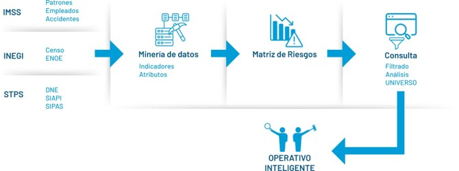
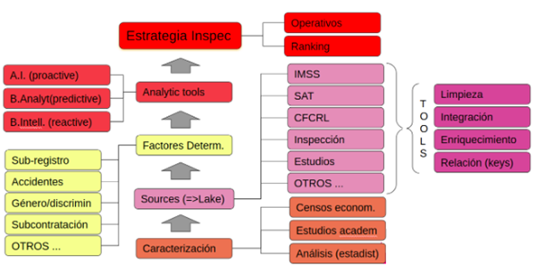
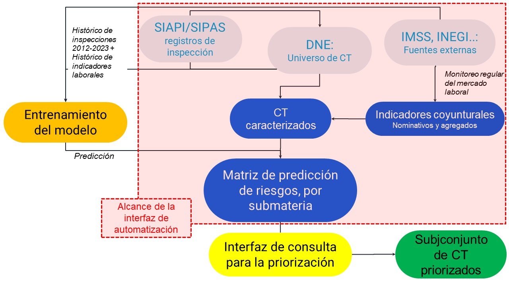
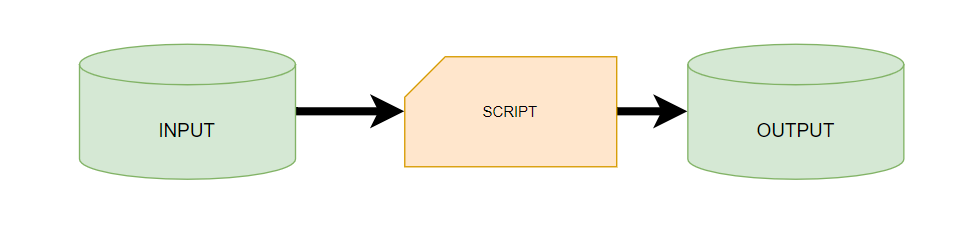
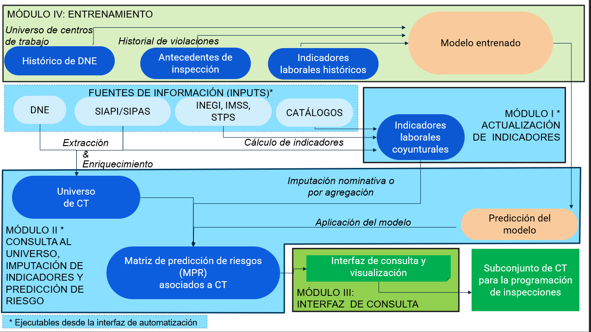

# 1 Bienvenida

<!-- # PRESENTACIÓN DEL SIDIL -->

> *Aplicación de la analítica de datos para la generación de estrategias
> inteligentes de selección de empresas para la inspección laboral*

Las inspecciones laborales son el instrumento más importante que
utilizan los gobiernos para verificar y garantizar que las empresas
adopten las medidas necesarias para cumplir con las normativas en
materia de condiciones laborales y de seguridad y salud en el trabajo.
No obstante, el efecto de dichas inspecciones depende de diversos
factores, siendo un factor fundamental el de los mecanismos de selección
de los centros de trabajo a inspeccionar.

Realizar inspecciones en todo el universo de empresas no resulta viable
debido a las limitaciones presupuestales y de recursos humanos que
tienen las instituciones públicas. Al día de hoy la selección de las
empresas que se van a inspeccionar se basa en un mecanismo aleatorio
sobre una preselección de centros de trabajo que cumplen con ciertas
características o que cuentan con determinados atributos de tamaña, rama
de actividad, región, etc. Dichas características de selección no sólo
son un conjunto limitado de atributos observables, sino que además no
toman en consideración en ninguna medida el riesgo de incumplimiento
laboral de las empresas.

En ese marco, este componente busca apoyar a la Secretaría de Trabajo y
Previsión Social (STPS) en la generación de herramientas y mecanismos
que permitan seleccionar centros de trabajo en función de un enfoque
basado en el **análisis de los factores de riesgo** de que cada una de
las empresas incumplan determinada normatividad en materia laboral.
Suponemos que este enfoque resultará en una mayor eficiencia de la
inspección. Para ello se requirió el desarrollo de métodos de análisis
que permitieran la priorización en función del riesgo, basándose en que
la STPS dispone de grandes volúmenes de datos derivados de la inspección
laboral y de otras bases de datos, propias o de terceros, de enorme
utilidad. Ha sido necesario, de la misma manera, relacionar estos
registros administrativos de la autoridad inspectiva con otras fuentes
de información estadística y registros de otras instituciones públicas
para enriquecer el universo de empresas y contar así con más información
que permita establecer factores de riesgo.

Así, el Sistema de Inteligencia de Datos para la Inspección Laboral
(SIDIL) que aquí se presenta es una herramienta tecnológica que explota
diversas fuentes de información para generar una predicción de
incumplimiento a la normativa laboral en los centros de trabajo (CT)
susceptibles de ser inspeccionados por la Secretaría del Trabajo y
Previsión Social del Gobierno de México. El SIDIL permite a la STPS
aplicar estrategias inteligentes de inspección laboral a partir de la
generación de subconjuntos de empresas y CT con base en criterios
preestablecidos que reflejan su perfil de riesgo de incumplimiento de
los derechos laborales. A tal efecto, como se explica más adelante, el
SIDIL explota más de un millón de inspecciones registradas y más de 35
millones de estimaciones puntuales a diferentes niveles de agregación,
para predecir el riesgo en un universo siempre dinámico de CT
registrados en el Directorio Nacional de Empresas (DNE),
independientemente de que éstos tengan o no antecedentes de inspección.

El SIDIL fue desarrollado por American Institutes for Research (AIR) en
colaboración con la STPS y en el marco del proyecto de Cumplimiento con
el Derecho Laboral en el Sector de Autopartes (CALLE, por sus siglas en
inglés). AIR busca apoyar a la STPS y otras autoridades competentes en
materia laboral en el desarrollo de procesos y herramientas que permitan
el incremento en la eficiencia y eficacia de las funciones relativas a
la aplicación de la ley laboral en el sector de autopartes de México,
así como en el fortalecimiento de la implementación de la Reforma
Constitucional en materia de Justicia Laboral (realizada en 2017) y la
Reforma de la Ley Federal del Trabajo (del 1 de mayo 2019).

El SIDIL responde a la necesidad de hacer un uso eficiente y eficaz de
los recursos públicos a través de la focalización de los universos de
las inspecciones y al propósito de realizar una mejor cobertura de los
diferentes tipos de riesgos laborales, a la no repetición de
inspecciones y a la priorización de CT con mayor probabilidad de
incumplimiento, entre otros aspectos relativos a la eficiencia y
eficacia de las inspecciones laborales.

En los primeros meses de este proyecto el equipo se abocó al
entendimiento, descripción y explotación de los registros
administrativos del proceso de inspección y sanción. Dicho trabajó
concluyó de manera preliminar en un documento de hallazgos, cuyos
principales resultados fueron presentados a la STPS.

\[\[pendiente definir sobre:

[DOCUMENTO DE
HALLAZGOS](https://msair.sharepoint.com/:w:/r/sites/Impaq_Projects/Mexico/CALLE/Ongoing%20Tasks/Data%20Intelligence/Data%20Analysis/2022-01%20An%C3%A1lisis%20SIAPI_SIPAS%20-%20Hallazgos.docx?d=wf74a0d86ad244c92a86c8a88e3af6f1e&csf=1&web=1&e=GcTmkv)
\]\]

En cuanto a los temas técnicos, abordar el reto de seleccionar empresas
de alto riesgo mediante el uso de la analítica de datos resulta adecuado
para los algoritmos de aprendizaje automático, ya que se cuenta con una
masa crítica de información para procesar. A lo largo de este proyecto
el equipo de AIR se avocó al análisis de datos, la incorporación de
fuentes de información, su relacionamiento, la definición de
indicadores, la generación y entrenamiento de modelos matemáticos para
la predicción de riesgo y el desarrollo de un poderoso sistema de
información, que se presenta a detalle a lo largo de este documento.

## 1.1 Alineación con la misión y programas de gobierno

En el Programa Sectorial de Trabajo y Previsión Social, en el “Objetivo
prioritario 4. Dignificar el trabajo y estimular la productividad
mediante la vigilancia al cumplimiento de la normativa laboral”2 se
menciona: “La nueva visión de la inspección pretende hacerla más
efectiva y lograr mejores resultados reduciendo los procedimientos
burocráticos, impulsando reformas integrales para mejorar el marco
legal, coordinando y dirigiendo las inspecciones de trabajo con nuevos
enfoques, estrategias e instrumentos con una visión de lucha frontal
contra la corrupción (…) con el fin de coadyuvar a la mejora de las
condiciones del mercado laboral mexicano con un especial interés en
materia de Salud y Seguridad en el trabajo y combate a la
subcontratación y al subregistro en el IMSS”. En particular, en el
análisis del estado actual se menciona: “el uso de bases de datos
anticuadas y la falta de mecanismos de coordinación institucional
ocasionó que la inspección federal se llevará a cabo en un universo
reducido de empresas que eran constantemente visitadas, en muchos casos
en materias de escasa relevancia, generando actos de molestia que no
resultaron en una mejora de las condiciones laborales del país”.

Así, en la Estrategia prioritaria “4.1.- Impulsar acciones para
favorecer la protección social de las personas trabajadoras ante el
futuro del trabajo con perspectiva de igualdad y no discriminación”, se
menciona, entre otras acciones: Coordinar la elaboración de estudios,
diagnósticos, encuestas y otros documentos de carácter analítico que
permitan conocer el estado de segmentos específicos de las personas
trabajadoras en materia de seguridad social, con especial énfasis en
grupos históricamente discriminados.

En la Estrategia prioritaria “4.4.- Reestructurar la inspección laboral
con énfasis en la simplificación normativa, la capacitación, el uso de
nuevas tecnologías y la lucha frontal contra la corrupción”, para
garantizar el cumplimiento de la normativa laboral vigente con una
perspectiva de no discriminación e inclusión, se mencionan las acciones
tendientes a

-   Coordinar y dirigir las inspecciones de trabajo con nuevos enfoques,
    estrategias e instrumentos con el fin de contribuir al trabajo digno
    o decente, con perspectiva de género, inclusión y no discriminación
-   Implementar mecanismos eficaces para optimizar y consolidar el
    proceso de inspección como herramienta eficaz para proteger los
    derechos de las personas trabajadoras.
-   Fortalecer los mecanismos de inspección a través de la vinculación
    con otros entes gubernamentales, para el intercambio de información
    con el objeto de vigilar el marco normativo en materia de
    subcontratación y subregistro.

Por su parte la Estrategia Digital Nacional (EDN) centra su razón de ser
en la necesidad de orientar el uso y el desarrollo de las TIC al
bienestar del pueblo mexicano con una visión humanista del uso de las
tecnologías y guardando estrictamente los principios de austeridad
republicana, transparencia, privilegiando lo público y el uso o
desarrollo nacional de tecnologías de acceso abierto \[…\] Visión: Un
país digitalizado y un gobierno austero, honesto y transparente, con
autonomía e independencia tecnológicas, centrado en las necesidades
ciudadanas, principalmente de los más pobres.

Entre sus Líneas de acción figuran: \* Definir elementos técnicos y
normativos clave para la contratación o desarrollo de soluciones
tecnológicas propias, de acceso abierto. \* Fomentar el desarrollo de
sistemas de información gubernamentales propios y de acceso abierto que
se compartan entre Instituciones. \* Priorizar el uso de Software Libre
y estándares abiertos. \* Promover el intercambio de información entre
Instituciones para la simplificación de trámites y servicios a la
ciudadanía. \* Impulsar la integración de bases de datos institucionales
que concentren, compartan y estandaricen la información de los sistemas
gubernamentales. \* Promover el uso y aprovechamiento de las bases de
datos institucionales.

En cuanto a la inspección laboral, según el marco normativo vigente la
STPS tiene entre sus facultades la vigilancia y cumplimiento de la
normatividad laboral como se marca en los artículos 540 al 550 de la Ley
Federal del Trabajo (LFT), así como el artículo 40 fracción I de la Ley
Orgánica de la Administración Pública Federal. Para ejercer estas
funciones, la STPS ha implementado el procedimiento de “Inspección del
Trabajo”, que lleva a cabo a través de la Dirección General de
Inspección Federal del Trabajo supervisando a las Delegaciones Federales
del Trabajo, como los responsables operativos. Cabe señalar que el
proceso de inspección incluye la vigilancia de las normas de trabajo
constitucionales, las contenidas en la LFT, sus reglamentos, convenios
internacionales, Normas Oficiales Mexicanas (NOMs), y las disposiciones
dictadas por la STPS. Otra de las funciones que lleva a cabo la
Secretaría, es el Procedimiento Administrativo Sancionador, que
determina la existencia de elementos jurídicos para sancionar al centro
de trabajo por actos violatorios a la legislación laboral. Es entonces
en ese marco, tanto sustantivo en términos de la inspección laboral,
como en materia de tecnologías y desarrollo de sistemas de información,
que se enmarca este proyecto a las prioridades del Gobierno de México.

## 1.2 Justificación de la viabilidad del proyecto

La determinación de estrategias inteligentes de inspección basadas en el
análisis de datos requiere un volumen suficiente de datos y una serie de
herramientas que, en función de determinados criterios de análisis,
permitan su procesamiento. La Inspección Federal del Trabajo y más en
general la Secretaría del Trabajo (STPS), dispone de una gran cantidad
de datos: datos históricos de la inspección, directorio de empresas y
centros de trabajo, reportes de accidentes, información de la evolución
de sueldos y salarios en los contratos colectivos, entre otros. Así, se
cuenta con la información que recopila y almacena el organismo de
inspección de trabajo, que en general son datos relacionados con sus
objetos de inspección y sus actividades: datos de las empresas como el
número de empleados, la antigüedad de la empresa, la rama de actividad,
el número de inspecciones previas, el resultado de dichas inspecciones y
las notificaciones de accidentes. Asimismo, se cuenta con un importante
acervo de información generada por el área de estadística e
investigación de la STPS referida a accidentes y contratos colectivos.
Además, el número de datos aumenta progresivamente al añadirse nuevas
inspecciones y al registrarse más y más nuevos contratos.

Por otro lado, la gran institución en materia de seguridad social de los
trabajadores, que es el Instituto Mexicano del Seguro Social (IMSS),
dispone de enormes acervos de información de empleados, empleadores,
accidentes laborales, etc., que, anonimizados y agrupados, están
disponibles (evitando todo problema de confidencialidad de la
información) en el marco de la cooperación entre estas instituciones del
Estado Mexicano, siendo una realidad que esa información ya fluye como
parte del intercambio entre la STPS y el IMSS.

Del mismo modo, es de resaltar la importante labor que ha desarrollado
por décadas el Instituto Nacional de Estadística y Geografía (INEGI), a
través de los censos económicos, encuestas de ocupación y empleo, los
directorios de unidades económicas y otros instrumentos fundamentales
para el análisis estadístico y el desarrollo de las políticas públicas
en la materia en México. La información generada por el INEGI, de la
misma manera, está disponible públicamente en tabulados y, a través de
acuerdos interinstitucionales, se puede contar con la misma a nivel de
los microdatos.

A estos acervos se podría en un futuro sumar los de otras instituciones
públicas como la Secretaría de Economía, la Secretaría de Hacienda, la
Secretaría de Gobernación, con las cuales será menester realizar
análisis de la información de la que disponen y de las posibilidades de
establecer acuerdos y convenios para su intercambio.

## 1.3 Objetivos del SIDIL

**El objetivo general del SIDIL es sistematizar la explotación de
fuentes de información internas y externas a la STPS para establecer una
herramienta tecnológica que permita a la Secretaría del Trabajo y
Previsión Social del Gobierno de México aplicar estrategias de
inspección laboral a partir de la generación de subconjuntos de empresas
y centros de trabajo con base en criterios preestablecidos que reflejen
su perfil de riesgo de incumplimiento de los derechos laborales.**

Este objetivo general abarca los siguientes objetivos específicos:

-   Establecer y reflejar criterios de identificación de riesgos de
    violaciones laborales que pueden ser medidos con la información
    actualmente disponible a la STPS.
-   Recuperar de encuestas y registros administrativos datos que
    permitan construir indicadores de utilidad para la medición del
    riesgo de incumplimiento laboral.
-   Generar estructuras de información que reflejen indicadores de
    riesgo asociados a los criterios establecidos.
-   Establecer los coeficientes que fungen como ponderadores de riesgo
    para conformar una matriz de factores de riesgo que pueda ser
    asociada al universo de los CT.
-   Imputar predicciones de riesgo a los centros de trabajo que están
    registrados en el DNE para informar los CT con mayor probabilidad de
    riesgo.
-   Generar interfaces comprensivas que permitan incorporar, actualizar
    y consultar los diferentes productos de información relativa a los
    factores de riesgo.
-   Exportar subconjuntos del universo de centros de trabajo que cumplan
    con criterios de selección flexibles asociados a los factores de
    riesgo.

## 1.4 Propuesta de solución

Buscando fortalecer el objetivo de que desde la inspección laboral se
vigile y promueva el cumplimiento de las condiciones laborales de los
trabajadores mexicanos en apego al marco regulatorio, se buscó
desarrollar una herramienta que permitiera generar estrategias cada vez
más inteligentes de inspección, así como analizar su impacto e
incidencia en dichas condiciones. En este componente se trabajaron
elementos que corresponden al proceso de análisis e inteligencia de
datos previos a la inspección: desde la recopilación y procesamiento de
fuentes internas y externas de información para la conformación de un
repositorio estructurado, el análisis de criterios para establecer
riesgo de violaciones laborales de los patrones y la consulta de estos
indicadores para la generación de estrategias inteligentes para la
inspección laboral basadas en análisis de riesgos de incumplimiento.

Para abordar el reto de seleccionar empresas de alto riesgo mediante el
uso de la analítica de datos debieron desarrollarse herramientas y
actividades para la elaboración de criterios de detección de violaciones
y desviaciones de las normas laborales, con la formalización de
indicadores que de estos criterios, la gestión y procesamiento de
información y el desarrollo y la puesta en funcionamiento de
herramientas tecnológicas que permitan el almacenamiento de los datos,
su explotación y consulta.

**PENDIENTE ELABORAR SOBRE ESTA ILUSTRACIÓN** Como muestra la
ilustración <a href="#fig:esquemaPPTSalafranca">1.1</a>, ….LOREM IPSUM…

Ilustración 1.1: Presentación esquematizada de la solución

**LA IMAGEN ANTERIOR REEMPLAZARÍA ESTA OTRA**

<figure>

<figcaption aria-hidden="true">Ilustración XXX:</figcaption>
</figure>

En el esquema anterior se puede observar los componentes básicos de la
solución planteada, que tienen que ver con:

-   <s>La concentración y procesamiento de la información estadística y
    los estudios especializados que permiten el análisis de las redes y
    cadenas productivas, del contexto laboral y su caracterización en
    materia de actividad económica, ocupación, empleo, evolución de los
    sueldos y salarios, etc.</s>
-   La limpieza, enriquecimiento y relacionamiento de información que se
    pudo integrar en bases de datos para su análisis. Esta información,
    como ya se mencionó, proviene tanto de fuentes internas como
    externas, a través de convenios de colaboración.
-   La determinación de los criterios de análisis que buscaron
    identificar las principales violaciones y que reflejen las
    prioridades en materia de política pública que deben guiar la
    inspección del trabajo.
-   El desarrollo de las herramientas que, a partir del establecimiento
    de los criterios mencionados y su descomposición en indicadores,
    permitieron llevar a cabo análisis basados en algoritmos de
    analítica, minería de datos y aprendizaje de máquina.

## 1.5 Alcance

El SIDIL tiene como alcance:

-   Desarrollar una matriz de criterios sustantivos para la
    identificación de las principales violaciones laborales por parte de
    los patrones, desagregados en los indicadores necesarios y factibles
    para su evaluación en las empresas y centros a partir de las fuentes
    de información que se disponen.
-   A partir de un diagnóstico pormenorizado contar con la
    identificación de los acervos de información susceptibles de
    incorporarse, así como las necesidades de procesamiento que son
    necesarias para integrar estos datos al cálculo de los indicadores
    generados.
-   La implementación de un repositorio de información y un ambiente de
    analítica de datos con las bases de datos procesadas y listas para
    su incorporación.
-   Una serie de interfaces y servicios de información que permitan la
    consulta del repositorio de datos a través de los indicadores y
    criterios definidos para la generación de estrategias inteligentes
    para la inspección.
-   La transferencia del conocimiento y de las herramientas necesarias
    para asegurar la sostenibilidad del proyecto en el mediano plazo.

<!--chapter:end:index.Rmd-->

# 2 Estructura y flujos de trabajo del SIDIL

Esta sección describe a detalle y para una audiencia técnica los
algoritmos computacionales, las fuentes de información y los metadatos
que las caracterizan, para la tarea de lograr el cálculo de una
predicción de riesgo de incumplimiento de la normatividad en materia
laboral e imputarlos a los CT del Directorio Nacional de Empresas (DNE)
de la STPS. Se ofrece información respecto a:

1.  **El *flujo de información*** establecido para el funcionamiento del
    SIDIL.

2.  **El *propósito* de** cada uno de los módulos, procesos y productos
    contenidos en el SIDIL.

3.  **Las *actividades*** que se deben realizar en cada uno de los
    módulos para mantener actualizado el SIDIL.

La principal audiencia de este documento es el personal de la STPS,
particularmente de la Dirección General de Investigación y Estadísticas
del Trabajo (DGIET), la cual será responsable de mantener actualizado el
SIDIL, particularmente en lo que respecta al procesamiento de datos para
la producción de la Matriz de Predicción de Riesgo (MPR). De hecho,
tanto el alcance del SIDIL, como el de este documento en general
incorpora como un requisito la estrecha colaboración que se ha sostenido
entre la Dirección de Estrategia e Innovación de AIR y la Dirección
General de Investigación y Estadísticas del Trabajo (DGIET) de la STPS.
Se han sostenido un gran número de sesiones de trabajo técnico y
reuniones ejecutivas que, reflejando los intereses y capacidades de la
STPS, dieron forma a la configuración actual del sistema.

La estructura de este apartado sigue en buena medida el diseño
modularizado del SIDIL. Se presentan las cuestiones generales del
sistema, haciéndolo en dos diferentes niveles: por un lado para una
audiencia menos técnica se detallan algunos aspectos sustantivos comunes
a los diferentes elementos del sistema; por otro lado se presentan
aquellas especificaciones que, si bien más técnicas, tienen
implicaciones para los diferentes módulos del sistema y que se enuncian
sólo una vez en esta sección para evitar su repetición en los capítulos
restantes del documento. Del mismo modo se presentan los módulos en los
que suceden todos los procesos para mantener actualizada la predicción
de riesgos en diferentes submaterias a un universo de naturaleza
dinámica de centros de trabajo consultados del Directorio Nacional de
Empresas (DNE). También se ofrecen detalles del diseño y operación de la
interfaz de consulta, que constituye el módulo III y que, tomando la
Matriz de predicción de Riesgos (MPR), resultado del proesamiento,
permite a un usuario de la UTD, seleccionar a los CT con base en la
predicción de riesgo por submaterias, atributos observados e indicadores
imputados a todos los CT que se encuentran en el DNE. Finalmente se
presenta el modelo predictivo utilizado, mismo que emana de combinar los
hallazgos de todas las inspecciones laborales realizadas por la UTD con
todos los indicadores laborales calculados de manera histórica, según la
disponibilidad temporal de las fuentes de información.

Ilustración 2.1: Pipelinse ilustrativo del SIDIL (versión simplificada)

## 2.1 Elementos básicos del SIDIL

**El objetivo del SIDIL es construir una predicción de riesgo de
incumplimiento a la normativa laboral vigente de los centros de trabajo
de las empresas, a partir de la explotación de diferentes fuentes de
información.** De esta manera, con esta predicción de riesgo y otros
indicadores y atributos asociados a los centros de trabajo, se pueden
construir universos con mayor probabilidad de incumplimiento en
determinadas submaterias que forman parte del alcance normativo de las
inspecciones laborales.

Para dicho objetivo, el SIDIL explota diferentes fuentes de información
de una manera sistematizada. **El SIDIL se basa en un conjunto ordenado
y sincronizado de algoritmos (scripts) que a partir de información
contenida en archivos de entrada (inputs) crea otros archivos de salida
(outputs)**, a partir de un proceso modularizado conectado.

Ilustración 2.2: Relación input-script-output

Definamos los tres elementos presentados en la ilustración
<a href="#fig:scriptinputoutput">2.2</a>:

**Entradas o Inputs**: son tablas de información con campos y
observaciones de interés para el SIDIL. Existen tres tipos de inputs.

-   Inputs exógenos: fuente de información “original” o “cruda” no
    producida por el SIDIL, pero relevante para su funcionamiento. Por
    ejemplo, la Encuesta Nacional de Ocupación y Empleo del INEGI que se
    utiliza para la obtención de indicadores. También pueden ser
    registros administrativos como lo son el DNE de la propia STPS o el
    patrón de empleadores registrados ante el IMSS, entre otros.

-   Catálogos: dan sentido, facilitan el mantenimiento e interpretación,
    y homologan los campos presentados en otras fuentes de información.
    Por ejemplo, las etiquetas asociadas al marco geoestadístico de
    municipios y entidades del país, producido por INEGI.

-   Inputs que provienen de datos generados en una etapa anterior: por
    consistencia, el SIDIL, al procesar una fuente de información
    exógena, con o sin apoyarse en catálogos, genera outputs que, al ser
    parte de un sistema modularizado o compartimental, sirven de inputs
    para una siguiente etapa. Por ejemplo, el acervo de indicadores
    laborales generados a partir de la ENOE son un output del módulo I
    de actualización de indicadores - que sirve de input para el módulo
    de imputación de indicadores al universo de centros de trabajo, como
    se describirá más adelante.

**Scripts**: son documentos (textos) que contienen instrucciones para la
ejecución de algoritmos de cómputo (secuencias de comandos) que
instruyen a un procesador para cargar, transformar y generar
información. Los scripts toman la información de los inputs y, mediante
diversas operaciones transforman la información, generando outputs que
servirán de insumo para etapas posteriores o como resultado final. En
esencia los scripts conforman la médula espinal del SIDIL, toda vez que
su contenido e interacción permite procesar la información de manera
consistente a lo largo del tiempo. Existen varios tipos de scripts.
Entre ellos hay algunos de carácter general y otros específicos para
cada fuente de información. Los primeros se detallan en la sección 3.3,
mientras que los segundos se profundizan en las secciones
correspondientes de cada módulo.

**Salidas o Outputs**: Son resultado de aplicar uno o más scripts a una
o más fuente de información o inputs. Contienen información considerada
relevante, procesada, y estructurada para su interpretación humana o
bien como un insumo para una próxima etapa en el SIDIL. Es decir, como
referido anteriormente, un output de una etapa puede ser un input de
otra etapa.

A partir de los tres elementos presentados anteriormente: inputs,
scripts y outputs, queda claro que el SIDIL es un sistema de
procesamiento de información que descansa sobre la coherencia y
consistencia entre estos tres elementos.

## 2.2 Módulos que conforman el SIDIL

En esta sección se describen de manera general los propósitos y procesos
que se realizan en cada uno de los módulos del SIDL, a fin de ofrecer
una explicación de sus principales características.

Conviene enfatizar la importancia y motivación de tener un SIDIL
compuesto por módulos diferenciados, ya que gracias a su modularidad el
SIDIL es más sostenible, toda vez que aísla potenciales problemas en el
procesamiento entre los diferentes módulos. Es decir, ante la eventual
imposibilidad de correr un módulo, si bien puede implicar la no
actualización de dicha información, no afecta la actualización de otros
módulos.

A su vez, la compartimentalización se observa, cuando es posible, al
interior mismo de los módulos. Por ejemplo, si hubiera un cambio en uno
de los campos de una fuente de información que impidiera el cálculo de
cierto indicador, esto no inhibe la actualización de otros indicadores
de dicha fuente de información.

Así mismo, la modularización abona a la facilidad de dar mantenimiento a
los diferentes componentes del SIDIL. La ejecución de los módulos por
separado (en contraste con una ejecución única de todos los módulos)
hace que, de presentarse problemas o de ser necesarias una revisión,
ésta pueda concentrarse en los módulos en donde fuera de interés sin
afectar a los demás módulos. La modularización permite aprovechar
posibles ventajas comparativas, áreas de especialización e incluso
atribuciones heterogéneas al interior de la STPS, permitiendo limitar el
acceso a ciertas carpetas o subcarpetas en las que se alojan los inputs
o scripts de ciertos módulos.

Ilustración 2.3: Módulos que componen el SIDIL

El SIDIL tiene cuatro módulos, tal como se muestra en la ilustración
<a href="#fig:modulosSIDIL">2.3</a>: El [primer
módulo](#moduloIexplicaciongeneral) es el de actualización de
indicadores, mismo que explota las fuentes de información exógenas; el
[segundo módulo](#moduloIIexplicaciongeneral) es el de consulta al
universo de CT registrados en el DNE, la imputación de indicadores y de
predicción de riesgo, que incorpora los resultados del módulo anterior.
Estos dos módulos son operables a través de una [interfaz de
automatización](#moduloIyIIexplicaciongeneral), misma que a su vez
permite de una manera muy simple, asegurando coherencia y consistencia,
la incorporación y actualización de catálogos y fuentes de información.

Así, la interfaz de automatización abarca el desarrollo de los procesos
que están en color azul en esta ilustración. Luego, el tercer módulo es
el de la [interfaz de consulta](#interfazConsultaexplicaciongeneral),
que explota el principal resultado del módulo anterior (la Matriz de
Predicción de Riesgos, MPR). Esta consulta está esquematizada en el área
verde de la figura, y da como resultado un *listado de centros de
trabajo priorizados*, listos para ser incorporados a la programación de
inspecciones. Por último, el cuarto módulo, de entrenamiento, es el que
permite reentrenar el modelo para actualizar la forma en la que se
realizará la predicción. El módulo cuarto arroja un modelo predictivo
entrenado (llamémoslo “parámetros del modelo”) que el módulo II consulta
para la predicción del modelo sobre el universo de CT enriquecido con
los indicadores. A continuación, se ofrecen las principales
características de estos módulos.

Recuadro 1: Modularización del SIDIL

<table>
<colgroup>
<col style="width: 100%" />
</colgroup>
<tbody>
<tr class="odd">
<td style="text-align: left;">
El SIDIL está compuesto por diferentes
módulos. Adicional a las ventajas mencionadas, conviene enfatizar que el
SIDIL permite a los usuarios actualizar los diferentes módulos por
separado. Esto es, diferentes usuarios (supongamos, especializados por
fuentes de información) pueden, en distintos momentos del tiempo,
actualizar un módulo sin necesidad de realizar la actualización de los
demás módulos en el mismo momento. Esto, si bien no se reflejará en una
actualización de la matriz de predicción de riesgos a menos que se
actualice el módulo II, permite dividir las tareas entre diferentes
personas.

En ese sentido, una situación que podría ocurrir es la siguiente: el
módulo I se actualiza cada tres meses. Pero en el caso del módulo II, al
depender del universo de CT registrado en el DNE, puede ameritar
actualizarse con mayor frecuencia, toda vez que dicho registro
administrativo está en constante cambio (nuevos CT que se incorporan o
modificaciones que se realizan a CT preexistentes).  No es necesario (ni
abonaría nuevos indicadores) volver a correr el módulo I porque el DNE
haya sufrido cambios. La información sería la misma.

De la misma manera, la modularización permite aislar la tarea más
compleja del SIDIL: la actualización del módulo IV de entrenamiento del
modelo. Esta tarea es la más intensiva en tiempo, toma de decisiones y
acceso a información a la vez que, de mantenerse el mismo modelo, no
resultaría en sustantivas diferencias si la actualización se realizara
con elevada frecuencia.
</td>
</tr>
</tbody>
</table>

### Módulo I: actualización de indicadores

En este módulo se explotan las diversas fuentes de información que
sirven como input. **El objetivo de este módulo es poder medir fenómenos
laborales a través de indicadores que permiten caracterizar las
condiciones vigentes en los centros de trabajo.** Para tal fin los
scripts extraen y transforman los inputs para mantener actualizados
dichos indicadores. Es en este módulo en donde, a futuro, es posible
agregar o quitar indicadores laborales según surjan nuevas fuentes de
información o entren en desuso otras.

Todas las estimaciones puntuales (valores) de los indicadores se
calculan para diferentes “niveles de agregación”: ***entiéndase por
nivel de agregación aquella combinación de campos de tamaño del centro
de trabajo, clasificación industrial y ubicación geográfica que
caracterizan a cada centro de trabajo.** Hay 18 niveles de agregación
según se incorporen estos campos. A mayor combinación de campos y/o
especificidad en la utilización de los mismos, mayor es el nivel de
agregación y más específica es la estimación puntual. Para más
información consultar la sección 4.1.3.1 de este documento.*

Recuadro 2: El aprovechamiento de los niveles de agregación en el
cálculo de indicadores.

<table>
<colgroup>
<col style="width: 100%" />
</colgroup>
<tbody>
<tr class="odd">
<td style="text-align: left;">Sirve dar un ejemplo de la utilidad de
calcular las estimaciones puntuales de los indicadores a diferentes
niveles de agregación: Para el cálculo de la media de la tasa de
prevalencia de asalariados percibiendo hasta 105% del salario mínimo
(uno de los indicadores desarrollados) a nivel nacional, el promedio
asciende a 12.8% de los puestos asegurados. Esto significa que casi 13%
de los asegurados en el IMSS perciben hasta 105% del salario mínimo.
Este es el promedio nacional y es el nivel de agregación de menor
granularidad o especificidad. Pero detrás de este promedio hay una
elevada heterogeneidad: tan solo observando el siguiente nivel de
agregación que distingue por categoría de tamaño se percibe que los
centros de trabajo (CT) de hasta 10 personas aseguradas tienen una
prevalencia del 21.7%, mientras que las de 251 o más asegurados se
reduce a 0.77%. Si además a los CT de menor tamaño se les distingue por
la clasificación industrial a dos dígitos, se estima que aquellas en la
categoría industrial SCIAN: 11 (Agricultura, cría y explotación de
animales) tienen un promedio de 21.3% pero las SCIAN 21 (minería) un
promedio de 16.9%. Este último nivel de agregación ya recupera la
información de dos campos (tamaño y clasificación industrial a dos
dígitos), pero puede profundizarse aún más incorporando la dimensión
geográfica (entidad federativa y municipio) y además llevar a 3 dígitos
la clasificación industrial. De esta manera, a mayor incorporación de
dimensiones, o mientras más específicas sean éstas más preciso es el
dato. A mayor precisión, mayor la posible heterogeneidad en la
caracterización de los CT y mayor poder predictivo de los indicadores
(sobre este punto se ofrecen más detalles en la sección 6).</td>
</tr>
</tbody>
</table>

------------------------------------------------------------------------

El cálculo de un determinado indicador se realiza para cada uno de los
diferentes niveles de agregación. Esto para permitir que a un CT se le
pueda imputar una mejor estimación de riesgo si se conoce con mayor
detalle sus características de tamaño, industria y geografía, pero que,
en caso de ausencia de alguna de ellas se le atribuya una medida de una
agrupación más general. Esto permite aprovechar al máximo la información
disponible.

Esto significa que, si la estructura de información del input lo
permite, la información se explota al máximo nivel de granularidad y
cobertura posible. En concreto, y para poner un ejemplo: de la ENOE se
calcula la tasa de sindicalización (con el cuestionario ampliado del
primer trimestre de cada año) para todas las posibles combinaciones de
entidad federativa, clasificación industrial a dos y tres dígitos del
SCIAN y categorías de tamaño, independientemente de que para ciertas
combinaciones de estos tres campos no hubiera CT que “requieran” dicha
caracterización. Es decir, podría ser el caso de que se calcule para la
categoría industrial 111 en la entidad federativa 1 y categoría de
tamaño 1 dicho indicador, incluso aunque, por diferentes motivos, el DNE
no tenga a ningún CT con dichas características.^\[De manera análoga,
dado que el SIDIL explota registros administrativos del IMSS y calcula
ciertos indicadores a nivel *registro* patronal, cabe observar que los
indicadores se calculan para todos los registros patronales,
independientemente de que éstos sean "encontrados" en el DNE.\] De esta
manera, dada la posibilidad de que en cualquier momento se incorporen
nuevos CT al DNE con esta o cualquier otra combinación de información,
se tiene a disposición la información en todos los niveles de agregación
para su eventual aprovech

Recuadro 3: El aprovechamiento de los niveles de agregación en el
cálculo de indicadores (segunda parte)

<table>
<colgroup>
<col style="width: 100%" />
</colgroup>
<tbody>
<tr class="odd">
<td style="text-align: left;">Con lo mencionado sobre el módulo de
actualización de indicadores se permite anticipar los elementos más
importantes en la estrategia y operacionalización del “matching” o
imputación de indicadores laborales al universo de centros de trabajo
(que se informa a mayor detalle en el capítulo 4.2.5): el acervo de
estimaciones puntuales (por ejemplo la media de acceso a la seguridad
social) calculada para toda la combinación posible de tamaño,
clasificación industrial y ubicación geográfica, es imputado a los CT a
partir de un algoritmo que identifica el nivel de especificación a lo
largo de estos tres campos. Es decir, el algoritmo detecta el nivel de
agregación de cada uno de los CT y le imputa la estimación puntual más
granular o específica posible de acuerdo con la información disponible
de cada CT. ¿Cuál es la “más granular o especifica posible”? Es aquella
estimación puntual que incorpora la mayor cantidad de campos de tamaño,
clasificación industrial y geografía posible.</td>
</tr>
</tbody>
</table>

------------------------------------------------------------------------

Además de que todas las estimaciones puntuales se calculan por niveles
de agregación, cuando se trata de estimaciones puntuales de indicadores
que explotan la fuente información IMSS, previo a su “agregación”, se
realiza su cálculo también por registro patronal. Esta información sirve
para, como se describe en el módulo siguiente, imputar la información de
*manera nominativa* por registro patronal, siempre que el CT estuviera
disponible (identificable) en el DNE.

**Los indicadores se expresan en el mismo sentido ordinal, donde “más es
mejor”, a excepción de cuando se encuentran en la MPR, como se verá más
adelante:** todos los indicadores miden un fenómeno laboral que
inherentemente reflejan una violación a un derecho laboral, o en última
instancia, un juicio de valor. A menor valor absoluto de un indicador,
mayor incumplimiento al derecho laboral, o en peores condiciones (de eso
que se mide) están las personas trabajadoras. Por ejemplo, el acceso a
la seguridad social cercano a 100% indica una elevada tasa de
formalización de la relación laboral, mientras que cercano a 0% se
acerca a la informalidad absoluta.

**En la construcción de la MPR (siguiente módulo), y a efectos de darle
el mismo sentido que la predicción de la probabilidad de incumplimiento
con la normativa laboral, el sentido de los indicadores se invierte.**
Es decir, los indicadores que hasta ese momento expresan “más es mejor”
se invierten para reflejar que “más es peor”. Esto facilita la
interpretación y el uso de los mismos como variables de selección y
filtrado a la hora de explotar la MPR en la interfaz de priorización. De
esta manera, al filtrar, tanto los predictores de riesgo generados a
partir del modelo entrenado, como los indicadores calculados a partir de
las fuentes de datos tienen la lógica de que un valor más cercano a 1
representa un mayor riesgo de violaciones.

Recuadro 4: El sentido de los indicadores

<table>
<colgroup>
<col style="width: 100%" />
</colgroup>
<thead>
<tr class="header">
<th>
Todos los indicadores se expresan en el mismo sentido, en donde
un menor valor de un indicador se asocia a peores condiciones laborales
en el aspecto que se esté midiendo. Esto es importante porque en algunas
ocasiones (ver siguiente capítulo) algunos indicadores se expresan como
la inversa o el complemento (según se traten de tasas o no) de la
ocurrencia de un fenómeno laboral.

Esto no guarda relación con la estandarización de 0 a 1 y la
inversión (es decir, el cambio de sentido) de los valores imputados a
los centros de trabajo registrados en DNE, mismo que se realiza
únicamente posterior a la imputación y sobre el universo acotado y que
permite ordenar en percentiles a los centros de trabajo, siendo los
percentiles de <em>menor</em> valor aquellos que se asocian a
<em>mejores</em> condiciones laborales (dada la estandarización y
posterior inversión).
</th>
</tr>
</thead>
<tbody>
<tr class="odd">
<td></td>
</tr>
</tbody>
</table>

**En este módulo también se mantiene actualizada una base que registra
la información más básica de los patrones registrados ante el IMSS, a
efectos del enriquecimiento de la consulta del DNE (ver siguiente
módulo).** Esto es adicional al acervo de estimaciones puntuales por
registro patronal que se mencionó en el párrafo anterior.

En acuerdo con la DGIET, **se propone que este módulo se actualice cada
tres meses**, toda vez que es la frecuencia con la cual se actualiza uno
de los principales insumos (la ENOE del INEGI). Pero dado que los inputs
del IMSS se actualizan mensualmente (y se calcula un promedio móvil de
los últimos tres meses disponibles) tendría sentido hacerlo hasta una
vez por mes si se desea.

**Así, el módulo I constituye la <u>oferta</u> de estimaciones puntuales
de los indicadores del SIDIL**, que posteriormente serán imputados (de
manera nominativa o por nivel de agregación, según sea al caso) a los
centros de trabajo disponibles en el DNE.

### Módulo II: Consulta al universo de CT, imputación de indicadores y predicción de riesgo

En este módulo se consulta el Directorio Nacional de Empresas (DNE) para
obtener el universo actualizado de centros de trabajo susceptibles de
ser inspeccionados. En esta consulta los campos más importantes (además
del identificador único del CT) son el tamaño, la clasificación
industrial, el municipio y la entidad federativa del CT, a efectos de
posteriormente poder imputarle los indicadores obtenidos del módulo
anterior. Del mismo modo se obtienen campos adicionales considerados
atributos y que pueden servir para, a través de la interfaz de consulta
filtrar el universo de centros de trabajo. Un ejemplo de ello es el
campo que indica que el CT forma parte de un mecanismo de
autorregulación, como por ejemplo el Programa de Autogestión en
Seguridad y Salud en el Trabajo – un aspecto que se toma como dato del
DNE.

**Si el módulo I constituye la “oferta” de indicadores, el módulo II,
particularmente el universo de CT registrados en el DNE, representa la
“demanda” de los mismos**. Son las características de los CT en el DNE
las que determinan cuáles estimaciones puntuales de cada indicador serán
imputadas a cada CT, notando que, en última instancia, de no poder
caracterizar a un CT en ninguna de las tres dimensiones (clasificación
industrial, geografía o tamaño) se le asignará el promedio a nivel
nacional. Siguiendo con la analogía, la oferta y la demanda se
encuentran justo en el punto que determina el algoritmo de matching
coyuntural, es decir, la imputación de las estimaciones a los CT.

Como se menciona en la sección anterior, en aquellos campos de las tres
dimensiones (geografía, tamaño e industria) el SIDIL consulta la
información más actualizada disponible en el IMSS para que, en caso de
que no estuviera el dato disponible en el DNE, se les impute dicha
información (a efectos del SIDIL únicamente, no se modifican registros
en el DNE, sino solamente en el resultado de la consulta a dicho
directorio que utiliza el SIDIL). Esto permite “refinar” el nivel de
agregación al que potencialmente se le imputan las estimaciones
puntuales de los diversos indicadores a los CT. Por ejemplo, un CT puede
no tener registrado el número de trabajadores en el DNE, en
consecuencia, no sería posible tomar en consideración los niveles de
agregación que requiere la estimación puntual por categoría de tamaño.
Sin embargo, gracias a este procedimiento de enriquecimiento, si a
través del registro patronal es posible identificar a este CT en las
bases del IMSS, se le asigna el campo tamaño (contando el número de
trabajadores registrados en el mismo) para imputarle una estimación
puntual con el mayor nivel de agregación posible que incluya el tamaño
como dimensión. Asimismo, a partir de esta identificación univoca de los
CT en las bases del IMSS y del DNE, se realiza la imputación nominativa
de los indicadores del IMSS.

Además, el SIDIL prevé una consulta al SIAPI y al SIPAS en caso de que
la información contenida en el DNE no estuviera completa o estuviera
actualizada. Dado que el SIAPI y SIPAS están en un proceso de
desarrollo, por ahora este aspecto no se enfatiza en el manual. Pero un
ejemplo de esta información podría ser el cálculo del porcentaje de
inspecciones a un CT que terminaron en negativas patronales, en caso de
que esto fuera de interés para la STPS para explotar en la interfaz.

Recuadro 5: Relación DNE-SNILE-SIAPI-SIPAS con el matching nominativo
del IMSS

<table>
<colgroup>
<col style="width: 101%" />
</colgroup>
<tbody>
<tr class="odd">
<td style="text-align: left;">Actualmente el SIDIL consulta al DNE y al
SIAPI/SIPAS. Al realizarlo,</td>
</tr>
<tr class="even">
<td style="text-align: left;">se encuentra que en el DNE el campo número
de trabajadores tiene</td>
</tr>
<tr class="odd">
<td style="text-align: left;">aproximadamente un 80% de observaciones
nulas (sin valor válido). Este</td>
</tr>
<tr class="even">
<td style="text-align: left;">campo es enriquecido con el campo que se
completa durante en las</td>
</tr>
<tr class="odd">
<td style="text-align: left;">inspecciones registradas en SIAPI SIPAS.
Si es posible enriquecerlo</td>
</tr>
<tr class="even">
<td style="text-align: left;">entonces ese campo ya se considera
completo y no se realiza la</td>
</tr>
<tr class="odd">
<td style="text-align: left;">imputación de enriquecimiento con base en
el IMSS patronal. Si en</td>
</tr>
<tr class="even">
<td style="text-align: left;">cambio no hay un dato derivado de las
inspecciones, entonces sí se</td>
</tr>
<tr class="odd">
<td style="text-align: left;">busca el enriquecimiento con los datos del
IMSS. Por supuesto, se</td>
</tr>
<tr class="even">
<td style="text-align: left;">reconocen obvias limitaciones derivadas de
que en el IMSS se registra</td>
</tr>
<tr class="odd">
<td style="text-align: left;">únicamente el empleo formal mientras que
en las inspecciones se</td>
</tr>
<tr class="even">
<td style="text-align: left;">registra todo tipo de trabajadores, estén
o no registrados ante el</td>
</tr>
<tr class="odd">
<td style="text-align: left;">IMSS.</td>
</tr>
</tbody>
</table>

------------------------------------------------------------------------

En resumen, el proceso de imputación o “matching” tiene tres etapas, en
dos scripts diferentes:

-   Primero, se busca enriquecer aquellos campos que definen el nivel de
    agregación al que se le imputarán los indicadores. Esto es, que se
    complemente un campo vacío del DNE respecto al tamaño, geografía y/o
    clasificación industrial con la información disponible en las bases
    del IMSS (siempre y cuando se logre identificar al mismo CT en el
    DNE y en el IMSS). Esta primera etapa sucede inmediatamente
    posterior a la consulta del DNE, como parte de dicho script;
    mientras las siguientes dos etapas suceden en el script de matching
    coyuntural.

-   Segundo, se le imputan indicadores de manera nominativa, cuando
    aplique y siempre que fuera posible, a través del campo registro
    patronal, identificar a un CT del DNE en las bases del IMSS. A esto
    se le llama *imputación nominativa*.

-   Tercero, para todos los CT y todos los indicadores a los que no fue
    posible realizarle una imputación nominativa, se le imputa un valor
    de todos los indicadores por nivel de *agregación* según la
    información disponible de cada CT.

Hasta aquí se obtiene el universo de los CT extraído del DNE y
enriquecido con las estimaciones puntuales de todos los indicadores
disponibles.

**A partir de los indicadores imputados a cada uno de los CT, y con base
en el modelo entrenado (ver módulo IV) se calculará el riesgo de
incumplimiento de cada uno de ellos por submateria.** La información de
indicadores, para cada uno de los CT del universo, se utiliza como
insumo para el cálculo de factores que permitirán la predicción del
riesgo de incumplimiento en cada una de las submaterias de las
Condiciones Generales de Trabajo a través de la **aplicación del
modelo** (previamente entrenado\[^2\]) para predecir y atribuir un
factor de riesgo de incumplimiento a cada centro de trabajo para cada
submateria.

El resultado final de este módulo es la **Matriz de Predicción de
Riesgos** (MPR), misma que se analiza en mucho más detalle en la
sección. 3.10. Aquí conviene mencionar que la MPR tiene tantas filas
como centros de trabajo registrados en el DNE y el número de columnas
dependerá de la disponibilidad de indicadores, del número de atributos
que se consulten al DNE (cuando menos serán aquellos campos de
geografía, clasificación industrial y tamaño) y del número de
submaterias sobre las cuales se realiza una predicción de riesgo, como
muestra la Ilustración 3 a continuación.

Ilustración 3 Tipos de columnas que componen la Matriz de Predicción de
Riesgos (MPR)

### Módulos I y II: operables desde la interfaz de automatización

**La interfaz de automatización permite que, bajo circunstancias
normales, es decir, sin la necesidad de corregir los algoritmos de
cálculo, se puedan mantener actualizados los productos de los módulos I
y II sin necesidad de ejecutar los algoritmos desde la consola del
software de análisis R Studio**, sino desde una interfaz amigable y
simplificada que ejecuta los mismos procesos que se correrían
manualmente desde R Studio. A dicha interfaz también se le agregó la
funcionalidad de incorporar actualizaciones a las fuentes de información
(por ejemplo, un nuevo trimestre de la ENOE) o a los catálogos que
permiten la adecuada explotación de los insumos a través de parámetros
configurables. Esto permite que la interfaz mantenga actualizados los
productos módulos I y II, y que esto se realice, en circunstancias
normales, por personal que no requiere de acceso o conocimiento profundo
de un software especializado. La interfaz permite actualizar los insumos
del cálculo, modificar sus parámetros principales y seleccionar cuáles
procesos se quieren ejecutar a fines de actualizar los productos, todo
el tiempo reportando en una consola los principales avances de dichos
procesos, para seguimiento del usuario que lo ejecuta.

**En el proceso de la actualización de los módulos I y II desde esta
interfaz, en la consola de procesamiento se presenta solamente la
información más ejecutiva sin abundar en todo el detalle técnico del
procesamiento de información.** Esto implica, que: a) la interfaz
permite la ejecución automatizada de los códigos del módulo I y II, más
no exime de la responsabilidad de analizar los resultados reportados en
su consola; y b) la interfaz no presenta toda la información que un
usuario más técnico pudiera requerir para su análisis y comprensión de
los procedimientos ejecutados, la que se encuentran en las bitácoras de
cada proceso, también accesibles para un usuario más avanzado. Por
último, realizadas las principales actualizaciones, la interfaz permite
la descarga de la MPR más reciente y enviarla a la interfaz de consulta,
poniendo así la MPR a disposición del otro tipo de usuario del SIDIL, el
personal de la UTD, para la priorización de CT conforme a las
estrategias de selección que se presenten.

**En contraste con la interfaz de consulta (ver más adelante), esta
interfaz, si bien facilita la ejecución de los módulos I y II, sí
requiere de cierto conocimiento técnico** – estadístico en cuanto a que
algunos de los mensajes que se reportan en su consola, si bien sólo se
reportan a título informativo y no se espera una aprobación explícita
del usuario, permiten a un usuario informado determinar que los
resultados obtenidos guardan sentido. Por ejemplo, en un momento
determinado la actualización de los indicadores del IMSS reporta el
porcentaje que las mujeres representan en el total de personas
aseguradas. Un usuario informado sabe que aproximadamente este
porcentaje se ubica alrededor del 40% y que cualquier desviación
sustantiva de dicho porcentaje pudiera implicar que la identificación
del sexo a partir de la CURP de las personas aseguradas no resultó
satisfactoria o que hubo algún problema en el procesamiento realizado.
De manera análoga, un usuario experimentado conoce el total de personas
ocupadas que se estiman a partir de la ENOE (y sabe cómo validar esta
estimación en el portal del INEGI), por lo que cualquier desviación
sustantiva de una estimación normal tendría que llamarle la atención,
ameritar la interrupción del proceso e iniciar una revisión exhaustiva a
nivel código para encontrar la solución a dicho error de cálculo.

Recuadro 6: la utilización de la interfaz de automatización

<table>
<colgroup>
<col style="width: 100%" />
</colgroup>
<thead>
<tr class="header">
<th>
La interfaz de automatización permite a un usuario mantener
actualizados los productos de los módulos I y II sin necesidad de
ejecutar los algoritmos desde la consola del software R. De hecho, no
requiere tener instalado el software R ni R Studio localmente, toda vez
que la operación de dicha interfaz se realiza desde una conexión WEB a
un servidor. Algunas de las condiciones que deben darse para que la
actualización de estos módulos desde la interfaz sea satisfactoria
son:

<ol type="1">
<li>
Que no haya cambios sustantivos en los insumos de las fuentes de
información o que no pudieran ser atendibles con la actualización de
catálogos. Por ejemplo, hay un catálogo de campos que permite asociar
diferentes nombres de ciertas variables a un nombre único, para atender
a cambios menores entre algunas versiones de la misma fuente de
información. Este tipo de cambios se considera menor y es atendible
desde el catálogo.
</li>
<li>
Que se requieran incorporar nuevos indicadores, o actualizar el
método de cálculo de algunos indicadores, o incluso modificar el flujo
de información. En otras palabras, cualquier modificación al cómo se
procesa la información, implica que primero haya que modificar algunos
archivos a nivel “código” y esto no se puede realizar desde la
interfaz.
</li>
<li>
Que se opte por utilizar un modelo entrenado distinto al más
reciente. El SIDIL está configurado para utilizar la última versión del
modelo entrenado. Si se quisiera, a fines comparativos, realizar una
predicción con otro modelo, distinto al más reciente, entonces esto no
podrá ser realizado desde la interfaz.
</li>
</ol>

En otras palabras, la interfaz de automatización permite mantener
actualizado los productos de los módulos I y II con un esfuerzo menor
que el requerido para abrir y ejecutar el código en una
consola.
</th>
</tr>
</thead>
<tbody>
<tr class="odd">
<td></td>
</tr>
</tbody>
</table>

\###Módulo III: Consulta de la MPR para priorización de CT a
inspeccionar {.unnumbered \#interfazConsultaexplicaciongeneral}

En el módulo de consulta se explota la información contenida en la
Matriz de Predicción de Riesgo (MPR). Se realiza a través de una
interfaz interactiva, permitiendo al usuario escoger y ponderar
diferentes campos para acotar y priorizar el universo de CT disponible
en el DNE para logar un subconjunto de ellos que cumplen determinados
criterios. Los CT en dicho subconjunto cumplen con características que
reflejan la estrategia de inspección que se quiere desarrollar.
Típicamente constituirán este subconjunto aquellos CT de mayor
probabilidad de incumplimiento en cierta submateria y que además cumplen
con los criterios impuestos a otras variables que los caracterizan.

**La utilización de esta interfaz no requiere conocimientos avanzados de
estadística ni de econometría**: si bien el SIDIL es un proceso
intensivo en datos, su producto final, la MPR, es explotado por el área
de programación de las inspecciones a través de una interfaz amigable
que permite reflejar prioridades estratégicas propias del proceso de
planeación, particularmente aquellas que se dan en el marco de
operativos de un alcance específico.

La interfaz permite al usuario:

1.  Siempre utilizar la MPR más reciente. De manera predeterminada se
    carga la MPR de versión más reciente, motivado en que ésta refleja
    los insumos más recientes (que a su vez se generaron con las
    versiones más reciente de los diferentes insumos de información).

2.  Escoger una submateria sobre la cual se realizó una predicción
    confiable (todos los CT tienen una predicción realizada en cada una
    de las submaterias, por lo que escoger cuál de ellas se utilizará
    para la programación de inspecciones no limita el número de CT). Una
    vez seleccionada la submateria, es posible acotar el universo
    limitándolo a aquellos CT que, para la predicción escogida, están en
    un rango numérico acotado (el rango de probabilidad).

3.  Acotar el universo de CT a partir de la aplicación de filtros
    adicionales, a partir del resto de la información contenida en la
    MPR:

    1.  Atributos de los CT obtenidos del DNE (por ejemplo, una entidad
        federativa) o enriquecidos a través del SIAPI SIPAS (por
        ejemplo, historial reciente de negativas patronales), o
        enriquecidos con el IMSS (por ejemplo, tamaño del CT).

    2.  Indicadores calculados a partir de las diferentes fuentes de
        información. En esencia, todos aquellos calculados en el módulo
        I y asignados a los CT a partir de los primeros dos pasos del
        módulo II.

<u>**Módulo IV: Entrenamiento del modelo**</u>

Este módulo tiene como propósito entrenar el modelo predictivo para
actualizar sus valores y posteriormente aplicarlos a la predicción que
se realiza sobre el universo de CT enriquecido con indicadores
coyunturales. A tal fin, en este módulo se realiza la explotación
histórica de todas las fuentes de información.

**A diferencia del módulo de actualización de indicadores que explota el
último periodo de referencia disponible para cada fuente de información,
en este módulo se explotan todos los periodos de referencia disponibles
para todas las mismas fuentes de información, incorporando, además, los
resultados de todas las inspecciones realizadas a la fecha.** El SIDIL
contempla que la explotación histórica de todos los indicadores
laborales se realice desde 2012 en adelante, siempre que esté disponible
la fuente de información. En concreto, dada la información disponible,
estos son los periodos temporales cubiertos por fuente de información:

-   ENOE: 2012 en adelante, de manera anual, utilizando el primer
    trimestre, toda vez que refleja la aplicación el cuestionario
    ampliado (ver sección 4.1.4.1.1).

-   IMSS: 2019 en adelante, de manera mensual, utilizando todos los
    meses (ver sección 4.1.4.2).

-   Censo Económico: 2019, toda vez que no preexiste un ejercicio
    similar al que realizó la STPS con el INEGI (ver más adelante
    sección 4.1.4.3).

**De esa manera, la explotación histórica no es otra cosa que repetir de
manera iterativa el mismo procedimiento de generación de indicadores del
módulo I pero extendiendo el horizonte temporal.** Claro está que
conforme se extiende el periodo de referencia, aumenta el número de
desafíos en materia de la infraestructura de cómputo y estructura de
datos. Por poner un ejemplo, varios campos de columnas en insumos del
IMSS cambian de nombre a lo largo del tiempo (motivo por el cual se
estableció un catálogo de campos que permite armonizar dichos campos).

**La diferencia sustantiva entre el módulo II y el módulo IV, además de
la extensión del periodo temporal para el cálculo de indicadores, es
que, a diferencia del módulo II, en el módulo IV la unidad de
observación no es el centro de trabajo sino la inspección a nivel
submateria.** Para predecir la probabilidad de incumplimiento a cada uno
de los CT en el entrenamiento del modelo se incluye en el análisis el
universo de de 1.1 millones de inspecciones, que genera más de 5.8
millones de pares inspecciones–submaterias distintas.

La explotación histórica de todas las fuentes de información, inclusive
los resultados de las inspecciones, permite la **interacción entre
variables** provenientes de diferentes fuentes en el entrenamiento del
modelo de aprendizaje de máquina (machine learning) que se utiliza para
la predicción de riesgo. El modelo utilizado para este fin es el
**Random Forest**, dadas que las pruebas realizadas con la información
provista por la STPS dieron mejores resultados de predictibilidad con
este modelo. Sin embargo, esto puede y debe revisarse conforme avance la
literatura y la tecnología en esta materia.

Un **modelo Random Forest (RF) de aprendizaje automático utiliza
múltiples árboles de decisión para hacer predicciones sobre un conjunto
de datos**. Los árboles de decisión son un tipo de modelo de aprendizaje
automático que se utiliza para tomar decisiones basadas en datos. Se
representan gráficamente como un árbol, donde cada nodo representa una
decisión o una acción (en este caso, una variable atributo o indicador
asociado a los CT) y las ramas que se desprenden de él representan las
posibles opciones que se pueden tomar.

**En el caso del modelo de RF que se utiliza, cada árbol de decisión en
el modelo es una representación gráfica de las reglas que se utilizan
para predecir la probabilidad de incumplimiento en una de las
submaterias de inspección**. Cada árbol en el modelo toma como entrada
los indicadores que se han calculado para el centro de trabajo que se
está evaluando y, a través de una serie de preguntas, clasifica el
centro de trabajo en una de las dos categorías: violación o no violación
procedente en la submateria en cuestión.

**En lugar de utilizar un solo árbol de decisión, el modelo RF utiliza
múltiples árboles de decisión para mejorar la precisión de las
predicciones.** Cada árbol se entrena con diferentes subconjuntos de los
datos y se combinan las predicciones de todos los árboles para
determinar la probabilidad de incumplimiento del centro de trabajo en
cada área de inspección.

**En este caso, el RF se utiliza como “multioutput”, es decir, para
predecir la probabilidad de que un CT incumpla en cada una de las
submaterias de inspección laboral, independientemente de la probabilidad
de incumplimiento en otras submaterias.** El modelo funciona al tomar en
cuenta los indicadores imputados a los centros de trabajo y analizar
cómo se relacionan con el historial de incumplimiento en diferentes
áreas de inspección. Luego, utiliza esta información para hacer una
predicción sobre la probabilidad de que un CT incumpla en el futuro.
Esto lo hace para cada una de las submaterias, de manera independiente.

**El número de observaciones que entra en el entrenamiento del modelo
equivale al número de inspecciones a nivel submateria para las cuales
hubo un desahogo registrado en el sistema.** Es decir, un centro de
trabajo con un ID determinado, pudo haber sido inspeccionado en más de
un año diferente. En cada una de esas inspecciones, se pudieron haber
cubierto las mismas o diferentes submaterias. Por cada combinación de
estos factores (ID del centro de trabajo, de la inspección y de la
submateria), habrá una fila en la base que se conforma para el
entrenamiento. Para un mismo CT y año, aunque fueran diferentes
submaterias, los valores de los indicadores imputados de manera
nominativa o por nivel de agregación serán los mismos, toda vez que
éstos se generan a nivel anual. Es decir, las poco más de 1.1 millones
de inspecciones han cubierto, en promedio, poco más de cinco submaterias
cada una. Al analizarlo a ese nivel, naturalmente, los atributos de los
centros de trabajo, junto con los indicadores asociados a ellos, guardan
el mismo valor para todas las diferentes filas (submaterias) de la misma
inspección (dado que las submaterias se inspeccionan al mismo tiempo) y
lo que sí cambia es la variable dependiente (si se encuentran o no
violaciones que proceden a nivel submateria).

**Entonces, las variables de entrada en dicho modelo son los indicadores
que se calcularon en el primer módulo y que se imputaron a los centros
de trabajo.** La variable de salida es una variable dicotómica que toma
valor uno si en dicha inspección se estableció que hay al menos una
violación que procede y valor nulo si no se encontró ninguna violación.

De esa manera, a partir del entrenamiento del modelo Random Forest sobre
el conjunto de datos históricos se guarda o exporta el **modelo
entrenado para la predicción de riesgo** por submateria a partir de los
indicadores y atributos imputados de manera histórica. Dicho modelo
entrenado se utiliza luego para la predicción de riesgos sobre el
universo de CT caracterizado con los indicadores coyunturales que se
calculan en el módulo I y se imputan en el módulo II. Así, este modelo
entrenado nos permitirá, para cada CT, calcular **predicciones de
riesgo**, utilizando el modelo entrenado a partir del registro histórico
de inspecciones y los atributos e indicadores observados al momento de
dichas inspecciones.

Para ilustrar la relación entre el entrenamiento del modelo con datos
históricos y la predicción de riesgo con datos coyunturales, puede
servir la siguiente analogía: imagine que el propósito es predecir a un
paciente que se presenta a consulta médica la probabilidad de ocurrencia
de cada una de las siguientes enfermedades cardiovasculares:
insuficiencia cardíaca, hipertensión arterial, exceso de colesterol,
infarto de miocardio, etc. Por otro lado, imagine que existen factores
que explican, causan, o al menos se correlacionan con la ocurrencia de
estas enfermedades cardiovasculares: edad, sexo, la mala alimentación,
falta de actividad física, el consumo de alcohol, la diabetes. Estos
factores son medibles o al menos averiguables, al momento en el que el
paciente se presenta a consulta médica. Esta medición es “en tiempo
real” al momento de la consulta. Conviene asociar los siguientes
conceptos: los diferentes tipos de enfermedades cardiovasculares serían
las diferentes submaterias del marco normativo de la inspección,
mientras que los indicadores y atributos son los factores de salud
(edad, sexo, alimentación), que son medibles en tiempo real, lo cual se
asimila al cálculo coyuntural de indicadores, que ocurre en el módulo I.
Pero también el historial médico de millones de pacientes que fueron
estudiados por la medicina, y a los cuales se les detectó o no cada una
de estas enfermedades, se analiza en el módulo IV: se identifica qué
pacientes tuvieron enfermedades y se busca asociar dichas enfermedades
con la presencia, ausencia o nivel de ciertos factores, que al momento
de detectarse dicha enfermedad fueron medidos. Dicho análisis histórico
de factores versus enfermedades, o de indicadores y atributos versus
violaciones laborales a nivel submateria es el entrenamiento del modelo.
Pero, muy importante, el modelo entrenado (o en este ejemplo la
medicina) busca predecir cierta probabilidad sobre una población siempre
cambiante, sobre la cual lo único que puede observar es lo que se puede
medir: los indicadores laborales (o los factores de salud como edad,
sexo, alimentación). Dicho de otra forma, la predicción se realiza sobre
una “nueva” población que además por definición estará en un cambio
constante.

<!--chapter:end:01-Estructura.Rmd-->

# 3 ELEMENTOS GENERALES DEL PROCESAMIENTO DE DATOS

## 3.1 Estructura de Scripts

Para el desarrollo de todas las funciones del SIDIL se utilizan
instrucciones de manejo de datos en diferentes lenguajes de programación
que permiten la carga, transformación, procesamiento, generación y
guardado de información. Todos estos procesos, para fines prácticos se
han dividido en una serie de “scripts”, esto es de paquetes de
instrucciones que se corren para lograr un fin determinado.

Típicamente, en cada script se incluyen múltiples instrucciones al
procesador, entre las que destacan la lectura de archivos, la
manipulación de variables, la definición de parámetros, etc. Es buena
práctica dividir los scripts por conjuntos de tareas. La delimitación
exacta no obedece a una regla determinada que es independiente del
contexto. Dicho de otra forma, depende de cada proyecto cómo se agrupan
las diferentes instrucciones en diferentes scripts.

En coordinación con la STPS, al interior de cada módulo se dividieron
las instrucciones en los siguientes grupos de scripts que, en línea
general, caracterizan la ejecución de los diferentes procesos a lo largo
de los módulos del SIDIL. El criterio principal fue que en los
diferentes scripts del SIDIL se dividieran los diferentes procesos de
tal forma que se refleje un balance entre minimizar el número de scripts
que un usuario debe ejecutar a la vez que se mantiene una coherencia en
el contenido y alcance de lo que contengan los respectivos scripts.

El SIDIL contempla más de 20 diferentes scripts. Los scripts podrían ser
clasificados de diversas maneras y muchos de ellos son de un alcance muy
específico por lo que la gran mayoría de ellos se presenta
específicamente en el contexto de cada módulo, en las secciones
posteriores. En el anexo 1 se ofrece una presentación tabular de todos
los scripts, siguiendo el módulo y el orden en el que generalmente se
utilizan.

Sin embargo, hay dos scripts cuya explicación se realiza en esta
sección, dado su carácter más general. Estos son el script de
configuración inicial y los scripts secuenciadores, a saber:

### 3.1.1 Script de configuración inicial y script de funciones y catálogos

**Hay un único script de configuración inicial y éste es ejecutado con
cada actualización de cualquier módulo, directamente a través de los
scripts secuenciadores que se escribieron en lenguaje R.** El script
tiene como propósito centralizar en un único lugar las definiciones
fundamentales que son homogéneas y consistentes a lo largo de todo el
SIDIL. Concentrar toda esta información en un solo lugar facilita el
mantenimiento y actualización de la información.

En concreto, el script de configuración inicial, identificado con el
nombre estable de *0\_config\_inicial*, ejecuta y define los siguientes
aspectos.

-   Carga de paquetes y librerías (ver Anexo 1: R y RStudio)

-   Generación de carpetas y subcarpetas para el funcionamiento del
    sistema.

-   Parámetros de ejecución, tales como la fecha y hora de ejecución,
    características del usuario que ejecuta el proceso, mismo que se
    presenta a lo largo de este documento.

-   *PATH* o direcciones de enlace o acceso a la información (en caso de
    que requieran ajustes específicos)

-   Parámetros de procesamiento, tales como los niveles de agregación,
    lista de indicadores, etc.

A su vez, es desde el script de configuración inicial que se ejecuta de
manera automática un segundo script de carácter general. Este es el
script llamado *0\_funciones\_catalogos* y como su nombre sugiere cumple
dos propósitos

-   Lectura de catálogos de información para el procesamiento,
    descripción o clasificación de la información, así como la
    definición de valores umbrales que no están catalogados (tales como
    el salario mínimo vigente según el municipio y año). Ver sección 3.9
    – página [30](#catálogos-de-información).

-   Funciones definidas para el procesamiento de la información.

**El script de configuración inicial se ejecuta antes de iniciar el
procesamiento de cada módulo o proceso en particular**, de manera
automática desde los scripts secuenciadores. Esto provee una estructura
de información y definición de parámetros armonizada a lo largo de todo
el SIDIL, sin importar si se ejecuta uno o varios módulos del sistema.

El motivo por el cual el script que lee catálogos y define funciones no
está directamente contenido en el de configuración inicial reside en que
para la ejecución de ciertos procesos en la interfaz de automatización
se requiere únicamente la lectura de catálogos y funciones. Sin embargo,
no afecta a la conclusión de que el script de configuración inicial es
de menester importancia y se ejecuta en todos los procesos del SIDIL que
se realizan con R.

### 3.1.2 Scripts secuenciadores

**Hay once scripts secuenciadores a lo largo del SIDIL, pues su alcance
es específico para un proceso determinado dentro de cada módulo.** El
propósito es centralizar la ejecución de diversos scripts, asegurando el
procesamiento de la información en el orden adecuado, en pro de la
coherencia de la información. El script secuenciador llama al
procesamiento de otros scripts sin la necesidad de ejecutar cada uno de
ellos individualmente.

**Las ventajas de tener un script secuenciador se encuentran en que
reducen la atención de una persona a un menor número de scripts para la
actualización de ciertas partes de un módulo.** Además, permite que el
“aislamiento” de ciertos procesos en scripts muy específicos mantenga
una coherencia, toda vez que estos scripts específicos son ejecutados
desde el secuenciador, entre otros. Como se observa en la siguiente
ilustración, el script secuenciador puede realizar diferentes
procesamientos de manera secuencial, por ejemplo, “llamar y ejecutar” el
script de configuración inicial, luego realizar lo mismo para otros
scripts propios de la fuente de información, a la vez que va generando
procesos con la información generada por estos (este tipo de códigos se
identifican en la siguiente imagen con los tres puntos (…)).

Ilustración 4 Presentación genérica de un script secuenciador

*Fuente: Elaboración propia*

¿Cuántos scripts secuenciadores existen? El número total asciende a once
porque actualmente hay un script secuenciador para la actualización de
indicadores de la ENOE, otro para indicadores del IMSS, otro para
indicadores del Censo Económico y otro tres para el módulo II,
concretamente para consulta al DNE, SIAPI y el matching:

Módulo I

1.  Script secuenciador para ENOE

2.  Script secuenciador para IMSS

3.  Script secuenciador para Censo

Módulo II

1.  Script secuenciador de consulta al DNE

2.  Script secuenciador de matching coyuntural

3.  Script secuenciador de predicción de riesgo

Módulo IV

1.  Script secuenciador para ENOE

2.  Script secuenciador para IMSS\[^3\]

3.  Script secuenciador de consulta de histórico de inspecciones

4.  Script secuenciador de matching histórico

5.  Script secuenciador de entrenamiento de modelo

En sentido estricto, un análisis más minucioso de los contenidos de este
script permitiría sostener que algunos de los scripts arriba definidos
como secuenciadores (en el sentido de que organizan el procesamiento de
la información recurriendo a otros scripts para la consecución sus
objetivos) realmente no tienen esta característica específica de
“llamar” a otros scripts, sin embargo, a fines de presentación se
simplifica su sistematización llamándolos como tal.

## 3.2 Estructura de carpetas y sintaxis de archivos

Dada la división de instrucciones en los diferentes scripts que fueron
enunciados de manera genérica en la sección anterior, la estructura de
las carpetas con que trabaja el SIDIL se describe en esta sección.

La organización de archivos en estas carpetas es agnóstica al sistema
operativo y ubicación del SIDIL, siempre y cuando se transfiera el
conjunto de carpetas sin realizar modificaciones. De realizarse cambios
en los nombres de las carpetas, es muy probable que muchos scripts no
funcionen, toda vez que los nombres de las carpetas son parte sustantiva
de la identificación de inputs, scripts y outputs que se deben correr.
De la misma manera, el cambio en el nombre de algunos archivos,
particularmente los catálogos que no llevan una versión en el nombre del
archivo, puede requerir ajustes en el código.\[^4\]

En algunas carpetas específicas, particularmente las de la subcarpeta de
insumos, la estructura ramificada incluye una subcarpeta final llamada
“anteriores” que permite almacenar versiones anteriores de los objetos.
Esto es particularmente útil para el procesamiento de catálogos toda vez
que el código de lectura de catálogos busca específicamente un nombre
determinado y todas las versiones anteriores a dicho catálogo deben
estar almacenadas en la subcarpeta anteriores.

Cuarto, hay un script que genera esta estructura de carpetas a partir
del catálogo de carpetas, el cual crea las carpetas, de no existir
alguna de estas.

Hay cuatro grandes carpetas: 1\_insumos, 2\_codigos, 3\_resultados,
4\_reportes.

((aqui imagen organizacion catalogos))

Al interior de 1\_insumos se encuentran tres subcarpetas:

-   La primera, *catalogos*, reúne los diferentes archivos que
    sistematizan y etiquetan la información. Sobre ello se profundiza en
    la sección 3.9.

-   La segunda es *originales* y sirve para depositar las fuentes de
    información sin procesamiento previo, por ejemplo, los archivos
    originales en formato dbf que componen la ENOE, o los archivos
    separados por tabulados que componen los registros administrativos
    del IMSS.

-   En la tercer subcarpeta, de nombre *procesados*, se almacenan los
    resultados del procesamiento que ya forma parte del SIDIL,
    concretamente, el resultado de la extracción y transformación de
    cada fuente de información, siempre que se requiera el guardado de
    los temporales procesados.

    -   Notar que en el caso de la ENOE, dado que su procesamiento no
        demanda mucha RAM, no se escribe a disco en esta carpeta. En
        contraste, para el procesamiento del IMSS se escriben tanto
        archivos temporales intermedios (que se borran luego de su
        utilización de manera automática) como también el guardado de
        los procesados “finales” (sin que estos sean resultados, sino
        que únicamente “preprocesados” que reducen las dimensiones y
        “limpian” algunos campos de los insumos).

Al interior de *2\_codigos*, existen tres principales subcarpetas:

-   *cod\_config\_inicial*: almacena el script *0\_config\_inicial*, y
    el script *0\_funciones\_catalogos* que se corren de manera anidada
    como parte de la ejecución de los scripts secuenciadores

-   *coyuntura:* almacena en sus respectivas subcarpetas, los scripts
    que se requieren para la explotación de las diferentes fuentes de
    información. Por ejemplo, para la explotación de las fuentes de
    información ENOE e IMSS hay carpetas asignadas para almacenar,
    respectivamente, el script secuenciador, el script de extracción y
    transformación, los scripts de indicadores y los scripts de
    reportes.

-   *historico:* lo mismo que *coyuntura* pero a fines de la
    construcción histórica de los indicadores.

En la carpeta *3\_resultados* se distinguen tres subcarpetas:

-   *coyuntura*: contiene subcarpetas para los cálculos de indicadores y
    las consultas al DNE

-   *historico:* similar al caso anterior, pero con la consideración
    histórica

-   *MPR:* El principal resultado del SIDIL, todas las versiones de
    ellas.

En la carpeta *4\_reportes* se albergan cuatro subcarpetas

-   *bitacoras:* contiene dos archivos, ambos en formato tabular: Una
    bitácora donde se registran todas las ejecuciones de todos los
    scripts secuenciadores, y una bitácora de estatus donde se registra
    únicamente la última ejecución de cada script. El primero hace a la
    trazabilidad del sistema, mientras que el segundo permite mantener
    actualizada una tabla que se despliega en la interfaz de consulta y
    que informa, justamente, la última ejecución de cada proceso. Estos
    archivos, respectivamente, se llaman bitácora y bitácora\_estatus y
    están en formato csv.

-   *eval\_modelo:* contiene los reportes de evaluación del modelo
    entrenado

-   *Logs:* resguarda los logs (archivos .txt) que contienen los
    resultados y mensajes de la consola cuando se ejecutan los scripts

-   *parametros: es la exportación de los parámetros que se definen en
    el script de configuración inicial.*

## 3.3 Sobre la temporalidad

A lo largo de la operación del SIDIL la persona usuaria podrá encontrar
referencias a un periodo o momento exacto en el tiempo:

-   Por un lado, está la referencia a la temporalidad que corresponde al
    periodo de representatividad de la medición o estimación de un
    fenómeno laboral. Por ejemplo, el primer trimestre de la ENOE, o el
    31 de marzo de cierto año para los registros administrativos del
    IMSS.

-   Por otro lado, está la referencia a la versión de un elemento, sea
    un script, output o incluso input, que da cuenta de la fecha de su
    creación y/o última modificación. Por ejemplo, un script puede
    sufrir cambios y, para asegurar la trazabilidad de cada cálculo,
    debe guardarse con una versión distinta a la anterior.

El SIDIL, a lo largo de los diferentes módulos, está configurado para
procesar o utilizar la última versión de un objeto, independientemente
de su periodo de referencia. Es decir, toma la fecha de modificación que
forma parte del nombre del archivo. Por eficiencia, lo más sensato es
recurrir a la fecha de modificación.

En cambio, el formato de la referencia al periodo temporal es específico
para cada fuente de información, toda vez que la frecuencia de
actualización y representatividad es específica a cada fuente. Así por
ejemplo la tabla con la información sociodemográfica de las personas
encuestadas en la ENOE contiene en su nombre “1t2022” haciendo
referencia al primer trimestre de 2022. En cambio, para el IMSS; cuya
información original es de frecuencia mensual, la referencia es 2022131
(que representa la fecha de corte al 31 de enero de 2022).

Recuadro 7: Versionado de elementos

<table>
<colgroup>
<col style="width: 100%" />
</colgroup>
<thead>
<tr class="header">
<th>
<strong>El principio de versionado para todos los elementos en
SIDIL es que la última versión de dicho elemento es la que se debe
utilizar,</strong> motivo por el cual, en el nombre del elemento (así
como se guarda en las carpetas referidas) se debe incluir la fecha.

El formato de definición de la fecha que se utiliza para identificar
la versión únicamente será el siguiente: <em>aaaa_mm_dd_hhmm</em>, es
decir, cuatro dígitos para el año, seguido de un guion bajo, luego dos
dígitos para el mes, otro guion bajo, luego dos dígitos para el día,
otro guion bajo, y dos dígitos de la hora y dos de la hora juntos. Notar
que la hora es en formato 24 horas. Por ejemplo: 2022_11_03_0901 (año
2022, mes noviembre, día 03, 09 horas con 01 minutos). Este versionado
se actualiza y genera automáticamente mediante el script de
configuración inicial. La fecha y hora se obtiene directamente del
sistema.

Para los scripts, el versionado también se incluye en el nombre del
script al guardarlo; no es necesario incluir la hora y minuto del
guardado pero sí mantener la estructura <em>aaaa_mm_dd</em> de la fecha.
Notar que el guardado de scripts se realiza de manera manual, toda vez
que se consideran relativamente estables en el SIDIL y que justamente
por eso el versionado de scripts no lleva horas ni minutos Es decir,
cada cambio que se realice al script, se sugiere enfáticamente, debe
culminar con el guardado de una nueva versión con una fecha posterior
(al menos un día) a la versión anterior. El SIDIL está configurado para
que scripts como el secuenciador, busquen la última versión de los
diferentes scripts. En consecuencia: si hay dos elementos con el mismo
nombre, se utiliza el que tenga la fecha de edición más reciente. Esta
regla aplica para toda lectura de insumos.

Esto debe distinguirse del periodo de referencia, cuyo formato es
específico a las fuentes de información utilizadas. Por ejemplo, en la
ENOE se utiliza 1t2022, mientras que en el IMSS se utiliza 2022131 para
enero de 2022.
</th>
</tr>
</thead>
<tbody>
<tr class="odd">
<td></td>
</tr>
</tbody>
</table>

El versionado de los archivos no solo permite la trazabilidad (ver
subsección siguiente) sino que además es indispensable para el
funcionamiento adecuado del SIDIL. Dos ejemplos: primero, la lectura de
scripts de cálculo de indicadores en el módulo I requiere la
identificación de fecha (tan solo para poder aplicarlo, pero además para
identificar la versión más reciente). De la misma manera, la interfaz de
explotación de datos requiere del adecuado versionado de la MPR para
poder identificar la versión más reciente y ofrecer la predicción de
riesgos más actualizada.

## 3.4 Sobre trazabilidad: bitácora, log y parámetros

En el diseño del SIDIL se tomó en consideración la necesidad de asegurar
la trazabilidad de la información generada. A tal fin se incorporaron
los siguientes elementos al procesamiento de la información a través de
los scripts.

-   Bitácora: existe una única bitácora en el SIDIL en la cual se
    registran *todas* las ejecuciones de los scripts secuenciadores,
    recuperando la siguiente información sobre el procesamiento de
    ciertos scripts\[^5\], al concluirse su ejecución de manera exitosa.

    -   La información que se registra en la bitácora es la siguiente:

        -   Fecha y hora de la ejecución

        -   Usuario responsable de la ejecución

        -   Nombre del script corrido

        -   Resultado obtenido: mensaje que se genera específicamente
            para cada script

        -   Liga al archivo de log (lo observado en la consola durante
            el procesamiento)

        -   Liga a los parámetros (aquellos definidos por configuración
            inicial o los que surgieron durante el procesamiento de un
            script).

    -   Por otro lado, existe una segunda bitácora, llamada
        *bitacora\_estatus* donde únicamente se registra la última
        ejecución de algunos procesos, los cuales se informan en la
        interfaz de automatización.

-   Log de cada script: como se puntualiza en el anexo, la ejecución de
    un script, sea en R o Python, genera mensajes que se imprimen a la
    consola. Esto permite al usuario analizar el avance de la ejecución,
    detectar posibles inconsistencias, atender diferentes mensajes de
    errores, advertencias e información errores, etc.

-   Archivo de parámetros definidos: son los objetos generados que se
    utilizan en los diferentes scripts y que se generan desde el script
    de configuración inicial.

-   Reportes de la evaluación del modelo: Para los reportes asociados a
    la evaluación de los modelos, se generarán sólo cuando haya más de
    un modelo a evaluar, por lo que se exportan en formato tabular los
    resultados para las diferentes submaterias, según diferentes
    umbrales, dichos datos se exportan en formato .html, con la etiqueta
    del umbral usado. Estos reportes se encuentran en
    *4\_reportes/eval\_modelo*

## 3.5 Mensajes al usuario

Esta sección adelanta algunos detalles que, independientemente de la
ejecución a partir de una interfaz paraguas para la ejecución
(semi)automatizada de los diferentes procesos (Ver sección xxx), ya
pueden ser confirmados.

A lo largo de su ejecución, los diversos procedimientos reportan
mensajes al usuario a través de la consola del software. Estos mensajes
pueden ser clasificados en los siguientes grupos:

### 3.5.1 Mensajes de error

Estos mensajes surgen cuando la ejecución del código no es como se
espera y el proceso probablemente falle en una(s) parte(s) o toda su
ejecución. Casi con seguridad no se cumplió con el propósito del proceso
y el mismo se interrumpió.

En algunos casos el mensaje de error puede reunir dos o tres elementos.
Como se observa en el ejemplo a continuación, un primer elemento es el
que está escrito en español. Esto es porque en este caso se pudo prever
que este tipo de error pudiera surgir. El segundo elemento es el que
empieza con “Error in …” y esta es la información de error que genera el
propio sistema. El tercer elemento es el que empieza con “Warning
message…”, cuya aparición depende del tipo de error. Sobre esto último
es importante notar que la aparición de un mensaje de “warning” por si
sólo en muchas ocasiones no es un error y sólo es una advertencia del
propio sistema. El SIDIL anticipa mucho de estos warning a partir de
“encapsular” ciertas partes del código en un TryCatch.

> *“2022-12-22 13:19:13 \*\*\*ERROR\*\*\*: No fue posible guardar el
> ultimo insumo de Accidentes (STPS\_RT\_202212.xlsx) debido a: Error in
> gzfile(file, mode): cannot open the connection*

*Warning message:*

> *In gzfile(file, mode) : cannot open compressed file
> ‘…/SIDIL\_impaq/1\_insumos/procesados/coy\_IMSS\_acac/accidentes\_202212\_2022\_12\_22\_09\_37\_50.Rds’,
> probable reason ‘No such file or directory’“*

Notar que no siempre estarán los tres elementos en un mensaje de error.
Podría ser un error no previsto, en cuyo caso no habrá un texto en
español, o bien el propio sistema podría no arrojar el tercer elemento
(“*Warning…*”) toda vez que no lo prevé así este lenguaje.

### 3.5.2 Mensajes de advertencia

Son mensajes que requieren la atención del usuario pero que no
necesariamente implican que algo haya salido mal, y que no impiden que
el procedimiento se desarrolle. Por ejemplo, en el procesamiento de los
insumos más recientes de los registros administrativos del IMSS, se
notifica al usuario si los periodos de referencia de los dos insumos que
se deben “cruzar” (puestos asegurados y patrones registrados) no se
refieren al mismo periodo de referencia. En dicho caso, el mensaje se
despliega como:

> *“2022-12-22 12:45:15 \*\*\*ADVERTENCIA\*\*\*: el periodo de
> referencia para insumos Patrones y Puestos no coincide.”*

Como se explica más adelante, esto pudiera ser intencional o no y
requiere la atención de una persona especialista para evaluar si es
pertinente o se requieren ajustar, en este caso, los insumos puestos a
disposición del SIDIL.

Notar que tanto los mensajes de error como de advertencia son
acompañados, cuando previstos por el sistema, con tres asteriscos antes
y después del tipo de error. Esto para propiciar su identificación en la
consola.

### 3.5.3 Mensajes de información o de confirmación

Son mensajes que en la mayoría de las veces sólo informan al usuario el
inicio o conclusión de algún proceso, mismo que anticipa qué estará
procesando la computadora. Un ejemplo es:

> “*2022-12-22 12:49:34 INFO: Se comienza lectura de insumo Accidentes:
> STPS\_RT\_202212.xlsx - periodo: 202212. El archivo pesa: 0.017 Mb*”

En este caso en particular, el peso del archivo puede ser indicativo del
tiempo esperado para la ejecución completa de esta sección del código.

## 3.6 Software para el procesamiento de datos

El conjunto de scripts sobre los cuales descansa el SIDIL han sido
desarrollados en R o Python, con el objetivo de aprovechar al máximo las
ventajas que ofrecen ambos tipos de lenguaje de programación. La
selección de estos lenguajes de programación obedece a la necesidad de
escoger software libre, en línea con la Estrategia Digital Nacional (DOF
2021). Además, existen muchas razones por las que R y Python son
populares en el área de la ciencia de datos, entre ellas, la
disponibilidad de paquetes y librerías especializadas en la ciencia de
datos que ahorran tiempo de programación a un usuario; una amplia
comunidad de usuarios y una gran cantidad de recursos disponibles en
línea, incluyendo libros, tutoriales y documentación; la posibilidad de
integrar, a futuro, estos lenguajes con otras herramientas y plataformas
como gestores de bases de datos, herramientas de visualización de datos,
etc.

En el caso R, se utiliza la versión 2022.07.2+576 o superior (la última
disponible a diciembre 2022 es 2022.12.0+353). Para más información ver
Anexo 1. 8. En el caso de Python se utiliza la versión 3.10.8.

## 3.7 Catálogos de información

A lo largo del SIDIL se utilizan diversos catálogos de información que
contienen información necesaria para la ejecución de los procesos. A
excepción del catálogo de catálogos en particular, todos los catálogos
se encuentran en su respectiva subcarpeta al interior de
*1\_insumos/catalogos*. El catálogo de catálogos (*cat\_catalogos*)
tiene como propósito caracterizar el contenido y ubicación de los
diferentes catálogos, lo cual se aprovecha para la lectura de estos. Es
un insumo clave para que la interfaz de automatización de la operación
del SIDIL pueda resguardar adecuadamente potenciales nuevas versiones
que reemplacen los catálogos anteriores.

El resto de los catálogos están organizados en subcarpetas según el tipo
de información que contienen. Los nombres de las subcarpetas se indican
en paréntesis.

1.  Relativos a la clasificación industrial (subcarpeta:
    *clasificacion\_industrial*):

    1.  Catálogo de correspondencia entre SCIAN Hogares y SCIAN México
        (subcarpeta *SCIAN\_HOGARES*, archivo: *cat\_scianHOGARES*):
        este catálogo establece la relación entre el catálogo de
        clasificación industrial SCIAN para hogares 2018, utilizado en
        la ENOE, y el catálogo SCIAN a nivel nacional 2018 a 3 dígitos.
        Si se llega a actualiza el catálogo SCIAN nacional es muy
        probable que se actualice también el catálogo SCIAN para
        hogares, por lo que se tendrá que realizar nuevamente esta
        homologación (conservando el mismo nombre del archivo).

    2.  Catálogo de correspondencia entre IMSS y SCIAN México
        (subcarpeta *IMSS\_SCIAN*, archivo:
        *cat\_correspondencia\_IMSS4\_SCIAN2ySCIAN3\_2018*): Este
        catálogo establece una relación unidireccional entre la
        clasificación de actividades siguiendo la taxonomía del IMSS y
        la del SCIAN 2018 a nivel nacional, a dos y tres dígitos. Es
        decir, dado el campo de clasificación de actividades que ofrecen
        los registros administrativos del IMSS, a través de este
        catálogo se reclasifica dicha actividad para expresarla en la
        taxonomía del SCIAN. Este catálogo resume los diferentes
        esfuerzos de comparativa de taxonomías realizados tanto en la
        STPS como en AIR.

    3.  Catálogo de clasificación de actividades industriales siguiendo
        el sistema del IMSS (subcarpeta *IMSS*, archivo:
        *cat\_actividades\_IMSS*): Este catálogo es, en esencia, la
        información contenida en el diccionario de datos del IMSS
        llamado “Diccionario de datos puestos de trabajo afiliados y
        asegurados sin un empleo asociado / Diccionario de datos
        asegurados” disponible en IMSS (2023)

    4.  Catálogo de clasificación de actividades siguiendo el SCIAN 2018
        (subcarpeta *SCIAN*, archivo: *cat\_activ\_SCIAN*), conforme
        publicado por INEGI (2018a). Consultar también las tablas
        comparativas en INEGI (2018b)

2.  Relativos a campos en las fuentes de información
    (*fuentes\_informacion*)

    1.  Catálogo de campos (subcarpeta *nombres\_campos*, archivo:
        *cat\_nombre\_campos*): es una tabla para ENOE e IMSS que
        permite asociar de manera unívoca diferentes nombres del mismo
        concepto, para, por ejemplo, atender a cambios que ocurrieron en
        las bases originales a lo largo del tiempo. Por poner un caso:
        en algunas bases más antiguas (aproximadamente año 2019) el IMSS
        llamaba como “cve\_patron” al campo “registro patronal”, nombre
        que sostiene desde el año 2020. El catálogo permite unificar
        todas las diferentes versiones de nombre del mismo campo a uno
        solo. Así, de presentarse nuevos cambios a los campos, sólo es
        necesario actualizar este catálogo y no todos los códigos.
        Imagine modificar más de 30 veces el nombre del campo “registro”
        y asegurar su consistencia a lo largo del tiempo. En este
        catálogo, el campo *nombre\_anterior* refiere al nombre que
        originalmente es proporcionado por la fuente de información en
        la versión original de los datos. El campo *nombre\_nuevo*
        registra el nombre con el que se procesará la información a lo
        largo del código.

    2.  Catálogo de fuentes de información (subcarpeta *fuentes*,
        archivo: *cat\_fuentes*). Este catálogo estipula parámetros que
        se requieren para que la interfaz de automatización resguarde
        adecuadamente los insumos de datos, a su vez que se debe
        mantener actualizado para que, a partir de este archivo, se
        permita la incorporación de nuevas fuentes de información.

3.  Relativos a información generada durante el procesamiento de
    información (*procesamiento\_informacion*)

    1.  El catálogo de organización de carpetas (subcarpeta
        *organización\_carpetas*, archivo
        *cat\_organizacion\_carpetas*). Este catálogo contiene toda la
        estructura de carpetas del SIDIL, el cual es consultado para
        verificar la existencia de las carpetas o, si es el caso,
        crearlas. Este es el único catálogo que no se encuentra en la
        carpeta de insumos, sino que se alberga junto con el proyecto R.

    2.  Catálogo de indicadores (subcarpeta *indicadores,* archivo
        *cat\_indicadores*). Este catálogo contiene los indicadores
        calculados que se utilizan en el SIDIL para el entrenamiento y
        la predicción del riesgo de los CT. Consta de las siguientes
        columnas: *fuente*, *indicador* (nombre que le fue asignado),
        *etiqueta* (breve descripción del indicador),
        *entra\_al\_modelo* (con opciones de si y no que indica aquellos
        indicadores que toma en cuenta el modelo predictivo),
        *especificación* (a qué tipo de combinación de tablas aplica en
        la fuente de información original, específicamente para
        indicadores del IMSS). *umbral\_cv* representa el máximo nivel
        del coeficiente de variación que se acepta en una estimación
        puntual, particularmente importante para la explotación de
        muestras complejas. *referencia* es el nivel de significancia
        para la detección de outliers al comparar estimaciones puntuales
        coyunturales contra valores de referencia construiídos a partir
        de *etiqueta\_MPR* y *descripcion\_MPR* son para la
        caracterización en la MPR. Notar que cualquier cambio en los
        indicadores (supresión o incorporación de nuevos indicadores o
        cambios en alguno de los campos) debe ser reflejado en este
        archivo.

    3.  Catálogo de niveles de agregación (subcarpeta
        *niveles\_agregacion*, archivo *cat\_niveles\_agregacion*):
        especifica los diferentes niveles de agregación según la
        especificidad de los campos de clasificación industrial (a dos y
        tres dígitos, *scian2018\_2* y *scian2018\_3*, respectivamente),
        de geografía (geo2- a nivel estatal- y geo5 - municipal) y de
        categoría de tamaño (*cat\_tamanio*).

    4.  Catálogo de categorías de tamaño (subcarpeta *tamanio*, archivo:
        *cat\_tamanio)*: el catálogo contiene las seis categorías de
        tamaño de los CT estipulados en el SIDIL. La tabla cuenta con
        cinco columnas: *cat\_tamanio* (enumeración del 1 al 6),
        *etiq\_cat\_tamanio* (la etiqueta del rango de tamaño para cada
        enumeración), *estrato\_censo\_economico* (la homologación entre
        el campo *estrato* del Censo Económico y el campo
        *cat\_tamanio*), *p3q\_en\_enoe* (la homologación entre el campo
        *p3q* de la ENOE y el campo *cat\_tamanio*) y *corte\_numerico*
        (la homologación entre los datos del IMSS y el campo
        *cat\_tamanio*). Si llegase a cambiar alguna de las categorías
        de alguna de las fuentes, los cambios correspondientes se deben
        hacer directamente en este catálogo.

    5.  Catálogo de campos del DNE (subcarpeta *campor\_DNE*, archivo:
        *cat\_campos\_DNE).* El catálogo contiene los campos que serán
        recuperados del DNE a lo largo de los diferentes scripts. Cuenta
        con cinco columnas: *fuente* (DNE en todos los casos),
        *indicador* (con el nombre del campo), *etiqueta* y
        *entra\_al\_modelo* (con opciones de si y no para entrar al
        modelo predictivo), *tabla* (la entidad dentro de la base de
        datos relacional). Con el campo *tipo* se escpecifica que tipo
        de filtro aplica al explotar estos campos (que luego en la MPR
        son atributos de los CT del DNE) a través de la interfaz de
        consulta.

    6.  Catálogo de campos del SIAPI SIPAS (subcarpeta
        *campos\_SIAPISIPAS*, archivo: *cat\_campos\_SIAPISIPAS*):
        Contiene los campos y ubicación de los mismos dentro del sistema
        SIAPI SIPAS.

    7.  Catálogo de procesos (directamente en la subcarpeta
        *procesamiento\_informacion*): Este catálogo identifica los
        procesos que se pueden ejecutar desde la interfaz de
        automatización.

4.  Relativos al marco geoestadístico (subcarpeta
    *marco\_geoestadistico)*:

    1.  Catálogo de entidades y municipios IMSS e INEGI (subcarpeta
        *municipiosIMSS\_INEGI,* archivo*: municipios\_imss\_inegi*). El
        IMSS utiliza una clasificación de municipios distinta al marco
        geoestadístico del INEGI, motivo por el cual este catálogo
        establece la relación unidireccional de municipios siguiendo la
        taxonomía del IMSS a municipios siguiendo la taxonomía del
        INEGI.

    2.  Catálogo de entidades y municipios DNE e INEGI (subcarpeta
        *municipios\_dne\_inegi,* archivo*: cat\_municipiosDNE\_INEGI*).
        El DNE utiliza una clasificación de municipios distinta al marco
        geoestadístico del INEGI, motivo por el cual este catálogo
        establece la relación unidireccional de municipios hacia la
        taxonomía del INEG.

    3.  Municipios frontera norte (subcarpeta: *municipios\_fn*,
        archivo: *cat\_municipiosFronteraNorte*): los centros de trabajo
        operando en municipios en la Zona Libre de la Frontera Norte
        tienen estipulado un salario mínimo distinto al del resto del
        país. Este catálogo expresa con una variable indicativa dicha
        pertenencia. La información original viene de
        <https://www.gob.mx/se/acciones-y-programas/zona-libre-de-la-frontera-norte>

    4.  Áreas urbanas (subcarpeta *áreas\_urbanas*, archivo:
        *areasurbanas*): este catálogo identifica los municipios que,
        según el INEGI, forman parte de un área urbana. Es,
        fundamentalmente, utilizado para el cálculo de concentración de
        mercado.

    5.  Correspondencia de municipios entre el DNE y el INEGI
        (subcarpeta *municipios\_dne\_inegi*, archivo
        *cat\_municipiosDNE\_INEGI*): Esto atiende a la realidad de que
        en el DNE no se utilizó el marco geoestadístico oficial. Por lo
        que este catálogo permite transitar de la clave de municipio
        registrada en DNE al marco geoestadístico oficial en México.
        Actualmente se encuentra asociado al marco geoestadístico de
        INEGI versión 2023/01, disponible en INEGI (2023).

5.  Relativo al marco normativo

    1.  Catálogo de materias y submaterias que forman parte del
        potencial alcance de una inspección (subcarpeta
        *marco\_normativo*, archivo: *cat\_submaterias)*. Establece la
        relación entre el código identificador de submaterias y materias
        de inspección con las etiquetas.

Recuadro 8: Versiones de archivos de catálogos

<table>
<colgroup>
<col style="width: 100%" />
</colgroup>
<thead>
<tr class="header">
<th>
Si se requiere hacer algún cambio sobre la información que abarca
los catálogos este se debe hacer directamente en los mismos catálogos,
pero se sugiere sea de la siguiente manera:

<ul>
<li>
Primero, resguardar una copia del catálogo desactualizado en la
subcarpeta <em>anteriores_descartar</em> que se encuentra en su
respectiva carpeta. Se sugiere guardarlo con la fecha en la que dicho
catalogo fue reemplazado.
</li>
<li>
Segundo, modificar y/o reemplazar el catálogo, para que esta sea
procesada correctamente por los scripts, sin cambiar el nombre del
archivo del catálogo.
</li>
</ul>

Por ejemplo, si se desarrolla un nuevo indicador que quiere ser
integrado al SIDIL, no solo se deben desarrollar sus códigos y
guardarlos en las carpetas correspondientes, también debe ser agregado
al catálogo de indicadores (<em>cat_indicadores</em>), o si cambia el
marco normativo, este se debe actualizar en su respectiva carpeta de
catálogos (<em>marco_normativo</em>).

De ser necesario, es posible resguardar la versión anterior del
catálogo, entonces puede resguardarse en la subcarpeta
<em>anteriores</em>. Lo importante es que el script de configuración
inicial, siempre “buscará” el mismo nombre de archivo insumo para cada
catálogo, independientemente de su contenido o vigencia.

Precisando esto último, la carga de los diferentes catálogos será a
partir de la información resguardada en el catálogo de catálogos, mismo
que se encuentra en la raíz del proyecto. Esto es importante porque la
consistencia de nombres que se estipula a lo largo del SIDIL también
requiere tomar este archivo en consideración.
</th>
</tr>
</thead>
<tbody>
<tr class="odd">
<td></td>
</tr>
</tbody>
</table>

## 3.8 La Matriz de Predicción de Riesgo

La Matriz de Predicción de Riesgo (MPR) es un producto crítico del
sistema. La MPR es la tabla que reúne el universo actualizado de centros
de trabajo disponibles en el DNE (una fila de la matriz por cada centro
de trabajo), junto con sus atributos más importantes, los indicadores
atribuidos a ellos a partir de la explotación de diferentes fuentes de
información, y por supuesto, la predicción de riesgo asociada a ciertas
submaterias y una predicción de riesgo general (todo ello en las
columnas de la matriz). Es, en esencia, el principal producto del SIDIL
previo a la priorización de un subconjunto del universo de CT realizada
por quien esté a cargo de la programación de inspecciones.

La MPR es un punto crítico porque:

1.  Es el producto con el cual culmina el proceso a cargo de la DGIET,
    es decir, en donde concluye el procesamiento de información.

2.  Contiene el resumen de toda la información extraída, generada o
    procesada a lo largo del ciclo del SIDIL para los centros de
    trabajo.

3.  Junto con los metadatos asociados a la MPR, es el único insumo
    imprescindible para el funcionamiento de la interfaz de consulta.

4.  Contiene toda la información que, a través de filtros y consultas,
    permitirá generar los universos susceptibles de ser inspeccionados,
    priorizados por riesgo de incumplimiento en las diferentes
    submaterias.

<!--chapter:end:02-Elementos_generales.Rmd-->

# 4 Procesamiento de las fuentes de información y generación de la MPR

Como ya fue mencionado, en los módulos I y II se procede a la
actualización de indicadores a partir de la explotación de las fuentes
de información, así como a la consulta del universo de CT, la imputación
de indicadores a este universo y la predicción de riesgo que incorpora
los resultados del modelo entrenado. En esta sección veremos en detalle
cómo funcionan estos dos módulos fundamentales del SIDIL.

## 4.1 Módulo I: actualización de indicadores

Propósito

El propósito de este módulo es explotar las diferentes fuentes de
información para la obtención de indicadores que luego servirán de
variables de entrada al modelo predictivo.

EL SIDIL requiere mantener actualizado el conjunto de indicadores
laborales porque es la información que se le atribuye o imputa de
diferentes formas al universo de centros de trabajo para construir su
perfil de riesgo en las diferentes submaterias de interés. Por su
enfoque en la información más reciente disponible, a este módulo también
se le denomina “coyuntural” y constituye la oferta de información.

Para cumplir con dicho propósito el SIDIL actualmente contempla la
explotación de tres fuentes de información externas a la STPS:

1.  La Encuesta Nacional de Ocupación y Empleo (ENOE o ENOE Nueva
    Edición).

2.  Los registros de los trabajadores asegurados, patrones y accidentes
    reportados al IMSS.

3.  El Censo Económico, en su edición del año 2019.

Requisitos para la ejecución de este módulo

Para la ejecución de este módulo no es necesario tener instalado Python,
porque únicamente se utiliza R y R Studio.

### 4.1.1 Desafíos al tratamiento de bases de datos externas

Hay diversos desafíos que se pudieran presentar para la inclusión de
bases de datos externas, o para la explotación de indicadores
específicos de dichas bases. Aquí se mencionan los principales desafíos
y posibles formas de atenderlos:

1.  Cambios de nombres de variables y variables faltantes: a lo largo
    del tiempo, con o sin cierta ciclicidad, existen modificaciones en
    los nombres de los campos de interés en las bases que se explotan.
    En el caso del IMSS, por ejemplo, el campo registro solía llamarse
    *cve\_registro* y antes *cve\_patronal*. En el caso de la ENOE, el
    mismo nombre de variable representa dos conceptos distintos según se
    trate del primer trimestre o alguno de los restantes tres. A tal
    efecto, el SIDIL contempla un catálogo de campos que permitan
    asociar diferentes nombres al mismo concepto. Ver sección: 3.9 -
    Catálogos de información.

2.  Cambios en la utilización esperada de variables: Caso factores de
    expansión y ajustes conforme al censo población: Con la nueva
    edición de la ENOE, se implementaron nuevos factores de expansión y
    variables muestrales para ajustar el diseño muestral de la encuesta
    conforme al nuevo censo de población. Esto hizo que, a partir del
    tercer trimestre de 2020 cambiaran las variables de diseño muestral
    de la encuesta. En el análisis coyuntural del SIDIL están
    considerados los nuevos nombres de variables muestrales, mientras
    que en el análisis histórico se toma en cuenta el cambio a partir
    del 2020. Si volviera a ocurrir un cambio en estas variables,
    bastará con cambiar el nombre de la misma en el catálogo
    correspondiente, como se señaló en el punto anterior. Por otra
    parte, este cambio del diseño muestral también ha propiciado cambios
    en las bases de años anteriores de la ENOE. La versión del SIDIL
    llega hasta la actualización realizada por el INEGI del 20 de
    febrero de 2023 en la cual se reemplazaron los archivos de las bases
    de datos de los cuatro trimestres de 2014. Si se desea, se puede
    actualizar el análisis histórico cuando se tengan disponibles las
    bases actualizadas del año 2013 y 2012.

3.  Imposibilidad de acceso a un periodo de referencia: En el caso del
    IMSS este problema se exacerba porque para el cálculo de los
    indicadores siempre es necesario combinar diferentes tipos de
    insumos: por ejemplo, el cálculo de *tasa de prevalencia de
    asegurados percibiendo hasta un 5% por encima del salario mínimo
    vigente* requiere la unión del insumo *puestos* con el insumo de
    *patrones* registrados. La falta de uno de estos tipos (por ejemplo,
    *puestos*) imposibilita el cálculo del periodo de referencia. En
    cambio, sí sería posible calcular los indicadores que requieren de
    *accidentes* y *patrones* si ambos estuvieran disponibles. En
    cambio, en el caso de la ENOE típicamente las diferentes tablas que
    se requieren para la actualización de un periodo de referencia
    vienen juntas en un mismo archivo comprimido, por lo que, si éste no
    está disponible, todos los indicadores para ese periodo de
    referencia no podrían ser calculados.

4.  Inclusión de nuevos indicadores. El diseño del SIDIL contempla la
    posibilidad de incluir nuevos indicadores con relativa facilidad,
    siguiendo el procedimiento estipulado en el recuadro a continuación.
    Es importante mencionar que la incorporación de nuevos indicadores,
    de requerirse su inclusión como variables de entrada para la
    predicción de riesgo, requiere el re-entrenamiento del modelo. Sin
    embargo, si sólo hubiera necesidad de incorporarlos como un
    indicador adicional para la caracterización “unidimensional” de un
    CT, entonces no es necesario volver a entrenar el modelo.

Recuadro 9 Procedimiento para la inclusión de nuevos indicadores

<table>
<colgroup>
<col style="width: 0%" />
<col style="width: 99%" />
</colgroup>
<thead>
<tr class="header">
<th></th>
<th>Para calcular un nuevo indicador es necesario seguir el siguiente
procedimiento, asumiendo que ya está definida la pertinencia,
metodología de cálculo y asegurada la disponibilidad de las fuentes de
información necesarias. Supongamos el siguiente ejemplo: se requiere
calcular la <em>tasa de accidentes por trabajador asegurado que
concluyeron con la incapacidad permanente o defunción de la/el
asegurada/o</em>. Llamémoslo <em>tasa_incapp_def</em> | | 1. Es
necesario revisar si se requiere recuperar información desde el script
de <em>Extracción Selección y Transformación</em>: En este caso, es
necesario, desde este script, generar una variable que refleje la cuenta
de accidentes/riesgos que terminaron en incapacidad permanente por
registro patronal. Se realiza durante el procesamiento del insumo
<em>Accidentes.</em> Supongamos esto genera la variable
<em>num_incapp_defuncion</em> que pudiera resultar del cálculo de la
suma del número de riesgos en los casos que el tipo de riesgo es igual a
1 o 3 y la consecuencia es igual a 3 ó 4, ignorando los <em>missing
values</em> o valores faltantes. Lo anterior tendría la siguiente
sintaxis en lenguaje R: |
<em>Group_by(registro)%&gt;%summarise(num_incapp_defuncion
=sum(num_riesgos</em>$$(tipo_riesgo==1\|
tipo_riesgo==3)
&amp;                                                                                                                                                                                                                                                                                                                                                                                                                                                                                                                                                                                            |
(consecuencia==3 \| consecuencia ==4)$$,na.rm=T)%&gt;%ungroup() |
| 2. Se define el script de cálculo de indicadores y se lo resguarda en
su respectiva carpeta dentro de códigos
“2_codigos/xxxx/cod_IMSS/nombre_indicador”. Notar que xxx corresponde a
tanto <em>historico</em> como <em>coyuntura (</em>hay que guardarlo en
ambas si se quiere que el indicador entre también al modelo predictivo)
y <em>nombre_indicador</em> vendría a ser, en este ejemplo
<em>tasa_incapp_def.</em> El nombre de la subcarpeta y el nombre del
indicador deben coincidir exactamente. | | a. Para el desarrollo del
script del nuevo indicador se sugiere tomar como base el script del
indicador que utilice las mismas fuentes de información, realizando los
ajustes específicos y sin alterar aquellas líneas del código que hacen
al tratamiento general de los insumos. | | b. Notar que siempre, todos
los scripts, deben tener una fecha de versión, siguiendo los dígitos de
año, mes y día que estipula el principio de versionado (similar al
parámetro “v” definido en el script de <em>config_inicial</em> – ver
Recuadro 7, página <a href="#_Ref129180212">27</a>). | | 3. En el
catálogo de indicadores dentro de la carpeta “1_insumos/catalogos/
procesamiento_informacion/indicadores” deben completarse todas las
columnas en una nueva fila, respetando exactamente el mismo nombre del
indicador y los demás parámetros preestablecidos (hay mucha flexibilidad
en cuanto al nivel del coeficiente de variación y etiqueta del
indicador, más no tanto en los demás campos, toda vez que los scripts
requieren definiciones exactas). |</th>
</tr>
</thead>
<tbody>
<tr class="odd">
<td></td>
<td></td>
</tr>
</tbody>
</table>

1.  Ajustes al cálculo de indicadores: Hay que distinguir la necesidad
    de la inclusión de *nuevos* indicadores que se especificó en el
    punto y recuadro anterior. Un cambio en la metodología de cálculo de
    un indicador no requiere mayor modificación que resguardar el script
    del cálculo del indicador con una fecha de versión posterior a la
    más reciente hasta entonces. Así el secuenciador de la explotación
    de la fuente de información detectará que esta es la nueva versión
    que se debe tomar. Por supuesto, el cálculo debe ser replicado hacia
    atrás en el tiempo para asegurar la consistencia temporal de la
    medición de indicadores.

> Recuadro 10 Distinción entre incorporación de nuevos indicadores y
> actualización de método de cálculo de indicadores preexistentes.

<table>
<colgroup>
<col style="width: 100%" />
</colgroup>
<thead>
<tr class="header">
<th>
A diferencia de la incorporación de nuevos indicadores, solamente
actualizar el método de cálculo de un indicador (por ejemplo, incorporar
otra categoría de riesgos para el cálculo de cierta tasa) no requiere
incluir una nueva carpeta, etc. Lo único que se requiere es

<ul>
<li>
Abrir el script anterior, la última versión del mismo
</li>
<li>
“Guardar como” con una fecha de versionado posterior a la
anterior
</li>
<li>
Realizar las modificaciones
</li>
<li>
Guardar con esa nueva versión posterior.
</li>
</ul></th>
</tr>
</thead>
<tbody>
<tr class="odd">
<td></td>
</tr>
</tbody>
</table>

### 4.1.2 Sobre niveles de agregación

Los indicadores calculados con todas las fuentes de información no
siempre son atribuibles de manera directa a cada uno de los CT
identificados nominativamente. Esto es por la propia naturaleza de los
datos (censos y encuestas que por confidencialidad no publican
información de las personas físicas y morales que responden a sus
reactivos), por la falta de registro del patrón laboral en instancias
como el IMSS, así como limitaciones en el procesamiento de la
información en el DNE. La consecuencia es que los indicadores calculados
a partir de las fuentes de información más diversas deben ser atribuidos
a los CT a partir de características observables cuando resulta
imposible atribuirlo de manera nominativa.

El SIDIL ha contemplado diferentes metodologías de imputación de dichos
indicadores. Considerando la frecuencia con la que se realiza este
proceso, el contexto administrativo en el que se ejecuta el SIDIL y la
necesidad de transparencia de este proceso, se ha optado por atribuir
los indicadores calculados a los CT a partir de la conjunción de tres
características o dimensiones que pueden ser observados de manera
completa o incompleta en los CT, según cada caso particular.

Estas características o dimensiones son:

1.  Su ubicación geográfica, pudiendo especificarse en dos diferentes
    niveles:

    -   1.  a nivel entidad (campo *geo2) y*

    -   1.  a nivel municipio/alcaldía (campo *geo5*)

2.  Su actividad principal, siguiendo el Sistema de Clasificación
    Industrial de América del Norte (SCIAN), y pudiendo especificarse en
    dos diferentes niveles:

    -   1.  SCIAN a dos dígitos (campo *scian2018\_2*) y

    -   1.  SCIAN a tres dígitos (campo *scian2018\_3*)

3.  El tamaño del centro de trabajo.\[^6\]

Al ejecutar los scripts que desarrollan los indicadores de cada una de
las fuentes de información se obtiene una tabla específica para cada
indicador por fuente de información por periodo de referencia que
incluye la siguiente información: los campos de dimensiones de niveles
de agregación (*cat\_tamanio, geo2, geo5, scian2018* y*\_2,
scian2018\_3*), campos de agregación (*agregacion* (etiqueta del nivel),
*agregacion\_numerica*, *grupo\_calidad\_info1*,
*grupo\_calidad\_info2*, *indicador*, *script\_calculo*,
*fecha\_calculo*, *usuario*, valor, cv, *periodo)*.

Para no duplicar información en este manual, se deja al lector consultar
en la sección Catálogos de información, página
[30](#catálogos-de-información), la clasificación de los atributos que
se encuentra en dichos catálogos.

Recuadro 11 Modificaciones a los niveles de agregación

<table>
<colgroup>
<col style="width: 100%" />
</colgroup>
<thead>
<tr class="header">
<th>
La inclusión de nuevas fuentes de información, o cambios
sustantivos a las existentes, podría causar la necesidad de revisar los
niveles de agregación. Es altamente improbable que esto ocurra, sin
embargo, los pasos serían los siguientes:

<ol type="1">
<li>
Redefinir el catálogo de niveles de agregación.
</li>
<li>
En el script de configuración inicial, ajustar la lectura y
definición de los niveles de agregación.

<ol type="a">
<li>Los niveles de agregación van numerados: agregacion_01,
agregacion_02, etc. mismos que se generan como parámetros individuales y
luego se agrupan en una lista. Se sugiere no modificar la numeración
para que no sea necesario ajustar los scripts de los indicadores que
recorren dichos niveles para agrupar las observaciones que cumplan con
las categorías incluidas en ellos.</li>
</ol></li>
<li>
Revisar los scripts de matching, tanto el coyuntural como el
histórico, toda vez que potencialmente habría más variables.
</li>
<li>
Revisar la especificación de la interfaz de consulta para que
refleje posibles variaciones en el número o composición de las
dimensiones escogidas.
</li>
</ol></th>
</tr>
</thead>
<tbody>
<tr class="odd">
<td></td>
</tr>
</tbody>
</table>

### 4.1.3 Sobre estimaciones puntuales nominativas

Los registros administrativos del IMSS permiten generar información
específica para un centro de trabajo que es identificado de manera
unívoca a través de su clave patronal. Esta información tan específica
es de mucha utilidad para la caracterización fidedigna de los CT en el
DNE.

Cabe cuestionarse que tanto para la imputación de estimaciones puntuales
nominativas como para el enriquecimiento de atributos de geografía,
tamaño y clasificación industrial, sería deseable incorporar un segundo
campo a la “llave” entre los datos del DNE y los nominativos del IMSS.
Esto para evitar posibles imputaciones equivocadas. Se han realizado
pruebas incluyendo el número de código postal como campo adicional a la
clave patronal, sin embargo, dicha inclusión vuelve demasiado
restrictiva la imputación nominativa, es decir, son demasiado pocos los
CT del DNE que se pueden asociar al universo de patrones del IMSS. En
números redondos, en lugar de imputarle a más de 170 mil CT del DNE
información del IMSS, al incluir el código postal, se reduce a cerca de
50 mil registros.

Conforme se profundice la aplicación del SIDIL y se realicen las mejoras
planeadas al DNE, convendría revisar nuevamente el criterio de
imputación nominativa.

Gestión de archivos de estimaciones puntuales por fuente de información

Como se observa en la sección 3.4, la estructura de carpetas prevé una
carpeta para cada indicador. A su interior, a su vez se incluye una
subcarpeta llamada anteriores misma que permite almacenar los outputs de
procesos anteriores.

Recuadro 12 Organización de las estimaciones puntuales por indicador

<table>
<colgroup>
<col style="width: 101%" />
</colgroup>
<tbody>
<tr class="odd">
<td style="text-align: left;">Todos los cálculos de indicadores
concluyen generando un único archivo</td>
</tr>
<tr class="even">
<td style="text-align: left;">en formato .<em>Rds</em> que reúne todas
las estimaciones puntuales para todos</td>
</tr>
<tr class="odd">
<td style="text-align: left;">los niveles de información, habiendo una
tabla para cada indicador,</td>
</tr>
<tr class="even">
<td style="text-align: left;">fuente de información y periodo. Cabe
notar que el algoritmo de</td>
</tr>
<tr class="odd">
<td style="text-align: left;">matching coyuntural que recupera la
información de estos outputs</td>
</tr>
<tr class="even">
<td style="text-align: left;">selecciona únicamente el output de cada
indicador según la fecha de</td>
</tr>
<tr class="odd">
<td style="text-align: left;">creación (parámetro v) más reciente,
independientemente de que esté</td>
</tr>
<tr class="even">
<td style="text-align: left;">resguardo en la subcarpeta anteriores o en
un nivel superior. Incluso</td>
</tr>
<tr class="odd">
<td style="text-align: left;">lo detectaría si estuviera en la carpeta a
un nivel mayor (por ejemplo,</td>
</tr>
<tr class="even">
<td style="text-align: left;"><em>res_coy_ENOE</em> o
<em>res_coy_IMSS</em>). Es decir, mover los indicadores a la</td>
</tr>
<tr class="odd">
<td style="text-align: left;">subcarpeta anterior únicamente es a fin de
facilitar la organización de</td>
</tr>
<tr class="even">
<td style="text-align: left;">los archivos (para la inteligibilidad
humana), más no tiene</td>
</tr>
<tr class="odd">
<td style="text-align: left;">afectaciones en la ejecución del
código.</td>
</tr>
</tbody>
</table>

------------------------------------------------------------------------

Tratamiento de industrias manufactureras, transportes, correo y
almacenamiento

Todos los indicadores, independiente de su fuente de información, se
calculan para las diversas combinaciones posibles de las diferentes
categorías del SCIAN a 2 y 3 dígitos, combinado respectivamente con las
categorías de las otras dos dimensiones que constituyen los niveles de
agregación (geografía y tamaño). En el caso del SCIAN 31-33 (industrias
manufactureras) y 48-49 (transportes, correos y almacenamiento) se
realiza un tratamiento especial. Esto porque, dada la cantidad de
subsectores que tiene, el SCIAN utiliza los sectores 31, 32 y 33 para
agrupar todos los subsectores de las industrias manufactureras, y el 48
y 49 para transportes, correos y almacenamiento.

Pero, en sentido estricto, cuando un usuario final quiere obtener el
valor de una estimación puntual representativa para uno de estos dos
grandes sectores, no quiere preocuparse por su codificación, sino que
busca obtener un único valor representativo para todo el sector, sin
importar si a dos dígitos sería el 31 o 32 o 33. Es decir, el promedio
del sector industria manufacturera, debe ser el mismo independientemente
de que el subsector (actividad, rama… ) estén finalmente agrupados bajo
el identificador 31, 32 ó 33. Lo análogo, por supuesto, con transportes,
correos y almacenamiento. A tal fin se realiza el siguiente
procedimiento.

1.  Previo a la estimación puntual de un indicador, el campo
    scian2018\_2 se uniforma a 31 si el campo scian2018\_3 comienza con
    32 o 33.

2.  Cuando el nivel de agregación que se calcula excluye el scian2018\_3
    pero incluye el scian2018\_2 (por ejemplo, un nivel de agregación
    “2\_geo2\_act2”) entonces el cálculo de los sectores 31 y 48 en
    realidad están también incluyendo las observaciones que se
    clasifican como 32 y 33 ó 49, respectivamente.

3.  Finalizado el cálculo de los indicadores, se replican los resultados
    obtenidos para las categorías 31 y 48 para incluir nuevas
    observaciones (sólo para los niveles de agregación que incluyen
    scian2018\_2 pero no scian2018\_3) con los número 32, 33 y 49,
    respectivamente.

### 4.1.4 Especificaciones por fuente de información

Esta sección reúne información relevante en dos niveles. Por un lado, se
ofrecen detalles de los indicadores que se calculan para cada una de las
fuentes de información. Por otro lado, se informan los procedimientos de
cálculo de dichos indicadores y aspectos que requieren mayor cautela. A
continuación, primero se presenta el resumen de las otras subsecciones
que siguen. Se observa que la gran mayoría de las fuentes información
son de carácter administrativo. Las excepciones vienen de la ENOE y del
CENSO gestionadas por INEGI.

Tabla 1 Resumen de las fuentes de información utilizadas en el SIDIL

<table style="width:98%;">
<colgroup>
<col style="width: 16%" />
<col style="width: 14%" />
<col style="width: 22%" />
<col style="width: 27%" />
<col style="width: 16%" />
</colgroup>
<thead>
<tr class="header">
<th>Fuente</th>
<th>Responsable de producción</th>
<th>Acceso</th>
<th>Tipo de fuente</th>
<th>F recuencia de actu alización</th>
</tr>
</thead>
<tbody>
<tr class="odd">
<td>DNE*</td>
<td>STPS</td>
<td>Interno</td>
<td>Admi nistrativo</td>
<td>Diaria</td>
</tr>
<tr class="even">
<td>SIA PI/SIPAS*</td>
<td>STPS</td>
<td>Interno</td>
<td>Admi nistrativo</td>
<td>Diaria</td>
</tr>
<tr class="odd">
<td>Asegurados en el IMSS</td>
<td>IMSS</td>
<td>Confidencial, sólo estadísticas agregadas</td>
<td>Admi nistrativo</td>
<td>Mensual</td>
</tr>
<tr class="even">
<td>Patrones en el IMSS</td>
<td>IMSS</td>
<td>Confidencial, sólo estadísticas agregadas</td>
<td>Admi nistrativo</td>
<td>Mensual</td>
</tr>
<tr class="odd">
<td>Accidentes reportados al IMSS</td>
<td>IMSS</td>
<td>Confidencial, sólo estadísticas agregadas</td>
<td>Admi nistrativo</td>
<td>Semestral</td>
</tr>
<tr class="even">
<td>ENOE</td>
<td>INEGI</td>
<td>Público</td>
<td>Encuesta</td>
<td>T rimestral</td>
</tr>
<tr class="odd">
<td>Censo Económico</td>
<td>INEGI</td>
<td></td>
<td>
Censo

Tabla generada en co laboración INEGI-D GIET(STPS)
</td>
<td>Q uinquenal</td>
</tr>
</tbody>
</table>

Nota: \* los detalles de estas fuentes de información se presentan en el
módulo II.

Todas estas fuentes de información se incorporan y deberán seguir
incorporándose conforme surjan actualizaciones futuras, en un
determinado formato, estructura de nombre, ubicación especifica y
frecuencia de actualización. Estas características fundamentales serán
especificadas en cada una de las subsecciones siguientes.

Recuadro 13 Resguardo de las bases originales

<table>
<colgroup>
<col style="width: 100%" />
</colgroup>
<thead>
<tr class="header">
<th>
El adecuado resguardo de la información original provista por las
fuentes de información es crítico para el funcionamiento del sistema.
Algunos puntos importantes a considerar:

<ul>
<li>
Sintaxis para el nombrado de los insumos. Dado que esta
información no se encuentra como campo “dentro” de los insumos, el
correcto nombrado del archivo digital es indispensable. AIR ha detectado
los patrones más frecuentes de cómo se guardan los diferentes insumos de
las diferentes fuentes de información, y esto fue reflejado en los
scripts que los utilizan, motivo por el cual no se sugiere
modificaciones a la sintaxis (salvo excepciones) sino constancia en los
patrones actuales.
</li>
<li>
Ubicación de los insumos en las carpetas y subcarpetas adecuadas.
El resguardo adecuado del insumo incluye su ubicación en la carpeta
adecuada y en el formato especificado, toda vez que los algoritmos
detectan el tipo de fuente, el periodo de referencia, etc., a partir de
las carpetas, subcarpetas y nombres que se estipulan en el catálogo de
fuentes. Resguardo para la reproducibilidad. El SIDIL descansa sobre un
versionado de scripts y outputs, resguardando el mínimo de resultados
intermedios, para hacer un uso eficiente del almacenamiento a disco. Lo
hace bajo el supuesto fundamental de que los insumos se mantendrán
disponibles en las carpetas especificadas o al menos resguardados en su
formato original en otro lugar pero disponibles para ser nuevamente
colocadas en su carpeta específica para reproducir una determina
actualización.
</li>
<li>
No duplicidad de insumos para un mismo periodo de referencia: no
se debe guardar más de un archivo para un mismo insumo de un determinado
periodo de referencia. Esto también aplica aunque fueran en formatos
distintos: sólo puede haber un insumo para un periodo de referencia
dentro de la carpeta especificada.
</li>
</ul></th>
</tr>
</thead>
<tbody>
<tr class="odd">
<td></td>
</tr>
</tbody>
</table>

#### 4.1.4.1 La ENOE

La Encuesta Nacional de Ocupación y Empleo (ENOE y ENOE Nueva Edición)
brinda información de manera trimestral sobre el mercado laboral
mexicano. Esta encuesta es representativa a nivel entidad federativa.

La ENOE cuenta con cinco tablas, de las cuales se utilizan tres para
generar 11 indicadores en 11 niveles de agregación. Las tablas son: 1)
Tabla con los datos sociodemográficos (SDEM), 2) Tabla de cuestionario
de ocupación y empleo I (COE1) y, 3) Tabla de cuestionario de ocupación
y empleo II (COE2). El INEGI aplica un cuestionario básico en los
trimestres dos, tres y cuatro de cada año, y un cuestionario ampliado en
el primer trimestre. El cuestionario ampliado es el que permite a SIDIL
estimar una tasa de sindicalización, mismo que no es posible hacer en
los trimestres restantes.

Frecuencia de actualización y propuesta de calendarización

-   Las bases de datos de la encuesta se actualizan de manera
    trimestral, por lo cual esa será la frecuencia de actualización. Si
    bien la STPS recibe las bases de la ENOE por parte del INEGI de
    manera directa y con cierta anticipación de su publicación (y son
    las bases que utiliza el SIDIL), no es necesario ejecutar la
    actualización de inmediato, sino que se puede tomar como guía el
    calendario de publicaciones de INEGI,\[^7\] las próximas
    publicaciones de la ENOE desde la realización de este manual son:
    primer trimestre 2023: 29 de mayo de 2023, segundo trimestre 2023:
    28 de agosto de 2023, tercer trimestre 2023: 27 de noviembre de
    2023.

Por supuesto, la DGIET debe estar atenta a modificaciones en este
calendario, así como de las actualizaciones previstas para 2024 y a
posteriori.

Se sugiere que la actualización de los indicadores de la ENOE se realice
con cada actualización de la encuesta, es decir, durante las últimas
semanas del mes de febrero, de mayo, de agosto y de noviembre. Esto
sujeto a cambios en la calendarización de la publicación de la ENOE.

Indicadores que se calculan

Con la ENOE se calculan once indicadores, de los cuales para diez la
información se encuentra disponible de manera trimestral y uno con
frecuencia anual. En la siguiente tabla se muestra el detalle de los
indicadores. Notar que todos los indicadores, incluidos los de la ENOE,
antes del entrenamiento del modelo predictivo (módulo IV) y de la
predicción del mismo (módulo II) se estandarizan entre 0 y 1 e invierten
para expresar que “más es peor”, es decir, un mayor percentil de un
indicador se asocia a peores condiciones laborales:

Tabla 2 Indicadores calculados con base en la ENOE

<table style="width:100%;">
<colgroup>
<col style="width: 6%" />
<col style="width: 36%" />
<col style="width: 45%" />
<col style="width: 10%" />
</colgroup>
<thead>
<tr class="header">
<th>Ind icador</th>
<th>Descripción</th>
<th>Cálculo</th>
<th>Frecuencia de cálculo</th>
</tr>
</thead>
<tbody>
<tr class="odd">
<td>Días trab ajados</td>
<td>Promedio de días trabajados de personas trabajadoras subordinadas y
remuneradas.</td>
<td>Media de días trabajados (dias_trab: variable numérica de 1 a
7)</td>
<td>Trimestral</td>
</tr>
<tr class="even">
<td>Horas trab ajadas</td>
<td>Promedio de horas trabajadas de personas trabajadoras subordinadas y
remuneradas.</td>
<td>Media de horas trabajados (hrs_trab: variable numérica continua de 1
a 168)</td>
<td>Trimestral</td>
</tr>
<tr class="odd">
<td>Acceso a presta ciones so ciales</td>
<td>Promedio de personas trabajadoras subordinadas y remuneradas con al
menos una prestación social: vacaciones, aguinaldo y reparto de
utilidades (sin considerar acceso a servicios de salud)</td>
<td>Media de acceso a prestaciones sociales (“presta_soc”: 1=Con al
menos una prestación social (sin considerar el acceso a las
instituciones de salud) 0= Sin prestaciones sociales (sin considerar el
acceso a las instituciones de salud) )</td>
<td>Trimestral</td>
</tr>
<tr class="even">
<td>Acceso a seg uridad social</td>
<td>Promedio de personas trabajadoras subordinadas y remuneradas con
acceso a instituciones de salud</td>
<td>
Media de acceso a seguridad social

(“seg_soc”1= Con acceso a instituciones de salud, 0=sin acceso a
instituciones de salud)
</td>
<td>Trimestral</td>
</tr>
<tr class="odd">
<td>Co ntrato e scrito</td>
<td>Promedio de personas trabajadoras subordinadas y remuneradas con
contrato escrito</td>
<td>
Media de contrato escrito

(” contrato_escrito”: 1=con contrato escrito , 0=sin contrato
escrito)
</td>
<td>Trimestral</td>
</tr>
<tr class="even">
<td>Tipo de co ntrato</td>
<td>Promedio de personas trabajadoras subordinadas y remuneradas por
tipo de contrato: de b ase/planta/tiempo indefinido o temporal.</td>
<td>
Media tipo de contrato

( “tipo_contrato” :1= De base, planta o por tiempo indefinido,
0=Temporal (menor a seis meses, mayor a seis meses pero menor a un año,
hasta el término de la obra))
</td>
<td>Trimestral</td>
</tr>
<tr class="odd">
<td>I ngreso l aboral por mes</td>
<td>Promedio de ingreso por mes de personas subordinadas y
remuneradas.</td>
<td>
Media del ingreso por mes

(“ingocup”: ingresos mayores a 0)
</td>
<td>Trimestral</td>
</tr>
<tr class="even">
<td>I ngreso l aboral por hora</td>
<td>Promedio de ingreso por hora de personas trabajadoras subordinadas y
remuneradas.</td>
<td>
Media del ingreso por hora

(“ing_x_hrs”: ingresos mayores a 0)
</td>
<td>Trimestral</td>
</tr>
<tr class="odd">
<td>S alario mínimo</td>
<td>Porcentaje de personas trabajadoras subordinadas y remuneradas que
perciben hasta un salario mínimo</td>
<td>
Media de personas con ingresos mayores a un salario mínimo

(“ing_min: 1=personas que perciben más de un salario mínimo;
0=personas con ingresos de hasta un salario mínimo)
</td>
<td>Trimestral</td>
</tr>
<tr class="even">
<td>Ig ualdad sa larial</td>
<td>Brecha de ingresos (promedio simple) entre personas trabajadoras
subordinadas y remuneradas.</td>
<td>
Ratio de media de ingresos mensuales mujeres entre la media de
ingresos mensuales de hombres.

(“brecha_gen”: 1= la media del salario entre hombres y mujeres es
igual, &gt;1= La media del ingreso de las mujeres es mayor que el de los
hombres, &lt;1= La media del ingreso de los hombres es mayor que el de
las mujeres)
</td>
<td>Trimestral</td>
</tr>
<tr class="odd">
<td>Tasa de sin dicali zación</td>
<td>Porcentaje de personas trabajadoras subordinadas y remuneradas que
pertenecen a un sindicato</td>
<td>
Media de personas sindicalizadas

(“sindicato”, 1=pertenece a un sindicato, 0=no pertenece a un
sindicato)
</td>
<td>Anual (con la base del primer trimestre de cada año)</td>
</tr>
</tbody>
</table>

El cálculo de los indicadores se realizará en las 11 agregaciones, las
cuales consideran todas las combinaciones de los siguientes niveles:
nivel nacional (*geo0*), entidad federativa (*geo2*), tamaño del centro
de trabajo (*cat\_tamanio*), clasificación industrial SCIAN a dos y tres
dígitos (*scian2018\_2* y *scian2018\_3*, respectivamente).

Entradas - Inputs

Los insumos principales para la generación de los 11 indicadores son las
bases de datos originales de la ENOE que son proporcionadas por el INEGI
a la DGIET de la STPS.

Para que el SIDIL detecte el último trimestre disponible de manera
correcta es imprescindible que los archivos originales de la ENOE se
guarden con la siguiente estructura de nombre y que se mantenga así
durante todo momento:

-   ENOEN\_COE1(trimestre del 1 al 4) T(últimos dos números del año)
    \_2x.dbf

    -   Ejemplo: ENOEN\_COE1T222\_2x.dbf

-   ENOEN\_COE2(trimestre del 1 al 4) T(últimos dos números del año)
    \_2x.dbf

    -   Ejemplo: ENOEN\_COE2T222\_2x.dbf

-   ENOEN\_SDEM (trimestre del 1 al 4) T(últimos dos números del año)
    \_2x.dbf

    -   ENOEN\_SDEMT222\_2x.dbf

(Notar que todas las bases de datos de datos deben estar en formato
.dbf)

Particularmente se enfatiza que los periodos de referencia deben ser: un
dígito para el trimestre, seguido por una T, seguido por dos dígitos
para el año, seguido por un “\_” y “2x”, finalizando con el formato del
archivo “.dbf”. Ver recuadro Recuadro 13 página [39](#_Ref129079847)

Se utilizan estas bases para seguir los principios de uso mínimo de
memoria de las computadoras y de aprovechamiento de los recursos ya
disponibles por la Secretaría, por lo que esta estructura se establece
siguiendo la estructura real de los archivos al momento de ser entregado
este manual. Si esta estructura cambia, es imprescindible que los
archivos se guarden con nombres que sigan la estructura anteriormente
expuesta en orden de que se puedan leer los archivos y generar los
indicadores.

Adicionalmente, para la explotación correcta de la ENOE se utilizan
catálogos de los siguientes tipos (los cuales se describen a mayor
profundidad en la sección 3.9):

-   De clasificación industrial

-   De nombres de campos (homologación de nombres de variables)

-   De indicadores

Aplicación de scripts

Para la generación de los 11 indicadores de la ENOE se cuenta con tres
tipos de scripts en lenguaje *R*:

-   *Script secuenciador (1script):* Este script secuenciador inicia con
    la definición de tres objetos: 1)*sinkmode*: que si es igual a TRUE
    (verdadero) genera y guarda el log en un archivo “.txt”; 2)
    *val*\_*referencia*: que si es igual a TRUE genera una tabla que
    compara las estimaciones puntuales generadas con las realizadas de
    manera histórica para ciertas agregaciones; y 3) *muestra*: que si
    es igual a verdadero o TRUE toma solo una muestra de la base del
    scirpt de transformación, esta opción es útil para probar cambios en
    los scripts. Para el funcionamiento habitual del script, los objetos
    se entregarán definidos de la siguiente manera: *sinkmode=TRUE;
    val\_referencia=TRUE y muestra=FALSE-.*

El script llama y corre el script de configuración inicial, así como a
todos los scripts descriptos en esta sección. El script inicia con el
llamado y ejecución del script de configuración e inicia la escritura
del log. Posteriormente llama y ejecuta el script de extracción y
transformación, de donde toma la definición del periodo y del año. Al
finalizar cada ejecución de los scripts da un mensaje de confirmación o
de error de estos procesos. Luego, genera un mensaje donde se muestra el
periodo y el año que se utilizarán para el cálculo de los indicadores,
llama y ejecuta los 11 scripts de los 11 indicadores, dando un mensaje
de confirmación o error al culminar cada proceso. Finalmente, cierra la
escritura del log y genera un sonido que indica que ya ha terminado todo
el proceso.

-   *Script de transformación (1 script):* Este script extrae y
    transforma las bases de datos de insumos principales (referidas en
    la sección anterior) para generar una sola base de datos con la
    información necesaria para el cálculo de los indicadores.

Primero, crea una lista de los archivos disponibles en la carpeta de
insumos originales de la ENOE (*orig\_ENOE*), identifica los nombres de
los cuestionarios, el trimestre y el año, para posteriormente quedarse
únicamente con el último trimestre disponible de los cuestionarios SDEM,
COE1 y COE2. Luego, carga estas bases y realiza el pegado de los
cuestionarios. Finalmente, cambia los nombres de las variables clave
para las agregaciones, filtra la base quedándose únicamente con la
población objetivo, aplica funciones para identificar las variables que
se utilizarán para los indicadores según el trimestre que se haya
cargado y cambia su nombre\[^8\].

La base de resultados contiene la información relativa a la población
trabajadora subordinada y remunerada durante el periodo de referencia.
Para minimizar el uso de la memoria en disco, esta nueva base de datos
generada no se guarda en la memoria de manera permanente.

El mensaje que indica la culminación de este script señala que se ha
generado la base de datos de población trabajadora subordinada y
remunerada para determinado periodo y año, mostrando el total de hombres
y mujeres de esta población. Este mensaje de cierre es de utilidad para
confirmar que se ejecutó el script para el periodo y año correcto,
además de que el pegado y manipulación de las bases fue el correcto (por
medio del número de la población de mujeres y hombres trabajadores
subordinados y remunerados).

-   *Scripts de generación de indicadores (11 scripts):* Estos scripts
    toman la base transformada para generar cada uno de los indicadores
    (un script por indicador) con sus respectivas estimaciones puntuales
    para los diferentes niveles de agregación que aplica a la fuente de
    información.

Primero, se crea o modifica la variable objetivo del indicador, para
posteriormente declarar la encuesta. Luego, se emplea un *loop* para
calcular el indicador a lo largo de las estimaciones correspondientes, y
calcular la agregación a nivel 0 (nivel nacional). Finalmente, se crea
un solo archivo con todas las agregaciones del indicador, se generan los
campos de identificación de cada agregación, y se limpian las
estimaciones puntuales quitando los 0 y 1 en el caso de los indicadores
que utilizan la media.

Estos scripts generan un archivo .Rds cada uno, los cuales
posteriormente serán almacenados en la memoria de la computadora o el
servidor utilizado con el nombre del indicador y la fecha de generación.

En la siguiente tabla se detalla el proceso de ejecución de cada script,
incluyendo el tipo de ejecución (manual por un usuario o automatizada),
outputs (resultados que generan cada uno de los scripts), mensajes
confirmatorios esperados, los cuales indican que el proceso se ejecutó
de manera correcta y los outputs o resultados son los esperados, y
posibles mensajes de error. Tabla 3 Procesos para la actualización de
indicadores con base en la ENOE

<table style="width:99%;">
<colgroup>
<col style="width: 7%" />
<col style="width: 11%" />
<col style="width: 20%" />
<col style="width: 32%" />
<col style="width: 28%" />
</colgroup>
<thead>
<tr class="header">
<th>E jecución del usuario</th>
<th>Ejecución automatizada</th>
<th>Output</th>
<th>Mensajes con firmatorios es perados[^9]</th>
<th>Posibles mensajes de error o a dvertencia</th>
</tr>
</thead>
<tbody>
<tr class="odd">
<td>Script secue nciador: 1_C_1_S _SE_ENOE</td>
<td>
Script de configuración inicial:

0_config_inicial
</td>
<td>Decla ración de pará metros en la RAM</td>
<td>
“Hora sistema. INFO: Se ha ejecutado con exito el scipt 0_config_
inicial.R”

“Hora sistema. INFO: Se ha iniciado la escritura del log de
indicadores c oyunturales de la ENOE”
</td>
<td>
Ver sección 3 .9<strong>Error! Reference source not
found.</strong>

“Hora sistema. ***E RROR*** No fue posible ejecutar el script
0_config_ inicial.R. Detalle:”

“Hora sistema. ***E RROR*** No fue posible iniciar la escritura del
log de i ndicadores co yunturales de la ENOE. Detalle”
</td>
</tr>
<tr class="even">
<td></td>
<td>Script de extracción y transformación: 1_B_1_S_EST_ENOE</td>
<td>Una matriz con la base de datos limpia (no se guarda en disco r
ígido)</td>
<td>
“Hora sistema . INFO: Se ha ejecutado con exito el scipt limpieza
y tra nsformación 1_B_1_S_EST _ENOE_v.R”

“Hora sistema. INFO: Se ha generado la base de datos de población
trabajadora subordinada y remunerada para el periodo _t del año 20__ con
un total de ___ hombres y __muje res.”[^10]
</td>
<td>
“Hora sistema. ***E RROR*** No fue posible ejecutar el script
1_B_1_S_E ST_ENOE_v. Detalle:”

“Hora sistema * 
**ADVERTE NCIA*** Se in trodujeron NAs: sim pleWarning in FUN(X $$\[i$$], ...): NAs introduced by
coerción”
</td>
</tr>
<tr class="odd">
<td></td>
<td>
Scripts de cálculo de indicador: 1_C_9_O_IC
_ENOE_TIPO_CONTRATO

1_C_ 8_O_IC_ENOE_SEG_SOC

1_C_8_O _IC_ENOE_PRESTA_SOC

1_C_6_ O_IC_ENOE_ING_X_MES

1_C_5_ O_IC_ENOE_ING_X_HRS

1_C_ 4_O_IC_ENOE_ING_MIN

1_C_3 _O_IC_ENOE_HRS_TRAB

1_C_2_ O_IC_ENOE_DIAS_TRAB

1_C_11_ O_IC_ENOE_SINDICATO

1_C_10_O _IC_ENOE_BRECHA_GEN

1_C_1_O_IC_EN OE_CONTRATO_ESCRITO
</td>
<td>Para cada script se genera un a rchivo RDS con las estima ciones pun
tuales del ind icador para el p eriodo ana lizado</td>
<td>
““Hora sistema. INFO: Los indicadores se generarán utilizando la
base de datos de la ENOE del periodo _t del anio 20__”

Para cada uno de los i ndicadores:

“Se ha calculado el indicador _ en agregacion _ con _ e stimaciones
puntuales a las (f echa_hora)”

” INFO: Se han guardado 10761 e stimaciones puntuales del indicador
brecha_gen para el periodo _ en la _”
</td>
<td>
” Hora sistema. ***E RROR*** No está disponible el indicador.
Detal le:“[^11]

Este error no impedirá el cálculo del resto de in dicadores.

Si se deja de producir un campo de los utilizados en los i ndicadores
desde la fuente de i nformación original, se mostrará este error y no se
generará el indicador.
</td>
</tr>
</tbody>
</table>

Salidas - Outputs

Los outputs o resultados esperados finales de la aplicación de los
scripts de la ENOE son 11 archivos *.Rds* correspondientes a cada uno de
los 11 indicadores para un periodo de referencia, los cuales contienen
las estimaciones puntuales de los indicadores en los (coincidentemente)
11 niveles de agregación para el último periodo disponible.

Estas estimaciones puntuales coyunturales serán el insumo del matching
coyuntural, y serán imputadas a los CT según el nivel de agregación
correspondiente a la información disponible de cada centro de trabajo.

#### 4.1.4.2 Registros administrativos del IMSS

La incorporación de las tablas de registros administrativos que el IMSS
comparte con la STPS es una muy importante incorporación al SIDIL, dadas
las siguientes características de este registro administrativo:

-   Su elevado nivel de cobertura: con tasas de informalidad que rondan
    el 55% a nivel nacional\[^12\] esta información cubre cerca de la
    mitad de la población trabajadora. Por supuesto que, a diferencia
    del DNE, los CT registrados en la base de patrones únicamente son
    los empleadores formales.\[^13\]

-   Al ser un registro administrativo cabe remarcar que su propósito no
    es (primordialmente) la estadística - no surge de una encuesta, no
    existen parámetros de diseño complejo, por ello la definición y
    utilidad que tienen los coeficientes de variación de una estimación
    puntual deben ser interpretados con su debida cautela.

-   El IMSS utiliza su propia clasificación industrial, misma que no es
    del todo “emparejable” con la del SCIAN que se utiliza en
    estadísticas del INEGI. Para atender a este desafío se desarrolló
    una tabla de correspondencias unidireccional del IMSS al SCIAN a
    tres y dos dígitos, misma que fue cotejada y enriquecida con
    resultados de un trabajo independiente realizado por la propia STPS
    junto con el INEGI y el IMSS.

-   Las bases del IMSS contienen registros más voluminosos que las demás
    fuentes de información utilizadas, ya que la base de patrones es más
    de un millón de observaciones y la de puestos asegurados, supera los
    20 millones de registros, ambas de actualización mensual. Mientras
    tanto la base de riesgos/accidentes concluye el año reportando
    aproximadamente medio millón de observaciones.

Por lo anterior, en ciertos procedimientos específicos, como, por
ejemplo, el completado del campo de Clave Única de Registro Poblacional
(CURP) a partir de un número de seguridad social (NSS), o el cálculo de
ciertos indicadores como el de rotación laboral que requiere la
construcción de un panel de mes contra mes, se procesa la información
total en un conjunto de fracciones (que toman en consideración la
memoria RAM disponible en la computadora). Estas fracciones se escriben
temporalmente a disco rígido, se vuelven a leer para conformar una única
tabla y luego se eliminan.

Indicadores que se calculan

A continuación, se detallan los indicadores que se calculan a partir de
los inputs que se reflejan en la siguiente subsección. Notar que todos
los indicadores, incluidos los que se obtienen con datos del IMSS, antes
del entrenamiento del modelo predictivo (módulo IV) y de la predicción
del mismo (módulo II) se estandarizan entre 0 y 1 e invierten para
expresar que “más es peor”, es decir, un mayor percentil de un indicador
se asocia a peores condiciones laborales

Tabla 4 Indicadores que se calculan con base en los datos del IMSS

<table style="width:100%;">
<colgroup>
<col style="width: 8%" />
<col style="width: 43%" />
<col style="width: 32%" />
<col style="width: 14%" />
</colgroup>
<thead>
<tr class="header">
<th>I ndicador</th>
<th>Des cripción</th>
<th>Cálculo</th>
<th>Frec uencia de c álculo</th>
</tr>
</thead>
<tbody>
<tr class="odd">
<td>Rotación laboral</td>
<td>La inversa de la tasa de rotación laboral e xpresada por las altas y
bajas de asegu rados/as ( personas físicas) que suceden a nivel registro
p atronal.</td>
<td>
1 dividido el resultado de la raíz cuadrada de la suma de altas
al cuadrado y bajas al cuadrado dividido el cuadrado del total de
asegurados en el periodo anterior por el mismo empleador, multiplicado
por 100.

Altas son aquellos casos en los que una persona no estaba registrada
en el mes anterior por el empleador pero sí aparece asegurada en el mes
de interés. Viceversa las bajas.
</td>
<td>Trime stral, como pr omedio del c álculo a nivel me nsual, para los
ú ltimos tres meses dispo nibles</td>
</tr>
<tr class="even">
<td>Igualdad salarial</td>
<td>Brecha de ingresos ( promedio simple) por sexo c alculado a nivel
registro p atronal.</td>
<td>
Ratio de media de ingresos mensuales mujeres entre la media de
ingresos mensuales de hombres.

(“brecha_gen”: 1= la media del salario entre hombres y mujeres es
igual, &gt;1= La media del ingreso de las mujeres es mayor que el de los
hombres, &lt;1= La media del ingreso de los hombres es mayor que el de
las mujeres)
</td>
<td>Trime stral, como pr omedio del c álculo a nivel me nsual, para los
ú ltimos tres meses dispo nibles</td>
</tr>
<tr class="odd">
<td>Tasa de pre valencia de hasta 105% del salario mínimo vigente</td>
<td>El com plemento (100 -) del po rcentaje de personas que perciben
hasta 105% del salario mínimo vigente en el m unicipio del patrón;
siendo el po rcentaje topado a 100.</td>
<td>
$valor = 100 - \min{\left\{ 100 \
*\frac{cuenta\ aseg105sm}{trabaja dores\ asegurados};100 \right\}\
}$

Se define un nivel de tolerancia (actualmente 5%). Quienes perciban
hasta ese nivel, cuentan como un asegurado que percibe hasta 105% del
salario mínimo. Luego se expresa en términos de trabajador asegurado en
el centro de trabajo.
</td>
<td>Trime stral, como pr omedio del c álculo a nivel me nsual, para los
ú ltimos tres meses dispo nibles</td>
</tr>
<tr class="even">
<td>Tasa de ac cidentes por tr abajador a segurado</td>
<td>La inversa del número de ac cidentes ( riesgos) rep ortados, e
xpresado como po rcentaje de tr abajador asegu rado.Una vez i mputados a
los centros de trabajo en el DNE (módulo II), este i ndicador se est
andariza entre 0 y 1, siendo 1 el máximo valor del universo de esti
maciones p untuales i mputadas a los CT.</td>
<td>
$valor = 100 - \min{\left\{ 100\
*\frac{cu enta\ accidentes}{promedio\ trabaja dores\ asegurados};100
\right\}\ }$

Cuenta simple de accidentes reportados por trabajador asegurado: suma
de riesgos (incidentes) por trabajador asegurado.
</td>
<td>Trime stral, como pr omedio del c álculo a nivel me nsual, para los
ú ltimos tres meses dispo nibles</td>
</tr>
<tr class="odd">
<td>Tasa de días de inc apacidad por tr abajador a segurado</td>
<td>El com plemento del po rcentaje de días de inc apacidad o torgados
por a ccidente en el centro de trabajo, e xpresado por tr abajador a
segurado</td>
<td>100 menos la tasa que surge de tomar el número de días de
incapacidad declarados por trabajador asegurado en el riesgo tipo
dividido suma de días por trabajador asegurado.</td>
<td>Trime stral, como pr omedio del c álculo a nivel me nsual, para los
ú ltimos tres meses dispo nibles</td>
</tr>
<tr class="even">
<td>Conce ntración de mercado</td>
<td>Parti cipación del centro de trabajo sobre el total de as egurados
dentro del sector de a ctividad e conómica a tres dígitos y área
urbana.</td>
<td>
Participación del empleador sobre el total de asegurados, dentro
del área urbana, scian2 y scian3.

<em>v</em><em>a</em><em>l</em><em>o</em><em>r</em> = 100 − min {<em>p</em><em>a</em><em>r</em><em>t</em><em>i</em><em>c</em><em>i</em><em>p</em><em>a</em><em>c</em><em>i</em><em>o</em><em>n</em> <em>e</em><em>n</em> <em>a</em><em>r</em><em>e</em><em>a</em> <em>u</em><em>r</em><em>b</em><em>a</em><em>n</em><em>a</em> <em>y</em> <em>s</em><em>c</em><em>i</em><em>a</em><em>n</em> 3;100} 
</td>
<td>Trime stral, como pr omedio del c álculo a nivel m ensual</td>
</tr>
</tbody>
</table>

Hay algunas diferencias importantes respecto a la ENOE en cuanto a la
generación de indicadores:

1.  La unidad de análisis para el cálculo de los indicadores es el CT,
    es decir, la clave del registro patronal. La medición de cierto
    fenómeno se realiza a partir de la información observada en los
    empleos asegurados en un CT, independientemente de que se represente
    luego en uno de los 18 diferentes niveles de agregación.

2.  El cálculo de los indicadores se realiza en las agregaciones que
    consideran todas las combinaciones de los siguientes niveles: nivel
    nacional (*geo0*), entidad federativa (*geo2*) y municipio (*geo5*),
    tamaño del centro de trabajo (*cat\_tamanio*), clasificación
    industrial SCIAN a dos y tres dígitos (*scian2018\_2* y
    *scian2018\_3*, respectivamente).

3.  En todos los casos, el cálculo se realiza primero a nivel mensual, y
    luego se toman promedios móviles tomando en consideración los
    últimos 3 meses (cuántos meses entran en la toma del promedio móvil
    es un parámetro configurable). Algunas especificaciones adicionales.

    1.  Para el cálculo de los indicadores calculados a partir del
        insumo *accidentes*/*riesgos* se toma en consideración el
        promedio de trabajadores asegurados en el último año calendario,
        toda vez que el insumo accidentes es acumulativo. Esto permite
        expresar la ocurrencia de accidentes o días de incapacidad, en
        términos de un promedio de trabajadores asegurados, mitigando el
        efecto de cambios abruptos en la cuenta de trabajadores
        asegurados reportado en el insumo *patrones*.

    2.  La elaboración de un promedio trimestral no guarda relación
        temporal con un trimestre calendario, es decir, para la
        elaboración del dato a mayo 2023 se toma el dato disponible de
        mayo, abril y marzo de 2023 (independiente de que los meses
        estén en diferentes trimestres del calendario),

4.  Los indicadores de concentración de mercado, tasa de accidentes por
    trabajador asegurado y tasa de prevalencia de salario mínimos están
    expuestos a posibles pero mínimas inconsistencias entre la base de
    patrones y puestos en cuanto al número de trabajadores reportados
    entre ambas bases. A su vez, son indicadores que miden fenómenos
    “negativos” (“más es peor”). Combinados estos factores se opta por
    tomar el complemento, así estos indicadores quedan expresados en
    términos “positivos” (“más es mejor”).

5.  El insumo *accidentes* (*riesgos*) es acumulativo al interior de un
    año calendario, es decir, si típicamente la STPS recibe este insumo
    en marzo y septiembre de un año, las observaciones de marzo se
    vuelven a incluir en septiembre. El algoritmo detecta el último
    insumo disponible para cada año para únicamente explotar estas
    observaciones una sola vez. Al hacerlo, expresa la tasa de
    accidentes y tasa de días de incapacidad por trabajador asegurado,
    tomando en consideración el promedio de trabajadores asegurados
    registrados en los respectivos CT (tabla *patrones*) en los últimos
    12 meses.

6.  Las estimaciones puntuales de los indicadores en cada nivel de
    agregación serán imputadas a cada centro de trabajo según sus
    características. Pero previo a esto, como se verá en el siguiente
    capítulo, ocurre una imputación de orden nominativo (por clave de
    *registro* patronal) y de enriquecimiento de las dimensiones clave
    que en el DNE estén como campos vacíos. La imputación de
    enriquecimiento precede a la imputación nominativa, a la vez que la
    imputación nominativa tiene prioridad por encima de la imputación
    por nivel de agregación.

7.  Los indicadores del IMSS, a diferencia de los de la ENOE, tienen
    insumos de corte mensual, pero las estimaciones que se imputan a los
    centros de trabajo toman un promedio de los últimos tres meses. En
    concreto, el cálculo es primero a nivel mensual de cada indicador
    (tanto el cálculo nominativo como el cálculo por nivel de
    agregación) y luego se toma un promedio ponderado por el número de
    registros de los últimos tres meses disponibles.

Entradas - Inputs

Los insumos principales para la generación de los seis indicadores son
las bases de datos originales del IMSS, que son proporcionadas a la
DGIET de la STPS a través de un convenio celebrado entre ambas
instituciones.

Cabe notar que el personal de AIR no ha accedido a los microdatos
confidenciales del IMSS en poder de la STPS; sino que únicamente ha
desarrollado los algoritmos que explotan dicha información asegurando su
correcto funcionamiento a partir del análisis de resultados agregados.

Los tres insumos que se utilizan son los siguientes:

-   Base de patrones registrados ante el IMSS, corte mensual, en formato
    de texto separado por tabulados (.tab)

    -   Ejemplo: PATRONES\_STPS\_2022131.tab

    -   Notar que en ocasiones dicho insumo también se encontró
        comprimido en formatos .rar, .gz y .7z mismo que el código de
        extracción y transformación contempla y atiende. No se aceptan
        otros formatos de compresión.

    -   Sí se aceptan otros formatos de separación, pero se sugiere
        mantener el tabulado toda vez que la coma a veces aparece en las
        razones sociales y puede desordenar las columnas. De hecho, en
        el año 2019 hay pérdida de información en los meses de febrero a
        abril por la calidad de la fuente de información original en
        este preciso aspecto.

-   Base de puestos asegurados ante el IMSS, también de corte mensual y
    en formato de texto separado por tabulados (.tab)

    -   Ejemplo: PAFINALMES\_F\_2022231.tab

    -   Las mismas consideraciones sobre formatos de compresión al
        insumo de patrones aplican aquí.

-   Base de riesgos (o accidentes) reportados al IMSS, en formato Excel,
    de corte esporádico y frecuencia acumulativa a lo largo de un año
    calendario.

    -   Ejemplo: STPS\_20210931.xlsx

    -   Notar que a diferencia de los dos insumos anteriores:

        -   Este archivo viene en formato Excel, y así debe seguir
            guardándose este insumo

        -   Este archivo es de carácter acumulativo, es decir los
            riesgos (entiéndase esto por accidentes o incidentes)
            reportados a marzo se vuelven a incluir en otro corte dentro
            del mismo año (por ejemplo, septiembre). Motivado por esto,
            el código detecta el mes más alto dentro de un año
            calendario y descarta los meses anteriores que pudieran
            existir para el mismo año de referencia.

        -   El formato original del periodo de referencia que se incluye
            por parte del IMSS no es compatible con el algoritmo de
            lectura del SIDIL por lo que es necesario guardarlo con el
            formato de fecha adecuado, mismo que sigue exactamente el
            formato que se estipula para los otros dos insumos.

Recuadro 14 Formato de periodo de referencia de los insumos del IMSS

<table>
<colgroup>
<col style="width: 100%" />
</colgroup>
<thead>
<tr class="header">
<th>
Si bien en la interfaz de automatización esto se realiza de
manera automática, se debe notar que el formato adecuado para el
guardado de tablas insumo del IMSS debe seguir al pie de la letra las
siguientes indicaciones:

<ul>
<li>
Los datos que se exportan de manera temporal – como parte de la
escritura a disco para permitir un procesamiento en fracciones de los
grandes volúmenes de información - llevan el prefijo “base”. Notar que,
de modificarse esta configuración, puede ser que el borrado automático
de dichos productos intermedios no resulte exitoso
</li>
<li>
Los códigos no están preparados para lidiar con más de un insumo
para un periodo de referencia, incluso si están en un formato distinto.
Es decir, es incorrecto almacenar <em>PA_FINAL_20221231.tab</em> y
<em>PA_20221231.rar</em> (aunque tengan raíz o extensión distinta, no se
debe almacenar más de un insumo por mes de referencia.
</li>
<li>
Los insumos se dividen siempre, en primera instancia, según el
tipo de fuente, luego según el año. No respetar esta organización
provoca errores de interpretación de los insumos disponibles.
</li>
<li>
Respetando el punto anterior, es decir, resguardado en la
subcarpeta del tipo y año correcto, es indistinto los caracteres
alfabéticos que se utilicen para los nombres de los insumos; en cambio
sí es importante el correcto uso de los caracteres numéricos que
especifican año, mes y día.
</li>
</ul></th>
</tr>
</thead>
<tbody>
<tr class="odd">
<td></td>
</tr>
</tbody>
</table>

Particularmente se enfatiza que los periodos de referencia deben ser:
*aaaamdd* o *aaaammdd*. Es decir, y por poner un ejemplo, no es un
problema resguardar julio 2021 como 20210731 ó 2021731.

Se utilizan estas bases para seguir los principios de uso mínimo de
memoria de las computadoras y de aprovechamiento de los recursos ya
disponibles por la Secretaría, por lo que esta estructura se establece
siguiendo la estructura real de los archivos al momento de ser entregado
este manual. Si esta estructura cambia, es imprescindible que los
archivos se guarden con nombres que sigan la estructura anteriormente
expuesta en orden de que se puedan leer los archivos y generar los
indicadores.

Aplicación de scripts

Para la generación de los seis indicadores provenientes del IMSS se
cuenta con tres tipos de scripts en lenguaje R:

***Script secuenciador (1 script)**:* Aunque en esencia cumple la misma
función, a diferencia del caso de la ENOE, este script tiene una mayor
injerencia en el cálculo de indicadores y define a un mayor grado de
detalle las diferentes particularidades que requiere el procesamiento de
información. Primero este script llama al script de configuración
inicial; luego inicia la escritura del log. Posteriormente define
parámetros que son de especial utilidad, tanto para el desarrollo
exploratorio como para la definición de la cobertura temporal. Estos
son:

-   El parámetro *muestra*. De estar definido en valor verdadero (TRUE)
    entonces se toman muestras muy pequeñas de las fuentes de
    información de patrones y puestos, para que el análisis exploratorio
    (en particular la evaluación del correcto funcionamiento del código)
    se vuelva mucho más ágil. De manera predeterminada, la definición
    del parámetro está comentada (cancelada). De activarla pero dejarlo
    en falso (FALSE) el efecto será el mismo: nulo.

-   El parámetro *solo\_adicionales*: para evitar que se recalculen
    *todos* los meses que fueran estipulados por la interacción de los
    otros parámetros con los insumos disponibles, este parámetro, de
    dejarlo en TRUE, hace que el algoritmo secuenciador identifique, en
    cada una de las etapas del procesamiento, los resultados y/o
    procesados calculados previamente, con el único propósito de no
    duplicar el procesamiento de información. Esto es, de existir el
    resultado o procesado requerido para un periodo de referencia
    determinado se tomará la última versión disponible como válida,
    independientemente de su contenido. Así, este parámetro permite
    actualizar el SIDIL más rápido, sin necesidad de volver a calcular
    todo lo preexistente.

-   El parámetro *coyuntural* que, de fijarse verdadero, únicamente
    actualiza los indicadores a efectos del módulo I.

-   El parámetro: *filtrado\_master\_et\_periodo* . Tiene como propósito
    acotar, por referencia temporal absoluta, los meses de análisis. Por
    ejemplo, 201901 (enero 2019) a 202208 (agosto 2022). De manera
    predeterminada, la definición del parámetro está comentada
    (cancelada).

-   El parámetro *periodos\_backward.* Con propósito similar al
    anterior, permite acotar los periodos de referencia, pero lo hace de
    manera relativa, indicando cuántos meses hacia atrás (siendo el mes
    1 el actual, el más reciente disponible, es decir, cargado como
    insumo) se pretende llevar el análisis. Este parámetro se actualiza
    de manera automática, calculando el número de meses transcurridos
    desde enero 2019 y asumiendo que las actualizaciones de los insumos
    ocurren hasta el día 12 del mes siguiente. Es decir, asume que a más
    tardar el 12 de junio se depositan los originales correspondientes a
    mayo.

    -   Se permite apreciar que con la definición de los últimos dos
        parámetros el código del cálculo coyuntural (módulo I) es
        fácilmente extensible al cálculo histórico de indicadores
        (módulo IV).

-   El parámetro *frecuencia\_actualizacion*: este parámetro espera un
    valor numérico entero para indicar el número de meses “hacia atrás”
    que se incluyen cada vez que se ejecuta el secuenciador del IMSS. Se
    predetermina en 4 (es decir un cuatrimestre hacia atrás), porque se
    estipula que el módulo I se actualice cada 3 meses (dado el
    calendario de publicaciones de la ENOE) y como pudiera ser que según
    el día del mes en que se realice dicha actualización ya hubiera un
    cuarto mes hacia atrás del IMSS, conviene por las dudas tomar un
    cuarto mes en consideración. Además, los 4 meses se justifican en
    cuanto a que para el cálculo de rotación laboral del tercer mes
    anterior al actual se requiere tomar el cuarto mes anterior al
    actual como base.

-   *nro\_periodos\_hacia\_atras:* es el parámetro que permite
    identificar cuántos resultados de cálculos mensuales de indicadores
    se incorporan al cálculo del promedio móvil. Está predefinido en 2,
    indicando que, además del mes más reciente se toman los dos
    resultados mensuales de los meses anteriores para calcular un
    promedio móvil.

-   *El parámetro sinkmode, así como se describe en la sección anterior
    de la ENOE*

-   *El parámetro val\_referencia, así como se describe en la sección
    anterior de la ENOE*

Recuadro 15 Configuración de parámetros del script secuenciador del IMSS

<table>
<colgroup>
<col style="width: 100%" />
</colgroup>
<thead>
<tr class="header">
<th>
La configuración de los parámetros del script secuenciador del
IMSS es la única distinción entre el script secuenciador del IMSS del
módulo I (coyuntural) respecto al módulo IV (histórico). Es decir, que
únicamente modificando el valor predefinido de estos parámetros es
suficiente para modificar el alcance de toda la explotación de los datos
del IMSS. En concreto se estipulan dos escenarios “típicos” en la
explotación coyuntural, y dos escenarios “típicos” para la explotación
histórica (misma que por completitud se presentan recién en el capítulo
quinto). Notar que esto son configuraciones sugeridas, quedando a
disposición del usuario informado para realizar las modificaciones
necesarias:

<em>Escenario 1: Explotación coyuntural “eficiente” en cuanto a que
solo se actualizan preprocesados o indicadores que no hayan sido
calculados a la fecha.</em>

En este escenario se calculan únicamente los productos intermedios
(preprocesados, indicadores mensuales) y los productos finales (promedio
móvil) para aquellos casos en los que no hayan sido calculados
previamente (dado <em>solo_adicionales</em>) hasta los cuatro últimos
meses (dado <em>coyuntural, frecuencia_actualizacion y
filtrado_master_et_periodo)</em>. De ser necesario un nuevo cálculo de
promedio móvil, se tomarán en cuenta los resultados mensuales de los
últimos dos meses anteriores al último mes disponible (dado
<em>nro_periodos_hacia_atras</em>). Los resultados serán representativos
(dado el valor de <em>muestra</em>). El procedimiento será registrado en
el log (dado <em>sinkmode</em>) y se realizarán comparaciones contra los
valores de referencia (dado <em>val_referencia)</em>

<table style="width:88%;">
<colgroup>
<col style="width: 47%" />
<col style="width: 40%" />
</colgroup>
<thead>
<tr class="header">
<th style="text-align: left;"><strong><em>Parámetro</em></strong></th>
<th style="text-align: left;"><strong><em>Valor
predeterminado</em></strong></th>
</tr>
</thead>
<tbody>
<tr class="odd">
<td style="text-align: left;"><em>coyuntural</em></td>
<td style="text-align: left;"><em>TRUE</em></td>
</tr>
<tr class="even">
<td style="text-align: left;"><em>solo_adicionales</em></td>
<td style="text-align: left;"><em>TRUE</em></td>
</tr>
<tr class="odd">
<td style="text-align: left;"><em>frecuencia_actualizacion</em></td>
<td style="text-align: left;"><em>4</em></td>
</tr>
<tr class="even">
<td style="text-align: left;"><em>filtrado_master_et_periodo</em></td>
<td style="text-align: left;"><em>FALSE</em></td>
</tr>
<tr class="odd">
<td style="text-align: left;"><em>nro_periodos_hacia_atras</em></td>
<td style="text-align: left;"><em>2</em></td>
</tr>
<tr class="even">
<td style="text-align: left;"><em>muestra</em></td>
<td style="text-align: left;"><em>FALSE</em></td>
</tr>
<tr class="odd">
<td style="text-align: left;"><em>sinkmode</em></td>
<td style="text-align: left;"><em>TRUE</em></td>
</tr>
<tr class="even">
<td style="text-align: left;"><em>val_referencia</em></td>
<td style="text-align: left;"><em>TRUE</em></td>
</tr>
<tr class="odd">
<td style="text-align: left;"><em>periodos_backward</em></td>
<td style="text-align: left;"><em>automático</em></td>
</tr>
</tbody>
</table>

<em>Escenario 2: Explotación coyuntural “ineficiente” en cuanto a que
se actualizan todos los preprocesados o indicadores de los últimos
cuatro meses, pero no se actualizan los históricos.</em>

En este escenario la única diferencia respecto al escenario
anteriores es la modificación a FALSE del parámetro
<em>solo_adicionales.</em> Esto hace que, dado coyuntural igual TRUE y
frecuencia actualización igual 4, únicamente para los 4 meses más
recientes se vuelvan a calcular tanto los preprocesados (resultado de la
selección, extracción y transformación) así como los indicadores
mensuales y los promedios móviles.

<table style="width:88%;">
<colgroup>
<col style="width: 47%" />
<col style="width: 40%" />
</colgroup>
<thead>
<tr class="header">
<th style="text-align: left;"><strong><em>Parámetro</em></strong></th>
<th style="text-align: left;"><strong><em>Valor
predeterminado</em></strong></th>
</tr>
</thead>
<tbody>
<tr class="odd">
<td style="text-align: left;"><em>coyuntural</em></td>
<td style="text-align: left;"><em>TRUE</em></td>
</tr>
<tr class="even">
<td style="text-align: left;"><em>solo_adicionales</em></td>
<td style="text-align: left;"><em>FALSE</em></td>
</tr>
<tr class="odd">
<td style="text-align: left;"><em>frecuencia_actualizacion</em></td>
<td style="text-align: left;"><em>4</em></td>
</tr>
<tr class="even">
<td style="text-align: left;"><em>filtrado_master_et_periodo</em></td>
<td style="text-align: left;"><em>FALSE</em></td>
</tr>
<tr class="odd">
<td style="text-align: left;"><em>nro_periodos_hacia_atras</em></td>
<td style="text-align: left;"><em>2</em></td>
</tr>
<tr class="even">
<td style="text-align: left;"><em>muestra</em></td>
<td style="text-align: left;"><em>FALSE</em></td>
</tr>
<tr class="odd">
<td style="text-align: left;"><em>sinkmode</em></td>
<td style="text-align: left;"><em>TRUE</em></td>
</tr>
<tr class="even">
<td style="text-align: left;"><em>val_referencia</em></td>
<td style="text-align: left;"><em>TRUE</em></td>
</tr>
<tr class="odd">
<td style="text-align: left;"><em>periodos_backward</em></td>
<td style="text-align: left;"><em>automático</em></td>
</tr>
</tbody>
</table></th>
</tr>
</thead>
<tbody>
<tr class="odd">
<td></td>
</tr>
</tbody>
</table>

-   Define los tipos de insumos que se tratarán, predeterminado a
    *accidentes, patrones* y *puestos*.

-   Detecta el último compendio histórico de indicadores para la
    generación de valores de referencia (sujeto a parámetro
    *val\_referencia* en TRUE) y la detección de desvíos respecto a
    ellos en la actualización coyuntural en curso.

-   Detecta y ejecuta la última versión del script de extracción,
    selección y transformación (ver enseguida)

-   Detecta disponibilidad de insumos preprocesados por el script de
    extracción, selección y transformación, los sistematiza y selecciona
    para utilizar la última versión de cada uno. Luego, de manera
    iterativa para los meses indicados y disponibles, combina los
    insumos preprocesados según corresponda. Hay tres posibles
    combinaciones:

    -   Unir accidentes con patrones: se combina el último periodo de un
        año calendario de accidentes, con un promedio móvil de los
        asegurados por registro patronal. Por ejemplo, si accidentes
        tiene como referencia septiembre 2022, se toma un promedio del
        tamaño de los registros patronales de octubre 2021 a
        septiembre 2022. Esto permite el cálculo de indicadores
        relativos a riesgos o accidentes, en términos relativos al
        número de trabajadores asegurados promedio. A la fecha los
        indicadores son tasa de días de incapacidad por trabajador
        asegurado, y tasa de accidentes por trabajador asegurado. Para
        la determinación de la ubicación geográfica del CT se toma el
        dato disponible del registro patronal en el último mes de la
        base de patrones.

    -   Unir patrones con puesto: para un mismo periodo de referencia,
        se combinan ambos insumos preprocesados, permitiendo calcular
        indicadores como la concentración de mercado, la brecha de
        género y la tasa de prevalencia de asegurados percibiendo hasta
        un 105% del salario mínimo.

    -   Unir el preprocesado detallado (con número de seguridad social
        de las personas aseguradas) de puestos de un mes, con su
        correspondiente homónimo del mes inmediatamente anterior, para
        calcular indicadores como la tasa de rotación laboral.

-   Exporta una versión acotada del insumo preprocesado de patrones a
    una carpeta específica, a efectos del matching nominativo.

-   Depura los resultados de los scripts de indicadores obtenidos
    excluyendo aquellas estimaciones que no satisfacen el umbral del
    nivel de los coeficientes de variación (CV).

-   Resguarda los resultados de los indicadores mensuales.

-   Detecta y sistematiza los resultados de indicadores mensuales
    disponibles para, sujeto al parámetro *nro\_meses\_hacia\_atras*,
    tomar el promedio móvil de las estimaciones puntuales recientes.
    Notar que para las estimaciones por nivel de agregación (no
    nominativas) el promedio es ponderado por el número de registros
    patronales asociados a a cada estimación puntual, mientras que el
    promedio de las estimaciones puntuales nominativas no lleva
    ponderación.

-   El propio secuenciador, como indica su nombre, llama al script de
    selección, extracción y transformación, que realiza lo siguiente:

> ***Script de selección, extracción y transformación de los insumos**
> (EST) (1 script):* Este script detecta la disponibilidad de insumos,
> los sistematiza y ordena para una explotación organizada, produciendo
> insumos preprocesados que facilitan el procesamiento posterior. Entre
> las principales actividades, este script:

-   Detecta la disponibilidad de insumos ya preprocesados para que, de
    &gt; ser configurado con *solo\_adicionales* no se vuelvan a
    calcular.

-   Reporta al usuario posibles inconsistencias temporales (por ejemplo,
    &gt; que el último insumo de puestos sea del mes marzo y el de
    patrones &gt; sea de febrero). Cuando aplicase, renombra los campos
    para &gt; asegurar el funcionamiento del código, utilizando las &gt;
    correspondencias del catálogo de campos.

-   Enriquece los insumos con campos que, si bien no imprescindibles
    &gt; para la interpretación económica (ejemplo código postal) se
    &gt; requieren (al menos vacíos, es decir, todo “missing”) para el
    &gt; funcionamiento del código.

-   Descomprime temporalmente y lee los insumos originales que están en
    &gt; formato *.rar* o *.7z*. Al hacerlo, borra los descomprimidos,
    &gt; dejando el original intacto.

-   Incorpora la información de catálogos como municipios del IMSS al
    &gt; INEGI, clasificación del IMSS al SCIAN, áreas urbanas, frontera
    &gt; norte, etc. para el procesamiento de la información.

-   “Limpia” la información en cuanto a

    -   Completar los campos de CURP dado un mismo número de seguridad
        &gt; social.

-   Genera campos de interés:

    -   Sexo de las y los asegurados,

    -   Conteo de personas percibiendo cerca del salario mínimo.

    -   Salarios mínimos vigentes, según la ubicación geográfica.

-   Reduce la extensión de los insumos, generando información a nivel
    &gt; registro patronal, cuando fuera útil. A su vez, exporta el &gt;
    preprocesado de *puestos detallado* que permite el cálculo de la
    &gt; rotación laboral a partir del número de seguridad social de las
    &gt; personas aseguradas.

-   Guarda los preprocesados en las carpetas correspondientes. Al &gt;
    finalizar da un mensaje de confirmación o de error de estos &gt;
    procesos.

-   Luego, volviendo al script secuenciador, se sistematizan los insumos
    preprocesados disponibles, un mensaje donde se muestra el periodo y
    el año que se utilizarán dichos preprocesados para el cálculo de los
    indicadores.

-   Combina los insumos preprocesados (sujeto a coincidencia temporal y
    que no existan indicadores ya calculados en caso de que
    *solo\_adicionales* sea TRUE) para llamar y ejecuta los scripts que
    permiten el cálculo de los indicadores, dando un mensaje de
    confirmación o error al culminar cada proceso.

***Scripts de generación de indicadores** (6 scripts):* Estos scripts se
corren una vez que el secuenciador tiene los insumos preprocesados
“unidos”, es decir, con los campos que requieren los scripts para su
ejecución.

-   Los scripts toman la base unidad para generar cada uno de los &gt;
    indicadores (un script por indicador) con sus respectivas &gt;
    estimaciones puntuales para los diferentes niveles de agregación
    &gt; que aplica a la fuente de información.

-   Previo a la agregación por niveles, también se realiza una &gt;
    exportación de la estimación a nivel nominativo (por registro &gt;
    patronal). En esencia, el resto del procedimiento al interior de
    &gt; cada uno de estos scripts es el mismo que lo detallado para la
    &gt; ENOE.

-   De estar *val\_referencia* en TRUE, se realizan las comparaciones
    con &gt; los valores de referencia que previamente el secuenciador
    detectó &gt; a partir del compendio histórico de indicadores.

-   Volviendo al script secuenciador, de estar *coyuntural* en TRUE, se
    realiza el cálculo del promedio móvil a partir de los resultados
    mensuales de cada indicador.

-   El script concluye infomrnado al usuario su conclusión, registrando
    en bitácora, log y tablas de parámetros los procesos realizados y
    resultados obtenidos.

Los tres tipos de scripts tienen en común que lidian con importantes
volúmenes de datos, incluso a pesar de que, por definición, el script
EST procura reducir las dimensiones cuando fuera oportuno. Para evitar
que el usuario perciba que el sistema dejó de funcionar o quedó sin
operar, el número de mensajes que se despliegan en consola es
relativamente mayor al que se presenta en los scripts de la ENOE. En
particular, en el script EST se reporta un porcentaje de avance conforme
se avanza en el procesamiento por fracciones de los insumos de más de un
millón de registros patronales y más de veinte millones de registros de
empleos asegurados.

En la siguiente tabla se detalla el proceso de ejecución de cada script,
incluyendo el tipo de ejecución (manual por un usuario o automatizada),
outputs (resultados que generan cada uno de los scripts), mensajes
confirmatorios esperados, los cuales indican que el proceso se ejecutó
de manera correcta y los outputs o resultados son los esperados, y
posibles mensajes de error.

Tabla 5 Procesos para la actualización de indicadores con base en los
datos del IMSS

<table style="width:100%;">
<colgroup>
<col style="width: 6%" />
<col style="width: 7%" />
<col style="width: 29%" />
<col style="width: 35%" />
<col style="width: 21%" />
</colgroup>
<thead>
<tr class="header">
<th>Ejecución del usuario</th>
<th>Ejecución automatizada</th>
<th>Output</th>
<th>Principales mensajes co nfirmatorios es perados[^14]</th>
<th>Posibles mensajes de error o a dvertencia</th>
</tr>
</thead>
<tbody>
<tr class="odd">
<td>Script s ecuenciador: 1_secuencia dor_IMSS_v.R</td>
<td>
Script de configuración inicial:

0 _config_inicial
</td>
<td>Defi nición de pará metros y func iones, l ectura catá logos, entre
otros.</td>
<td>
“Hora sistema. INFO: Se ha ejecutado con éxito el script 0_config
_inicial.R”

“Hora sistema. INFO: Se ha iniciado la escritura del log de
indicadores coyunturales del IMSS”
</td>
<td>
Ver sección 3.9

“Hora sistema. ***E RROR*** No fue posible ejecutar el script
0_config_ inicial.R. Detalle:”

“Hora sistema. ***E RROR*** No fue posible iniciar la escritura del
log de i ndicadores co yunturales del IMSS. Detalle”
</td>
</tr>
<tr class="even">
<td></td>
<td>Script de extracción y transformación: 1_extraccion _IMSS</td>
<td>I nsumos p reproc esados</td>
<td>
“Hora sistema. INFO: Número de registros patronales en el mes de
referencia. Tasa de p articipación de mujeres en el empleo formal.
Tamaño promedio del os centros de trabajo. Promedio de personas
aseguradas trabajando en CT radicados en alguno de los municipios de la
frontera Norte”

“Hora sistema. INFO: Se ha ejecutado con carácter el script limpieza
y tr ansformación 1_secuenciad or_IMSS_v.R”

“Hora sistema. INFO: Se han procesado los siguientes insumos. Nombre
de insumo original y nombre de insumo p reprocesado”
</td>
<td>
“Hora sistema. ***E RROR*** No fue posible ejecutar el script
1_B_1_S_E ST_IMSS_v. Detalle:”

“Hora sistema * 
**ADVERTE NCIA*** Se in trodujeron Nas: sim pleWarning in FUN(X $$\[i$$], ...): Nas introduced by
coerción”
</td>
</tr>
<tr class="odd">
<td></td>
<td>
Scripts de cálculo de indicador:

brecha_im ss_aaaa_mm_dd.R

sm105 
__aaaa_mm_dd.R

rot_l ab_aaaa_mm_dd.R

concen_merca do_aaaa_mm_dd.R

brecha_im ss_aaaa_mm_dd.R

tasa_di as_aaaa_mm_dd.R

tasa_accident es_aaaa_mm_dd.R
</td>
<td>Para cada script se genera un objeto en la RAM con todas las estima
ciones pun tuales del ind icador para el p eriodo anal izado. Desde el
secuen ciador se f iltran las o bserva ciones según el umbral del CV y
se e scribe a disco.</td>
<td>
“Hora sistema. INFO: Se han calculado XXX estimaciones puntuales
a nivel nominativo”

Para cada uno de los indicadores:

“Hora sistema. INFO Se ha calculado el indicador _ en agregacion _
con _ estimaciones puntuales”
</td>
<td>
“Hora sistema. ***E RROR*** No está disponible el indicador. Deta
lle:”[^15]

Este error no impedirá el cálculo del resto de in dicadores.

Si se deja de producir un campo de los utilizados en los i ndicadores
desde la fuente de i nformación original, se mostrará este error y no se
generará el indicador.
</td>
</tr>
</tbody>
</table>

Saludas - Outputs

Los outputs o resultados esperados finales de la aplicación de los
scripts del IMSS son seis archivos *.Rds* correspondientes a cada uno de
los indicadores, los cuales contienen las estimaciones puntuales de los
indicadores en los seis niveles de agregación para el último periodo
disponible, tomando en consideración que es un promedio móvil de los
últimos tres meses disponibles (o lo que determine el usuario).

Estas estimaciones puntuales coyunturales serán el insumo del *matching*
coyuntural, y serán imputadas a los centros de trabajo según el nivel de
agregación correspondiente a la información disponible de cada centro de
trabajo.

#### 4.1.4.3 El Censo económico

El Censo Económico brinda información sobre los establecimientos
productores de bienes, comercializadores y prestadores de servicios de
manera quinquenal. Dado que se trata de un censo, la información de las
unidades económicas cuenta con gran especificidad geográfica, sectorial
y temática.

Frecuencia de actualización y propuesta de calendarización

Para la construcción de los indicadores se utilizó el censo económico
del año 2019. No obstante, no se utilizó la información pública de dicho
censo, sino que, siguiendo con la idea de aprovechamiento de la
información con la que cuenta la STPS, se utilizaron las tablas del
censo que fueron proporcionadas a la STPS directamente por el INEGI y
que cuentan con información de las 3 empresas más importantes por
municipio y actividad económica (SCIAN a dos dígitos).

Dada esta particularidad sobre la fuente de información no se espera que
se actualicen los indicadores próximamente. Si se desean actualizar con
la próxima edición del censo, es importante contar con las tablas
proporcionadas por el INEGI también actualizadas.

Indicadores que se calculan

Con el Censo Económico se construyen dos indicadores: subcontratación y
concentración de mercado. Ambos se construyen con respecto a las tres
empresas más grandes por municipio y actividad económica, por lo que
únicamente se calculan a un único nivel de agregación:
3\_geo5\_act2\_tam.

No obstante, es importante notar que no siempre se calculan las
estimaciones puntuales por falta de información en el número total de
ocupados en alguna de las agregaciones, ya que esta información también
cuenta con censura estadística.

En la siguiente tabla se muestra el detalle del cálculo de indicadores.

Tabla 6 Indicadores que se calculan con base en el Censo Económico

<table>
<colgroup>
<col style="width: 8%" />
<col style="width: 91%" />
</colgroup>
<thead>
<tr class="header">
<th>Indicador</th>
<th>Cálculo</th>
</tr>
</thead>
<tbody>
<tr class="odd">
<td>Su bcontratación</td>
<td>
Promedio de personas trabajadoras dependientes de otra razón
social respecto al total de trabajadores de las tres empresas más
grandes por municipio y sector de actividad económica (SCIAN dos
dígitos). Este indicador viene en términos porcentuales desde la fuente
de datos original.

La medida del indicador se guarda como: “promedio_ct3”, lo refiere al
promedio de los tres principales centros de trabajo de los niveles ya
mencionados.
</td>
</tr>
<tr class="even">
<td>Concentración de mercado</td>
<td>
Índice de concentración de mercado de las tres empresas más
grandes por municipio y sector de actividad económica (SCIAN dos
dígitos). Este indicador viene en términos porcentuales desde la fuente
de datos original.

La medida del indicador se guarda como: “promedio_ct3”, lo refiere al
promedio de los tres principales centros de trabajo de los niveles ya
mencionados.
</td>
</tr>
</tbody>
</table>

Entradas - Inputs

Para la construcción de los indicadores es necesaria la Tabla 1, Incisos
C, D, E, Censos Económicos 2019, datos de 2018, con el nombre
“TABLA\_1\_INCISOS\_CDE\_C1C3C5\_CE2019.xlsx”, específicamente la
pestaña “C3”. El formato de la tabla no permite ser leído correctamente
por el programa Rstudio, por lo que se creó una nueva tabla en formato
.csv recuperando algunos de los campos de la tabla original.

Esta nueva tabla fue nombrada “TABLA\_C3\_CENSO2019.csv”, cuenta con 30
campos y 31,399 observaciones, cada una de las cuales corresponde a los
datos de las tres empresas más grandes por municipio y actividad
económica. A continuación, se muestra el detalle de la construcción de
este insumo a partir de los documentos originales:

Tabla 7 Campos que se utilizan para el cálculo de indicadores con base
en el Censo Económico

<table style="width:99%;">
<colgroup>
<col style="width: 41%" />
<col style="width: 37%" />
<col style="width: 14%" />
<col style="width: 4%" />
</colgroup>
<thead>
<tr class="header">
<th>Información</th>
<th>Documento original</th>
<th>Nombre del campo en la nueva tabla</th>
<th></th>
</tr>
</thead>
<tbody>
<tr class="odd">
<td>Clave (Entidad)</td>
<td>Del documento: TABLA_1 _INCISOS_CDE_C1C3C5_CE2019, pestaña: C3;
columna A</td>
<td>entidad</td>
<td></td>
</tr>
<tr class="even">
<td>Denominación (Entidad)</td>
<td>Del documento: TABLA_1 _INCISOS_CDE_C1C3C5_CE2019, pestaña: C3;
columna B</td>
<td>etiq_entidad</td>
<td></td>
</tr>
<tr class="odd">
<td>Clave (Municipio)</td>
<td>Del documento: TABLA_1 _INCISOS_CDE_C1C3C5_CE2019, pestaña: C3;
columna C</td>
<td>municipio</td>
<td></td>
</tr>
<tr class="even">
<td>Denominación (Municipio)</td>
<td>Del documento: TABLA_1 _INCISOS_CDE_C1C3C5_CE2019, pestaña: C3;
columna D</td>
<td>etiq_municipio</td>
<td></td>
</tr>
<tr class="odd">
<td>Código (Sector actividad)</td>
<td>Del documento: TABLA_1 _INCISOS_CDE_C1C3C5_CE2019, pestaña: C3;
columna E</td>
<td>scian2dgts</td>
<td></td>
</tr>
<tr class="even">
<td>Denominación (Sector actividad)</td>
<td>Del documento: TABLA_1 _INCISOS_CDE_C1C3C5_CE2019, pestaña: C3;
columna F</td>
<td>etiq_scian2dgts</td>
<td></td>
</tr>
<tr class="odd">
<td>Total (C3 Índice de concentración del personal ocupado)</td>
<td>Del documento: TABLA_1 _INCISOS_CDE_C1C3C5_CE2019, pestaña: C3;
columna G</td>
<td>ct3_po</td>
<td></td>
</tr>
<tr class="even">
<td>Remunerado (C3 Índice de concentración del personal ocupado)</td>
<td>Del documento: TABLA_1 _INCISOS_CDE_C1C3C5_CE2019, pestaña: C3;
columna H</td>
<td>ct3_remunerado</td>
<td></td>
</tr>
<tr class="odd">
<td>Contratado y proporcionado por otra razón social (C3 Índice de
concentración del personal ocupado)</td>
<td>Del documento: TABLA_1 _INCISOS_CDE_C1C3C5_CE2019, pestaña: C3;
columna I</td>
<td>ct3_otra_razon</td>
<td></td>
</tr>
<tr class="even">
<td>En establecimientos informales (C3 Índice de concentración del
personal ocupado)</td>
<td>Del documento: TABLA_1 _INCISOS_CDE_C1C3C5_CE2019, pestaña: C3;
columna J</td>
<td>ct3_ est_informales</td>
<td></td>
</tr>
<tr class="odd">
<td>Personal ocupado total (Remuneraciones Medias (Promedio anual))</td>
<td>Del documento: TABLA_1 _INCISOS_CDE_C1C3C5_CE2019, pestaña: C3;
columna K</td>
<td>ct3_remun_po</td>
<td></td>
</tr>
<tr class="even">
<td>Personal remunerado (Remuneraciones Medias (Promedio anual))</td>
<td>Del documento: TABLA_1 _INCISOS_CDE_C1C3C5_CE2019, pestaña: C3;
columna L</td>
<td>ct3_ remun_remunerado</td>
<td></td>
</tr>
<tr class="odd">
<td>En establecimientos informales (Remuneraciones Medias (Promedio
anual))</td>
<td>Del documento: TABLA_1 _INCISOS_CDE_C1C3C5_CE2019, pestaña: C3;
columna M</td>
<td>ct3_remui n_est_informales</td>
<td></td>
</tr>
<tr class="even">
<td>Costo promedio del personal contratado y proporcionado por otra
razón social</td>
<td>Del documento: TABLA_1 _INCISOS_CDE_C1C3C5_CE2019, pestaña: C3;
columna N</td>
<td>ct3_ costo_otra_razon</td>
<td></td>
</tr>
<tr class="odd">
<td>Unidades económicas</td>
<td>Del documento: Tabla_2_incisos_A_B_C_CONFI 2019, pestaña: CE 2019
SIN ACUMULADOS, columna G</td>
<td>ue</td>
<td></td>
</tr>
<tr class="even">
<td>
Personal Ocupado. Total

Número de personas
</td>
<td>Del documento: Tabla_2_incisos_A_B_C_CONFI 2019, pestaña: CE 2019
SIN ACUMULADOS, columna H</td>
<td>total_ocupado</td>
<td></td>
</tr>
<tr class="odd">
<td>
TOTAL, de personal dependiente de la razón social. Total

Número de personas
</td>
<td>Del documento: Tabla_2_incisos_A_B_C_CONFI 2019, pestaña: CE 2019
SIN ACUMULADOS, columna i</td>
<td>tot al_depndiente_rs</td>
<td></td>
</tr>
<tr class="even">
<td>
Personal remunerado. Total

Número de personas
</td>
<td>Del documento: Tabla_2_incisos_A_B_C_CONFI 2019, pestaña: CE 2019
SIN ACUMULADOS, columna J</td>
<td>total_remunerado</td>
<td></td>
</tr>
<tr class="odd">
<td>
Personal que trabajó en este establecimiento contratado y
proporcionado por otra razón social. Total

Número de personas
</td>
<td>Del documento: Tabla_2_incisos_A_B_C_CONFI 2019, pestaña: CE 2019
SIN ACUMULADOS, columna U</td>
<td>total_otra_rs</td>
<td></td>
</tr>
<tr class="even">
<td>
Pagos a otra razón social que contrató y le proporcionó personal
a este es tablecimiento.

Millones de pesos
</td>
<td>Del documento: Tabla_2_incisos_A_B_C_CONFI 2019, pestaña: CE 2019
SIN ACUMULADOS, columna V</td>
<td>tot al_costo_otra_rs</td>
<td></td>
</tr>
</tbody>
</table>

Aplicación de scripts

El cálculo de los indicadores del censo solo requiere un script
“1\_secuenciador\_CENSO\_v.R”. Este script carga la tabla de datos
transformada como único insumo.

El script también realiza una limpieza de la tabla de datos quitando las
observaciones que tienen el número de trabajadores como NA. Desde la
base original, en la columna H que muestra el total de personas
ocupadas, se encuentran 9,089 registros que tienen información faltante
o NA. El rango de unidades económicas con NA va de 1 a 29, por lo que se
prevé que hace parte de la censura estadística. Esta variable es
importante ya que servirá para estimar el tamaño de las unidades
económicas para producir el campo “cat\_tamanio”, uno de los niveles de
la agregación. Producto de esta limpieza resulta una tabla con 22,310
observaciones.

Posteriormente, las variables de acuerdo con la sintaxis utilizada en el
SIDIL y crea dos variables auxiliares necesarias para el cálculo de los
indicadores en el nivel de agregación, estas son:

-   *num\_trabajadores*: El promedio de trabajadores de las tres
    empresas

> $\frac{\left( \frac{ct3\_{po} \times totalocupados}{100} \right)}{3}$

-   *cat\_tamanio*: Categorización del número de trabajadores en las
    seis categorías que emplea el SIDIL. 

Finalmente se generan los indicadores subcontratación y concentración de
mercado tomando las variables que vienen de la fuente de información
original en términos porcentuales. Para homologar los indicadores a la
escala de 0 a 1 de otros indicadores generados en el SIDIL, se divide la
variable original entre 100.

La siguiente tabla muestra el detalle de este script:

Tabla 8 Procesos para la actualización de indicadores con base en el
censo económico

<table style="width:99%;">
<colgroup>
<col style="width: 13%" />
<col style="width: 7%" />
<col style="width: 11%" />
<col style="width: 16%" />
<col style="width: 21%" />
<col style="width: 28%" />
</colgroup>
<thead>
<tr class="header">
<th>Ejecución del usuario</th>
<th>Ejec ución au tomat izada</th>
<th>Output</th>
<th>M e n s a j e s c o n f i r m a t o r i o s e s p e r a d o s</th>
<th></th>
<th>Posibles mensajes de error</th>
</tr>
</thead>
<tbody>
<tr class="odd">
<td>Script secuenciador: 1_secuenciador _CENSO2019_v.R</td>
<td><em>NA</em></td>
<td>
Dos archivos .Rds (uno por cada indicador):

1_C_1_ O_IC_CENSO_

CONCENTRACI ON_MERCADO_

2022_12_16_ 14_06_41.Rds

1_C_1_ O_IC_CENSO_

SUBCO NTRATACION_

2022_12_16_ 14_06_41.Rds
</td>
<td></td>
<td>
“Hora sistema. INFO: Se ha cargado con éxito el insumo T
ABLA_C3_CEN SO2019.csv”

“Hora sistema. INFO: Se ha guardado el indicador subcon
tratación.”

” Hora sistema. INFO: Se ha guardado el indicador co ncentración de
mercado”
</td>
<td>
“Hora sistema. *** ERROR*** No fue posible cargar el insumo T
ABLA_C3_CEN SO2019.csv. Detalle”

” Hora sistema. *** ERROR*** No fue posible guardar el indicador
Subco ntratación. Detalle”

” Hora sistema. *** ERROR*** No fue posible guardar el indicador co
ncentración de mercado. Detalle”
</td>
</tr>
</tbody>
</table>

Posibles problemas específicos en la aplicación de scripts

El principal problema que puede surgir para la generación de los
indicadores del Censo Económico es que no se cuenta con la tabla
transformada que sirve de insumo principal para el cálculo
correspondiente. Como se mencionó en secciones anteriores, si se desean
actualizar los indicadores con una versión posterior al Censo Económico
2019 se debe crear esta misma tabla con un insumo igual al proporcionado
por el INEGI a la STPS.

Salidas - Outputs productos resultado de la ejecución de actividades

Todos los outputs del cálculo coyuntural de los indicadores laborales a
partir de las fuentes de información mencionadas hasta aquí, guarda
prácticamente la misma estructura de información. La única gran
diferencia es el campo *n\_registro* que aplica únicamente para el caso
del IMSS.

Para cada combinación posible de indicador, periodo de información y
fuente de información se genera una sola tabla con el output. Estas
tablas se almacenan por separado, e incluyen siempre las dos alusiones
temporales: i) el periodo de referencia, y ii) la fecha de cálculo (v).
Los outputs se almacenan en formato *.Rds*. Estos outputs tienen, por lo
general los campos que se muestran en la Tabla 9.

Tabla 9 Campos comunes en los resultados coyunturales del cálculo de
indicadores

<table style="width:99%;">
<colgroup>
<col style="width: 38%" />
<col style="width: 51%" />
<col style="width: 9%" />
</colgroup>
<thead>
<tr class="header">
<th style="text-align: left;">Campo</th>
<th style="text-align: left;">Descripción</th>
<th style="text-align: left;">Clase</th>
</tr>
</thead>
<tbody>
<tr class="odd">
<td style="text-align: left;">valor</td>
<td style="text-align: left;">Valor de la estimación puntual</td>
<td style="text-align: left;">Numérico</td>
</tr>
<tr class="even">
<td style="text-align: left;">cv</td>
<td style="text-align: left;">Coeficiente de variación de la estimación
puntual</td>
<td style="text-align: left;">Numérico</td>
</tr>
<tr class="odd">
<td style="text-align: left;">n_registro (únicamente aplica a los
indicadores del IMSS)</td>
<td style="text-align: left;">Número de registros patronales distintos
implicados en la estimación puntual</td>
<td style="text-align: left;">Entero</td>
</tr>
<tr class="even">
<td style="text-align: left;">n_trabajadores</td>
<td style="text-align: left;">Número de trabajadores implicados en la
estimación puntual</td>
<td style="text-align: left;">Numérico</td>
</tr>
<tr class="odd">
<td style="text-align: left;">anio</td>
<td style="text-align: left;">Año del periodo de referencia</td>
<td style="text-align: left;">Carácter</td>
</tr>
<tr class="even">
<td style="text-align: left;">mes</td>
<td style="text-align: left;">Mes del periodo de referencia (sólo en
IMSS)</td>
<td style="text-align: left;">Carácter</td>
</tr>
<tr class="odd">
<td style="text-align: left;">periodo</td>
<td style="text-align: left;">Periodo de referencia</td>
<td style="text-align: left;">Carácter</td>
</tr>
<tr class="even">
<td style="text-align: left;">Indicador</td>
<td style="text-align: left;">Código del indicador</td>
<td style="text-align: left;">Carácter</td>
</tr>
<tr class="odd">
<td style="text-align: left;">script_calculo</td>
<td style="text-align: left;">Script que dio origen al cálculo del
indicador</td>
<td style="text-align: left;">Carácter</td>
</tr>
<tr class="even">
<td style="text-align: left;">fecha_calculo</td>
<td style="text-align: left;">Fecha de calculo</td>
<td style="text-align: left;">Fecha</td>
</tr>
<tr class="odd">
<td style="text-align: left;">usuario</td>
<td style="text-align: left;">Usuario que realizó el cálculo</td>
<td style="text-align: left;">Carácter</td>
</tr>
<tr class="even">
<td style="text-align: left;">cat_tamanio</td>
<td style="text-align: left;">Categoría de tamaño</td>
<td style="text-align: left;">Numérica</td>
</tr>
<tr class="odd">
<td style="text-align: left;">geo2</td>
<td style="text-align: left;">Entidad federativa</td>
<td style="text-align: left;">Carácter</td>
</tr>
<tr class="even">
<td style="text-align: left;">geo5</td>
<td style="text-align: left;">Municipio</td>
<td style="text-align: left;">Carácter</td>
</tr>
<tr class="odd">
<td style="text-align: left;">scian2018_2</td>
<td style="text-align: left;">Clasificación industrial a 2 dígitos del
SCIAN 2018</td>
<td style="text-align: left;">Carácter</td>
</tr>
<tr class="even">
<td style="text-align: left;">scian2018_3</td>
<td style="text-align: left;">Clasificación industrial a 3 dígitos del
SCIAN 2018</td>
<td style="text-align: left;">Carácter</td>
</tr>
<tr class="odd">
<td style="text-align: left;">agregacion</td>
<td style="text-align: left;">Código no numérico del nivel de
agregación</td>
<td style="text-align: left;">Carácter</td>
</tr>
<tr class="even">
<td style="text-align: left;">agregacion_numerica</td>
<td style="text-align: left;">Código numérico del nivel de
agregación</td>
<td style="text-align: left;">Numérico</td>
</tr>
<tr class="odd">
<td style="text-align: left;">grupo_calidad_info2</td>
<td style="text-align: left;">Grupo de calidad de información a 2
dígitos</td>
<td style="text-align: left;">Carácter</td>
</tr>
<tr class="even">
<td style="text-align: left;">grupo_calidad_info1</td>
<td style="text-align: left;">Grupo de calidad de información a 1
dígito</td>
<td style="text-align: left;">Carácter</td>
</tr>
</tbody>
</table>

### 4.1.5 Estimaciones puntuales e históricas de indicadores

El resultado de realizar las estimaciones puntuales de los diversos
indicadores a partir de las diferentes fuentes de información es en
realidad un *conjunto de tablas* que se almacenan en la carpeta
*3\_resultados/coyuntura/…* en las respectivas subcarpetas de cada
fuente de información e indicador correspondiente.

Sin embargo, sólo a modo ilustrativo, la tabla a continuación presenta
de manera sintética y sobre-simplificada cómo sería si todas estas
estimaciones puntuales de la coyuntura fueran reunidas en una sola
tabla.\[^16\] Reunir todas estas estimaciones se traduce en cientos de
miles de filas para el periodo de referencia más reciente solamente.

Antes de profundizar en el objeto de esta sección, conviene aprovechar
este ejemplo para enfatizar:

– **Que** **las fuentes de información no necesariamente coincidirán
exactamente en el mismo periodo de referencia**: En el ejemplo a
continuación se plantea el hipotético caso en el que los datos del IMSS
permiten tener un periodo de referencia para abril 2022 mientras que los
datos de la ENOE, por su naturaleza trimestral, cubren el primer
trimestre del mismo año. Esto no es un problema toda vez que el
*matching* coyuntural incorpora el último periodo de referencia
disponible de cada indicador. Así, el caso extremo es el de los
indicadores del Censo Económico, mismos que se seguirán imputando como
los más recientes y a la par de los indicadores más recientes del IMSS y
de la ENOE, hasta que en 2024 o 2025 surja una versión más reciente del
censo.

– **Que** **cuando el nivel de agregación no especifica cierta dimensión
(por ejemplo, la clasificación industrial en la primera observación del
ejemplo), los valores de las columnas excluidas estarán en NA**. En
cambio, si al interior de las dimensiones geografía y clasificación
industrial se estipula el mayor nivel de desagregación posible
(municipio o SCIAN a 3 dígitos) entonces, si bien la etiqueta de dicho
nivel no lo hace explícito, la categoría “superior” (entidad o SCIAN a 2
dígitos) también es incluida.\[^17\]

**- Que los valores de los indicadores *luego* de ser imputados a los CT
(módulo II o IV) no son re-expresados (estandarizados) a valores entre 0
y 1 toda vez que dicho procedimiento se realiza sobre el universo de CT
con sus respectivos indicadores imputados** (ver Recuadro 4 – página
[14](#_Ref130985035)). Dicha estandarización es, además, realizada por
indicador. Sin embargo el módulo I sí concluye expresando a todos los
indicadores con el mismo sentido ordinal, es decir, que “más es mejor”.
Los coeficientes de variación ya se expresan en términos porcentuales.

\- **Que la explotación de este tipo de tablas requiere de la cautela de
que la misma unidad de observación se representa en diferentes niveles
de agregación. Esto es importante a efectos de la explotación rápida de
indicadores precalculados**. Es decir, que en la interpretación y
explotación de esta información se debe evitar caer en la paradoja de
Simpson, paradoja en la cual una tendencia que aparece en diferentes
grupos de datos se invierte o desaparece cuando se combinan los grupos.
De la misma manera, una explotación inadecuada puede arrojar categorías
de columnas incompletas. Por ejemplo, si no se filtrara la información
por “1\_geo2” (entidades) entonces dicha columna tendrá observaciones
vacías.

\- **Que para el cálculo de estas estimaciones no se toma en
consideración las necesidades de información para el match con el
universo de CT. Es decir, en la explotación de las fuentes de
información, se aplican los algoritmos para todas las posibles
combinaciones de categorías dentro de los diversos niveles de
agregación**. Si bien la persona usuaria podría acotar estas
estimaciones por su significancia estadística (ajustando los valores
umbrales en el catálogo de indicadores), no hay, al menos por diseño,
una evaluación ex ante si realmente es necesaria la estimación en todas
las categorías especificadas. Esto, fundamentalmente, porque por su
propia naturaleza siempre es posible que al DNE se incorpore un nuevo CT
con una determinada combinación de categorías de geografía,
clasificación industrial y tamaño que no se presentaba hasta entonces en
el DNE y que ahora se necesite dicha estimación puntual. Además, es
deseable la combinatoria de categorías toda vez que si el usuario
restringe el nivel de significancia estadística entonces las
estimaciones de menor nivel de agregación (usualmente de mayor
significancia) se volverán más relevantes. De no hacerlo así como está
configurado, entonces si surgiera ese nuevo CT con combinación de
categorías previamente inexistentes, entonces habría que volver a
realizar todas las estimaciones del módulo I.

\- **“Oferta” de estimaciones: este acervo de estimaciones coyunturales
sería suficiente para ofrecer de manera sistematizada reportes que
caractericen al mercado laboral con diferentes niveles de
especificación**. Es decir, dada la estructura estable de esta
información, independientemente de la posible heterogeneidad del periodo
de referencia, cabe pensar que a partir de estas diferentes tablas (aquí
sólo reunidas a fines ilustrativos) podrían incorporarse rutinas que
permitan dar un seguimiento más o menos pormenorizado de ciertos
fenómenos laborales a diferentes niveles de agregación. Así, como fue
visto durante las sesiones de acompañamiento, esto constituye la oferta
de estimaciones puntuales para los diferentes indicadores.

\-**Recordar que las estimaciones puntuales del IMSS se basan en la
observación en un centro de trabajo, y luego se agrega por centros de
trabajo** que compongan las diferentes categorías de los niveles de
agregación, motivo por el cual no necesariamente coincidirán con
estimaciones realizadas por trabajador.

Tabla 10 Presentación esquematizada de los indicadores coyunturales en
sus diferentes niveles de agregación

<table>
<colgroup>
<col style="width: 9%" />
<col style="width: 9%" />
<col style="width: 9%" />
<col style="width: 9%" />
<col style="width: 9%" />
<col style="width: 9%" />
<col style="width: 9%" />
<col style="width: 9%" />
<col style="width: 9%" />
<col style="width: 9%" />
<col style="width: 9%" />
</colgroup>
<thead>
<tr class="header">
<th style="text-align: left;"><strong>Fuente</strong></th>
<th style="text-align: left;"><strong>Agregación</strong></th>
<th style="text-align: left;"><strong>Indicador</strong></th>
<th style="text-align: left;"><strong>Periodo</strong></th>
<th style="text-align: left;"><strong>Valor</strong></th>
<th style="text-align: left;"><strong>CV</strong></th>
<th style="text-align: left;"><strong>SCIAN2</strong></th>
<th style="text-align: left;"><strong>SCIAN3</strong></th>
<th style="text-align: left;"><strong>Entidad</strong></th>
<th style="text-align: left;"><strong>Municipio</strong></th>
<th style="text-align: left;"><strong>Categoría Tamaño</strong></th>
</tr>
</thead>
<tbody>
<tr class="odd">
<td style="text-align: left;">IMSS</td>
<td style="text-align: left;">2_entidad_tamaño</td>
<td style="text-align: left;">Rotación laboral</td>
<td style="text-align: left;">202204</td>
<td style="text-align: left;">1.43</td>
<td style="text-align: left;">44.50</td>
<td style="text-align: left;">NA</td>
<td style="text-align: left;">NA</td>
<td style="text-align: left;">22</td>
<td style="text-align: left;">NA</td>
<td style="text-align: left;">6</td>
</tr>
<tr class="even">
<td style="text-align: left;">IMSS</td>
<td style="text-align: left;">1_scian2</td>
<td style="text-align: left;">Rotación laboral</td>
<td style="text-align: left;">202204</td>
<td style="text-align: left;">1.00</td>
<td style="text-align: left;">41.06</td>
<td style="text-align: left;">11</td>
<td style="text-align: left;">NA</td>
<td style="text-align: left;">NA</td>
<td style="text-align: left;">NA</td>
<td style="text-align: left;">NA</td>
</tr>
<tr class="odd">
<td style="text-align: left;">IMSS</td>
<td style="text-align: left;">1_tamanio</td>
<td style="text-align: left;">Rotación laboral</td>
<td style="text-align: left;">202204</td>
<td style="text-align: left;">12.93</td>
<td style="text-align: left;">57.66</td>
<td style="text-align: left;">NA</td>
<td style="text-align: left;">NA</td>
<td style="text-align: left;">NA</td>
<td style="text-align: left;">NA</td>
<td style="text-align: left;">5</td>
</tr>
<tr class="even">
<td style="text-align: left;">IMSS</td>
<td style="text-align: left;">3_municipio_scian3_tamaño</td>
<td style="text-align: left;">Rotación laboral</td>
<td style="text-align: left;">202204</td>
<td style="text-align: left;">23.62</td>
<td style="text-align: left;">14.64</td>
<td style="text-align: left;">54</td>
<td style="text-align: left;">541</td>
<td style="text-align: left;">23</td>
<td style="text-align: left;">23012</td>
<td style="text-align: left;">4</td>
</tr>
<tr class="odd">
<td style="text-align: left;">IMSS</td>
<td style="text-align: left;">3_entidad_scian2_tamaño</td>
<td style="text-align: left;">Rotación laboral</td>
<td style="text-align: left;">202204</td>
<td style="text-align: left;">1.64</td>
<td style="text-align: left;">55.08</td>
<td style="text-align: left;">11</td>
<td style="text-align: left;">NA</td>
<td style="text-align: left;">22</td>
<td style="text-align: left;">NA</td>
<td style="text-align: left;">3</td>
</tr>
<tr class="even">
<td style="text-align: left;">IMSS</td>
<td style="text-align: left;">1_scian3</td>
<td style="text-align: left;">Rotación laboral</td>
<td style="text-align: left;">202204</td>
<td style="text-align: left;">0.85</td>
<td style="text-align: left;">46.16</td>
<td style="text-align: left;">11</td>
<td style="text-align: left;">111</td>
<td style="text-align: left;">NA</td>
<td style="text-align: left;">NA</td>
<td style="text-align: left;">NA</td>
</tr>
<tr class="odd">
<td style="text-align: left;">IMSS</td>
<td style="text-align: left;">1_entidad</td>
<td style="text-align: left;">Prevalencia s.m.</td>
<td style="text-align: left;">202204</td>
<td style="text-align: left;">0.05</td>
<td style="text-align: left;">81.78</td>
<td style="text-align: left;">NA</td>
<td style="text-align: left;">NA</td>
<td style="text-align: left;">11</td>
<td style="text-align: left;">NA</td>
<td style="text-align: left;">NA</td>
</tr>
<tr class="even">
<td style="text-align: left;">IMSS</td>
<td style="text-align: left;">1_municipio</td>
<td style="text-align: left;">Prevalencia s.m.</td>
<td style="text-align: left;">202204</td>
<td style="text-align: left;">0.39</td>
<td style="text-align: left;">84.89</td>
<td style="text-align: left;">NA</td>
<td style="text-align: left;">NA</td>
<td style="text-align: left;">31</td>
<td style="text-align: left;">31054</td>
<td style="text-align: left;">NA</td>
</tr>
<tr class="odd">
<td style="text-align: left;">IMSS</td>
<td style="text-align: left;">2_scian2_tamaño</td>
<td style="text-align: left;">Brecha de género (IMSS)</td>
<td style="text-align: left;">202204</td>
<td style="text-align: left;">0.87</td>
<td style="text-align: left;">7.78</td>
<td style="text-align: left;">43</td>
<td style="text-align: left;">NA</td>
<td style="text-align: left;">NA</td>
<td style="text-align: left;">NA</td>
<td style="text-align: left;">2</td>
</tr>
<tr class="even">
<td style="text-align: left;">IMSS</td>
<td style="text-align: left;">3_municipio_scian3_tamaño</td>
<td style="text-align: left;">Brecha de género (IMSS)</td>
<td style="text-align: left;">202204</td>
<td style="text-align: left;">0.95</td>
<td style="text-align: left;">98.84</td>
<td style="text-align: left;">49</td>
<td style="text-align: left;">491</td>
<td style="text-align: left;">03</td>
<td style="text-align: left;">03001</td>
<td style="text-align: left;">1</td>
</tr>
<tr class="odd">
<td style="text-align: left;">IMSS</td>
<td style="text-align: left;">3_entidad_scian2_tamaño</td>
<td style="text-align: left;">Brecha de género (IMSS)</td>
<td style="text-align: left;">202204</td>
<td style="text-align: left;">0.89</td>
<td style="text-align: left;">71.17</td>
<td style="text-align: left;">61</td>
<td style="text-align: left;">NA</td>
<td style="text-align: left;">08</td>
<td style="text-align: left;">08047</td>
<td style="text-align: left;">2</td>
</tr>
<tr class="even">
<td style="text-align: left;">IMSS</td>
<td style="text-align: left;">1_scian3</td>
<td style="text-align: left;">Tasa de accidentes por asegurado</td>
<td style="text-align: left;">202204</td>
<td style="text-align: left;">0.98</td>
<td style="text-align: left;">68.14</td>
<td style="text-align: left;">61</td>
<td style="text-align: left;">613</td>
<td style="text-align: left;">NA</td>
<td style="text-align: left;">NA</td>
<td style="text-align: left;">NA</td>
</tr>
<tr class="odd">
<td style="text-align: left;">ENOE</td>
<td style="text-align: left;">1_scian3</td>
<td style="text-align: left;">Tasa de sindicalización</td>
<td style="text-align: left;">1T2023</td>
<td style="text-align: left;">0.71</td>
<td style="text-align: left;">94.66</td>
<td style="text-align: left;">31</td>
<td style="text-align: left;">313</td>
<td style="text-align: left;">NA</td>
<td style="text-align: left;">NA</td>
<td style="text-align: left;">NA</td>
</tr>
<tr class="even">
<td style="text-align: left;">ENOE</td>
<td style="text-align: left;">1_entidad</td>
<td style="text-align: left;">Acceso a prestacc. Soc.</td>
<td style="text-align: left;">1T2023</td>
<td style="text-align: left;">0.56</td>
<td style="text-align: left;">19.17</td>
<td style="text-align: left;">NA</td>
<td style="text-align: left;">NA</td>
<td style="text-align: left;">25</td>
<td style="text-align: left;">NA</td>
<td style="text-align: left;">NA</td>
</tr>
<tr class="odd">
<td style="text-align: left;">ENOE</td>
<td style="text-align: left;">1_municipio</td>
<td style="text-align: left;">Acceso a prestacc. Soc.</td>
<td style="text-align: left;">1T2023</td>
<td style="text-align: left;">0.18</td>
<td style="text-align: left;">71.16</td>
<td style="text-align: left;">NA</td>
<td style="text-align: left;">NA</td>
<td style="text-align: left;">24</td>
<td style="text-align: left;">24012</td>
<td style="text-align: left;">NA</td>
</tr>
<tr class="even">
<td style="text-align: left;">ENOE</td>
<td style="text-align: left;">1_scian2</td>
<td style="text-align: left;">Acceso a seguridad social</td>
<td style="text-align: left;">1T2023</td>
<td style="text-align: left;">0.67</td>
<td style="text-align: left;">13.83</td>
<td style="text-align: left;">93</td>
<td style="text-align: left;">NA</td>
<td style="text-align: left;">NA</td>
<td style="text-align: left;">NA</td>
<td style="text-align: left;">NA</td>
</tr>
<tr class="odd">
<td style="text-align: left;">ENOE</td>
<td style="text-align: left;">3_entidad_scian2_tamaño</td>
<td style="text-align: left;">Acceso a seguridad social</td>
<td style="text-align: left;">1T2023</td>
<td style="text-align: left;">0.05</td>
<td style="text-align: left;">32.29</td>
<td style="text-align: left;">83</td>
<td style="text-align: left;">NA</td>
<td style="text-align: left;">27</td>
<td style="text-align: left;">NA</td>
<td style="text-align: left;">2</td>
</tr>
<tr class="even">
<td style="text-align: left;">ENOE</td>
<td style="text-align: left;">2_entidad_tamaño</td>
<td style="text-align: left;">Acceso a contrato escrito</td>
<td style="text-align: left;">1T2023</td>
<td style="text-align: left;">0.85</td>
<td style="text-align: left;">76.45</td>
<td style="text-align: left;">NA</td>
<td style="text-align: left;">NA</td>
<td style="text-align: left;">08</td>
<td style="text-align: left;">NA</td>
<td style="text-align: left;">3</td>
</tr>
<tr class="odd">
<td style="text-align: left;">ENOE</td>
<td style="text-align: left;">1_entidad</td>
<td style="text-align: left;">Horas trabajadas</td>
<td style="text-align: left;">1T2023</td>
<td style="text-align: left;">0.44</td>
<td style="text-align: left;">31.40</td>
<td style="text-align: left;">NA</td>
<td style="text-align: left;">NA</td>
<td style="text-align: left;">01</td>
<td style="text-align: left;">NA</td>
<td style="text-align: left;">NA</td>
</tr>
<tr class="even">
<td style="text-align: left;">ENOE</td>
<td style="text-align: left;">2_scian2_tamaño</td>
<td style="text-align: left;">Ingreso laboral por hora</td>
<td style="text-align: left;">1T2023</td>
<td style="text-align: left;">0.85</td>
<td style="text-align: left;">17.09</td>
<td style="text-align: left;">11</td>
<td style="text-align: left;">NA</td>
<td style="text-align: left;">NA</td>
<td style="text-align: left;">NA</td>
<td style="text-align: left;">5</td>
</tr>
</tbody>
</table>

**A partir del análisis de las tablas resultado de los indicadores
coyunturales de cada indicador, se pone en evidencia la facilidad con la
que podría construirse un compendio histórico de indicadores**. Esto, en
realidad, forma parte del módulo IV; pero conviene presentarlo aquí por
completitud. Si a la tabla anterior uno la extendiera en el tiempo para
incorporar todas las estimaciones realizadas a lo largo de todos los
periodos de referencia previos al último, obtendría un resultado como el
de la Ilustración 5 – a continuación – es decir, el compendio de
indicadores calculados de manera consistente a lo largo del tiempo para
las diferentes posibles combinaciones de categorías en los diversos
niveles de agregación.

**Esto es lo que constituye, ahora sí, la oferta “histórica” de
indicadores laborales calculados.** Esto, insistimos, es el histórico de
indicadores calculados de manera consistente a partir del SIDIL y
permite a un costo muy bajo, acceder a su serie histórica para
caracterizar la evolución de ciertos fenómenos laborales.

Observando que sigue siendo una simplificación ilustrativa\[^18\], en el
recuadro rojo se presenta lo que podría ser el cálculo coyuntural
(módulo I) al 10 de mayo de 2023, cuando teóricamente la DGIET ya accede
a los microdatos del IMSS y aun no se publica el primer trimestre de
2023 de la ENOE. En cambio, el resto de los periodos temporales
(resaltados en color de fuente roja, fuera del recuadro rojo) es la
representación simplificada de los mismos indicadores para periodos de
referencia previos. Se hace notar, adicionalmente a los puntos
anteriores, que:

-   **Se reúnen todos los elementos para una rápida representación
    gráfica y/o geográfica de los fenómenos laborales medidos por
    SIDIL**. Observando que la construcción de este tipo de tablas no
    sólo es relativamente sencilla (aunque excede el alcance y
    necesidades del SIDIL) pero que permite la explotación de
    información con diferentes propósitos:

    -   Si sólo se tratase del recuadro rojo – indicadores coyunturales-
        entonces permite un corte transversal en diferentes niveles de
        profundización (los niveles de agregación), representando la
        heterogeneidad en las estimaciones y su respectiva significancia
        estadística.

    -   Si se tratase de toda la tabla, se permite un corte
        longitudinal: un análisis de la evolución temporal de un
        indicador (o un conjunto de ellos) en los diferentes niveles de
        agregación, a lo largo de todos los periodos disponibles.

Ilustración 5 Presentación esquematizada del resultado del cálculo de
indicadores de manera histórica

Fuente: elaboración propia. Nota, el recuadro rojo representa el
resultado del módulo I.

\## Módulo II: imputación de indicadores y generación de la MPR

Propósito principal

Este módulo tiene como propósito principal generar la Matriz de

Predicción de Riesgo (MPR), la cual contiene, entre otra información,

las predicciones de riesgo en determinadas submaterias para cada uno de

los centros de trabajo del DNE. Para dicho objetivo general, se procuran

tres objetivos específicos:

1\. Consultar el universo de CT susceptibles de ser inspeccionados,

junto con sus atributos

2\. Caracterizarlos con los indicadores laborales calculados en el

módulo I

3\. Realizar una predicción de riesgo con base en el modelo predictivo

preentrenado.

Así, en este módulo se presenta, primero, el mecanismo de acceso al DNE

para obtener el listado de los CT con sus principales atributos. Ahí

mismo se presenta el mecanismo de enriquecimiento de los atributos más

importantes (\*geo2, geo5, scian2018\_2, scian2018\_3\* y
\*cat\_tamanio\*) por

correspondencia nominativa con el registro patronal en el IMSS. Le sigue

el script de matching o imputación de los indicadores calculados de

manera coyuntural a cada uno de los centros de trabajo del DNE y

posteriormente, la aplicación o deploy del modelo entrenado que, con

base en el historial de inspecciones explotado en el módulo IV, y las

características atribuidas a los CT de manera coyuntural, predice un

riesgo de incumplimiento por submateria de inspección.

Requisitos para la ejecución de este módulo

Para la ejecución de este módulo es necesario contar con \*R Studio\* y

\*Python\*. Los scripts en Python pueden ser ejecutados desde \*R
Studio\*

con apoyo de la paquetería \*reticulate\* o directamente desde la
terminal

o cmd de cualquier computadora.

Acceso a SQL server o recepción del universo del DNE

Este módulo requiere de un acceso al DNE y potencialmente al historial

de inspecciones en SIAPI y SIPAS. Sin embargo, conforme dichos sistemas

están en rediseño, se han realizado consultas a la última versión

disponible, respectivamente, y almacenado a disco. Esto permite leer

esta información como si fuera un insumo adicional, aunque también se

incluyen los scripts de conexión y query a dichos sistemas.

\### Consulta al DNE {#procesamientoModuloIIConsultaDNE}

El propósito de esta primera parte es acceder al universo de CT más

reciente, así como está registrado en tablas específicas del DNE,

particularmente las tablas \*centro\_trabajo\*, \*empresa\* y

\*grupo\_empresa.\* Cabe destacar que en la consulta de los CT:

\- Se acceden a atributos tales como la clasificación industrial en el

SCIAN o la rama industrial del CT, la presencia ciertas

características asociadas a mayores riesgos en materia de seguridad

e higiene (por ejemplo, la presencia de materiales pirofóricos,

sustancias químicas peligrosas, etc)

-   La selección exacta de los campos que se consultan debe

especificarse en el catálogo de campos del DNE.

\- Los CT que se consultan constituyen todo el universo de CT

susceptible de ser inspeccionados, sin importar si tienen

antecedentes de inspección o no.

Entradas - Inputs

El principal input es el catálogo de campos del DNE, mismo que permite a

un usuario especificar cuáles campos se consultan del Directorio

Nacional de Empresas. Al respecto, ver la sección 3.9. A esto cabe

agregarle que se incorpora la última base de patrones registrados ante

el IMSS; conforme lo realiza el secuenciador del IMSS.

Aplicación de scripts

Para actualizar el universo de CT que están disponibles en el DNE,

independientemente de su historial de inspecciones, se realizan los

siguientes procedimientos.

\- \*Script consulta (1script):\* Este script es un secuenciador que

inicia con la ejecución del script de configuración inicial (ver

sección 3.3.1) y además define el valor del parámetro \*sinkmode\*: si

es igual a TRUE (verdadero) genera y guarda el log en un archivo

“.txt”; mientras que si es FALSE (falso) no se registrará un log.

Para el funcionamiento habitual del script el parámetro se entrega

como \*sinkmode=TRUE.\* Este script luego detecta automáticamente la

última versión del script \*extractor.\*

\- \*Script de extracción (1 script):\* Este script tiene dos pasos

fundamentales. Primero establece la conexión al SQL ejecutando otro

script llamado \*conexión.R\*, luego detecta los campos del catálogo

de campos del DNE que se procuran extraer del sistema SQL y para

cada una de las entidades de dicho sistema, define, envía y

recolecta una \*query\* al SQL. El resultado de esto son tantos

dataframes almacenados en la RAM como entidades en la base SQL se

hayan definido en el catálogo de campos. Por último, este script

construye un dataframe \*DNE\_inicial\* que resulta de la combinación

de dichas entidades. El resultado de dicha construcción es

almacenado a disco, en la carpeta \*1\_insumos/originales/orig\_DNE\*

como \*DNE\_inicial\_v.Rds\*.

\- El script de consulta identifica la versión de DNE\_inicial más

reciente (lo define como un parámetro llamado \*ultimo\_DNE\_orig\*

mismo que lee a la RAM para la posterior refinación de ciertos

campos. En concreto se definen las clases de los campos y se depura

información sobre la entidad federativa y el municipios, para

conformar una base de los CT con la variable geográfica “limpia”.

Luego se le asocia la información de los catálogos de actividades

del SCIAN y rama industrial y se limpia la variaba

\*ct\_imss\_registro\* que permite el match de enriquecimiento y

nominativo con los registros del IMSS. También aquí se realiza el

primero de estos matches, utilizando como insumo el último de los

\*procesados\* bajo en la carpeta
\*1\_insumos/procesados/coy\_IMSS\_pat\*.

El propósito es tener los CT del DNE enriquecidos con la última

información disponible de los patrones en el IMSS, en particular, en

cuanto al tamaño del CT. El resultado de este procedimiento es la

tabla llamada \*DNE\_plus\_v.Rds\*

\-

Tabla 11 Procesos para la actualización del universo de CT con base en

el DNE

+------------+-------------+------------+-------------+----------------+

| Ejecución | Ejecución | Output | Principales | Posibles |

| del | a | | mensajes | mensajes de |

| usuario | utomatizada | | con | error o |

| | | | firmatorios | advertencia |

| | | | esp | |

| | | | erados\[^19\] | |

+============+=============+============+=============+================+

| Script | Script de | Definición | “Hora | Ver sección |

| sec | co | de | sistema. | 3.9 |

| uenciador: | nfiguración | parámetros | INFO: Se ha | |

| 2\_co | inicial: | y | ejecutado | “Hora sistema. |

| nsulta\_DNE | | funciones, | con éxito | \\\\ |

| | 0\_con | carga de | el script | \*\\ERROR\\\\\\ |

| | fig\_inicial | catálogos | 0\_config\_ | No fue posible |

| | | | inicial.R\\ | ejecutar el |

| | | Definición | | script |

| | | de log de | | 0\_con |

| | | extracción | | fig\_inicial.R. |

| | | de DNE: | | Detalle:” |

| | | | | |

| | | | | “Hora sistema. |

| | | | | \\\\ |

| | | | | \*\\ERROR\\\\\\ |

| | | | | No fue posible |

| | | | | iniciar la |

| | | | | escritura del |

| | | | | log de |

| | | | | consulta al |

| | | | | DNE. Detalle” |

+------------+-------------+------------+-------------+----------------+

| | Script de | DNE\_ | \\“Hora |”Hora sistema. |

| | extracción | inicialRds | sistema. | \\\\ |

| | y | | INFO: Se ha | \*\\ERROR\\\\\\ |

| | tran | | exportado | No fue posible |

| | sformación: | | la consulta | ejecutar el |

| | 1\_ext | | inicial del | script |

| | raccion\_DNE | | DNE a | 1\_B\_1 |

| | | | DNE\_in | \_S\_EST\_IMSS\_v. |

| | | | icial\_v.Rds | Detalle: \\ |

| | | | | |

| | | | | “Hora sistema |

| | | | | \\\\\\ADV |

| | | | | ERTENCIA\\\\\\ |

| | | | | Se |

| | | | | introdujeron |

| | | | | NAs: |

| | | | | simpleWarning |

| | | | | in |

| | | | | F |

| | | | | UN(X\\\\i\\\\, |

| | | | | \\): NAs |

| | | | | introduced by |

| | | | | coerción” |

+------------+-------------+------------+-------------+----------------+

| | Limpieza, | DN | “Hora | |

| | unión con | E\_plus.Rds | sistema. | |

| | catálogos y | mismo que | INFO: | |

| | enri | incluye el | Consulta al | |

| | quecimiento | match de | DNE | |

| | con base en | enriqu | actualizada | |

| | patrones | ecimiento. | al \\fecha | |

| | registrados | | v\\. Ultimo | |

| | ante el | | CT | |

| | IMSS | | incorporado | |

| | | | tiene fecha | |

| | | | de alta | |

| | | | \\fecha\\. | |

| | | | Hay \\“XX\\” | |

| | | | CT en esta | |

| | | | ultima | |

| | | | consulta. | |

+------------+-------------+------------+-------------+----------------+

Posibles problemas específicos en la aplicación de scripts

\*\*Hay dos principales problemas que podrían ocurrir\*\*\[. Primero,
que no

se pueda acceder al universo de CT registrados en el DNE. Esto dependerá

del mecanismo de conexión a dicha base.\]{.mark} Segundo, que no se
pueda

acceder a la base de registros patronales obtenida del IMSS, mismo que

impediría la imputación o match de enriquecimiento. El primer problema

deriva en que no se incluirían en la MPR aquellos CT de más reciente

incorporación, esto es, los CT de reciente incorporación no serían

incluidos en la estrategia de priorización (módulo III). El segundo

problema, si bien a junio 2023 abona el enriquecimiento de información

sobre la categoría de tamaño de aproximadamente 170 mil CT, afectaría la

calidad de la imputación por nivel de agregación (al no haber

enriquecido la variable \*cat\_tamanio\*).

Frecuencia de actualización y propuesta de calendarización

Se propone que la consulta al universo de CT registrado en el DNE se

realice cuando menos cada tres meses, cada vez que se actualiza la ENOE.

No sobra decir que, de haber modificaciones sustantivas en el DNE, estas

podrían ameritar anticipar dicha consulta para poder reflejar dichos

cambios en el universo de CT en la MPR.

\### Imputación de indicadores laborales al universo de CT

Este módulo tiene el propósito de explicar el proceso de imputación de

los indicadores calculados al universo de centros de trabajo. El

objetivo principal de esta imputación o “matching” es que cada uno de

los centros de trabajo del DNE cuente con un valor de cada uno de los

indicadores, sin importar si se tiene poca o mucha información de dicho

centro de trabajo.

\*\*El matching se realiza de dos maneras dependiendo de la información

que se tenga disponible\*\* de cada CT y del alcance de la fuente de

información original de los indicadores. Estas son: matching nominativo

y por nivel de agregación.

\*\*Notar que el matching que ocurre en el módulo II es únicamente sobre

el universo de indicadores coyunturales\*\*, es decir, aquellos
resultados

del módulo I, o dicho de otra forma, la última estimación puntual

disponible para cada indicador de cada fuente de información. Por eso es

que esto también se conoce como \*matching coyuntural.\*

Matching nominativo

\*\*El matching nominativo es el proceso de imputar los indicadores

calculados de manera nominativa (a nivel registro patronal) del IMSS a

cada uno de los CT del DNE\*\*. En otras palabras, el matching
nominativo

relaciona las tablas de datos del DNE y del IMSS para identificar a los

centros de trabajo que se encuentran en ambas tablas y asignar los

valores de los indicadores del IMSS calculados para cada centro de

trabajo con información nominativa. Los CT se identifican en ambas

tablas a través del número de registro del IMSS.

Matching por nivel de agregación

\*\*El matching por nivel de agregación imputa indicadores calculados
por

nivel de agregación a partir de las características observadas en cuanto

a la ubicación geográfica (entidad federativa y municipio, clasificación

industrial -- SCIAN a 2 y 3 dígitos -- y categoría de tamaño) de los CT

en el DNE\*\*. De esta manera, se asigna un valor de cada uno de los

indicadores de la ENOE, del Censo Económico y del IMSS (aquellos que no

fueron relacionados en el matching nominaintetivo) a cada CT. Entre más

información se tenga de las características del CT (ubicación

geográfica, tamaño de la empresa y actividad económica), se imputará un

valor del indicador calculado a un nivel de agregación mayor o más

desagregado.

Aplicación de script

\*\*Los dos procesos descritos anteriormente se realizan en un solo
script

desarrollado en el lenguaje Python\*\*. El script

\*“2\_matching\_coyuntural\\.py”\* se encuentra en la carpeta

\*2\_codigos/coyuntura/ cod\_matching\* correspondiente de códigos. Su

aplicación o despliegue se puede llevar a cabo mediante Rstudio (ver

sección Anexo 1: R y RStudio).

Al ejecutarlo, el script carga las paqueterías, establece las

direcciones e importa los catálogos de indicadores y de niveles de

agregación. Posteriormente, genera las funciones para: renombrar

columnas, crea diccionario de insumos que se van a cargar, diccionario

de rutas, crea diccionario para construcción de la variable llave

(“key”), la cual genera un vector de campos dicotómico a partir de la

existencia o no de la información en el campo, creando una matriz de 1 y

0 con las posibles combinaciones de la llave. Esta llave luego se

concatena en un solo campo. Junto con estas, se generan diversas

funciones útiles para el correcto funcionamiento del código (limpieza de

campos, reemplazo de valores faltantes, etc).

Posteriormente, se cargan los insumos (que se detallan en la siguiente

sección), se realiza la imputación de los indicadores del IMSS a los

centros de trabajo que se encuentran tanto en IMSS como en DNE.

Finalmente se realiza el matching por nivel de agregación de indicadores

de ENOE, Censo y aquellos del IMSS que no fueron imputados de manera

nominativa.

Entradas - Inputs

Este algoritmo requiere insumos o inputs que son el resultado (outputs)

de los procesos realizados en el módulo anterior o previamente en este

módulo. Estos son:

\- \*\*El resultado del paso anterior, es decir, el universo de CT

consultado más recientemente del DNE, la cual contiene el universo

de CT a los cuales se les imputarán las estimaciones puntuales de

los indicadores.\*\* El nombre de este insumo es “DNE\_PLUS\\(v).Rds”,

donde la (v) hace referencia al versionado. Notar que \*DNE\_plus\* ya

trae enriquecido el campo \*cat\_tamanio\* para aquellos CT cuyo

registro patronal coincide entre el DNE y el registro patronal del

IMSS.

\- \*\*Las tablas de indicadores del IMSS (calculados de manera

nominativa y por nivel de agregación), ENOE y Censo\*\* Económico. El

script de matching coyuntural recupera la versión más reciente de

los indicadores calculados (según la \*v\* sufijo de cada tabla de

indicadores). Dichos indicadores tienen la siguiente convención en

el nombre: nombre de la base de datos en minúscula seguido del

nombre del indicador, seguida del periodo de referencia (trimestre

en la ENOE o trimestre móvil del IMSS) y el versionado (fecha y

hora). El formato de estos archivos es \*.Rds\*. Por poner un ejemplo

para el caso de la ENOE, “\*enoe\_dias\_trab\_2t\_2022\_11\_03\_0213\*”.
(Ver

las subsecciones de 4.1.4: Detalle de ENOE, Detalle de IMSS, Detalle

de Censo económico )

Salidas - Outputs - Productos resultado de la ejecución de actividades

\*\*El matching coyuntural es el último paso previo a la generación de
la

MPR.\*\* Se define el nombre de la tabla resultante de este proceso como

el Universo de CT con indicadores, abreviado a

\*UniversoCTconIndicadores\_v\*.

\*\*Comprender las dimensiones del producto de este proceso facilita la

comprensión de la propia MPR. Hay dos factores que explican las

dimensiones que toma el producto del matching coyuntural.\*\*

\*\*Por un lado, el número de observaciones que tendrá esta tabla será

exactamente igual al número de centros de trabajo registrados en el

DNE\*\*, \*\*siguiendo su identificador único,
\*centro\_trabajo\_id\*.\*\* Es

decir, si dos CT en el DNE tienen diferente \*centro\_trabajo\_id\* en
el

DNE, pero toda la demás información sobre ellos en el DNE es la misma,

tanto la consulta al DNE (primer paso del módulo II) como el matching

coyuntural, ignorarán este posible duplicado y dejarán el número total

de CT intacto.

\*\*Por otro lado, el producto del matching coyuntural contendrá tres

tipos de columnas que dependen de ciertos factores para determinar la

dimensión que tomen\*\*. Primero, el número de atributos que se
consultan

del DNE, y/o que se imputan a partir de cálculos del SIAPI/SIPAS. Esto

está definido por el catálogo de campos que se consultan del DNE.\[^20\]

El segundo factor será el número de indicadores que se calculan, mismo

que se puede observar en el catálogo de indicadores. El primer caso

determinará el número de columnas \*atributos\*¸mientras que el segundo

caso determinará el número de columnas \*indicadores.\* El tercer factor

son los campos de identificación (actualmente \*centro\_trabajo\_id\* y

\*ct\_imss\_registro\* - el número de registro patronal en el IMSS) que,
si

bien técnicamente están incluidos en el catálogo de campos del DNE, es

más intuitivo mantenerlos por separado toda vez que el valor que éstos

campos toman no tiene injerencia en el modelo predictivo, sino que son

únicamente funcionales a la identificación del CT y a su posible
\*match\*

nominativo con el IMSS.

\*\*Tanto las columnas de \*atributos,\* como las columnas de
indicadores,

aparecen en su respectivo catálogo, independientemente de cómo se

caractericen dichas columnas en su catálogo.\*\* Al respecto, recordar
que

en el catálogo de campos del DNE hay dos campos que merecen la atención.

Primero, el campo \*entra\_al\_modelo.\* Este campo es únicamente para

definir si los respectivos campos del DNE y los indicadores son

variables de entrada para el modelo (ver módulo IV). Es decir, el valor

que esta columna del catálogo de campos del DNE tome no afecta si los

campos del DNE entren o no al universo matcheado. Segundo, el campo

\*tipo\*, mismo que determina el tipo de filtro que le aplica a este
campo

una vez que se genera la MPR en el siguiente paso.

\*\*Aquí es importante notar que ninguna de estas dos columnas del

catálogo de campos del DNE tiene efectos sobre la inclusión de los

campos del DNE\*\* que se incluyen el universo de CT matcheado con

indicadores coyunturales.

\*\*De la misma manera, la inclusión de las columnas \*indicadores\* de
este

producto que, como fue descrito, dependen del catálogo de indicadores,

son independientes del campo \*entra\_al\_modelo\*\*\*\*,\* toda vez que
ello

sólo afecta su inclusión en el entrenamiento del mismo, y no en la

inclusión de la MPR. Es decir, todos los indicadores mencionados en este

catálogo buscarán ser incorporados en el matching coyuntural.

\*\*Considerando lo anterior, a abril 2023, se encuentran 67 columnas en

el producto del matching coyuntural, y aproximadamente 617 mil CT\*\*.

Esta tabla será el insumo para realizar la predicción del riesgo para

cada uno de los CT. El archivo se guarda con la siguiente estructura de

nombre: \*UniversoCTconIndicadores\*\\(v) y en resumen la tabla cuenta
con

campos de distinto tipo, y estos son:

\- Identificación: Campos identificadores para cada centro de trabajo,

también utilizados para identificar los centros de trabajo en común

entre el DNE y el IMSS Patrones.

\- Atributos: Campos de atributos de los centros de trabajo, que vienen

desde el DNE, o bien, fueron enriquecidas por el IMSS Patrones.

\- Indicadores: Campos de indicadores de la ENOE, IMSS y Censo

Económico.

Posibles problemas específicos en la aplicación de scripts

Los principales problemas que pueden surgir al ejecutar el script son

los relacionados con problemas en los insumos. De no encontrarse alguno

de los insumos con los nombres estipulados en las secciones anteriores o

con estructuras diferentes de las estipuladas en el presente documento,

será imposible que el script se ejecute de manera correcta.

Mensajes generados

La ejecución del script mencionado en la subsección anterior puede

detonar en alguno(s) de los siguientes mensajes:

Mensajes de error

\- \\\\\\ERROR\\\\\\ No se ha encontrado ningún archivo en el

directorio

\- \\\\\\ERROR\\\\\\ No se ha generado el producto final

Mensajes de confirmación

\- INFO: La fecha de hoy es …

\- INFO: El directorio de trabajo es…

\- INFO: Lista de insumos generada

\- INFO: Inicio de lectura de insumos

\- INFO: Lectura de insumos completada

\- INFO: Inicio del matching nominativo

\- INFO: Inicio matching por agregación

\- INFO: Fin del script de matching coyuntural. Tardó … segundos

\- INFO: Producto Final -\\ UniversoCTconIndicadores\_v.Rds

Frecuencia de actualización y propuesta de calendarización

Se sugiere que la frecuencia de actualización sea cada trimestre,

posterior de la actualización de los indicadores y de la consulta al

DNE.

\### Predicción de riesgo

\*\*­A partir del resultado del matching coyuntural se realiza la

predicción del riesgo para cada uno de los centros de trabajo\*\*. Esto
se

hace mediante la aplicación de un script que, utilizando los resultados

del modelo predictivo previamente entrenado, genera la probabilidad de

riesgo de incumplimiento de las normativas laborales para determinadas

submaterias, además de generar una predicción de riesgo general para

cada centro de trabajo.

\*\*La actualización del universo de CT (primer paso de este módulo) y/o

la imputación de los indicadores coyunturales (segundo paso) no se

reflejarán en la MPR si no se realiza la predicción de riesgo con base

en el modelo entrenado.\*\*

Entradas - Inputs

\*\*La predicción de riesgo tiene dos insumos principales: Primero, el

output del matching coyuntural (paso previo),\*\* mismo que como se ha

descrito, incluye el universo de CT del DNE actualizado. Recordar los

tipos de columna y los factores que explican su inclusión para la

generación de este output.

\*\*El segundo insumo para la predicción de riesgo es el modelo

entrenado\*\*. El modelo se entrena en el módulo IV, pero en este último

paso del módulo II se incorpora a efectos predictivos únicamente. Es

decir, para la predicción de riesgo hay que tener al menos un modelo

entrenado previamente. AIR entrega el SIDIL con el modelo random forest

ya entrenado.

Aplicación de scripts

\*\*El único script que se ejecuta en esta etapa del proceso es el de

predicción.\*\* Se llama prediccion\_modelo\_v.py. Como indica su

terminación es un script programado en Python, mismo que se puede operar

desde la interfaz de automatización, desde la terminal o cmd, o desde R

Studio a través de la paquetería lubridate (como los otros scripts en

este lenguaje).

\*\*En términos simplificados, este script recupera el modelo entrenado,

mismo que puede ser interpretado como un conjunto de “coeficientes” de

riesgo asociados a cada uno de los atributos e indicadores que entraron

al modelo\*\* y que están disponibles en el Universo de CT con
Indicadores

(output del paso anterior) para hacer interactuar dichos coeficientes

con el valor coyuntural de dichos atributos e indicadores y así generar

una predicción.

\*\*La predicción que se realiza en este paso es múltiple e
independiente,

por un lado, y compuesta, por el otro.\*\* Es múltiple e independiente
en

cuanto a que a cada CT se le predice una probabilidad de incumplimiento

por submateria, independientemente de la probabilidad de incumplimiento

laboral en otras submaterias. Esta predicción se realiza a todos los CT

del universo consultado del DNE.

\*\*Por otro lado, es compuesta porque hay una última predicción que se

realiza para representar el riesgo de incumplimiento en cualquiera de

las submaterias que conforman el marco normativo.\*\* Esto es lo que la

hace “compuesta”, y representa la probabilidad de incumplimiento en

alguna de las submaterias para las cuales hay registros de inspecciones

previas. También en este caso, la predicción se realiza a todos los CT

del universo consultado del DNE.

El script consiste en:

\- Importación de paqueterías, definición de fecha (v), directorios y

log de salida

\- Definición de funciones “básicas”, incluyendo: función de redondedo,

cálculo de missing, ordenamiento de columnas, lectura de tablas en

formato rds, renombrado de variables, etc.

\- Definición de función específica: generación de dataframe con

predicciones, misma que recupera las predicciones por submateria y

una predicción general, según el tipo de modelo, las ordena

adecuadamente y agrega prefijos a los campos atributos, indicadores

y predicciones.

\- Identificación del Universo de CT con indicadores generado más

recientemente.

\- Identificación del modelo entrenado más recientemente, así como los

archivos auxiliares a este.

\- Utilización del modelo para la predicción y aplicación de la función

que ordena probabilidades.

\- Exportación de la MPR, ya con los prefijos atrib\\, ind\\ y pred\\

incorporados, mismo que facilita la interpretación por parte de la

interfaz de consulta.

Frecuencia de actualización y propuesta de calendarización

La predicción debe realizarse al menos una vez cada tres meses, pero

sólo después de haber actualizado el universo de CT consultado del DNE y

el matching coyuntural, los dos pasos previos en este módulo.

Salidas - Outputs - Productos resultado de la ejecución de actividades

\*\*El resultado de este script es la propia Matriz de Predicción de

Riesgos (MPR).\*\* Esta matriz es, en esencia, el resultado del match

coyuntural descrito en la subsección anterior, sumando dos nuevos tipos

de columna: l\*\*as columnas que comienzan su nombre con pred\\ son

aquellas que contienen la predicción a nivel submateria, considerando la

independencia mencionada anteriormente, mientras que la columna que se

llama “riesgo” refleja la predicción de incumplimiento “compuesto”,\*\*
es

decir, la probabilidad de encontrar una violación laboral procedente en

alguna de las submaterias.

Además, la matriz de predicción de riesgo contiene información adicional

perteneciente al CT sobre el cual se hace dicha predicción. En la

segunda fila, y solo en las columnas con la predicción de la submateria

se incluye una métrica que se calcula a partir del error absoluto medio

ó MAE por sus siglas en inglés. Dicha métrica fue calculada, tomando en

cuenta que, al aplicar un threshold, la predicción de riesgo a nivel

submateria se transforma en una variable dicotómica. Por lo que el MAE

entre menor sea, más cerca de 1 será dicha métrica hibrida.

Con los datos disponibles a enero 2023la MPR consta de poco más de 600

mil registros y es importante resaltar que para los datos descriptivos a

nivel centro de trabajo que pudieran entrar o no al modelo para la

predicción del riesgo a nivel submateria o nivel centro de trabajo, se

cuenta con una codificación en donde --1 significa valor faltante, esta

codificación le permite al modelo discernir de dicho valor. La

predicción de riesgo de cada CT para cada submateria es una estimación

independiente.

\## Módulo I y II: Interfaz de automatización

En este capítulo se presentan las instrucciones de operación de la

interfaz de automatización. La ubicación de esta sección a esta altura

del manual no es casualidad, toda vez que la misma únicamente tiene el

propósito de simplificar el proceso de actualización de los módulos I y

II, sin ser realmente un módulo adicional ya que no genera un contenido

distinto al de dichos módulos (a diferencia del capítulo siguiente que,

además de tener otro tipo de usuario, la UTD en lugar de la DGIET) sí

genera nuevos subconjuntos de la MPR.

Propósito de la interfaz:

El propósito de esta interfaz es facilitar las tareas del SIDIL a cargo

de la Dirección General de Investigación y Estadísticas del Trabajo

(DGIET) de la STPS. Estas tareas comprenden: la carga de insumos

originales de las fuentes de información estadísticas; el mantenimiento

y actualización de los catálogos; y la ejecución de procesos de

actualización coyunturales (generación de indicadores, matching, entre

otros). Estos procesos desembocan en la creación de la Matriz de

Predicción de Riesgo (MPR) que será enviada y consultada a la matriz

consulta.

Acceso a la interfaz:

El acceso a la interfaz requiere de tener un usuario y contraseña

habilitado. En caso de no contar con estas credenciales, contactar a

\[&lt;XXXX@stps.gob.mx&gt; . El acceso a esta interfaz es a través de la

siguiente liga XXXX.\]{.mark}

Organización de la interfaz

La interfaz tiene tres pestañas que organizan los procesos de

procesamiento de datos y generación de la MPR.

1.  \*Carga insumos originales\*: Esta es la primera pestaña que se

despliega al momento de acceder a la interfaz. En esta sección se

cargan los insumos originales que servirán para la posterior

ejecución de procesos que se deben ejecutar de manera periódica.

1.  \*Carga de catálogos\*: Esta pestaña permite la carga y descarga de

los diversos catálogos utilizados en el SIDIL para su actualización

y mantenimiento, cuando sea necesario.

1.  \*Estatus y ejecución de procesos\*: En esta pestaña se visualiza la

fecha y estatus de todos los procesos coyunturales del SIDIL, así

como se ejecutan los mismos. Utiliza los últimos insumos originales

disponibles, así como las últimas versiones de los catálogos, para

ejecutar los diversos procedimientos de cálculo que culminan con la

creación y envío de la MPR .

Ilustración 1. Página principal de la Interfaz de Automatización.

{width=“4.833333333333333in”

height=“3.5119127296587926in”}

Primera pestaña: Carga de insumos originales

Esta pestaña permite cargar los insumos originales más recientes para

que puedan ser utilizados en procesos posteriores. Cuenta con cuatro

secciones: \*selección de la fuente de información, selección de
periodo,

selección de archivo y resumen de la carga\*. En su conjunto, estas

secciones permiten al usuario asegurarse de que se cargue el archivo

correcto para cada proceso, identificando fuente de información y

periodo para cada uno de los insumos originales.

En la primera sección de esta pestaña se puede seleccionar la fuente de

información que se desea actualizar, bien sea del INEGI (Censo Económico

y ENOE) o IMSS. Como se puede observar en la siguiente imagen, la

interfaz permite guardar una a una las tablas correspondientes a las

tres fuentes de información con las que actualmente trabaja el SIDIL:

\- Censo Económico (CE): Una (1) tabla con la información

correspondiente a los tres centros de trabajo más grandes por

municipio y rama (SCIAN 2 dígitos). Esta tabla fue producida en

colaboración entre la STPS y el INEGI, y su actualización debe

seguir el mismo formato que la tabla establecida en el CE 2019.

\- ENOE: Tres (3) tablas de la ENOE (COE1, COE2 y SDEM) las cuales

deben ser cargadas en formato .dbf. La publicación de estas tablas

las realiza INEGI con frecuencia trimestral.

\- IMSS: Tres (3) tablas del IMSS (patrones, puestos, accidentes

(riesgos)) que pueden ser cargadas en diversos formatos. Los

formatos aceptados son .csv, .tab, .rar, .7z en el caso de patrones

y puestos (de publicación mensual), y .xlsx o .csv en el caso de

accidentes (riesgos) -- de publicación esporádica.

Ilustración 2. Sección Carga de insumos originales. Pestaña: Carga de

insumos originales.

{width=“5.199972659667542in”

height=“3.964423665791776in”}

Una vez seleccionada la fuente de información que se desea actualizar,

se procede a seleccionar el periodo de la nueva actualización. Los

periodos varían según la fuente de información. Para el caso de la ENOE

se despliegan los trimestres de cada año, en el caso del IMSS se

muestran los meses de cada año y, finalmente, para el censo económico,

la temporalidad del periodo es quinquenal. Notar que se muestran algunos

periodos anteriores y posteriores a la fecha actual, dando un poco de

margen al usuario para que pueda subir al sistema insumos anteriores o

muy recientes con los que cuente la DGIET.

Ilustración 3. Sección Selección del periodo. Pestaña: Carga de insumos

originales.

Posteriormente, en la sección de seleccionar el archivo, se desplegará

una ventana de los archivos de la PC al hacer click en el botón de

“seleccionar”. En este cuadro de diálogo se podrá seleccionar el archivo

que se desea subir. El archivo seleccionado debe coincidir con la

información proporcionada en las secciones anteriores. Una vez

seleccionado, dar click en “open” o “abrir”.

Notar que:

1.  De cargar archivos ya existentes para el periodo de referencia y

tipo de insumo, el sistema sobreescribirá dichos insumos.

1.  Según el tipo de fuente y periodo de referencia indicado, el insumo

se guardará con un nombre determinado. Esto es independiente del

nombre que el archivo original tenga en el dispositivo de quien esté

subiendo la información. Y por supuesto, tiene implicaciones en

cuanto a la veracidad de la información. Aunque el usuario se

equivoque y seleccione de la ENOE 1T 2022 el insumo SDEM….dbf, si

en las opciones de la interfaz indica que la información corresponde

a ENOE \*2\*T 202\*3\* para el insumo \*COE1\*, en el sistema se

almacenará con las especificaciones de lo segundo.

Ilustración 4. Ventana de diálogo desplegada para seleccionar el archivo

del insumo. Sección: Selección del archivo. Pestaña: Carga de insumos

originales.

Cuando se haya seleccionado y abierto el archivo este se empieza a subir

al sistema. La barra azul de la sección muestra el avance de la carga

del insumo desde la computadora local al servidor.

Ilustración 5. Avance de carga del archivo. Sección: Selección del

archivo. Pestaña: Carga de insumos originales.

\*\*En el recuadro “Resumen de la carga” se observan los resultados

preliminares de los pasos anteriores, quedando pendiente la confirmación

del usuario.\*\* Es decir, una vez se completa la barra azul, confirma
que

el archivo está listo para ser cargado, pero \*\*no se verá reflejado en

el servidor hasta en tanto el usuario presione el botón de “guardar

archivo”,\*\* mismo se encuentra debajo de la información que se
despliega

para una última revisión del usuario.

En este ejemplo se puede observar en el recuadro de información de

\*Resumen de la carga\* que se ha seleccionado la fuente INEGI-ENOE SDEM

del periodo 2023 T2, el cual se poblará con el archivo seleccionado

“ENOE\_SDEMT223.dbf”. Una vez revisada y validada esta información por

parte del usuario, comprobando que efectivamente el archivo cargado

corresponda con la información seleccionada, se puede guardar el archivo

dando click al botón.

Ilustración 6. Sección Resumen de la Carga y guardado de archivos

seleccionados. Pestaña: Carga de insumos originales.

Una vez guardado el archivo se despliega un mensaje confirmatorio en la

parte inferior de la pestaña. Cuando esté cargado el archivo se puede

proceder a cargar un nuevo insumo o continuar a otra pestaña para

ejecutar algún otro proceso. El mensaje confirmatorio únicamente

indicaría, en este caso, “ENOEN\_SDEMT223.dbf guardado”.

Actualización de catálogos

La segunda pestaña de la interfaz es la de \*Actualización de
catálogos\*,

la cual cuenta con dos grandes secciones: \*descarga\* y \*carga\* de

catálogos.

¿Qué se entiendo por un \*catálogo\* en el SIDIL? Los catálogos son

documentos de tipo .xlsx que dan sentido, facilitan el mantenimiento e

interpretación de información, y homologan los campos presentados en

otras fuentes de información. Por ejemplo, las etiquetas asociadas al

marco geoestadístico de municipios y entidades del país, producido por

INEGI. Para mas información consultar la sección 1 (CATALOGOS DE

INFORMACION).

Sección Descarga de catálogos

El objetivo de esta sección es ofrecer la posibilidad de descarga de

cualquier catálogo en su versión actual (vigente) o en su versión

anterior, para así poder verificar qué versión está siendo utilizada o

cuál fue la versión previa a la versión actual. De esta manera, se

resguardan todas las versiones de los catálogos en el sistema y se puede

mantener una supervisión de éstas para evitar que se resguarden copias

de los catálogos en algún otro sitio fuera del servidor esta interfaz.

Se sugiere enfáticamente que para modificar un catálogo se sigan los

siguientes pasos:

a\. Acceder a la pestaña de carga de catálogos y descargar la versión

actual en la sección de descarga.

b\. La versión actual se procesa fuera de línea, identificando y

realizando los cambios necesarios.

c\. Se sube el nuevo catálogo utilizando la sección “Carga” que se

describe más abajo

d\. En caso de errores (subir una versión equivocada, por ejemplo), es

posible recuperar la versión anterior al cambio realizado,

presionando el botón “Descargar versión previa”.

Ilustración 7. Pestaña de carga de catálogos

Sección Carga:

En esta sección se realiza la carga de las nuevas versiones de los

catálogos que requieran cambios. Primero se selecciona el catálogo de la

lista desplegable, el nombre del catálogo seleccionado se mostrará a

continuación de la lista, este nombre será el que se le asignará al

archivo que posteriormente será seleccionado.

Luego, en la sección de selección del archivo, se desplegará una ventana

de diálogo al dar click en el botón de “seleccionar”, en esta pestaña se

deberá seleccionar el archivo correspondiente y dar click en “open” o

“abrir”.

Ilustración 8. Sección de carga de archivos. Pestaña Carga de catálogos.

Una vez seleccionado el archivo se mostrará el proceso de lectura en la

barra azul. Cuando la lectura del archivo termine, la barra azul

mostrará el texto “Archivo listo para ser cargado”. \*\*En este punto el

archivo aún no está cargado en el sistema\*\*. \*\*Para culminar con la

carga del archivo, se deberá dar click en el botón de “Guardar archivo”

ubicado en el recuadro de Resumen\*\*. Una vez revisada la información
de

dicho recuadro, el cual muestra el nombre del catálogo que se quiere

actualizar y el nombre del archivo que se seleccionó para su

actualización, con esta acción se guardará el archivo.

Como ya se mencionó con anterioridad, si en este punto se sube por

equivocación un archivo erróneo se deberá subir de nuevo el archivo

correcto, cerciorándose finalmente que la versión errónea haya quedado

como versión previa y la nueva y correcta como versión actual (esto se

puede realizar en la sección de descarga). Esto último da cuenta de la

importancia del botón para “Descargar versión previa”, toda vez que

permitiría descargar el resguardo en caso de error.

Ilustración 9. Carga de un nuevo archivo. Sección de carga. Pestaña de

Carga de catálogos.

Finalmente, cuando se guarda el archivo se despliega un mensaje

confirmatorio en la parte inferior de la pantalla. De esta manera, se

puede proceder a cargar un nuevo catálogo o ir a otra pestaña para

ejecutar otro proceso.

Ilustración 10. Mensaje de confirmación de carga de catálogos. Pestaña

de Carga de catálogos.

{width=“4.892094269466317in”

height=“6.4396883202099735in”}

Ejecución de procesos

La tercera pestaña es la de \*Estatus y ejecución de procesos\*. El

objetivo de esta sección es ejecutar todos los procesos necesarios para

generar la Matriz de Predicción de Riesgo. Se sugiere que la ejecución

de estos procesos se realice trimestralmente.

Estatus de fuentes y procesos

La primera sección es la de \*Estatus de fuentes de procesos\* la cual

muestra una tabla que da cuenta del estatus de actualización de cada

tabla por fuente de información, incluyendo la versión actual que está

cargada en el sistema y la versión esperada de acuerdo con la

calendarización de la publicación. Cuando la versión actual coincide con

la versión esperada se toma su estatus como “actualizado”, cuando no

coinciden las dos versiones, es decir, se espera que haya una nueva

publicación de la fuente de información que aún no se ha subido al

sistema, el estatus de dicha tabla se muestra como “posible

actualización disponible”, lo que indica que se debe iniciar por la

carga de insumos originales (primera pestaña de la interfaz) y

posteriormente ejecutar los procesos correspondientes para la

actualización del SIDIL.

Notar que las fechas de las versiones esperadas son aproximadas

siguiendo con la regularidad con la que hasta ahora se hace la

publicación de las fuentes de información. Si la DGIET aún no cuenta con

la fuente de información, pero el sistema ya anuncia una posible

actualización disponible, no causa ningún inconveniente esperar a que se

cuente con los datos originales actualizados para ejecutar los procesos.

Ilustración 11. Sección de Estatus de fuestes y procesos. Pestaña de

Estatus y ejecución de procesos.

Procesos

La siguiente sección es la de \*Procesos\*, donde se muestra una tabla
con

la información de todos los procesos que se ejecutan en el SIDIL, la

versión del código que se utiliza, el último periodo de referencia, la

última actualización y el último mensaje confirmatorio. Esta tabla le

permite al usuario revisar los detalles de la última ejecución realizada

de cada uno de los procesos y la pertinencia de una nueva ejecución.

Ilustración 12. Sección Procesos. Pestaña de Estatus y ejecución de

procesos.

Procesamiento de información

La siguiente sección es la de \*Procesamiento de información\*, es en
esta

sección que se ejecutan todos los procesos que sean pertinentes

actualizar posterior análisis de la tabla de información de procesos. En

la parte izquierda de la sección se encuentra la lista de los procesos

que se pueden ejecutar, estos se dividen en dos: actualización de

fuentes y procesamiento de datos. Notar que el orden en el que se

encuentran los procesos importa. Primero se ejecutará la actualización

de fuentes (una o más según lo seleccionado), seguida por el

procesamiento de datos. Esto es independiente del orden en el que el

usuario los “active” o seleccione. Por supuesto, únicamente aplica a la

sesión que se sostenga con la interfaz, es decir, si en una primera

sesión se actualiza la “Consulta al DNE” y en la siguiente sesión

únicamente se actualiza “INEGI-ENOE”, sin seleccionar “Consulta al DNE”,

entonces el cálculo de los nuevos indicadores de la ENOE no se verá

reflejado en la MPR. Ni tampoco la MPR tendrá cambios en su dimensión si

no se corren los últimos dos procesos.

En consecuencia, se sugiere la ejecución trimestral de los procesos de

manera “completa”, es decir, si se actualiza INEGI-ENOE o IMSS entonces

también se deben seleccionar para ejecución los últimos tres procesos.

Una vez seleccionados todos los procesos que se desean correr, dar click

en el botón “Ejecutar” para que inicie el procesamiento.

Ilustración 13. Sección de Procesamiento de información. Pestaña de

Estatus y ejecución de procesos

Cuando se ejecutan los procesos, el avance de estos se va mostrando en

la consola de seguimiento ubicada en el costado derecho de la pantalla.

Esta consola reportará los principales hitos y resultados de cada

proceso, hasta finalizar con el producto final y con el mensaje de

cierre de cada uno. Lo que se imprime en consola formará parte de lo que

se se resguardará en el log (archivo .txt) de cada proceso. En caso de

haber algún error al ejecutar algún script de los procesos también se

verá reflejado en la consola.

Sin embargo, notar que en la consola de la interfaz únicamente se

muestran aquellos mensajes “de alto nivel” que, desde el script, se

configuraron para identificarse con tres \*hashes\* (“\###”). Mientras
que

en el log se imprimen todos los mensajes y resultados generados en el

procesamiento de la información, en la consola de la interfaz únicamente

se muestran aquellos que llevan los tres \*hashes\*.

Ilustración 14. Consola de seguimiento. Sección de Procesamiento de

información. Pestaña de Estatus y ejecución de procesos

Algunos procesos pueden tardar varios minutos, incluso horas, es por

esto que mientras el proceso se está ejecutando se muestra un mensaje en

la esquina derecha de la pantalla el cual da cuenta de este

procesamiento en curso.

Los procesos de “Imputación y enriquecimiento” y de “Aplicación de

modelo para MPR” se ejecutan en Python y su despliegue en consola no se

presenta en tiempo real, sino únicamente al finalizar el proceso. El

primero de estos dos procesos tarda aproximadamente 30 minutos, mientras

que el segundo de ellos aproximadamente 10 minutos (medido con base en

los aproximadamente 617 mil registros de CT en el DNE y los 18

indicadores laborales).

Ilustración 15. Mensaje de proceso en ejecución o corriendo. Sección de

Procesamiento de información. Pestaña de Estatus y ejecución de procesos

Descarga de la información

Cuando terminan de correr los procesos seleccionados (\[siempre y cuando

se haya seleccionado y ejecutado el proceso de Aplicación de modelo para

MPR),\]{.mark} se habilitan los botones de la sección de \*Descarga de

información\*, los cuales permiten descargar la Matriz de Predicción de

Riesgo (MPR) y el botón de \*Enviar última versión de MPR a interfaz de

consulta.\* El primer botón de descarga permite al usuario visualizar la

MPR generada para cerciorarse de que se hayan realizado todos los

procesos correctamente (la matriz está poblada, cuenta con todas las

columnas esperadas, etc.). Una vez revisada, la MPR puede ser enviada a

la interfaz de consulta para su análisis y uso. Esto último despliega un

mensaje confirmatorio emergente, mientras que en el \*back\* se deposita

la MPR con ciertos metadatos en la carpeta
\*3\_resultados/MPR/consulta\*

en un archivo de varios dataframes con la fecha de envío.

Ilustración 16. Sección Descarga de información. Pestaña de Estatus y

ejecución de procesos

\## Módulo III: Priorización de los centros de trabajo

\*\*Propósito\*\*

Para facilitar la exploración y priorización de los centros de trabajo

del DNE con mayores probabilidades de tener infracciones se generó una

interfaz de consulta de la Matriz de Predicción de Riesgo. Esta interfaz

permite filtrar y descargar la MPR de manera sencilla basadas en

estrategias inteligentes de inspecciones.

\*\*Acceso\*\*

Para poder acceder a la interfaz de consulta del SIDIL se debe acceder

con el usuario y contraseña asignados. Únicamente si el usuario cuenta

con los permisos correspondientes puede acceder a la interfaz.

Una vez se accede a la interfaz para seleccionar los centros de trabajo

a inspeccionar el usuario puede ver dos pestañas, la primer de

“Filtrado” y la segunda de “Análisis”. La pestaña de Filtrado cuenta con

cuatro secciones: predictores, indicadores, atributos y selección

aleatoria y exportación de la matriz. En la pestaña de Análisis se

encuentran las secciones de criterios de filtrado, distribución de

centros de trabajo por estado, distribución de centros de trabajo por

tamaño y estadísticas de la matriz.

La pestaña de Filtrado inicia con un texto que indica cuántos centros de

trabajo están disponibles en la matriz de predicción de riesgo que se

está trabajando, así como la fecha de generación de dicha matriz. Este

será el universo sobre el cual se aplicarán los filtros que el usuario

considere según la estrategia de inspección. A medida que se apliquen

los filtros, este número irá disminuyendo.

Posteriormente se encuentra la sección de predictores, la cual permite

al usuario seleccionar una de las submaterias de Condiciones Generales

de Trabajo sobre las cuales se realizó una predicción y filtrar los

centros de trabajo a partir de la probabilidad de riesgo calculada. En

el menú desplegable se selecciona una submateria o predictor,

posteriormente se muestra la distribución de la predicción de la

submateria (el primer cuartil, la media, la mediana y el tercer

cuartil). En la barra se muestra esta distribución, la cual va de 0 a 1,

aquí se puede seleccionar el rango que el usuario desee, recordando que

entre mayor sea el valor de la predicción mayor es la probabilidad de

encontrar infracciones en esta submateria.

En el ejemplo de la imagen se selecciona el predictor o la submateria de

Contratación, y se hace una selección del valor de 0.19 (el valor de la

mediana) al 0.4391 (el máximo valor) y se da click en el botón de

“seleccionar predictor”. Una vez seleccionados podemos ver que hemos

seleccionado 327,221 centros de trabajo que tienen una probabilidad de

tener violaciones en la submateria de contratación de entre el 19% y el

43.9%.

De manera predeterminada la interfaz mostrará la selección en la barra

de la mediana al valor máximo, no obstante, esta selección puede ser

cambiada por el usuario según su criterio. Cabe resaltar que a medida

que la selección sea más estricta (centros de trabajo con mayor valor de

predicción o mayor probabilidad de riesgo), el total de centros de

trabajo resultante del filtrado será menor.

Si se requiere cambiar la selección realizada se puede hacer dando click

al objeto de la lista (en azul en la imagen) y posteriormente dando

click en el botón de “Quitar seleccionado”. De esta manera se limpiará

la sección y se podrá realizar otra selección. \[Cabe destacar que en

esta sección solo se podrá elegir un predictor o submateria en cada

consulta.\]{.mark}

En la siguiente sección se pueden aplicar filtros de indicadores

laborales calculados en el SIDIL. En la barra desplegable se pueden

seleccionar el indicador, del cual se mostrará la distribución del

indicador (el primer cuartil, la media, la mediana y el tercer cuartil)

y una descripción del indicador seleccionado. Posteriormente se

encuentra la barra los valores del indicador que van de 0 a 1, la cual

permite seleccionar los centros de trabajo con mayores valores del

indicador.

En el ejemplo de la imagen se seleccionar el indicador “Falta de acceso

a prestaciones sociales” con el rango 0.21 a 1. Con esta selección

obtenemos los centros de trabajo con mayor probabilidad de encontrar

falta de acceso a prestaciones sociales. Al dar click al botón “agregar

indicador” se puede observar que el total de centros de trabajo es de

193,314.

En esta sección se puede seleccionar y agregar má de un indicador, según

lo considere el criterio del usuario. En todos los casos, la escala de

los indicadores va de 0 a 1, donde 1 es mayor probabilidad de encontrar

alguna de las problemáticas medidas por los indicadores en los centros

de trabajo.

Al igual que en la sección anterior, si se quiere modificar alguna

selección de indicador se pueden quitar indicadores ya seleccionados y

modificar los filtros.

La siguiente sección de la pestaña es la de atributos en la cual se

pueden aplicar filtros de atributos propios de los centros de trabajo la

cual se encuentra en el DNE. Entre estos se encuentran: si es

prioritario, si está en DECLARE, prima de riesgo, rama industrial,

actividad del SCIAN, estado, municipio, entre otros. Se puede agregar

más de un atributo como filtro. Como en las secciones anteriores, se

añaden con el botón “agregar atributo” y se pueden quitar seleccionando

los objetos y dando click en “quitar atributo”.

Aleatorizacion

La última sección es la de aleatorización y descarga de la matriz. Al

inicio se muestra el total de centros de trabajo resultado de la

aplicación de filtros. También se brinda la opción de seleccionar de

forma aleatoria una parte del resultado. En el ejemplo de la imagen se

muestra que la matriz final después de los filtros aplicados es de 185

centros de trabajo en 23 estados, si se requiere un número menor, se

escribe en la barra para que se seleccionen de manera aleatoria de la

matriz.

Antes de exportar la tabla se sugiere revisar la pestaña de análisis, la

cual se describe a continuación.

Pestañana analisis

La pestaña de análisis se encuentra en la parte superior de la interfaz,

junto con el título de Filtrado.

La primera sección de la pestaña es la de Criterios de filtrado, la cual

muestra un resumen de los filtros aplicados a la matriz.

La segunda sección muestra la distribución de los centros de trabajo

seleccionados por estado, mediante una gráfica y una tabla.

La terera sección muestra la distribución de los centros de trabajo

seleccionados por tamaño, mostrando las seis categorías de tamaño que

utiliza el SIDIL (de 0 a 10 personas trabajadoras, de 11 a 15, de 16 a

50, de 51 a 100, de 101 a 250 y 521 y más) y los valores faltantes (NA).

Finalmente, en esta pestaña también se encuentran las estadísticas de la

matriz que se obtiene después de los filtros, donde se encuentra

información como el número total de filas y columnas, el tipo de

columnas (carácter o numérica), los valores faltantes, medidas de

distribución de las variables numéricas, entre otros.

Una vez revisada la información de la tabla se puede volver a la pestaña

de filtrado para, o bien editar la selección realizada, o bien descargar

la matriz filtrada. Para descarga la matriz resultante se debe dar click

en el botón verde de “Exportar centros de trabajo seleccionados”. De

esta manera, se descargará un archivo en formato .csv a la pestaña de

descargas del equipo con el nombre “matriz\_filtrada-aaaa-mm-dd\\”.

Tabla final de resultados con sus pestañas:

En la tabla resultante se encuentra en la primera pestaña “matriz” el

resultado de la matriz filtrada con los centros de trabajo

seleccionados, identificados con el ID de cada uno, atributos,

indicadores, probabilidades de riesgo en cada una de las submaterias y

un riesgo general (probabilidad de encontrar violaciones laborales en

cualquier submateria).

La segunda pestaña de la matriz “predictor” muestra el predictor o

submateria seleccionado así como información sobre la selección o

filtrado.

La tercer pestaña “indicadores” muestra la información del filtro de

indicadores aplicados. Y la cuarta “atributos”, sobre los filtros

aplicados en esta sección. Si no se selecciona ningún filtro en alguna

de las secciones, la pestaña quedará en blanco.

VIDEO DE DEMO A SALAFRANCA

\## Módulo IV: Entrenamiento del modelo

Propósito principal

\*\*El módulo IV tiene como objetivo principal entrenar el modelo

predictivo que será utilizado para asignar probabilidades de ocurrencia

de violaciones laborales por submateria a los centros de trabajo según

sus características.\*\* El modelo de predicción se realiza a partir de
lo

observado en el pasado, de esta manera, se analizan registros de

inspecciones desde el 2012 hasta lo más reciente disponible --

actualmente principios de enero de 2023. La principal variable de

interés, más allá del centro de trabajo, y la submateria, es si en el

desahogo de la inspección se detectaron violaciones que proceden en las

submaterias objetivo para, a partir de las características del centro de

trabajo, entrenar el modelo.

\*\*El modelo entrenado puede ser un modelo Random Forest o un modelo

TabNet,\*\* ambos tipos de modelos son herramientas muy útiles para

realizar predicciones a partir de datos tabulares. A continuación, se

brinda una breve explicación de cada modelo:

\*\*- Los modelos \*random forest\* o \*bosque aleatorio\*, se basan en
la

creación de un conjunto de árboles de decisión, cada uno de los cuales

es entrenado para hacer predicciones sobre un conjunto de datos\*\*. Los

resultados de cada árbol se combinan para formar la predicción final del

modelo. Una de las principales ventajas de los bosques de decisión es su

capacidad para manejar datos con un gran número de variables y realizar

automáticamente muchas de las tareas de preprocesamiento de datos que

normalmente se requieren para trabajar con este tipo de datos. Además,

los bosques de decisión son generalmente muy resistentes al

\*overfitting\* o sobreajuste, lo que significa que suelen tener un

rendimiento consistente incluso cuando se utilizan con conjuntos de

datos muy grandes.

Por otro lado, TabNet es otro modelo de aprendizaje automático basado en

redes neuronales diseñado específicamente para trabajar con datos

tabulares. Al igual que los bosques de decisión, TabNet es capaz de

manejar automáticamente muchas de las tareas de preprocesamiento de

datos que normalmente se requieren para trabajar con este tipo de datos.

Además, TabNet es muy eficiente en términos de uso de memoria y tiene un

rendimiento muy bueno en tareas de predicción de datos tabulares.

De manera preestablecida se dejará el modelo Random Forest, no obstante,

esto se puede cambiar en el script de entrenamiento (Ver Parte 4 del

presente capítulo).

Se requiere realizar cuatro actividades principales para llevar a cabo

el módulo IV, estas son:

\- Construcción de la serie histórica de inspecciones laborales

(2012-2022)

\- Construcción de la serie histórica de indicadores laborales

\- Matching de las series históricas

\- Entrenamiento y evaluación del modelo de predicción.

\### Construcción de la serie histórica de inspecciones laborales
(2012-2022)

Entradas - Inputs

\*\*El registro histórico de inspecciones que se obtienen del
SIAPI-SIPAS

es el principal insumo para la ejecución de este proceso.\*\* A la
fecha,

entre 2012 y 2023 se han registrado más de 1.1 millones de inspecciones

distintas (según \*inspeccion\_id\* - la variable que identifica de
manera

unívoca las inspecciones laborales).

\*\*El SIAPI-SIPAS es un sistema de bases de datos relacionales

almacenadas en SQL Server.\*\* Tiene múltiples entidades (tablas)

relacionadas entre sí. Como en el DNE, es necesario acceder a él

mediante una conexión ODBC/DBI que permita el envío y recolección de

queries definidas conforme a los intereses de SIDIL. Así como en la

consulta del DNE, en ningún momento se escribe información sobre las

bases originales, únicamente se consulta la información mínima para el

adecuado procesamiento de datos.

\*\*Cabe notar que el registro histórico de inspecciones debe
construirse

toman en consideración una particularidad que se observa en el

sistema.\*\* Coexisten en el SIAPI-SIPAS cinco diferentes instancias de
la

base de datos. Estas son:\\“SSI\_DB\_ReformaLaboral\\”,
\\“SSI\_DB\_Prod\\”,

SSI\_DB\_Prod\_Rgitas\\“, \\”SSI\_DB\_SIAPI\_ReFeSSAT\\ Prod\\ y

\\“SSI\_DB\_SIAPI\_REFESSATV2\\”. El motivo por el cual coexisten estas
cinco

bases de datos excede los alcances de SIDIL; basta notar las

implicaciones que tiene para la construcción del registro histórico. Una

misma inspección (inspeccion\_id) puede ser encontrada en más de una

(sino las cinco) instancias de esta base de datos, toda vez que sobre la

instancia original se fueron realizando sucesivas copias sin depuración

de inspecciones posiblemente duplicadas.

\*\*Por ello es que un paso crítico es la construcción de un índice de

inspecciones, mismo que no es otra cosa que un registro que identifica

en cuál de las cinco instancias mencionadas se encuentra por primera vez

una inspeccion\_id.\*\* Así, por ejemplo, si la inspección de id número

10001112 aparece por primera vez en la primera instancia,

“SSI\_DB\_ReformaLaboral”, esta es la instancia en la que se esperaría
que

se registren todos los procedimientos de inspección y posiblemente de

sanción posteriores al registro inicial de la inspección. Es decir, si

esta misma inspección aparece nuevamente en otras instancias

posteriores, por ejemplo, \\“SSI\_DB\_Prod\\”, no solamente es ignorada
en

dichas ocurrencias, sino que también todos los posibles registros del

procedimiento inspectivo y/o sancionador asociados a ella. La regla es

que allí (la instancia) donde aparece primero la inspección es donde se

registra. Esto se debe a que esta es la instrucción que recibe el equipo

de inspectores, y que además obedece a que las inspecciones se realizan

conforme al marco normativo vigente al momento de la inspección,

independientemente de que su resolución administrativa (desahogos,

sanciones, juicios, amparos, etc) se realicen más adelante en el tiempo,

incluso cuando ya hay otro marco normativo vigente. Y esto es muy

importante, no solo para evitar el conteo repetido, sino para evitar la

incorporación de información incompleta (procedimientos posteriores a la

copia de la instancia que no se actualizaron en cualquier otra instancia

posterior a la original).

Aplicación de scripts

Hay un único script que se ejecuta; se llama

\*query\_violaciones\_inspecciones\_v.R\*. Contiene los siguientes
elementos:

\- Se define una función (f.query ) que recorre las diferentes

instancias de la base de datos, consultando una tabla específica en

cada una de ellas y combinando los resultados en una única tabla que

se devuelve como resultado.

\- Se define otra función (f.slice\_base) que toma un data frame, lo

ordena por la columna \\“base\\”, agrupa el data frame por una

variable de agrupación (por ejemplo podría ser inspeccion\_id) y

posiblesmente otras variables adicionales (como argumentos

adicionales opcionales en la función) seleccionando la primera fila

de cada grupo y devuelve el data frame resultante con las filas

seleccionadas

\- Se leen catálogos específicos de la inspección, en particular: el

catálogo del tipo de inspección (entidad \*tipo\_inspeccion\*), el

subtipo de inspeccion (\*subtipo\_inspeccion\*), el catálogo de

inspectores participantes (inspec\_participantes) y participantes en

general (\*participantes\*), así como el \*DNE\_plus\* (notando que como

el DNE no tiene un buen registro histórico de movimientos, no es

posible conocer las características de los CT al momento de la

inspección y se asumen constantes a lo largo del tiempo).

\- Se construye el índice de inspecciones, conforme al criterio

mencionado anteriormente.

\- Se construye el historial de violaciones detectadas por todas las

inspecciones. Esto es una consulta bastante compleja que se reduce,

muy sintéticamente, a las siguientes características:

-   La consulta construye los siguientes campos:

-   inspeccion\_id: ID de inspección.

-   dshgo\_tipo\_desahogo: Tipo de desahogo.

-   materia\_id: ID de materia.

-   submateria\_id: ID de submateria.

-   nind: Número de indicadores.

-   nvio: Número de violaciones.

-   nvio\_procede: Número de violaciones que proceden.

-   base: base de la cual se consulta (expresado numéricamente)

-   Luego se realizan las siguientes consultas:

-   Se recupera el id de la submateria de inspección.

-   Se cuenta el número de registros en las tablas \*desahogo\*,

\*dshgo\_revision\*, \*dshgo\_alcance\* e \*indicador\* que cumplen

la condición de la \*inspeccion\_id\* de la tabla \*inspeccion\*

sea igual a la \*inspeccion\_id\* de \*desahogo\*, el

\*dshgo\_tipo\_desahogo\* sea de valor 1 a 4, y varios campos

estén relacionados entre las tablas. El resultado se

almacena en la columna \*nind\*.

-   Se cuenta el número de registros en las mismas tablas

mencionadas anteriormente, pero con condiciones adicionales.

Por ejemplo, se verifican las relaciones entre las tablas y

que el campo \*cviol\_procede\* de la tabla \*calif\_violacion\*

sea igual a 1. El resultado se almacena en la columna

\*nvio\*.

-   Se cuenta el número de violaciones que proceden imponiendo

la condición adicional de que de la tabla \*violaciones\* la

columna c\*viol\_procede\* sea igual a 1. El resultado se

almacena en la columna \*nvio\_procede\*

-   Se combinan las tablas y agrupan los resultados según la

\*inspeccion\_id\*, \*dshgo\_tipo\_desahogo\* y \*submateria\_id\*.

Finalmente, los resultados se ordenan por \*inspeccion\_id\* y como

todo esto se realiza para cada una de la instancias de la base

de datos, se agrega una columna que refleja qué número de

instancia es.

\- Tomando como referencia el índice de inspecciones construido

anteriormente, se recupera la información del historial de

violaciones, los catálogos de tipos y subtipos de inspección, los

inspectores y demás participantes y los centros de trabajo.

\- El resultado de este procedimiento de almacena como

\*historico\_inspecciones\_v\*.Rds

Posibles problemas específicos en la aplicación de scripts

El principal problema es el acceso a las bases de datos en SQL Server

del SIAPI-SIPAS, a la vez que se presenta un riesgo menor de que se

realicen cambios sustantivos en la estructura de las bases de datos.

Frecuencia de actualización y propuesta de calendarización

Se recomienda realizar esta rutina cada vez que se requiera entrenar el

modelo, a fin de incorporar la información más reciente sobre las

inspecciones realizadas

Outputs Productos resultado de la ejecución de actividades

El resultado de este procedimiento de almacena como

\*historico\_inspecciones\_v\*.Rds

\### Construcción de la serie histórica de indicadores laborales

La segunda parte del módulo IV es la construcción de la serie histórica

de los indicadores laborales que harán parte de las características de

los centros de trabajo para predecir su probabilidad de encontrar

violaciones laborales a nivel submateria.

Estos indicadores son los mismos del módulo I, es decir, usan el mismo

método de cálculo y estructura, la única diferencia es que no se

calculan de manera trimestral sino de manera anual, tomando uno o más

periodos de referencia para construir un solo dato anual por indicador y

agregación.

Todos los indicadores que se calculan de manera histórica se pueden

identificar en el catálogo de indicadores por la columna “entra al

modelo” cuando están marcados como “si”. Cabe resaltar que los

indicadores que se calculan de manera coyuntural en el módulo I pero no

de manera histórica en el módulo IV no entran como variables predictivas

al modelo, y se utilizan sólo para caracterizar el centro de trabajo en

la MPR (este es el caso de los indicadores del Censo Económico y el

indicador \*\\“ing\_min”\* de la ENOE),

A continuación se detallan los procesos de construcción de las series

históricas por fuente de información: ENOE e IMSS.

\### Indicadores históricos de la ENOE

Entradas - Inputs

\*\*La tabla de indicadores histórico de la ENOE contiene todos los

indicadores de la ENOE que entran como predictores al modelo, con

estimaciones puntuales anuales calculadas para los diferentes niveles de

agregación de 2012 a 2013.\*\* La tabla puede ser producida de dos
formas

distintas, llegando al mismo resultado: Una primera forma es calculando

todos los indicadores desde el año 2012 al año más reciente (en este

caso, 2023) a partir de las bases originales de la ENOE en formato .dbf

únicamente del primer trimestre de cada año. Si se decide por esta

construcción se debe tener en cuenta que el cálculo tomará alrededor de

una semana para calcular 9 indicadores durante 10 años.

\*\*O bien, la segunda forma, completando o nutriendo una tabla de

indicadores históricos de la ENOE que haya sido calculada con

anterioridad\*\*. Es decir, actualizando el compendio histórico que se

incluye en la transferencia original del SIDIL. Para esta segunda opción

se detectarán, primero, si están disponibles los insumos calculados de

manera coyuntural, si es así, se añaden a la tabla de indicadores y se

guarda la nueva versión actualizada. Si no se encuentran insumos en los

resultados coyunturales, se buscan las bases originales de la ENOE

posteriores al último periodo disponible de la tabla que se quiere

actualizar, se construyen los indicadores y se añaden a la tabla,

guardando una nueva versión actualizada de la misma.\[^21\]

En ambos casos se utilizan los datos correspondientes al primer

trimestre de cada año, esto debido a que: 1) el corte de la serie

histórica debe ser anual para poderlos imputar con esta temporalidad a

la tabla del historial de inspecciones y, 2) todos los indicadores deben

estar disponibles (sin valores faltantes), incluyendo aquellos que se

calculan únicamente en el cuestionario ampliado del primer trimestre de

cada año.

Aplicación de script

La construcción de la serie histórica de indicadores de la ENOE se

realiza a partir de tres tipos de scripts que generan un único archivo

.Rds con todas las estimaciones puntuales de todos los indicadores de la

ENOE de los primeros trimestres desde el año 2012 hasta el año más

reciente disponible.

Para producir la serie histórica de indicadores de la ENOE se utiliza la

misma cantidad y tipos de scripts que el módulo I, ajustados para

realizar el cálculo histórico.

Al igual que en la actualización coyuntural, para producir la serie

histórica de indicadores de la ENOE se utiliza un script secuenciador,

el cual hace uso del script de configuración inicial (sección 3.3.1),

posteriormente ejecuta el script de Extracción y Transformación, el cual

genera la base única de 2012 a 2023; y finalmente, ejecuta los scripts

de cálculo de indicadores. El resultado de las estimaciones a través de

los años y las agregaciones se guarda en una sola tabla que contiene

todas las estimaciones puntuales de la ENOE. A continuación se detallan

los procesos que realiza cada script:

\- \*Script secuenciador (1 script):\* Este script secuenciador llama y

ejecuta el script de configuración inicial, así como a todos los

scripts descritos en esta sección. El script inicia con el llamado y

ejecución del script de configuración inicial y con la escritura del

log. Posteriormente se define el objeto “actualizar\_insumo”, el

cual, si es igual a \*True\* o verdadero, toma la última versión de la

tabla de indicadores históricos de la ENOE y la actualiza con los

últimos insumos disponibles, bien sea obteniendo los indicadores de

las tablas calculadas de manera coyuntural o, si no encuentra ningún

insumo disponible allí, calculándolos a partir de las tablas

originales de la ENOE para los años correspondientes.

Si este objeto es falso o \*False\* generará la tabla de indicadores

históricos desde cero, a partir de los cuestionarios originales de la

ENOE desde el año 2012 al último año disponible. Por default se dejará

el objeto actualizar\_insumo==TRUE, por lo que se actualizará la tabla
de

indicadores históricos de la ENOE que se entregará a la STPS.\\

Después de definir si se va a actualizar el último insumo o si se hará

todo el proceso desde cero, se llama y corre el script de extracción y

transformación, posteriormente se genera una lista con los indicadores

que entran al modelo a partir del catálogo de indicadores, la cual es la

base para llamar los scripts que generan cada indicador. Finalmente, se

genera el resultado final: una tabla .Rds con todos los indicadores

calculados de manera histórica desde 2012 hasta el último año

disponible.

\- \*Script de extracción y transformación (1 script):\* Este script

extrae y transforma las bases de datos originales (bien sea desde el

2012 o solo las correspondientes para actualizar el último insumo)

para generar una sola base de datos con la información necesaria

para el cálculo de los indicadores. La base resultante contiene la

información relativa a la población trabajadora subordinada y

remunerada del primer trimestre de cada año. Para minimizar el uso

de la memoria de las computadoras, esta nueva base de datos generada

no se guarda en la memoria de manera permanente.

\*Scripts de generación de indicadores (10 scripts):\* Estos scripts
toman

la base transformada para generar cada uno de los indicadores (un script

por indicador) con sus respectivas estimaciones puntuales para los

diferentes niveles de agregación por año. Estos scripts generan un

archivo .Rds cada uno, los cuales posteriormente serán almacenados en la

memoria de la computadora o el servidor con el nombre del indicador y la

fecha de generación. Estos archivos posteriormente serán apilados en una

sola tabla .Rds. Este paso no se realiza si se encuentra que los

indicadores fueron calculados anteriormente de manera coyuntural.

Posibles problemas específicos en la aplicación de script

Los posibles problemas que pueden surgir al ejecutar los scripts están

principalmente relacionados con los insumos y con la definición del

objeto “\\”actualizar\_insumo”. Si se deja la opción predeterminada, es

decir, actualizar\_insumo==TRUE se debe tener la tabla de indicadores

históricos con el nombre y la ubicación correcta, además, se deben tener

las tablas originales de la ENOE con los años que se deseen actualizar

en los insumos originales en formato .dbf; o bien, se deben tener las

tablas de indicadores calculados de manera coyuntural completas.

Si se cambia el objeto a FALSE, se deben tener todas las tablas

originales de la ENOE en formato .dbf para cada primer trimestre del

año, desde el año 2012 al año más reciente disponible. Hay que recordar

que, al igual que el matching coyuntural, las tablas originales de la

ENOE que se requieren son: COE1, COE2 y SDEM.

Otro problema que puede surgir de la aplicación de los scripts está

relacionado con la disponibilidad de los scripts de los indicadores. Con

el SIDIL se entregarán a la Secretaría diez (10) scripts de indicadores

históricos de la ENOE, los cuales realizan el mismo cálculo que a nivel

coyuntural, pero incluyendo la temporalidad anual a las iteraciones del

cálculo.

Salidas - Outputs Productos resultado de la ejecución de actividades

El script secuenciador genera el resultado final o \*output\* de esta

sección es una tabla .Rds con las estimaciones puntuales de todos los

indicadores de la ENOE calculados desde el año 2012 hasta el primer

trimestre del último año disponible. Este archivo se aloja en la carpeta

de resultados históricos de la ENOE

((\\3\_resultados\\historico\\res\_hist\_ENOE). El archivo final tiene
la

siguiente estructura de nombre: “\*enoe\_historico\_2023\_v”\*. En el
ejemplo

anterior, el 2023 se refiere al último periodo calculado de la serie

histórica, mientras que la v se refiere al versionado que fue generado.

De ser necesario, el script secuenciador generará resultados intermedios

por cada indicador, los cuales contienen las estimaciones puntuales de

cada indicador para todos los años. Estos resultados intermedios se

alojan en la carpeta de resultados históricos de la ENOE

(\\3\_resultados\\historico\\res\_hist\_ENOE) en carpetas con el nombre
de

cada indicador. Es importante resaltar que estos outputs no se producen

si se encuentran los inputs ya calculados de manera histórica.

\### Indicadores históricos del IMSS

En esta sección se ofrecen detalles acerca de la construcción de la

serie histórica de indicadores calculados a partir de los registros

administrativos del IMSS. Como podrá apreciarse, guarda mucha similitud

con la explotación coyuntural de esta fuente de información.

Entradas - Inputs

Los principales inputs para la generación de los indicadores históricos

del IMSS son, naturalmente, los insumos originales de los registros

administrativos. En consulta con la DGIEt se han incorporado los

registros patronales, de asegurados y de accidentes (riesgos) reportados

al IMSS de enero 2019 en adelante. Si estuvieran disponibles los

registros administrativos anteriores a esa fecha tendría que verificarse

que para cuatro de los 6 indicadores exista tanto la tabla de patrones

como la de puestos, así como la de accidentes (riesgos) y patrones para

la construcción de los otros dos indicadores. Esto porque, como se

detalló anteriormente, es necesario combinar de esa manera estas tablas

para la construcción de los indicadores.

Aplicación de scripts

Hay cierta economía de escala en la construcción histórica de los

indicadores del IMSS, a saber:

\- Al igual que en la ENOE, se puede optar por una reconstrucción de

principio a fin de los indicadores, o bien, únicamente incluir los

valores adicionales que estuvieran faltando.

\- El principal script del IMSS en el módulo I es prácticamente el

mismo que el script en el módulo IV, siendo la única diferencia la

configuración de los parámetros.

A su vez, respecto a la ENOE, la construcción de la serie histórica

guarda una diferencia sustantiva: si bien la construcción de la

estimación puntual también se realiza a nivel anual (un único valor para

una unidad de observación para todo un año), la construcción de ésta es

a partir de un promedio (según el caso, ponderado) de los promedios

móviles trimestrales, como puede interpretarse a partir de los

siguientes detalles.

Para la generación de los seis indicadores provenientes del IMSS aquí

nuevamente se cuenta con tres tipos de scripts en formato .R, todos

ellos gestionados desde el principal de ellos, el script secuenciador.

Notar que a continuación sólo se destacarán las principales diferencias

respecto al cálculo coyuntural de estos indicadores, a efectos de no

repetir información.

\*\*\*Script secuenciador (1 script)\*\*:\* La ejecución de este script
se

realiza con la siguiente configuración de parámetros:

\- El parámetro \*muestra\* viene de manera predeterminada en FALSE

\- El parámetro \*solo\_adicionales\*: para evitar que se recalculen

\*todos\* los \*años\*, este se deja en TRUE. Así, este parámetro

permite actualizar el SIDIL más rápido, sin necesidad de volver a

calcular todo lo preexistente.

\- El parámetro \*coyuntural:\* en este caso siempre debe estar en FALSE

\- El parámetro: \*filtrado\_master\_et\_periodo\* definido en FALSE.

\- El parámetro \*periodos\_backward\* se fija de manera automática

\- El parámetro \*frecuencia\_actualizacion:\* Es indistinto, queda sin

efecto si coyuntural es FALSE

\- \*nro\_periodos\_hacia\_atras:\* predefinido en 2.

\- \*El parámetro sinkmode, así como se describe en la sección anterior

de la ENOE\*

\- \*El parámetro val\_referencia:\* queda sin efecto si coyuntural es

FALSE

&gt; Recuadro 15 Configuración de parámetros del script secuenciador del

&gt; IMSS para el cálculo histórico

+-----------------------------------------------------------------------+

| Notar que de nueva cuenta se presentan configuraciones sugeridas, |

| quedando a disposición del usuario informado para realizar las |

| modificaciones necesarias |

| |

| \*Escenario 1: Explotación histórica \\“completa\\”: se actualizan
todos |

| los preprocesados y/o indicadores que no hayan sido calculados a la |

| fecha.\* |

| |

| En este escenario se calculan todos los productos intermedios |

| (preprocesados, indicadores mensuales) y los productos finales |

| (promedio móvil) independitemente de que hayan sido calculados |

| previamente (dado \*solo\_adicionales\* en FALSE). Se tomarán en
cuenta |

| los resultados mensuales de los últimos dos meses anteriores al |

| último mes disponible (dado \*nro\_periodos\_hacia\_atras\*) para el |

| cálculo del promedio móvil. Los resultados serán representativos |

| (dado el valor de \*muestra\*). El procedimiento será registrado en el
|

| log (dado \*sinkmode\*) y se realizarán comparaciones contra los |

| valores de referencia (dado \*val\_referencia)\* |

| |

| ------------------------------------------------------------------ |

| \*\*\*Parámetro\*\*\* \*\*\*Valor predeterminado\*\*\* |

| ------------------------------------- ---------------------------- |

| \*coyuntural\* \*FALSE\* |

| |

| \*solo\_adicionales\* \*FALSE\* |

| |

| \*frecuencia\_actualizacion\* \*Indistinto, no aplica\* |

| |

| \*filtrado\_master\_et\_periodo\* \*FALSE\* |

| |

| \*nro\_periodos\_hacia\_atras\* \*2\* |

| |

| \*muestra\* \*FALSE\* |

| |

| \*sinkmode\* \*TRUE\* |

| |

| \*val\_referencia\* \*indistinto\* |

| |

| \*periodos\_backward\* \*automático\* |

| ------------------------------------------------------------------ |

| |

| \*Escenario 2: Explotación histórica \\“eficiente\\” en cuanto a que
se |

| actualizan sólo los adicionales pendientes\* |

| |

| En este escenario, la única diferencia respecto al escenario |

| anteriores es la modificación a TRUE del parámetro |

| \*solo\_adicionales.\* Esto hace que se calculen únicamente los |

| adicionales. |

| |

| ------------------------------------------------------------------ |

| \*\*\*Parámetro\*\*\* \*\*\*Valor predeterminado\*\*\* |

| ------------------------------------- ---------------------------- |

| \*coyuntural\* \*FALSE\* |

| |

| \*solo\_adicionales\* \*TRUE\* |

| |

| \*frecuencia\_actualizacion\* \*Indistinto, no aplica\* |

| |

| \*filtrado\_master\_et\_periodo\* \*FALSE\* |

| |

| \*nro\_periodos\_hacia\_atras\* \*2\* |

| |

| \*muestra\* \*FALSE\* |

| |

| \*sinkmode\* \*TRUE\* |

| |

| \*val\_referencia\* \*indistinto\* |

| |

| \*periodos\_backward\* \*automático\* |

| ------------------------------------------------------------------ |

+=======================================================================+

+-----------------------------------------------------------------------+

EL hecho de fijar \*coyuntural\* igual a FALSE incide directamente en
las

siguientes secciones del script secuenciador:

\- 2.1.3 y 4.0: que no se calcularán valores de referencia

\- 4.1.2: no se limitará la explotación de insumos preprocesados

\- 5: si solo\_adicionales también es FALSE: se recorrerán todos los

meses hacia atrás y secuencialmente se calculará el promedio móvil

para cada uno de ellos

\- 6: se actualizará el acumulado histórico con los promedios anuales

calculados a partir de los promedio móviles.

Frecuencia de actualización y propuesta de calendarización

Este script debe ser ejecutado previo al matching histórico, mismo que a

su vez debe suceder previo al entrenamiento del modelo

Outputs Productos resultado de la ejecución de actividades

El principal resultado de este script son dos tablas con el acumulado

histórico de indicadores anuales. Una de ellas es la tabla

IMSS\_AGREGADO\_historico\\ que incluye las estimaciones por nivel de

agregación. La otra es la tabla IMSS\_NOMINATIVO\_historico\\ que
contiene

el promedio anual a nivel registro patronal. Ambas son tablas en formato

Rds que luego explotará el script de matching histórico.

\### Matching de las series históricas

Después de generar las tablas de las series históricas de los

indicadores y del historial de inspecciones se debe realizar el matching

entre los conjuntos de datos. El objetivo del matching histórico es

imputar a los centros de trabajo que fueron inspeccionados los

indicadores calculados, ya sea a nivel nominativo (para los indicadores

del IMSS cuando aplique) o por nivel de agregación, según el año de

inspección.

Esta imputación se diferencia de la coyuntural en que toma en cuenta la

temporalidad y la unidad de observación. La base del histórico de

inspecciones tiene como unidad de observación las inspecciones, de esta

manera, el matching histórico se realiza utilizando, además de las

características del centro del trabajo al que se le realizó la

inspección, el año en que ésta fue realizada, para así imputarle los

indicadores de dicho año.

Inputs

Los insumos o inputs necesarios para realizar el matching son:

\- Tabla de indicadores históricos de la ENOE

\- Tabla de indicadores históricos del IMSS por agregación

\- Tabla de indicadores históricos del IMSS a nivel nominativo

\- Tabla de inspecciones históricas

Estas tablas son generadas en los procesos anteriormente descritos

(partes 2 y 3 módulo IV) y guardadas en formato .Rds.

Asimismo, son necesarios los catálogos de indicadores y de niveles de

agregación guardados en las carpetas de insumos correspondientes.

Aplicación de script

El script de matching histórico está desarrollado en formato Python y

cuenta con la siguiente estructura en el nombre:

\*4\_matching\_historico\_aaaa\_mm\_dd.py\*

Este script identifica las últimas versiones de las cuatro tablas que

necesita de insumo y las carga junto con los catálogos correspondientes.

Posteriormente, genera el matching histórico nominativo a partir de la

variable “ct\_registro\_imss” y año.

Es importante resaltar que, ya que los indicadores históricos del IMSS

se encuentran disponibles únicamente desde el año 2019, la imputación o

matching de estos indicadores a las inspecciones realizadas antes del

2019 se hace con las estimaciones puntuales de dicho año, representando

el valor más antiguo en el tiempo. Esto aplica tanto a nivel nominativo

como por agregación y únicamente para los indicadores del IMSS, no para

los de la ENOE.

Finalmente, el script realiza el matching por nivel de agregación de

indicadores de la ENOE y para aquellos del IMSS que no fueron imputados

de manera nominativa.

Este proceso genera una tabla .Rds cuyas observaciones son el total de

inspecciones históricas (mismo número de filas que la tabla del

histórico de inspecciones), y con columnas de tipo:

\- Campos de identificación de la inspección y del centro de trabajo

\- Campos de características de la inspección y del centro de trabajo

\- Campos de indicadores (IMSS y ENOE)

Posibles problemas específicos en la aplicación de scripts

Al igual que en las otras partes del módulo, los principales problemas

que se puedan presentar están relacionados con los insumos que utiliza

el código. Es importante mantener la misma estructura de las tablas, el

nombre y el lugar de guardado correctamente. También se enfatiza en que,

si se realiza algún cambio en los datos, no olvidar reflejarlo en los

catálogos correspondientes, ya que todos los códigos a lo largo de los

módulos lo utilizan.

Outputs Productos resultado de la ejecución de actividades

Es resultado o output principal es una tabla en formato .Rds con tantas

número de filas como número de inspecciones del input del historial de

inspecciones, y con filas de distinto tipo:

\- Identificación: Campos identificadores de cada inspección y del

centro de trabajo.

\- Atributos: Campos de atributos de los centros de trabajo y de la

inspección

\- Indicadores: Campos de indicadores de la ENOE e IMSS que entran al

modelo.

\### Entrenamiento y evaluación del modelo de predicción

\*\*Una vez realizado el matching histórico se puede generar el

entrenamiento del modelo predictivo y su respectiva evaluación\*\*. El

modelo genera una probabilidad de cometer violaciones laborales en cada

una de las submaterias seleccionadas, así como una predicción conjunta

de riesgo de cometer alguna violación en cualquier submateria, esto para

cada uno de los centros de trabajo. Las probabilidades van de 0 a 1 para

ser interpretadas en términos porcentuales. El modelo predeterminado que

se entrena es un modelo Random Forest, aunque también se deja

configurada la opción de que se entrene un modelo Tabnet.

Recuadro 16: Modelos Random Forest y Tabnet

+-----------------------------------------------------------------------+

| \*\*Random Forest o bosque aleatorio:\*\* |

| |

| Es un modelo que crea un conjunto de árboles de decisión |

| independientes entre sí para solventar problemas de clasificación y |

| regresión en aprendizaje automático. Cada árbol se entrena en una |

| muestra aleatoria del conjunto de datos de entrenamiento y utiliza |

| solo un subconjunto aleatorio de características (\*features\*, o |

| \*variables input\*) para realizar divisiones en los nodos del árbol.
|

| Estos subconjuntos aleatorios y el uso de múltiples árboles permiten |

| que el modelo Random Forest capture una variedad de patrones y |

| relaciones en los datos, promediando todos los resultados para |

| obtener una predicción final. |

| |

| Una de las ventajas del modelo Random Forest es su capacidad para |

| manejar conjuntos de datos grandes y complejos, su capacidad para |

| manejar datos categóricos y numéricos, su resistencia al sobreajuste |

| y su rendimiento robusto en una variedad de problemas de aprendizaje |

| automático. |

| |

| \*\*TabNet:\*\* |

| |

| TabNet es un modelo de aprendizaje automático basado en redes |

| neuronales pero diseñado específicamente para abordar problemas de |

| aprendizaje automático en datos tabulares, como conjuntos de datos |

| estructurados o tablas. TabNet utiliza una operación de atención en |

| cada capa (es decir, asignar diferentes pesos o niveles de |

| importancia a diferentes elementos o partes de la entrada) para |

| seleccionar y ponderar características relevantes en función de la |

| tarea de predicción, esto permite al modelo aprender de manera más |

| eficiente a partir de datos tabulares y capturar relaciones no |

| lineales complejas entre las características. |

| |

| TabNet ha demostrado ser de utilidad en distintas tareas de |

| aprendizaje automático en datos tabulares, incluyendo clasificación, |

| regresión y tareas de series de tiempo. |

+=======================================================================+

+-----------------------------------------------------------------------+

Inputs

El principal insumo necesario para generar el entrenamiento y posterior

evaluación del modelo de predicción de riesgo es la tabla resultado del

matching coyuntural. También se utilizan diversos catálogos.

Además, para generar la evaluación es necesario instalar la herramienta

“Graphviz” para visualizar el reporte de modelo en formato HTML.

Aplicación de scripts

La Parte 4 está dividida en dos scripts: el script de entrenamiento y el

script de evaluación. Ambos scripts están desarrollados en lenguaje

Python, los cuales pueden ser ejecutados desde la CMD o desde RStudio.

\- El script de entrenamiento del modelo tiene las siguientes partes:

1.  Llamado de paqueterías

2.  Funciones de configuración, entre las que se encuentran procesos

&gt; como la definición de rutas, definición de fecha y hora, de

&gt; apertura de log, tamaño de \*chunk\*\[^22\], entre otros.

1.  Definición de funciones operativas, entre las que se encuentran

&gt; la escritura del log, renombrar columnas, función para carga

&gt; de archivos .Rds y .csv, función para identificar las

&gt; variables de entrada al modelo, función de muestreo, entre

&gt; otras.

1.  Definición de las submaterias sobre las cuales se hará la

&gt; predicción a partir del catálogo de submaterias. La selección

&gt; de submaterias se realiza teniendo en cuenta los indicadores

&gt; calculados (como variables latentes de las submaterias) y el

&gt; número de inspecciones que se hayan realizado de estas

&gt; submaterias (se sugiere que haya por lo menos 300 inspecciones

&gt; en el historial de inspecciones). Teniendo en cuenta esto, las

&gt; inspecciones seleccionadas hacen parte de la materia de

&gt; Condiciones Generales de Trabajo (ver cat\_submaterias).

&gt; Además de las predicciones por submateria, se realiza un
entrenamiento

&gt; de predicción general para todas las submaterias (y todas las

&gt; materias).

5\. Lectura y transformación del último insumo disponible del Universo

&gt; de Inspecciones con Indicadores (resultado de la parte 3 de este

&gt; módulo).

6\. Definición de las variables de entrada al modelo. En esta sección se

&gt; consultan los catálogos de niveles de agregación, de indicadores y

&gt; de campos del DNE para identificar las variables que entran al

&gt; modelo. Posteriormente, se verifica que todas las variables

&gt; indicadas en los catálogos existan en el insumo del histórico de

&gt; inspecciones con indicadores.

7\. Preparación de la base para el entrenamiento del modelo, donde se

&gt; estandarizan las variables, se realiza un muestreo aleatorio

&gt; (también se brinda la posibilidad de que dicho muestreo sea por

&gt; fecha de inspección), se hace un \*pivot\* o trasposición de la

&gt; base, se reemplazan los valores faltantes e infinitos por -1 (ya

&gt; que no es un valor válido para la predicción, como si lo es el 0),

&gt; se generan objetos tipo \*array\* que contienen las variables a

&gt; predecir tanto para la predicción por submateria como para la

&gt; predicción general, entre otros procedimientos.

8\. Una vez se tienen las bases de datos listas, se inicia el

&gt; entrenamiento del modelo. Primero se selecciona el modelo que se

&gt; quiere entrenar, puede ser Random Forest o TabNet. Para

&gt; seleccionar Random Forest, en la sección 8.1, el parámetro

&gt; “model\_number” debe ser igual a 1 (model\_number = \\‘1\\’), para

&gt; seleccionar el modelo TabNet, el parámetro “model\_number” debe ser

&gt; igual a 2 (model\_number = \\‘2\\’). Se dejará preseleccionado el

&gt; modelo Random Forest.

&gt; Posteriormente, se divide la base 4 objetos \*array\*, dos que
contienen

&gt; las variables de entrada (con el nombre “x\\\\”) y dos que
contienen

&gt; la variable objetivo (con el nombre “y\\\\”). Cada par será

&gt; utilizado para el entrenamiento y para el test.

a\. Random Forest: Primero se generan los archivos .txt y .pkl que

&gt; albergarán los resultados del modelo, los cuales serán utilizados

&gt; en la predicción. Estos son:

-   sub\_test\_rf\\(fecha).txt: Contiene las submaterias sobre las

&gt; cuales se harán las predicciones

-   score\_test\_rf\\(fecha).txt: Contiene una medida de confianza de

&gt; las predicciones para cada submateria

-   rf\_clf\\(fecha).pkl: Contiene los elementos del modelo entrenado

&gt; de clasificación (predicción por submaterias)

-   rd\_regr\\(fecha).pkl: Contiene los elementos del modelo

&gt; entrenado de regresión (predicción general).

&gt; Posteriormente, se entrenan los dos modelos:

1.  El modelo predictivo para cada una de las submaterias: Se genera el

objeto ‘regr’ creando un clasificador de bosque aleatorio dentro de

la clase MultiOutputClassifier. Esto permite que el clasificador

pueda manejar múltiples variables objetivo (en este caso,

submaterias) en lugar de solo una. De esta manera, el modelo

resultante realiza predicciones simultáneas para cada submateria. El

parámetro “n\_jobs=-1” indica que se utilizarán todos los núcleos del

procesador disponibles para entrenar los árboles en paralelo, lo que

acelera el proceso de entrenamiento. Posteriormente, se aplica el

modelo utilizando las variables de entrada (“x\_regr\\”) y la

variable objetivo (“y\_regr\\”).

1.  El modelo predictivo general para todas las submaterias: se genera

el objeto ‘clf’ creando un clasificador de bosque aleatorio

utilizando la clase RandomForestClassifier. con una profundidad

máxima de 3 (“max\_depth=3”), manejo automático de desequilibrios de

clases (“class\_weight=\\‘balanced\\’”) y utilizando todos los núcleos

del procesador disponibles (“n\_jobs=-1”). Posteriormente, se aplica

el modelo utilizando las variables de entrada (“x\_clf\\”) y la

variable objetivo (“y\_clf\\”).

&gt; Posteriormente, se generan las predicciones utilizando los modelos

&gt; ‘regr’ y ’clf, utilizando el método “predict\_proba”, el cual
devuelve

&gt; las probabilidades de predicción para cada clase. El objeto

&gt; “y\_pred\_regr” contendrá las predicciones del modelo ‘regr’,
mientras

&gt; que “y\_pred\_clf” contendrá las probabilidades de predicción del
modelo

&gt; ‘clf’. Finalmente se guardan los resultados en los archivos .pkl y

&gt; .txt creados anteriormente.

a\. TabNet: Primero se generan los archivos .txt y .pkl que albergarán

&gt; los resultados del modelo, los cuales será utilizados en la

&gt; predicción. Estos son:

-   sub\_test\_tn\\(fecha).txt: Contiene las submaterias sobre las

&gt; cuales se harán las predicciones

-   score\_test\_tn\\(fecha).txt: Contiene una medida de confianza de

&gt; las predicciones para cada submateria

-   tabnet\_model\_1\\(fecha).pkl: Contiene los elementos del modelo

&gt; entrenado de clasificación (predicción por submaterias)

-   tabnet\_model\_1\\(fecha).pkl: Contiene los elementos del modelo

&gt; entrenado de regresión (predicción general).

&gt; Posteriormente, se entrenan los dos modelos:

1.  El modelo predictivo para cada una de las submaterias: Se genera el

objeto “regr” con un modelo un modelo de regresión basado en la

arquitectura de red neuronal TabNet, utilizando la clase

TabNetRegressor. Posteriormente, sen entrena el modelo modelo

utilizando las variables de entrada (“x\_regr\\”) y la variable

objetivo (“y\_regr\\”). Además, se evalúa el desempeño del modelo

en un conjunto de datos de prueba proporcionado. Esto permite

evaluar qué tan bien está generalizando el modelo y si está logrando

buenos resultados en datos que no ha visto durante el entrenamiento.

1.  El modelo predictivo general para todas las submaterias: se genera

el objeto ‘clf’ con un modelo de clasificación basado en TabNet,

utilizando la clase TabNetClassifier. Esta clase implementa la

lógica y los métodos necesarios para entrenar y realizar

predicciones utilizando el algoritmo de clasificación TabNet.

Posteriormente, sen entrena el modelo modelo utilizando las

variables de entrada (“x\_clf\\”) y la variable objetivo

(“y\_clf…”). Asimismo, se especifica el método de evaluación AUC

(Área bajo la curva). El AUC es una métrica comúnmente utilizada en

problemas de clasificación binaria para evaluar la calidad de un

modelo de clasificación.

&gt; Luego, se generan las predicciones utilizando los modelos
previamente

&gt; entrenados. El objeto ‘y\_pred\_regr’ contendrá las predicciones
del

&gt; modelo de regresión ‘regr’, mientras que ‘y\_pred\_clf’ contendrá
las

&gt; probabilidades de predicción del modelo de clasificación ‘clf’.

&gt; Finalmente se guardan los resultados en los archivos .pkl y .txt

&gt; creados anteriormente.

1\. Se guardan los resultados de la predicción y se ajusta el base

&gt; resultado del riesgo total.

2\. Se registra el proceso en las bitácoras correspondientes.

3\. Cierre.

\- El script de entrenamiento del modelo tiene las siguientes partes:

1\. Generación de métricas de \*performance\* del modelo predictivo

entrenado para los dos modelos, ya sea Random Forest o TabNet. En

esta parte se generan dos tablas que se imprimirán en el log

reportando las métricas de rendimiento del modelo, estas son\[^23\]:

-   Precisión (\*accuracy\*): La precisión es una medida de qué tan

bien el modelo clasificador coincide con los datos reales y

proporciona información sobre la exactitud general del modelo.

-   Puntaje de precisión (\*precision score\*): Es una métrica que

mide la proporción de predicciones positivas correctas

(verdaderos positivos) con respecto a todas las predicciones

positivas realizadas por el modelo, es decir, cuán precisas son

las predicciones positivas del modelo.

-   Sensibilidad o tasa de verdaderos positivos (\*recall\*): Es una

medida que evalúa la capacidad de un modelo de clasificación

para identificar correctamente las muestras positivas. El recall

se centra en saber cuántos valores positivos fueron

correctamente clasificados.

-   Puntaje F1 (\*F1 Score\*): Es una métrica que combina la precisión

(precision) y el recall en una sola medida para evaluar el

rendimiento de un modelo de clasificación. El F1 Score es una

medida que oscila entre 0 y 1, donde 1 representa la mejor

puntuación posible, indicando un equilibrio entre precisión y

recall.

-   Puntaje AUC (\*Area Under the Curve Score\*): Es una métrica

utilizada para evaluar el rendimiento de un modelo de

clasificación binaria en un problema de clasificación. AUC mide

la capacidad del modelo para distinguir entre clases positivas y

negativas. El AUC Score representa el área bajo la curva ROC y

varía entre 0 y 1. Un AUC Score de 1 indica un modelo perfecto

que puede distinguir perfectamente entre las clases positivas y

negativas, mientras que un AUC Score de 0.5 indica un modelo que

realiza predicciones al azar.

-   Adicionalmente se presenta el nivel de confianza de toda la

base.

2\. Generación del análisis Shapley, el cual mide la contribución

relativa de cada característica o atributo en la predicción del

modelo. El análisis se guarda en un archivo HTML y las gráficas en

archivos .png.

Posibles problemas específicos en la aplicación de scripts

Los posibles problemas con la aplicación del script son los relacionados

con los insumos. Debe estar disponible el insumo resultado del matching

histórico, los catálogos y el complemento “GraphViz” para la generación

del reporte Shapley en HTML. Asimismo, deben estar instaladas todas las

librerías de Python necesarias para el funcionamiento del script (las

cuales se encuentran en el archivo \*requirements.txt\*).

Recuadro 175: Inclusión de submaterias para la predicción

+-----------------------------------------------------------------------+

| Incorporar nuevas submaterias para la predicción requiere tres pasos:
|

| |

| - Verificar que haya antecedentes de inspección en dicha materia y |

| que estén reflejados en la consulta del histórico de inspecciones |

| |

| - Incluir el id de la submateria en el listado de submaterias |

| registrado en \*sub\_to\_not\_exclude.txt\* |

+=======================================================================+

+-----------------------------------------------------------------------+

Outputs Productos resultado de la ejecución de actividades

Son seis \*outputs\* o resultados esperados de esta sección:

\- Un archivo .txt con el nombre \*score\_test\\(rf o tn)\\(fecha).txt\*

el cual contiene la métrica de confianza de la predicción de cada

una de las submaterias. Este archivo se alberga en la misma carpeta

donde se encuentra el script de entrenamiento.

\- Un archivo .txt con el nombre \*sub\_test\\(rf o tn)\\(fecha).txt\*
el

cual contiene el nombre de cada una de las submaterias sobre las

cuales se entrenó el modelo. Este archivo se alberga en la misma

carpeta donde se encuentra el script de entrenamiento. Este archivo

se alberga en la misma carpeta donde se encuentra el script de

entrenamiento.

\- Un archivo .pkl con el nombre \*(rf o tn)\\regr\\(fecha).pkl\* el
cual

contiene los elementos del modelo entrenado para cada una de las

submaterias. Este archivo se alberga en la misma carpeta donde se

encuentra el script de entrenamiento.

\- Un archivo .pkl con el nombre \*(rf o tn)\\clf\\(fecha).pkl\* el cual

contiene los elementos del modelo entrenado para todas las

submaterias en conjunto. Este archivo se alberga en la misma carpeta

donde se encuentra el script de entrenamiento.

\- Un archivo .pkl con el nombre \*variables\_entrenamiento

\\(fecha).pkl\* el cual contiene las variables que se tomaron en

cuenta para entrenar el modelo. Este archivo se alberga en la misma

carpeta donde se encuentra el script de entrenamiento.

\- Un archivo .csv con el nombre
\*TrainingInspeccionesInd\\(fecha).csv\*

el cual contiene todas las columnas con las que se entrenó el

modelo, además de otros atributos, así como el riesgo conjunto de

todas las submaterias para cada centro de trabajo. Este archivo se

alberga en la carpeta de resultados.

Todos estos archivos son necesarios para la aplicación del modelo en el

módulo III.

Adicionalmente, el script de evaluación genera los siguientes outputs:

\- Log que contiene métricas de performance de los dos modelos

entrenados

\- Reporte Shapley en formato HTML

\- Gráficas del reporte en formato .png

\- Si se entrenan los dos modelos, tablas comparativas entre los

resultados de modelo Random Forest y de modelo Tabnet.

\*<u>Recuadro 15: Reporte Shapley</u>\*

+-----------------------------------------------------------------------+

| \[El análisis Shapley se utiliza para comprender la contribución de |

| características individuales en un modelo de aprendizaje automático y
|

| cómo afectan las predicciones del modelo. Dado que modelos como |

| Random Forest o TabNet no arrojan resultados de contribución a la |

| predicción de las variables de la misma manera que lo hace una |

| regresión simple, por ejemplo, el análisis Shapley se aplica con el |

| fin de comprender cómo las características individuales afectan las |

| predicciones del modelo.\]{.underline} |

| |

| Al calcular los valores Shapley para cada característica, se obtiene |

| una medida de importancia relativa. Estos valores indican cuánto |

| contribuye cada característica a la predicción final. Este aporte se |

| puede medir y visualizar de diferentes maneras, entre ellas: |

| |

| \\ SHAP Feature Importance: Promedio de los valores absolutos para |

| obtener una importancia global de cada uno de los atrbutos. Ejemplo: |

| |

| {width=“4.029830489938758in” |

| height=“2.4583333333333335in”} |

| |

| \\ Diagrama de resumen SHAP: Este diagrama combina la importancia de |

| las características con los efectos de las características. Cada |

| punto en la gráfica de resumen es un valor de Shapley para una |

| característica y una instancia. La posición en el eje y está |

| determinada por la característica y en el eje x por el valor de |

| Shapley. El color representa el valor de la característica de menor a
|

| mayor. Ejemplo: |

| |

| {width=“3.2291666666666665in” |

| height=“3.8485411198600175in”} |

| |

| - Diagramas de cascada: Estos diagramas están diseñados para |

| mostrar explicaciones de predicciones individuales. La parte |

| inferior del diagrama comienza como el valor esperado o treshhold |

| de la salida del modelo ($E\lbrack f(X$)) y luego cada fila |

| muestra cómo la contribución positiva (roja) o negativa (azul) de |

| cada característica mueve el valor de la salida esperada del |

| modelo sobre el conjunto de datos del modelo hasta alcanzar la |

| predicción ($(f(x)$). Ejemplo: |

| |

| {width=“4.583333333333333in” |

| height=“2.5775918635170605in”} |

| |

| Fuentes: |

| |

| - MOLNAR, Chirstoph. \*Interpretable Machine Learning. A Guide for |

| Making Black Box Models Explainable\*, 2023-03-02. En internet: |

| <https://christophm.github.io/interpretable-ml-book/> |

| |

| - An introduction to explainable AI with Shapley values. En |

| internet: |

| |

|
[https://shap.readthedocs.io/en/latest/example\_notebooks/overviews/An%](https://shap.readthedocs.io/en/latest/example_notebooks/overviews/An%)
|

| 20introduction%20to%20explainable%20AI%20with%20Shapley%20values.html
|

+=======================================================================+

+-----------------------------------------------------------------------+

## 4.2 Módulo II: imputación de indicadores y generación de la MPR

Propósito principal

Este módulo tiene como propósito principal generar la Matriz de
Predicción de Riesgo (MPR), la cual contiene, entre otra información,
las predicciones de riesgo en determinadas submaterias para cada uno de
los centros de trabajo del DNE. Para dicho objetivo general, se procuran
tres objetivos específicos:

1.  Consultar el universo de CT susceptibles de ser inspeccionados,
    junto con sus atributos

2.  Caracterizarlos con los indicadores laborales calculados en el
    módulo I

3.  Realizar una predicción de riesgo con base en el modelo predictivo
    preentrenado.

Así, en este módulo se presenta, primero, el mecanismo de acceso al DNE
para obtener el listado de los CT con sus principales atributos. Ahí
mismo se presenta el mecanismo de enriquecimiento de los atributos más
importantes (*geo2, geo5, scian2018\_2, scian2018\_3* y *cat\_tamanio*)
por correspondencia nominativa con el registro patronal en el IMSS. Le
sigue el script de matching o imputación de los indicadores calculados
de manera coyuntural a cada uno de los centros de trabajo del DNE y
posteriormente, la aplicación o deploy del modelo entrenado que, con
base en el historial de inspecciones explotado en el módulo IV, y las
características atribuidas a los CT de manera coyuntural, predice un
riesgo de incumplimiento por submateria de inspección.

Requisitos para la ejecución de este módulo

Para la ejecución de este módulo es necesario contar con *R Studio* y
*Python*. Los scripts en Python pueden ser ejecutados desde *R Studio*
con apoyo de la paquetería *reticulate* o directamente desde la terminal
o cmd de cualquier computadora.

Acceso a SQL server o recepción del universo del DNE

Este módulo requiere de un acceso al DNE y potencialmente al historial
de inspecciones en SIAPI y SIPAS. Sin embargo, conforme dichos sistemas
están en rediseño, se han realizado consultas a la última versión
disponible, respectivamente, y almacenado a disco. Esto permite leer
esta información como si fuera un insumo adicional, aunque también se
incluyen los scripts de conexión y query a dichos sistemas.

### 4.2.1 Consulta al DNE

El propósito de esta primera parte es acceder al universo de CT más
reciente, así como está registrado en tablas específicas del DNE,
particularmente las tablas *centro\_trabajo*, *empresa* y
*grupo\_empresa.* Cabe destacar que en la consulta de los CT:

-   Se acceden a atributos tales como la clasificación industrial en el
    SCIAN o la rama industrial del CT, la presencia ciertas
    características asociadas a mayores riesgos en materia de seguridad
    e higiene (por ejemplo, la presencia de materiales pirofóricos,
    sustancias químicas peligrosas, etc)

    -   La selección exacta de los campos que se consultan debe
        especificarse en el catálogo de campos del DNE.

-   Los CT que se consultan constituyen todo el universo de CT
    susceptible de ser inspeccionados, sin importar si tienen
    antecedentes de inspección o no.

Entradas - Inputs

El principal input es el catálogo de campos del DNE, mismo que permite a
un usuario especificar cuáles campos se consultan del Directorio
Nacional de Empresas. Al respecto, ver la sección 3.9. A esto cabe
agregarle que se incorpora la última base de patrones registrados ante
el IMSS; conforme lo realiza el secuenciador del IMSS.

Aplicación de scripts

Para actualizar el universo de CT que están disponibles en el DNE,
independientemente de su historial de inspecciones, se realizan los
siguientes procedimientos.

-   *Script consulta (1script):* Este script es un secuenciador que
    inicia con la ejecución del script de configuración inicial (ver
    sección 3.3.1) y además define el valor del parámetro *sinkmode*: si
    es igual a TRUE (verdadero) genera y guarda el log en un archivo
    “.txt”; mientras que si es FALSE (falso) no se registrará un log.
    Para el funcionamiento habitual del script el parámetro se entrega
    como *sinkmode=TRUE.* Este script luego detecta automáticamente la
    última versión del script *extractor.*

-   *Script de extracción (1 script):* Este script tiene dos pasos
    fundamentales. Primero establece la conexión al SQL ejecutando otro
    script llamado *conexión.R*, luego detecta los campos del catálogo
    de campos del DNE que se procuran extraer del sistema SQL y para
    cada una de las entidades de dicho sistema, define, envía y
    recolecta una *query* al SQL. El resultado de esto son tantos
    dataframes almacenados en la RAM como entidades en la base SQL se
    hayan definido en el catálogo de campos. Por último, este script
    construye un dataframe *DNE\_inicial* que resulta de la combinación
    de dichas entidades. El resultado de dicha construcción es
    almacenado a disco, en la carpeta *1\_insumos/originales/orig\_DNE*
    como *DNE\_inicial\_v.Rds*.

-   El script de consulta identifica la versión de DNE\_inicial más
    reciente (lo define como un parámetro llamado *ultimo\_DNE\_orig*
    mismo que lee a la RAM para la posterior refinación de ciertos
    campos. En concreto se definen las clases de los campos y se depura
    información sobre la entidad federativa y el municipios, para
    conformar una base de los CT con la variable geográfica “limpia”.
    Luego se le asocia la información de los catálogos de actividades
    del SCIAN y rama industrial y se limpia la variaba
    *ct\_imss\_registro* que permite el match de enriquecimiento y
    nominativo con los registros del IMSS. También aquí se realiza el
    primero de estos matches, utilizando como insumo el último de los
    *procesados* bajo en la carpeta
    *1\_insumos/procesados/coy\_IMSS\_pat*. El propósito es tener los CT
    del DNE enriquecidos con la última información disponible de los
    patrones en el IMSS, en particular, en cuanto al tamaño del CT. El
    resultado de este procedimiento es la tabla llamada
    *DNE\_plus\_v.Rds*

-   

Tabla 11 Procesos para la actualización del universo de CT con base en
el DNE

<table style="width:99%;">
<colgroup>
<col style="width: 9%" />
<col style="width: 22%" />
<col style="width: 14%" />
<col style="width: 22%" />
<col style="width: 30%" />
</colgroup>
<thead>
<tr class="header">
<th>Ejecución del usuario</th>
<th>Ejecución a utomatizada</th>
<th>Output</th>
<th>Principales mensajes con firmatorios esp erados[^19]</th>
<th>Posibles mensajes de error o advertencia</th>
</tr>
</thead>
<tbody>
<tr class="odd">
<td>Script sec uenciador: 2_co nsulta_DNE</td>
<td>
Script de co nfiguración inicial:

0_con fig_inicial
</td>
<td>
Definición de parámetros y funciones, carga de catálogos

Definición de log de extracción de DNE:
</td>
<td>“Hora sistema. INFO: Se ha ejecutado con éxito el script 0_config_
inicial.R”</td>
<td>
Ver sección 3.9

“Hora sistema. * 
**ERROR*** No fue posible ejecutar el script 0_con fig_inicial.R.
Detalle:”

“Hora sistema. * 
**ERROR*** No fue posible iniciar la escritura del log de consulta al
DNE. Detalle”
</td>
</tr>
<tr class="even">
<td></td>
<td>Script de extracción y tran sformación: 1_ext raccion_DNE</td>
<td>DNE_ inicialRds</td>
<td>“Hora sistema. INFO: Se ha exportado la consulta inicial del DNE a
DNE_in icial_v.Rds</td>
<td>
“Hora sistema. * 
**ERROR*** No fue posible ejecutar el script 1_B_1 _S_EST_IMSS_v.
Detalle:”

“Hora sistema ***ADV ERTENCIA*** Se introdujeron NAs: simpleWarning
in F UN(X$$\[i$$], ...): NAs
introduced by coerción”
</td>
</tr>
<tr class="odd">
<td></td>
<td>Limpieza, unión con catálogos y enri quecimiento con base en
patrones registrados ante el IMSS</td>
<td>DN E_plus.Rds mismo que incluye el match de enriqu ecimiento.</td>
<td>“Hora sistema. INFO: Consulta al DNE actualizada al <em>f</em><em>e</em><em>c</em><em>h</em><em>a</em><em>v</em>.
Ultimo CT incorporado tiene fecha de alta <em>f</em><em>e</em><em>c</em><em>h</em><em>a</em>.
Hay”XX” CT en esta ultima consulta.</td>
<td></td>
</tr>
</tbody>
</table>

Posibles problemas específicos en la aplicación de scripts

**Hay dos principales problemas que podrían
ocurrir**. Primero, que no se pueda acceder al
universo de CT registrados en el DNE. Esto dependerá del mecanismo de
conexión a dicha base. Segundo, que no se pueda acceder a la base
de registros patronales obtenida del IMSS, mismo que impediría la
imputación o match de enriquecimiento. El primer problema deriva en que
no se incluirían en la MPR aquellos CT de más reciente incorporación,
esto es, los CT de reciente incorporación no serían incluidos en la
estrategia de priorización (módulo III). El segundo problema, si bien a
junio 2023 abona el enriquecimiento de información sobre la categoría de
tamaño de aproximadamente 170 mil CT, afectaría la calidad de la
imputación por nivel de agregación (al no haber enriquecido la variable
*cat\_tamanio*).

Frecuencia de actualización y propuesta de calendarización

Se propone que la consulta al universo de CT registrado en el DNE se
realice cuando menos cada tres meses, cada vez que se actualiza la ENOE.
No sobra decir que, de haber modificaciones sustantivas en el DNE, estas
podrían ameritar anticipar dicha consulta para poder reflejar dichos
cambios en el universo de CT en la MPR.

### 4.2.2 Imputación de indicadores laborales al universo de CT

Este módulo tiene el propósito de explicar el proceso de imputación de
los indicadores calculados al universo de centros de trabajo. El
objetivo principal de esta imputación o “matching” es que cada uno de
los centros de trabajo del DNE cuente con un valor de cada uno de los
indicadores, sin importar si se tiene poca o mucha información de dicho
centro de trabajo.

**El matching se realiza de dos maneras dependiendo de la información
que se tenga disponible** de cada CT y del alcance de la fuente de
información original de los indicadores. Estas son: matching nominativo
y por nivel de agregación.

**Notar que el matching que ocurre en el módulo II es únicamente sobre
el universo de indicadores coyunturales**, es decir, aquellos resultados
del módulo I, o dicho de otra forma, la última estimación puntual
disponible para cada indicador de cada fuente de información. Por eso es
que esto también se conoce como *matching coyuntural.*

Matching nominativo

**El matching nominativo es el proceso de imputar los indicadores
calculados de manera nominativa (a nivel registro patronal) del IMSS a
cada uno de los CT del DNE**. En otras palabras, el matching nominativo
relaciona las tablas de datos del DNE y del IMSS para identificar a los
centros de trabajo que se encuentran en ambas tablas y asignar los
valores de los indicadores del IMSS calculados para cada centro de
trabajo con información nominativa. Los CT se identifican en ambas
tablas a través del número de registro del IMSS.

Matching por nivel de agregación

**El matching por nivel de agregación imputa indicadores calculados por
nivel de agregación a partir de las características observadas en cuanto
a la ubicación geográfica (entidad federativa y municipio, clasificación
industrial – SCIAN a 2 y 3 dígitos – y categoría de tamaño) de los CT en
el DNE**. De esta manera, se asigna un valor de cada uno de los
indicadores de la ENOE, del Censo Económico y del IMSS (aquellos que no
fueron relacionados en el matching nominaintetivo) a cada CT. Entre más
información se tenga de las características del CT (ubicación
geográfica, tamaño de la empresa y actividad económica), se imputará un
valor del indicador calculado a un nivel de agregación mayor o más
desagregado.

Aplicación de script

**Los dos procesos descritos anteriormente se realizan en un solo script
desarrollado en el lenguaje Python**. El script
*“2\_matching\_coyuntural\_.py”* se encuentra en la carpeta
*2\_codigos/coyuntura/ cod\_matching* correspondiente de códigos. Su
aplicación o despliegue se puede llevar a cabo mediante Rstudio (ver
sección Anexo 1: R y RStudio).

Al ejecutarlo, el script carga las paqueterías, establece las
direcciones e importa los catálogos de indicadores y de niveles de
agregación. Posteriormente, genera las funciones para: renombrar
columnas, crea diccionario de insumos que se van a cargar, diccionario
de rutas, crea diccionario para construcción de la variable llave
(“key”), la cual genera un vector de campos dicotómico a partir de la
existencia o no de la información en el campo, creando una matriz de 1 y
0 con las posibles combinaciones de la llave. Esta llave luego se
concatena en un solo campo. Junto con estas, se generan diversas
funciones útiles para el correcto funcionamiento del código (limpieza de
campos, reemplazo de valores faltantes, etc).

Posteriormente, se cargan los insumos (que se detallan en la siguiente
sección), se realiza la imputación de los indicadores del IMSS a los
centros de trabajo que se encuentran tanto en IMSS como en DNE.
Finalmente se realiza el matching por nivel de agregación de indicadores
de ENOE, Censo y aquellos del IMSS que no fueron imputados de manera
nominativa.

Entradas - Inputs

Este algoritmo requiere insumos o inputs que son el resultado (outputs)
de los procesos realizados en el módulo anterior o previamente en este
módulo. Estos son:

-   **El resultado del paso anterior, es decir, el universo de CT
    consultado más recientemente del DNE, la cual contiene el universo
    de CT a los cuales se les imputarán las estimaciones puntuales de
    los indicadores.** El nombre de este insumo es “DNE\_PLUS\_(v).Rds”,
    donde la (v) hace referencia al versionado. Notar que *DNE\_plus* ya
    trae enriquecido el campo *cat\_tamanio* para aquellos CT cuyo
    registro patronal coincide entre el DNE y el registro patronal del
    IMSS.

-   **Las tablas de indicadores del IMSS (calculados de manera
    nominativa y por nivel de agregación), ENOE y Censo** Económico. El
    script de matching coyuntural recupera la versión más reciente de
    los indicadores calculados (según la *v* sufijo de cada tabla de
    indicadores). Dichos indicadores tienen la siguiente convención en
    el nombre: nombre de la base de datos en minúscula seguido del
    nombre del indicador, seguida del periodo de referencia (trimestre
    en la ENOE o trimestre móvil del IMSS) y el versionado (fecha y
    hora). El formato de estos archivos es *.Rds*. Por poner un ejemplo
    para el caso de la ENOE,
    “*enoe\_dias\_trab\_2t\_2022\_11\_03\_0213*”. (Ver las subsecciones
    de 4.1.4: Detalle de ENOE, Detalle de IMSS, Detalle de Censo
    económico )

Salidas - Outputs - Productos resultado de la ejecución de actividades

**El matching coyuntural es el último paso previo a la generación de la
MPR.** Se define el nombre de la tabla resultante de este proceso como
el Universo de CT con indicadores, abreviado a
*UniversoCTconIndicadores\_v*.

**Comprender las dimensiones del producto de este proceso facilita la
comprensión de la propia MPR. Hay dos factores que explican las
dimensiones que toma el producto del matching coyuntural.**

**Por un lado, el número de observaciones que tendrá esta tabla será
exactamente igual al número de centros de trabajo registrados en el
DNE**, **siguiendo su identificador único, *centro\_trabajo\_id*.** Es
decir, si dos CT en el DNE tienen diferente *centro\_trabajo\_id* en el
DNE, pero toda la demás información sobre ellos en el DNE es la misma,
tanto la consulta al DNE (primer paso del módulo II) como el matching
coyuntural, ignorarán este posible duplicado y dejarán el número total
de CT intacto.

**Por otro lado, el producto del matching coyuntural contendrá tres
tipos de columnas que dependen de ciertos factores para determinar la
dimensión que tomen**. Primero, el número de atributos que se consultan
del DNE, y/o que se imputan a partir de cálculos del SIAPI/SIPAS. Esto
está definido por el catálogo de campos que se consultan del DNE.\[^20\]
El segundo factor será el número de indicadores que se calculan, mismo
que se puede observar en el catálogo de indicadores. El primer caso
determinará el número de columnas *atributos*¸mientras que el segundo
caso determinará el número de columnas *indicadores.* El tercer factor
son los campos de identificación (actualmente *centro\_trabajo\_id* y
*ct\_imss\_registro* - el número de registro patronal en el IMSS) que,
si bien técnicamente están incluidos en el catálogo de campos del DNE,
es más intuitivo mantenerlos por separado toda vez que el valor que
éstos campos toman no tiene injerencia en el modelo predictivo, sino que
son únicamente funcionales a la identificación del CT y a su posible
*match* nominativo con el IMSS.

**Tanto las columnas de *atributos,* como las columnas de indicadores,
aparecen en su respectivo catálogo, independientemente de cómo se
caractericen dichas columnas en su catálogo.** Al respecto, recordar que
en el catálogo de campos del DNE hay dos campos que merecen la atención.
Primero, el campo *entra\_al\_modelo.* Este campo es únicamente para
definir si los respectivos campos del DNE y los indicadores son
variables de entrada para el modelo (ver módulo IV). Es decir, el valor
que esta columna del catálogo de campos del DNE tome no afecta si los
campos del DNE entren o no al universo matcheado. Segundo, el campo
*tipo*, mismo que determina el tipo de filtro que le aplica a este campo
una vez que se genera la MPR en el siguiente paso.

**Aquí es importante notar que ninguna de estas dos columnas del
catálogo de campos del DNE tiene efectos sobre la inclusión de los
campos del DNE** que se incluyen el universo de CT matcheado con
indicadores coyunturales.

**De la misma manera, la inclusión de las columnas *indicadores* de este
producto que, como fue descrito, dependen del catálogo de indicadores,
son independientes del campo *entra\_al\_modelo****,* toda vez que ello
sólo afecta su inclusión en el entrenamiento del mismo, y no en la
inclusión de la MPR. Es decir, todos los indicadores mencionados en este
catálogo buscarán ser incorporados en el matching coyuntural.

**Considerando lo anterior, a abril 2023, se encuentran 67 columnas en
el producto del matching coyuntural, y aproximadamente 617 mil CT**.
Esta tabla será el insumo para realizar la predicción del riesgo para
cada uno de los CT. El archivo se guarda con la siguiente estructura de
nombre: *UniversoCTconIndicadores*\_(v) y en resumen la tabla cuenta con
campos de distinto tipo, y estos son:

-   Identificación: Campos identificadores para cada centro de trabajo,
    también utilizados para identificar los centros de trabajo en común
    entre el DNE y el IMSS Patrones.

-   Atributos: Campos de atributos de los centros de trabajo, que vienen
    desde el DNE, o bien, fueron enriquecidas por el IMSS Patrones.

-   Indicadores: Campos de indicadores de la ENOE, IMSS y Censo
    Económico.

Posibles problemas específicos en la aplicación de scripts

Los principales problemas que pueden surgir al ejecutar el script son
los relacionados con problemas en los insumos. De no encontrarse alguno
de los insumos con los nombres estipulados en las secciones anteriores o
con estructuras diferentes de las estipuladas en el presente documento,
será imposible que el script se ejecute de manera correcta.

Mensajes generados

La ejecución del script mencionado en la subsección anterior puede
detonar en alguno(s) de los siguientes mensajes:

Mensajes de error

-   \*\*\*ERROR\*\*\* No se ha encontrado ningún archivo en el
    directorio

-   \*\*\*ERROR\*\*\* No se ha generado el producto final

Mensajes de confirmación

-   INFO: La fecha de hoy es …

-   INFO: El directorio de trabajo es…

-   INFO: Lista de insumos generada

-   INFO: Inicio de lectura de insumos

-   INFO: Lectura de insumos completada

-   INFO: Inicio del matching nominativo

-   INFO: Inicio matching por agregación

-   INFO: Fin del script de matching coyuntural. Tardó … segundos

-   INFO: Producto Final -&gt; UniversoCTconIndicadores\_v.Rds

Frecuencia de actualización y propuesta de calendarización

Se sugiere que la frecuencia de actualización sea cada trimestre,
posterior de la actualización de los indicadores y de la consulta al
DNE.

### 4.2.3 Predicción de riesgo

**­A partir del resultado del matching coyuntural se realiza la
predicción del riesgo para cada uno de los centros de trabajo**. Esto se
hace mediante la aplicación de un script que, utilizando los resultados
del modelo predictivo previamente entrenado, genera la probabilidad de
riesgo de incumplimiento de las normativas laborales para determinadas
submaterias, además de generar una predicción de riesgo general para
cada centro de trabajo.

**La actualización del universo de CT (primer paso de este módulo) y/o
la imputación de los indicadores coyunturales (segundo paso) no se
reflejarán en la MPR si no se realiza la predicción de riesgo con base
en el modelo entrenado.**

Entradas - Inputs

**La predicción de riesgo tiene dos insumos principales: Primero, el
output del matching coyuntural (paso previo),** mismo que como se ha
descrito, incluye el universo de CT del DNE actualizado. Recordar los
tipos de columna y los factores que explican su inclusión para la
generación de este output.

**El segundo insumo para la predicción de riesgo es el modelo
entrenado**. El modelo se entrena en el módulo IV, pero en este último
paso del módulo II se incorpora a efectos predictivos únicamente. Es
decir, para la predicción de riesgo hay que tener al menos un modelo
entrenado previamente. AIR entrega el SIDIL con el modelo random forest
ya entrenado.

Aplicación de scripts

**El único script que se ejecuta en esta etapa del proceso es el de
predicción.** Se llama prediccion\_modelo\_v.py. Como indica su
terminación es un script programado en Python, mismo que se puede operar
desde la interfaz de automatización, desde la terminal o cmd, o desde R
Studio a través de la paquetería lubridate (como los otros scripts en
este lenguaje).

**En términos simplificados, este script recupera el modelo entrenado,
mismo que puede ser interpretado como un conjunto de “coeficientes” de
riesgo asociados a cada uno de los atributos e indicadores que entraron
al modelo** y que están disponibles en el Universo de CT con Indicadores
(output del paso anterior) para hacer interactuar dichos coeficientes
con el valor coyuntural de dichos atributos e indicadores y así generar
una predicción.

**La predicción que se realiza en este paso es múltiple e independiente,
por un lado, y compuesta, por el otro.** Es múltiple e independiente en
cuanto a que a cada CT se le predice una probabilidad de incumplimiento
por submateria, independientemente de la probabilidad de incumplimiento
laboral en otras submaterias. Esta predicción se realiza a todos los CT
del universo consultado del DNE.

**Por otro lado, es compuesta porque hay una última predicción que se
realiza para representar el riesgo de incumplimiento en cualquiera de
las submaterias que conforman el marco normativo.** Esto es lo que la
hace “compuesta”, y representa la probabilidad de incumplimiento en
alguna de las submaterias para las cuales hay registros de inspecciones
previas. También en este caso, la predicción se realiza a todos los CT
del universo consultado del DNE.

El script consiste en:

-   Importación de paqueterías, definición de fecha (v), directorios y
    log de salida

-   Definición de funciones “básicas”, incluyendo: función de redondedo,
    cálculo de missing, ordenamiento de columnas, lectura de tablas en
    formato rds, renombrado de variables, etc.

-   Definición de función específica: generación de dataframe con
    predicciones, misma que recupera las predicciones por submateria y
    una predicción general, según el tipo de modelo, las ordena
    adecuadamente y agrega prefijos a los campos atributos, indicadores
    y predicciones.

-   Identificación del Universo de CT con indicadores generado más
    recientemente.

-   Identificación del modelo entrenado más recientemente, así como los
    archivos auxiliares a este.

-   Utilización del modelo para la predicción y aplicación de la función
    que ordena probabilidades.

-   Exportación de la MPR, ya con los prefijos atrib\_, ind\_ y pred\_
    incorporados, mismo que facilita la interpretación por parte de la
    interfaz de consulta.

Frecuencia de actualización y propuesta de calendarización

La predicción debe realizarse al menos una vez cada tres meses, pero
sólo después de haber actualizado el universo de CT consultado del DNE y
el matching coyuntural, los dos pasos previos en este módulo.

Salidas - Outputs - Productos resultado de la ejecución de actividades

**El resultado de este script es la propia Matriz de Predicción de
Riesgos (MPR).** Esta matriz es, en esencia, el resultado del match
coyuntural descrito en la subsección anterior, sumando dos nuevos tipos
de columna: l**as columnas que comienzan su nombre con pred\_ son
aquellas que contienen la predicción a nivel submateria, considerando la
independencia mencionada anteriormente, mientras que la columna que se
llama “riesgo” refleja la predicción de incumplimiento “compuesto”,** es
decir, la probabilidad de encontrar una violación laboral procedente en
alguna de las submaterias.

Además, la matriz de predicción de riesgo contiene información adicional
perteneciente al CT sobre el cual se hace dicha predicción. En la
segunda fila, y solo en las columnas con la predicción de la submateria
se incluye una métrica que se calcula a partir del error absoluto medio
ó MAE por sus siglas en inglés. Dicha métrica fue calculada, tomando en
cuenta que, al aplicar un threshold, la predicción de riesgo a nivel
submateria se transforma en una variable dicotómica. Por lo que el MAE
entre menor sea, más cerca de 1 será dicha métrica hibrida.

Con los datos disponibles a enero 2023la MPR consta de poco más de 600
mil registros y es importante resaltar que para los datos descriptivos a
nivel centro de trabajo que pudieran entrar o no al modelo para la
predicción del riesgo a nivel submateria o nivel centro de trabajo, se
cuenta con una codificación en donde –1 significa valor faltante, esta
codificación le permite al modelo discernir de dicho valor. La
predicción de riesgo de cada CT para cada submateria es una estimación
independiente.

## 4.3 Módulo I y II: Interfaz de automatización

En este capítulo se presentan las instrucciones de operación de la
interfaz de automatización. La ubicación de esta sección a esta altura
del manual no es casualidad, toda vez que la misma únicamente tiene el
propósito de simplificar el proceso de actualización de los módulos I y
II, sin ser realmente un módulo adicional ya que no genera un contenido
distinto al de dichos módulos (a diferencia del capítulo siguiente que,
además de tener otro tipo de usuario, la UTD en lugar de la DGIET) sí
genera nuevos subconjuntos de la MPR.

Propósito de la interfaz:

El propósito de esta interfaz es facilitar las tareas del SIDIL a cargo
de la Dirección General de Investigación y Estadísticas del Trabajo
(DGIET) de la STPS. Estas tareas comprenden: la carga de insumos
originales de las fuentes de información estadísticas; el mantenimiento
y actualización de los catálogos; y la ejecución de procesos de
actualización coyunturales (generación de indicadores, matching, entre
otros). Estos procesos desembocan en la creación de la Matriz de
Predicción de Riesgo (MPR) que será enviada y consultada a la matriz
consulta.

Acceso a la interfaz:

El acceso a la interfaz requiere de tener un usuario y contraseña
habilitado. En caso de no contar con estas credenciales, contactar a
<XXXX@stps.gob.mx> . El acceso a esta interfaz es a
través de la siguiente liga XXXX.

Organización de la interfaz

La interfaz tiene tres pestañas que organizan los procesos de
procesamiento de datos y generación de la MPR.

1.  *Carga insumos originales*: Esta es la primera pestaña que se
    despliega al momento de acceder a la interfaz. En esta sección se
    cargan los insumos originales que servirán para la posterior
    ejecución de procesos que se deben ejecutar de manera periódica.

2.  *Carga de catálogos*: Esta pestaña permite la carga y descarga de
    los diversos catálogos utilizados en el SIDIL para su actualización
    y mantenimiento, cuando sea necesario.

3.  *Estatus y ejecución de procesos*: En esta pestaña se visualiza la
    fecha y estatus de todos los procesos coyunturales del SIDIL, así
    como se ejecutan los mismos. Utiliza los últimos insumos originales
    disponibles, así como las últimas versiones de los catálogos, para
    ejecutar los diversos procedimientos de cálculo que culminan con la
    creación y envío de la MPR .

Ilustración 1. Página principal de la Interfaz de Automatización.

Primera pestaña: Carga de insumos originales

Esta pestaña permite cargar los insumos originales más recientes para
que puedan ser utilizados en procesos posteriores. Cuenta con cuatro
secciones: *selección de la fuente de información, selección de periodo,
selección de archivo y resumen de la carga*. En su conjunto, estas
secciones permiten al usuario asegurarse de que se cargue el archivo
correcto para cada proceso, identificando fuente de información y
periodo para cada uno de los insumos originales.

En la primera sección de esta pestaña se puede seleccionar la fuente de
información que se desea actualizar, bien sea del INEGI (Censo Económico
y ENOE) o IMSS. Como se puede observar en la siguiente imagen, la
interfaz permite guardar una a una las tablas correspondientes a las
tres fuentes de información con las que actualmente trabaja el SIDIL:

-   Censo Económico (CE): Una (1) tabla con la información
    correspondiente a los tres centros de trabajo más grandes por
    municipio y rama (SCIAN 2 dígitos). Esta tabla fue producida en
    colaboración entre la STPS y el INEGI, y su actualización debe
    seguir el mismo formato que la tabla establecida en el CE 2019.

-   ENOE: Tres (3) tablas de la ENOE (COE1, COE2 y SDEM) las cuales
    deben ser cargadas en formato .dbf. La publicación de estas tablas
    las realiza INEGI con frecuencia trimestral.

-   IMSS: Tres (3) tablas del IMSS (patrones, puestos, accidentes
    (riesgos)) que pueden ser cargadas en diversos formatos. Los
    formatos aceptados son .csv, .tab, .rar, .7z en el caso de patrones
    y puestos (de publicación mensual), y .xlsx o .csv en el caso de
    accidentes (riesgos) – de publicación esporádica.

Ilustración 2. Sección Carga de insumos originales. Pestaña: Carga de
insumos originales.

Una vez seleccionada la fuente de información que se desea actualizar,
se procede a seleccionar el periodo de la nueva actualización. Los
periodos varían según la fuente de información. Para el caso de la ENOE
se despliegan los trimestres de cada año, en el caso del IMSS se
muestran los meses de cada año y, finalmente, para el censo económico,
la temporalidad del periodo es quinquenal. Notar que se muestran algunos
periodos anteriores y posteriores a la fecha actual, dando un poco de
margen al usuario para que pueda subir al sistema insumos anteriores o
muy recientes con los que cuente la DGIET.

Ilustración 3. Sección Selección del periodo. Pestaña: Carga de insumos
originales.

Posteriormente, en la sección de seleccionar el archivo, se desplegará
una ventana de los archivos de la PC al hacer click en el botón de
“seleccionar”. En este cuadro de diálogo se podrá seleccionar el archivo
que se desea subir. El archivo seleccionado debe coincidir con la
información proporcionada en las secciones anteriores. Una vez
seleccionado, dar click en “open” o “abrir”.

Notar que:

1.  De cargar archivos ya existentes para el periodo de referencia y
    tipo de insumo, el sistema sobreescribirá dichos insumos.

2.  Según el tipo de fuente y periodo de referencia indicado, el insumo
    se guardará con un nombre determinado. Esto es independiente del
    nombre que el archivo original tenga en el dispositivo de quien esté
    subiendo la información. Y por supuesto, tiene implicaciones en
    cuanto a la veracidad de la información. Aunque el usuario se
    equivoque y seleccione de la ENOE 1T 2022 el insumo SDEM….dbf, si en
    las opciones de la interfaz indica que la información corresponde a
    ENOE *2*T 202*3* para el insumo *COE1*, en el sistema se almacenará
    con las especificaciones de lo segundo.

Ilustración 4. Ventana de diálogo desplegada para seleccionar el archivo
del insumo. Sección: Selección del archivo. Pestaña: Carga de insumos
originales.

Cuando se haya seleccionado y abierto el archivo este se empieza a subir
al sistema. La barra azul de la sección muestra el avance de la carga
del insumo desde la computadora local al servidor.

Ilustración 5. Avance de carga del archivo. Sección: Selección del
archivo. Pestaña: Carga de insumos originales.

**En el recuadro “Resumen de la carga” se observan los resultados
preliminares de los pasos anteriores, quedando pendiente la confirmación
del usuario.** Es decir, una vez se completa la barra azul, confirma que
el archivo está listo para ser cargado, pero **no se verá reflejado en
el servidor hasta en tanto el usuario presione el botón de “guardar
archivo”,** mismo se encuentra debajo de la información que se despliega
para una última revisión del usuario.

En este ejemplo se puede observar en el recuadro de información de
*Resumen de la carga* que se ha seleccionado la fuente INEGI-ENOE SDEM
del periodo 2023 T2, el cual se poblará con el archivo seleccionado
“ENOE\_SDEMT223.dbf”. Una vez revisada y validada esta información por
parte del usuario, comprobando que efectivamente el archivo cargado
corresponda con la información seleccionada, se puede guardar el archivo
dando click al botón.

Ilustración 6. Sección Resumen de la Carga y guardado de archivos
seleccionados. Pestaña: Carga de insumos originales.

Una vez guardado el archivo se despliega un mensaje confirmatorio en la
parte inferior de la pestaña. Cuando esté cargado el archivo se puede
proceder a cargar un nuevo insumo o continuar a otra pestaña para
ejecutar algún otro proceso. El mensaje confirmatorio únicamente
indicaría, en este caso, “ENOEN\_SDEMT223.dbf guardado”.

Actualización de catálogos

La segunda pestaña de la interfaz es la de *Actualización de catálogos*,
la cual cuenta con dos grandes secciones: *descarga* y *carga* de
catálogos.

¿Qué se entiendo por un *catálogo* en el SIDIL? Los catálogos son
documentos de tipo .xlsx que dan sentido, facilitan el mantenimiento e
interpretación de información, y homologan los campos presentados en
otras fuentes de información. Por ejemplo, las etiquetas asociadas al
marco geoestadístico de municipios y entidades del país, producido por
INEGI. Para mas información consultar la sección 1 (CATALOGOS DE
INFORMACION).

Sección Descarga de catálogos

El objetivo de esta sección es ofrecer la posibilidad de descarga de
cualquier catálogo en su versión actual (vigente) o en su versión
anterior, para así poder verificar qué versión está siendo utilizada o
cuál fue la versión previa a la versión actual. De esta manera, se
resguardan todas las versiones de los catálogos en el sistema y se puede
mantener una supervisión de éstas para evitar que se resguarden copias
de los catálogos en algún otro sitio fuera del servidor esta interfaz.

Se sugiere enfáticamente que para modificar un catálogo se sigan los
siguientes pasos:

1.  Acceder a la pestaña de carga de catálogos y descargar la versión
    actual en la sección de descarga.

2.  La versión actual se procesa fuera de línea, identificando y
    realizando los cambios necesarios.

3.  Se sube el nuevo catálogo utilizando la sección “Carga” que se
    describe más abajo

4.  En caso de errores (subir una versión equivocada, por ejemplo), es
    posible recuperar la versión anterior al cambio realizado,
    presionando el botón “Descargar versión previa”.

Ilustración 7. Pestaña de carga de catálogos

Sección Carga:

En esta sección se realiza la carga de las nuevas versiones de los
catálogos que requieran cambios. Primero se selecciona el catálogo de la
lista desplegable, el nombre del catálogo seleccionado se mostrará a
continuación de la lista, este nombre será el que se le asignará al
archivo que posteriormente será seleccionado.

Luego, en la sección de selección del archivo, se desplegará una ventana
de diálogo al dar click en el botón de “seleccionar”, en esta pestaña se
deberá seleccionar el archivo correspondiente y dar click en “open” o
“abrir”.

Ilustración 8. Sección de carga de archivos. Pestaña Carga de catálogos.

Una vez seleccionado el archivo se mostrará el proceso de lectura en la
barra azul. Cuando la lectura del archivo termine, la barra azul
mostrará el texto “Archivo listo para ser cargado”. **En este punto el
archivo aún no está cargado en el sistema**. **Para culminar con la
carga del archivo, se deberá dar click en el botón de “Guardar archivo”
ubicado en el recuadro de Resumen**. Una vez revisada la información de
dicho recuadro, el cual muestra el nombre del catálogo que se quiere
actualizar y el nombre del archivo que se seleccionó para su
actualización, con esta acción se guardará el archivo.

Como ya se mencionó con anterioridad, si en este punto se sube por
equivocación un archivo erróneo se deberá subir de nuevo el archivo
correcto, cerciorándose finalmente que la versión errónea haya quedado
como versión previa y la nueva y correcta como versión actual (esto se
puede realizar en la sección de descarga). Esto último da cuenta de la
importancia del botón para “Descargar versión previa”, toda vez que
permitiría descargar el resguardo en caso de error.

Ilustración 9. Carga de un nuevo archivo. Sección de carga. Pestaña de
Carga de catálogos.

Finalmente, cuando se guarda el archivo se despliega un mensaje
confirmatorio en la parte inferior de la pantalla. De esta manera, se
puede proceder a cargar un nuevo catálogo o ir a otra pestaña para
ejecutar otro proceso.

Ilustración 10. Mensaje de confirmación de carga de catálogos. Pestaña
de Carga de catálogos.

Ejecución de procesos

La tercera pestaña es la de *Estatus y ejecución de procesos*. El
objetivo de esta sección es ejecutar todos los procesos necesarios para
generar la Matriz de Predicción de Riesgo. Se sugiere que la ejecución
de estos procesos se realice trimestralmente.

Estatus de fuentes y procesos

La primera sección es la de *Estatus de fuentes de procesos* la cual
muestra una tabla que da cuenta del estatus de actualización de cada
tabla por fuente de información, incluyendo la versión actual que está
cargada en el sistema y la versión esperada de acuerdo con la
calendarización de la publicación. Cuando la versión actual coincide con
la versión esperada se toma su estatus como “actualizado”, cuando no
coinciden las dos versiones, es decir, se espera que haya una nueva
publicación de la fuente de información que aún no se ha subido al
sistema, el estatus de dicha tabla se muestra como “posible
actualización disponible”, lo que indica que se debe iniciar por la
carga de insumos originales (primera pestaña de la interfaz) y
posteriormente ejecutar los procesos correspondientes para la
actualización del SIDIL.

Notar que las fechas de las versiones esperadas son aproximadas
siguiendo con la regularidad con la que hasta ahora se hace la
publicación de las fuentes de información. Si la DGIET aún no cuenta con
la fuente de información, pero el sistema ya anuncia una posible
actualización disponible, no causa ningún inconveniente esperar a que se
cuente con los datos originales actualizados para ejecutar los procesos.

Ilustración 11. Sección de Estatus de fuestes y procesos. Pestaña de
Estatus y ejecución de procesos.

Procesos

La siguiente sección es la de *Procesos*, donde se muestra una tabla con
la información de todos los procesos que se ejecutan en el SIDIL, la
versión del código que se utiliza, el último periodo de referencia, la
última actualización y el último mensaje confirmatorio. Esta tabla le
permite al usuario revisar los detalles de la última ejecución realizada
de cada uno de los procesos y la pertinencia de una nueva ejecución.

Ilustración 12. Sección Procesos. Pestaña de Estatus y ejecución de
procesos.

Procesamiento de información

La siguiente sección es la de *Procesamiento de información*, es en esta
sección que se ejecutan todos los procesos que sean pertinentes
actualizar posterior análisis de la tabla de información de procesos. En
la parte izquierda de la sección se encuentra la lista de los procesos
que se pueden ejecutar, estos se dividen en dos: actualización de
fuentes y procesamiento de datos. Notar que el orden en el que se
encuentran los procesos importa. Primero se ejecutará la actualización
de fuentes (una o más según lo seleccionado), seguida por el
procesamiento de datos. Esto es independiente del orden en el que el
usuario los “active” o seleccione. Por supuesto, únicamente aplica a la
sesión que se sostenga con la interfaz, es decir, si en una primera
sesión se actualiza la “Consulta al DNE” y en la siguiente sesión
únicamente se actualiza “INEGI-ENOE”, sin seleccionar “Consulta al DNE”,
entonces el cálculo de los nuevos indicadores de la ENOE no se verá
reflejado en la MPR. Ni tampoco la MPR tendrá cambios en su dimensión si
no se corren los últimos dos procesos.

En consecuencia, se sugiere la ejecución trimestral de los procesos de
manera “completa”, es decir, si se actualiza INEGI-ENOE o IMSS entonces
también se deben seleccionar para ejecución los últimos tres procesos.

Una vez seleccionados todos los procesos que se desean correr, dar click
en el botón “Ejecutar” para que inicie el procesamiento.

Ilustración 13. Sección de Procesamiento de información. Pestaña de
Estatus y ejecución de procesos

Cuando se ejecutan los procesos, el avance de estos se va mostrando en
la consola de seguimiento ubicada en el costado derecho de la pantalla.
Esta consola reportará los principales hitos y resultados de cada
proceso, hasta finalizar con el producto final y con el mensaje de
cierre de cada uno. Lo que se imprime en consola formará parte de lo que
se se resguardará en el log (archivo .txt) de cada proceso. En caso de
haber algún error al ejecutar algún script de los procesos también se
verá reflejado en la consola.

Sin embargo, notar que en la consola de la interfaz únicamente se
muestran aquellos mensajes “de alto nivel” que, desde el script, se
configuraron para identificarse con tres *hashes* (“\###”). Mientras que
en el log se imprimen todos los mensajes y resultados generados en el
procesamiento de la información, en la consola de la interfaz únicamente
se muestran aquellos que llevan los tres *hashes*.

Ilustración 14. Consola de seguimiento. Sección de Procesamiento de
información. Pestaña de Estatus y ejecución de procesos

Algunos procesos pueden tardar varios minutos, incluso horas, es por
esto que mientras el proceso se está ejecutando se muestra un mensaje en
la esquina derecha de la pantalla el cual da cuenta de este
procesamiento en curso.

Los procesos de “Imputación y enriquecimiento” y de “Aplicación de
modelo para MPR” se ejecutan en Python y su despliegue en consola no se
presenta en tiempo real, sino únicamente al finalizar el proceso. El
primero de estos dos procesos tarda aproximadamente 30 minutos, mientras
que el segundo de ellos aproximadamente 10 minutos (medido con base en
los aproximadamente 617 mil registros de CT en el DNE y los 18
indicadores laborales).

Ilustración 15. Mensaje de proceso en ejecución o corriendo. Sección de
Procesamiento de información. Pestaña de Estatus y ejecución de procesos

Descarga de la información

Cuando terminan de correr los procesos seleccionados
(siempre y cuando se haya seleccionado y ejecutado el
proceso de Aplicación de modelo para MPR), se habilitan los
botones de la sección de *Descarga de información*, los cuales permiten
descargar la Matriz de Predicción de Riesgo (MPR) y el botón de *Enviar
última versión de MPR a interfaz de consulta.* El primer botón de
descarga permite al usuario visualizar la MPR generada para cerciorarse
de que se hayan realizado todos los procesos correctamente (la matriz
está poblada, cuenta con todas las columnas esperadas, etc.). Una vez
revisada, la MPR puede ser enviada a la interfaz de consulta para su
análisis y uso. Esto último despliega un mensaje confirmatorio
emergente, mientras que en el *back* se deposita la MPR con ciertos
metadatos en la carpeta *3\_resultados/MPR/consulta* en un archivo de
varios dataframes con la fecha de envío.

Ilustración 16. Sección Descarga de información. Pestaña de Estatus y
ejecución de procesos

## 4.4 Módulo III: Priorización de los centros de trabajo

**Propósito**

Para facilitar la exploración y priorización de los centros de trabajo
del DNE con mayores probabilidades de tener infracciones se generó una
interfaz de consulta de la Matriz de Predicción de Riesgo. Esta interfaz
permite filtrar y descargar la MPR de manera sencilla basadas en
estrategias inteligentes de inspecciones.

**Acceso**

Para poder acceder a la interfaz de consulta del SIDIL se debe acceder
con el usuario y contraseña asignados. Únicamente si el usuario cuenta
con los permisos correspondientes puede acceder a la interfaz.

Una vez se accede a la interfaz para seleccionar los centros de trabajo
a inspeccionar el usuario puede ver dos pestañas, la primer de
“Filtrado” y la segunda de “Análisis”. La pestaña de Filtrado cuenta con
cuatro secciones: predictores, indicadores, atributos y selección
aleatoria y exportación de la matriz. En la pestaña de Análisis se
encuentran las secciones de criterios de filtrado, distribución de
centros de trabajo por estado, distribución de centros de trabajo por
tamaño y estadísticas de la matriz.

La pestaña de Filtrado inicia con un texto que indica cuántos centros de
trabajo están disponibles en la matriz de predicción de riesgo que se
está trabajando, así como la fecha de generación de dicha matriz. Este
será el universo sobre el cual se aplicarán los filtros que el usuario
considere según la estrategia de inspección. A medida que se apliquen
los filtros, este número irá disminuyendo.

Posteriormente se encuentra la sección de predictores, la cual permite
al usuario seleccionar una de las submaterias de Condiciones Generales
de Trabajo sobre las cuales se realizó una predicción y filtrar los
centros de trabajo a partir de la probabilidad de riesgo calculada. En
el menú desplegable se selecciona una submateria o predictor,
posteriormente se muestra la distribución de la predicción de la
submateria (el primer cuartil, la media, la mediana y el tercer
cuartil). En la barra se muestra esta distribución, la cual va de 0 a 1,
aquí se puede seleccionar el rango que el usuario desee, recordando que
entre mayor sea el valor de la predicción mayor es la probabilidad de
encontrar infracciones en esta submateria.

En el ejemplo de la imagen se selecciona el predictor o la submateria de
Contratación, y se hace una selección del valor de 0.19 (el valor de la
mediana) al 0.4391 (el máximo valor) y se da click en el botón de
“seleccionar predictor”. Una vez seleccionados podemos ver que hemos
seleccionado 327,221 centros de trabajo que tienen una probabilidad de
tener violaciones en la submateria de contratación de entre el 19% y el
43.9%.

De manera predeterminada la interfaz mostrará la selección en la barra
de la mediana al valor máximo, no obstante, esta selección puede ser
cambiada por el usuario según su criterio. Cabe resaltar que a medida
que la selección sea más estricta (centros de trabajo con mayor valor de
predicción o mayor probabilidad de riesgo), el total de centros de
trabajo resultante del filtrado será menor.

Si se requiere cambiar la selección realizada se puede hacer dando click
al objeto de la lista (en azul en la imagen) y posteriormente dando
click en el botón de “Quitar seleccionado”. De esta manera se limpiará
la sección y se podrá realizar otra selección. Cabe
destacar que en esta sección solo se podrá elegir un predictor o
submateria en cada consulta.

En la siguiente sección se pueden aplicar filtros de indicadores
laborales calculados en el SIDIL. En la barra desplegable se pueden
seleccionar el indicador, del cual se mostrará la distribución del
indicador (el primer cuartil, la media, la mediana y el tercer cuartil)
y una descripción del indicador seleccionado. Posteriormente se
encuentra la barra los valores del indicador que van de 0 a 1, la cual
permite seleccionar los centros de trabajo con mayores valores del
indicador.

En el ejemplo de la imagen se seleccionar el indicador “Falta de acceso
a prestaciones sociales” con el rango 0.21 a 1. Con esta selección
obtenemos los centros de trabajo con mayor probabilidad de encontrar
falta de acceso a prestaciones sociales. Al dar click al botón “agregar
indicador” se puede observar que el total de centros de trabajo es de
193,314.

En esta sección se puede seleccionar y agregar má de un indicador, según
lo considere el criterio del usuario. En todos los casos, la escala de
los indicadores va de 0 a 1, donde 1 es mayor probabilidad de encontrar
alguna de las problemáticas medidas por los indicadores en los centros
de trabajo.

Al igual que en la sección anterior, si se quiere modificar alguna
selección de indicador se pueden quitar indicadores ya seleccionados y
modificar los filtros.

La siguiente sección de la pestaña es la de atributos en la cual se
pueden aplicar filtros de atributos propios de los centros de trabajo la
cual se encuentra en el DNE. Entre estos se encuentran: si es
prioritario, si está en DECLARE, prima de riesgo, rama industrial,
actividad del SCIAN, estado, municipio, entre otros. Se puede agregar
más de un atributo como filtro. Como en las secciones anteriores, se
añaden con el botón “agregar atributo” y se pueden quitar seleccionando
los objetos y dando click en “quitar atributo”.

Aleatorizacion

La última sección es la de aleatorización y descarga de la matriz. Al
inicio se muestra el total de centros de trabajo resultado de la
aplicación de filtros. También se brinda la opción de seleccionar de
forma aleatoria una parte del resultado. En el ejemplo de la imagen se
muestra que la matriz final después de los filtros aplicados es de 185
centros de trabajo en 23 estados, si se requiere un número menor, se
escribe en la barra para que se seleccionen de manera aleatoria de la
matriz.

Antes de exportar la tabla se sugiere revisar la pestaña de análisis, la
cual se describe a continuación.

Pestañana analisis

La pestaña de análisis se encuentra en la parte superior de la interfaz,
junto con el título de Filtrado.

La primera sección de la pestaña es la de Criterios de filtrado, la cual
muestra un resumen de los filtros aplicados a la matriz.

La segunda sección muestra la distribución de los centros de trabajo
seleccionados por estado, mediante una gráfica y una tabla.

La terera sección muestra la distribución de los centros de trabajo
seleccionados por tamaño, mostrando las seis categorías de tamaño que
utiliza el SIDIL (de 0 a 10 personas trabajadoras, de 11 a 15, de 16 a
50, de 51 a 100, de 101 a 250 y 521 y más) y los valores faltantes (NA).

Finalmente, en esta pestaña también se encuentran las estadísticas de la
matriz que se obtiene después de los filtros, donde se encuentra
información como el número total de filas y columnas, el tipo de
columnas (carácter o numérica), los valores faltantes, medidas de
distribución de las variables numéricas, entre otros.

Una vez revisada la información de la tabla se puede volver a la pestaña
de filtrado para, o bien editar la selección realizada, o bien descargar
la matriz filtrada. Para descarga la matriz resultante se debe dar click
en el botón verde de “Exportar centros de trabajo seleccionados”. De
esta manera, se descargará un archivo en formato .csv a la pestaña de
descargas del equipo con el nombre “matriz\_filtrada-aaaa-mm-dd”.

Tabla final de resultados con sus pestañas:

En la tabla resultante se encuentra en la primera pestaña “matriz” el
resultado de la matriz filtrada con los centros de trabajo
seleccionados, identificados con el ID de cada uno, atributos,
indicadores, probabilidades de riesgo en cada una de las submaterias y
un riesgo general (probabilidad de encontrar violaciones laborales en
cualquier submateria).

La segunda pestaña de la matriz “predictor” muestra el predictor o
submateria seleccionado así como información sobre la selección o
filtrado.

La tercer pestaña “indicadores” muestra la información del filtro de
indicadores aplicados. Y la cuarta “atributos”, sobre los filtros
aplicados en esta sección. Si no se selecciona ningún filtro en alguna
de las secciones, la pestaña quedará en blanco.

VIDEO DE DEMO A SALAFRANCA

## 4.5 Módulo IV: Entrenamiento del modelo

Propósito principal

**El módulo IV tiene como objetivo principal entrenar el modelo
predictivo que será utilizado para asignar probabilidades de ocurrencia
de violaciones laborales por submateria a los centros de trabajo según
sus características.** El modelo de predicción se realiza a partir de lo
observado en el pasado, de esta manera, se analizan registros de
inspecciones desde el 2012 hasta lo más reciente disponible –
actualmente principios de enero de 2023. La principal variable de
interés, más allá del centro de trabajo, y la submateria, es si en el
desahogo de la inspección se detectaron violaciones que proceden en las
submaterias objetivo para, a partir de las características del centro de
trabajo, entrenar el modelo.

**El modelo entrenado puede ser un modelo Random Forest o un modelo
TabNet,** ambos tipos de modelos son herramientas muy útiles para
realizar predicciones a partir de datos tabulares. A continuación, se
brinda una breve explicación de cada modelo:

**- Los modelos *random forest* o *bosque aleatorio*, se basan en la
creación de un conjunto de árboles de decisión, cada uno de los cuales
es entrenado para hacer predicciones sobre un conjunto de datos**. Los
resultados de cada árbol se combinan para formar la predicción final del
modelo. Una de las principales ventajas de los bosques de decisión es su
capacidad para manejar datos con un gran número de variables y realizar
automáticamente muchas de las tareas de preprocesamiento de datos que
normalmente se requieren para trabajar con este tipo de datos. Además,
los bosques de decisión son generalmente muy resistentes al
*overfitting* o sobreajuste, lo que significa que suelen tener un
rendimiento consistente incluso cuando se utilizan con conjuntos de
datos muy grandes.

Por otro lado, TabNet es otro modelo de aprendizaje automático basado en
redes neuronales diseñado específicamente para trabajar con datos
tabulares. Al igual que los bosques de decisión, TabNet es capaz de
manejar automáticamente muchas de las tareas de preprocesamiento de
datos que normalmente se requieren para trabajar con este tipo de datos.
Además, TabNet es muy eficiente en términos de uso de memoria y tiene un
rendimiento muy bueno en tareas de predicción de datos tabulares.

De manera preestablecida se dejará el modelo Random Forest, no obstante,
esto se puede cambiar en el script de entrenamiento (Ver Parte 4 del
presente capítulo).

Se requiere realizar cuatro actividades principales para llevar a cabo
el módulo IV, estas son:

-   Construcción de la serie histórica de inspecciones laborales
    (2012-2022)

-   Construcción de la serie histórica de indicadores laborales

-   Matching de las series históricas

-   Entrenamiento y evaluación del modelo de predicción.

### 4.5.1 Construcción de la serie histórica de inspecciones laborales (2012-2022)

Entradas - Inputs

**El registro histórico de inspecciones que se obtienen del SIAPI-SIPAS
es el principal insumo para la ejecución de este proceso.** A la fecha,
entre 2012 y 2023 se han registrado más de 1.1 millones de inspecciones
distintas (según *inspeccion\_id* - la variable que identifica de manera
unívoca las inspecciones laborales).

**El SIAPI-SIPAS es un sistema de bases de datos relacionales
almacenadas en SQL Server.** Tiene múltiples entidades (tablas)
relacionadas entre sí. Como en el DNE, es necesario acceder a él
mediante una conexión ODBC/DBI que permita el envío y recolección de
queries definidas conforme a los intereses de SIDIL. Así como en la
consulta del DNE, en ningún momento se escribe información sobre las
bases originales, únicamente se consulta la información mínima para el
adecuado procesamiento de datos.

**Cabe notar que el registro histórico de inspecciones debe construirse
toman en consideración una particularidad que se observa en el
sistema.** Coexisten en el SIAPI-SIPAS cinco diferentes instancias de la
base de datos. Estas son:“SSI\_DB\_ReformaLaboral”, “SSI\_DB\_Prod”,
SSI\_DB\_Prod\_Rgitas”, “SSI\_DB\_SIAPI\_ReFeSSAT\_ Prod” y
“SSI\_DB\_SIAPI\_REFESSATV2”. El motivo por el cual coexisten estas
cinco bases de datos excede los alcances de SIDIL; basta notar las
implicaciones que tiene para la construcción del registro histórico. Una
misma inspección (inspeccion\_id) puede ser encontrada en más de una
(sino las cinco) instancias de esta base de datos, toda vez que sobre la
instancia original se fueron realizando sucesivas copias sin depuración
de inspecciones posiblemente duplicadas.

**Por ello es que un paso crítico es la construcción de un índice de
inspecciones, mismo que no es otra cosa que un registro que identifica
en cuál de las cinco instancias mencionadas se encuentra por primera vez
una inspeccion\_id.** Así, por ejemplo, si la inspección de id número
10001112 aparece por primera vez en la primera instancia,
“SSI\_DB\_ReformaLaboral”, esta es la instancia en la que se esperaría
que se registren todos los procedimientos de inspección y posiblemente
de sanción posteriores al registro inicial de la inspección. Es decir,
si esta misma inspección aparece nuevamente en otras instancias
posteriores, por ejemplo, “SSI\_DB\_Prod”, no solamente es ignorada en
dichas ocurrencias, sino que también todos los posibles registros del
procedimiento inspectivo y/o sancionador asociados a ella. La regla es
que allí (la instancia) donde aparece primero la inspección es donde se
registra. Esto se debe a que esta es la instrucción que recibe el equipo
de inspectores, y que además obedece a que las inspecciones se realizan
conforme al marco normativo vigente al momento de la inspección,
independientemente de que su resolución administrativa (desahogos,
sanciones, juicios, amparos, etc) se realicen más adelante en el tiempo,
incluso cuando ya hay otro marco normativo vigente. Y esto es muy
importante, no solo para evitar el conteo repetido, sino para evitar la
incorporación de información incompleta (procedimientos posteriores a la
copia de la instancia que no se actualizaron en cualquier otra instancia
posterior a la original).

Aplicación de scripts

Hay un único script que se ejecuta; se llama
*query\_violaciones\_inspecciones\_v.R*. Contiene los siguientes
elementos:

-   Se define una función (f.query ) que recorre las diferentes
    instancias de la base de datos, consultando una tabla específica en
    cada una de ellas y combinando los resultados en una única tabla que
    se devuelve como resultado.

-   Se define otra función (f.slice\_base) que toma un data frame, lo
    ordena por la columna “base”, agrupa el data frame por una variable
    de agrupación (por ejemplo podría ser inspeccion\_id) y
    posiblesmente otras variables adicionales (como argumentos
    adicionales opcionales en la función) seleccionando la primera fila
    de cada grupo y devuelve el data frame resultante con las filas
    seleccionadas

-   Se leen catálogos específicos de la inspección, en particular: el
    catálogo del tipo de inspección (entidad *tipo\_inspeccion*), el
    subtipo de inspeccion (*subtipo\_inspeccion*), el catálogo de
    inspectores participantes (inspec\_participantes) y participantes en
    general (*participantes*), así como el *DNE\_plus* (notando que como
    el DNE no tiene un buen registro histórico de movimientos, no es
    posible conocer las características de los CT al momento de la
    inspección y se asumen constantes a lo largo del tiempo).

-   Se construye el índice de inspecciones, conforme al criterio
    mencionado anteriormente.

-   Se construye el historial de violaciones detectadas por todas las
    inspecciones. Esto es una consulta bastante compleja que se reduce,
    muy sintéticamente, a las siguientes características:

    -   La consulta construye los siguientes campos:

        -   inspeccion\_id: ID de inspección.

        -   dshgo\_tipo\_desahogo: Tipo de desahogo.

        -   materia\_id: ID de materia.

        -   submateria\_id: ID de submateria.

        -   nind: Número de indicadores.

        -   nvio: Número de violaciones.

        -   nvio\_procede: Número de violaciones que proceden.

        -   base: base de la cual se consulta (expresado numéricamente)

    -   Luego se realizan las siguientes consultas:

        -   Se recupera el id de la submateria de inspección.

        -   Se cuenta el número de registros en las tablas *desahogo*,
            *dshgo\_revision*, *dshgo\_alcance* e *indicador* que
            cumplen la condición de la *inspeccion\_id* de la tabla
            *inspeccion* sea igual a la *inspeccion\_id* de *desahogo*,
            el *dshgo\_tipo\_desahogo* sea de valor 1 a 4, y varios
            campos estén relacionados entre las tablas. El resultado se
            almacena en la columna *nind*.

        -   Se cuenta el número de registros en las mismas tablas
            mencionadas anteriormente, pero con condiciones adicionales.
            Por ejemplo, se verifican las relaciones entre las tablas y
            que el campo *cviol\_procede* de la tabla *calif\_violacion*
            sea igual a 1. El resultado se almacena en la columna
            *nvio*.

        -   Se cuenta el número de violaciones que proceden imponiendo
            la condición adicional de que de la tabla *violaciones* la
            columna c*viol\_procede* sea igual a 1. El resultado se
            almacena en la columna *nvio\_procede*

    -   Se combinan las tablas y agrupan los resultados según la
        *inspeccion\_id*, *dshgo\_tipo\_desahogo* y *submateria\_id*.
        Finalmente, los resultados se ordenan por *inspeccion\_id* y
        como todo esto se realiza para cada una de la instancias de la
        base de datos, se agrega una columna que refleja qué número de
        instancia es.

-   Tomando como referencia el índice de inspecciones construido
    anteriormente, se recupera la información del historial de
    violaciones, los catálogos de tipos y subtipos de inspección, los
    inspectores y demás participantes y los centros de trabajo.

-   El resultado de este procedimiento de almacena como
    *historico\_inspecciones\_v*.Rds

Posibles problemas específicos en la aplicación de scripts

El principal problema es el acceso a las bases de datos en SQL Server
del SIAPI-SIPAS, a la vez que se presenta un riesgo menor de que se
realicen cambios sustantivos en la estructura de las bases de datos.

Frecuencia de actualización y propuesta de calendarización

Se recomienda realizar esta rutina cada vez que se requiera entrenar el
modelo, a fin de incorporar la información más reciente sobre las
inspecciones realizadas

Outputs Productos resultado de la ejecución de actividades

El resultado de este procedimiento de almacena como
*historico\_inspecciones\_v*.Rds

### 4.5.2 Construcción de la serie histórica de indicadores laborales

La segunda parte del módulo IV es la construcción de la serie histórica
de los indicadores laborales que harán parte de las características de
los centros de trabajo para predecir su probabilidad de encontrar
violaciones laborales a nivel submateria.

Estos indicadores son los mismos del módulo I, es decir, usan el mismo
método de cálculo y estructura, la única diferencia es que no se
calculan de manera trimestral sino de manera anual, tomando uno o más
periodos de referencia para construir un solo dato anual por indicador y
agregación.

Todos los indicadores que se calculan de manera histórica se pueden
identificar en el catálogo de indicadores por la columna “entra al
modelo” cuando están marcados como “si”. Cabe resaltar que los
indicadores que se calculan de manera coyuntural en el módulo I pero no
de manera histórica en el módulo IV no entran como variables predictivas
al modelo, y se utilizan sólo para caracterizar el centro de trabajo en
la MPR (este es el caso de los indicadores del Censo Económico y el
indicador *“ing\_min”* de la ENOE),

A continuación se detallan los procesos de construcción de las series
históricas por fuente de información: ENOE e IMSS.

### 4.5.3 Indicadores históricos de la ENOE

Entradas - Inputs

**La tabla de indicadores histórico de la ENOE contiene todos los
indicadores de la ENOE que entran como predictores al modelo, con
estimaciones puntuales anuales calculadas para los diferentes niveles de
agregación de 2012 a 2013.** La tabla puede ser producida de dos formas
distintas, llegando al mismo resultado: Una primera forma es calculando
todos los indicadores desde el año 2012 al año más reciente (en este
caso, 2023) a partir de las bases originales de la ENOE en formato .dbf
únicamente del primer trimestre de cada año. Si se decide por esta
construcción se debe tener en cuenta que el cálculo tomará alrededor de
una semana para calcular 9 indicadores durante 10 años.

**O bien, la segunda forma, completando o nutriendo una tabla de
indicadores históricos de la ENOE que haya sido calculada con
anterioridad**. Es decir, actualizando el compendio histórico que se
incluye en la transferencia original del SIDIL. Para esta segunda opción
se detectarán, primero, si están disponibles los insumos calculados de
manera coyuntural, si es así, se añaden a la tabla de indicadores y se
guarda la nueva versión actualizada. Si no se encuentran insumos en los
resultados coyunturales, se buscan las bases originales de la ENOE
posteriores al último periodo disponible de la tabla que se quiere
actualizar, se construyen los indicadores y se añaden a la tabla,
guardando una nueva versión actualizada de la misma.\[^21\]

En ambos casos se utilizan los datos correspondientes al primer
trimestre de cada año, esto debido a que: 1) el corte de la serie
histórica debe ser anual para poderlos imputar con esta temporalidad a
la tabla del historial de inspecciones y, 2) todos los indicadores deben
estar disponibles (sin valores faltantes), incluyendo aquellos que se
calculan únicamente en el cuestionario ampliado del primer trimestre de
cada año.

Aplicación de script

La construcción de la serie histórica de indicadores de la ENOE se
realiza a partir de tres tipos de scripts que generan un único archivo
.Rds con todas las estimaciones puntuales de todos los indicadores de la
ENOE de los primeros trimestres desde el año 2012 hasta el año más
reciente disponible.

Para producir la serie histórica de indicadores de la ENOE se utiliza la
misma cantidad y tipos de scripts que el módulo I, ajustados para
realizar el cálculo histórico.

Al igual que en la actualización coyuntural, para producir la serie
histórica de indicadores de la ENOE se utiliza un script secuenciador,
el cual hace uso del script de configuración inicial (sección 3.3.1),
posteriormente ejecuta el script de Extracción y Transformación, el cual
genera la base única de 2012 a 2023; y finalmente, ejecuta los scripts
de cálculo de indicadores. El resultado de las estimaciones a través de
los años y las agregaciones se guarda en una sola tabla que contiene
todas las estimaciones puntuales de la ENOE. A continuación se detallan
los procesos que realiza cada script:

-   *Script secuenciador (1 script):* Este script secuenciador llama y
    ejecuta el script de configuración inicial, así como a todos los
    scripts descritos en esta sección. El script inicia con el llamado y
    ejecución del script de configuración inicial y con la escritura del
    log. Posteriormente se define el objeto “actualizar\_insumo”, el
    cual, si es igual a *True* o verdadero, toma la última versión de la
    tabla de indicadores históricos de la ENOE y la actualiza con los
    últimos insumos disponibles, bien sea obteniendo los indicadores de
    las tablas calculadas de manera coyuntural o, si no encuentra ningún
    insumo disponible allí, calculándolos a partir de las tablas
    originales de la ENOE para los años correspondientes.

Si este objeto es falso o *False* generará la tabla de indicadores
históricos desde cero, a partir de los cuestionarios originales de la
ENOE desde el año 2012 al último año disponible. Por default se dejará
el objeto actualizar\_insumo==TRUE, por lo que se actualizará la tabla
de indicadores históricos de la ENOE que se entregará a la STPS.  
Después de definir si se va a actualizar el último insumo o si se hará
todo el proceso desde cero, se llama y corre el script de extracción y
transformación, posteriormente se genera una lista con los indicadores
que entran al modelo a partir del catálogo de indicadores, la cual es la
base para llamar los scripts que generan cada indicador. Finalmente, se
genera el resultado final: una tabla .Rds con todos los indicadores
calculados de manera histórica desde 2012 hasta el último año
disponible.

-   *Script de extracción y transformación (1 script):* Este script
    extrae y transforma las bases de datos originales (bien sea desde el
    2012 o solo las correspondientes para actualizar el último insumo)
    para generar una sola base de datos con la información necesaria
    para el cálculo de los indicadores. La base resultante contiene la
    información relativa a la población trabajadora subordinada y
    remunerada del primer trimestre de cada año. Para minimizar el uso
    de la memoria de las computadoras, esta nueva base de datos generada
    no se guarda en la memoria de manera permanente.

*Scripts de generación de indicadores (10 scripts):* Estos scripts toman
la base transformada para generar cada uno de los indicadores (un script
por indicador) con sus respectivas estimaciones puntuales para los
diferentes niveles de agregación por año. Estos scripts generan un
archivo .Rds cada uno, los cuales posteriormente serán almacenados en la
memoria de la computadora o el servidor con el nombre del indicador y la
fecha de generación. Estos archivos posteriormente serán apilados en una
sola tabla .Rds. Este paso no se realiza si se encuentra que los
indicadores fueron calculados anteriormente de manera coyuntural.

Posibles problemas específicos en la aplicación de script

Los posibles problemas que pueden surgir al ejecutar los scripts están
principalmente relacionados con los insumos y con la definición del
objeto ““actualizar\_insumo”. Si se deja la opción predeterminada, es
decir, actualizar\_insumo==TRUE se debe tener la tabla de indicadores
históricos con el nombre y la ubicación correcta, además, se deben tener
las tablas originales de la ENOE con los años que se deseen actualizar
en los insumos originales en formato .dbf; o bien, se deben tener las
tablas de indicadores calculados de manera coyuntural completas.

Si se cambia el objeto a FALSE, se deben tener todas las tablas
originales de la ENOE en formato .dbf para cada primer trimestre del
año, desde el año 2012 al año más reciente disponible. Hay que recordar
que, al igual que el matching coyuntural, las tablas originales de la
ENOE que se requieren son: COE1, COE2 y SDEM.

Otro problema que puede surgir de la aplicación de los scripts está
relacionado con la disponibilidad de los scripts de los indicadores. Con
el SIDIL se entregarán a la Secretaría diez (10) scripts de indicadores
históricos de la ENOE, los cuales realizan el mismo cálculo que a nivel
coyuntural, pero incluyendo la temporalidad anual a las iteraciones del
cálculo.

Salidas - Outputs Productos resultado de la ejecución de actividades

El script secuenciador genera el resultado final o *output* de esta
sección es una tabla .Rds con las estimaciones puntuales de todos los
indicadores de la ENOE calculados desde el año 2012 hasta el primer
trimestre del último año disponible. Este archivo se aloja en la carpeta
de resultados históricos de la ENOE
((\3\_resultados\historico\res\_hist\_ENOE). El archivo final tiene la
siguiente estructura de nombre: “*enoe\_historico\_2023\_v”*. En el
ejemplo anterior, el 2023 se refiere al último periodo calculado de la
serie histórica, mientras que la v se refiere al versionado que fue
generado.

De ser necesario, el script secuenciador generará resultados intermedios
por cada indicador, los cuales contienen las estimaciones puntuales de
cada indicador para todos los años. Estos resultados intermedios se
alojan en la carpeta de resultados históricos de la ENOE
(\3\_resultados\historico\res\_hist\_ENOE) en carpetas con el nombre de
cada indicador. Es importante resaltar que estos outputs no se producen
si se encuentran los inputs ya calculados de manera histórica.

### 4.5.4 Indicadores históricos del IMSS

En esta sección se ofrecen detalles acerca de la construcción de la
serie histórica de indicadores calculados a partir de los registros
administrativos del IMSS. Como podrá apreciarse, guarda mucha similitud
con la explotación coyuntural de esta fuente de información.

Entradas - Inputs

Los principales inputs para la generación de los indicadores históricos
del IMSS son, naturalmente, los insumos originales de los registros
administrativos. En consulta con la DGIEt se han incorporado los
registros patronales, de asegurados y de accidentes (riesgos) reportados
al IMSS de enero 2019 en adelante. Si estuvieran disponibles los
registros administrativos anteriores a esa fecha tendría que verificarse
que para cuatro de los 6 indicadores exista tanto la tabla de patrones
como la de puestos, así como la de accidentes (riesgos) y patrones para
la construcción de los otros dos indicadores. Esto porque, como se
detalló anteriormente, es necesario combinar de esa manera estas tablas
para la construcción de los indicadores.

Aplicación de scripts

Hay cierta economía de escala en la construcción histórica de los
indicadores del IMSS, a saber:

-   Al igual que en la ENOE, se puede optar por una reconstrucción de
    principio a fin de los indicadores, o bien, únicamente incluir los
    valores adicionales que estuvieran faltando.

-   El principal script del IMSS en el módulo I es prácticamente el
    mismo que el script en el módulo IV, siendo la única diferencia la
    configuración de los parámetros.

A su vez, respecto a la ENOE, la construcción de la serie histórica
guarda una diferencia sustantiva: si bien la construcción de la
estimación puntual también se realiza a nivel anual (un único valor para
una unidad de observación para todo un año), la construcción de ésta es
a partir de un promedio (según el caso, ponderado) de los promedios
móviles trimestrales, como puede interpretarse a partir de los
siguientes detalles.

Para la generación de los seis indicadores provenientes del IMSS aquí
nuevamente se cuenta con tres tipos de scripts en formato .R, todos
ellos gestionados desde el principal de ellos, el script secuenciador.
Notar que a continuación sólo se destacarán las principales diferencias
respecto al cálculo coyuntural de estos indicadores, a efectos de no
repetir información.

***Script secuenciador (1 script)**:* La ejecución de este script se
realiza con la siguiente configuración de parámetros:

-   El parámetro *muestra* viene de manera predeterminada en FALSE

-   El parámetro *solo\_adicionales*: para evitar que se recalculen
    *todos* los *años*, este se deja en TRUE. Así, este parámetro
    permite actualizar el SIDIL más rápido, sin necesidad de volver a
    calcular todo lo preexistente.

-   El parámetro *coyuntural:* en este caso siempre debe estar en FALSE

-   El parámetro: *filtrado\_master\_et\_periodo* definido en FALSE.

-   El parámetro *periodos\_backward* se fija de manera automática

-   El parámetro *frecuencia\_actualizacion:* Es indistinto, queda sin
    efecto si coyuntural es FALSE

-   *nro\_periodos\_hacia\_atras:* predefinido en 2.

-   *El parámetro sinkmode, así como se describe en la sección anterior
    de la ENOE*

-   *El parámetro val\_referencia:* queda sin efecto si coyuntural es
    FALSE

> Recuadro 15 Configuración de parámetros del script secuenciador del
> IMSS para el cálculo histórico

<table>
<colgroup>
<col style="width: 100%" />
</colgroup>
<thead>
<tr class="header">
<th>
Notar que de nueva cuenta se presentan configuraciones sugeridas,
quedando a disposición del usuario informado para realizar las
modificaciones necesarias

<em>Escenario 1: Explotación histórica “completa”: se actualizan
todos los preprocesados y/o indicadores que no hayan sido calculados a
la fecha.</em>

En este escenario se calculan todos los productos intermedios
(preprocesados, indicadores mensuales) y los productos finales (promedio
móvil) independitemente de que hayan sido calculados previamente (dado
<em>solo_adicionales</em> en FALSE). Se tomarán en cuenta los resultados
mensuales de los últimos dos meses anteriores al último mes disponible
(dado <em>nro_periodos_hacia_atras</em>) para el cálculo del promedio
móvil. Los resultados serán representativos (dado el valor de
<em>muestra</em>). El procedimiento será registrado en el log (dado
<em>sinkmode</em>) y se realizarán comparaciones contra los valores de
referencia (dado <em>val_referencia)</em>

<table style="width:90%;">
<colgroup>
<col style="width: 50%" />
<col style="width: 40%" />
</colgroup>
<thead>
<tr class="header">
<th style="text-align: left;"><strong><em>Parámetro</em></strong></th>
<th style="text-align: left;"><strong><em>Valor
predeterminado</em></strong></th>
</tr>
</thead>
<tbody>
<tr class="odd">
<td style="text-align: left;"><em>coyuntural</em></td>
<td style="text-align: left;"><em>FALSE</em></td>
</tr>
<tr class="even">
<td style="text-align: left;"><em>solo_adicionales</em></td>
<td style="text-align: left;"><em>FALSE</em></td>
</tr>
<tr class="odd">
<td style="text-align: left;"><em>frecuencia_actualizacion</em></td>
<td style="text-align: left;"><em>Indistinto, no aplica</em></td>
</tr>
<tr class="even">
<td style="text-align: left;"><em>filtrado_master_et_periodo</em></td>
<td style="text-align: left;"><em>FALSE</em></td>
</tr>
<tr class="odd">
<td style="text-align: left;"><em>nro_periodos_hacia_atras</em></td>
<td style="text-align: left;"><em>2</em></td>
</tr>
<tr class="even">
<td style="text-align: left;"><em>muestra</em></td>
<td style="text-align: left;"><em>FALSE</em></td>
</tr>
<tr class="odd">
<td style="text-align: left;"><em>sinkmode</em></td>
<td style="text-align: left;"><em>TRUE</em></td>
</tr>
<tr class="even">
<td style="text-align: left;"><em>val_referencia</em></td>
<td style="text-align: left;"><em>indistinto</em></td>
</tr>
<tr class="odd">
<td style="text-align: left;"><em>periodos_backward</em></td>
<td style="text-align: left;"><em>automático</em></td>
</tr>
</tbody>
</table>

<em>Escenario 2: Explotación histórica “eficiente” en cuanto a que se
actualizan sólo los adicionales pendientes</em>

En este escenario, la única diferencia respecto al escenario
anteriores es la modificación a TRUE del parámetro
<em>solo_adicionales.</em> Esto hace que se calculen únicamente los
adicionales.

<table style="width:90%;">
<colgroup>
<col style="width: 50%" />
<col style="width: 40%" />
</colgroup>
<thead>
<tr class="header">
<th style="text-align: left;"><strong><em>Parámetro</em></strong></th>
<th style="text-align: left;"><strong><em>Valor
predeterminado</em></strong></th>
</tr>
</thead>
<tbody>
<tr class="odd">
<td style="text-align: left;"><em>coyuntural</em></td>
<td style="text-align: left;"><em>FALSE</em></td>
</tr>
<tr class="even">
<td style="text-align: left;"><em>solo_adicionales</em></td>
<td style="text-align: left;"><em>TRUE</em></td>
</tr>
<tr class="odd">
<td style="text-align: left;"><em>frecuencia_actualizacion</em></td>
<td style="text-align: left;"><em>Indistinto, no aplica</em></td>
</tr>
<tr class="even">
<td style="text-align: left;"><em>filtrado_master_et_periodo</em></td>
<td style="text-align: left;"><em>FALSE</em></td>
</tr>
<tr class="odd">
<td style="text-align: left;"><em>nro_periodos_hacia_atras</em></td>
<td style="text-align: left;"><em>2</em></td>
</tr>
<tr class="even">
<td style="text-align: left;"><em>muestra</em></td>
<td style="text-align: left;"><em>FALSE</em></td>
</tr>
<tr class="odd">
<td style="text-align: left;"><em>sinkmode</em></td>
<td style="text-align: left;"><em>TRUE</em></td>
</tr>
<tr class="even">
<td style="text-align: left;"><em>val_referencia</em></td>
<td style="text-align: left;"><em>indistinto</em></td>
</tr>
<tr class="odd">
<td style="text-align: left;"><em>periodos_backward</em></td>
<td style="text-align: left;"><em>automático</em></td>
</tr>
</tbody>
</table></th>
</tr>
</thead>
<tbody>
<tr class="odd">
<td></td>
</tr>
</tbody>
</table>

EL hecho de fijar *coyuntural* igual a FALSE incide directamente en las
siguientes secciones del script secuenciador:

-   2.1.3 y 4.0: que no se calcularán valores de referencia

-   4.1.2: no se limitará la explotación de insumos preprocesados

-   5: si solo\_adicionales también es FALSE: se recorrerán todos los
    meses hacia atrás y secuencialmente se calculará el promedio móvil
    para cada uno de ellos

-   6: se actualizará el acumulado histórico con los promedios anuales
    calculados a partir de los promedio móviles.

Frecuencia de actualización y propuesta de calendarización

Este script debe ser ejecutado previo al matching histórico, mismo que a
su vez debe suceder previo al entrenamiento del modelo

Outputs Productos resultado de la ejecución de actividades

El principal resultado de este script son dos tablas con el acumulado
histórico de indicadores anuales. Una de ellas es la tabla
IMSS\_AGREGADO\_historico\_ que incluye las estimaciones por nivel de
agregación. La otra es la tabla IMSS\_NOMINATIVO\_historico\_ que
contiene el promedio anual a nivel registro patronal. Ambas son tablas
en formato Rds que luego explotará el script de matching histórico.

### 4.5.5 Matching de las series históricas

Después de generar las tablas de las series históricas de los
indicadores y del historial de inspecciones se debe realizar el matching
entre los conjuntos de datos. El objetivo del matching histórico es
imputar a los centros de trabajo que fueron inspeccionados los
indicadores calculados, ya sea a nivel nominativo (para los indicadores
del IMSS cuando aplique) o por nivel de agregación, según el año de
inspección.

Esta imputación se diferencia de la coyuntural en que toma en cuenta la
temporalidad y la unidad de observación. La base del histórico de
inspecciones tiene como unidad de observación las inspecciones, de esta
manera, el matching histórico se realiza utilizando, además de las
características del centro del trabajo al que se le realizó la
inspección, el año en que ésta fue realizada, para así imputarle los
indicadores de dicho año.

Inputs

Los insumos o inputs necesarios para realizar el matching son:

-   Tabla de indicadores históricos de la ENOE

-   Tabla de indicadores históricos del IMSS por agregación

-   Tabla de indicadores históricos del IMSS a nivel nominativo

-   Tabla de inspecciones históricas

Estas tablas son generadas en los procesos anteriormente descritos
(partes 2 y 3 módulo IV) y guardadas en formato .Rds.

Asimismo, son necesarios los catálogos de indicadores y de niveles de
agregación guardados en las carpetas de insumos correspondientes.

Aplicación de script

El script de matching histórico está desarrollado en formato Python y
cuenta con la siguiente estructura en el nombre:
*4\_matching\_historico\_aaaa\_mm\_dd.py*

Este script identifica las últimas versiones de las cuatro tablas que
necesita de insumo y las carga junto con los catálogos correspondientes.
Posteriormente, genera el matching histórico nominativo a partir de la
variable “ct\_registro\_imss” y año.

Es importante resaltar que, ya que los indicadores históricos del IMSS
se encuentran disponibles únicamente desde el año 2019, la imputación o
matching de estos indicadores a las inspecciones realizadas antes del
2019 se hace con las estimaciones puntuales de dicho año, representando
el valor más antiguo en el tiempo. Esto aplica tanto a nivel nominativo
como por agregación y únicamente para los indicadores del IMSS, no para
los de la ENOE.

Finalmente, el script realiza el matching por nivel de agregación de
indicadores de la ENOE y para aquellos del IMSS que no fueron imputados
de manera nominativa.

Este proceso genera una tabla .Rds cuyas observaciones son el total de
inspecciones históricas (mismo número de filas que la tabla del
histórico de inspecciones), y con columnas de tipo:

-   Campos de identificación de la inspección y del centro de trabajo

-   Campos de características de la inspección y del centro de trabajo

-   Campos de indicadores (IMSS y ENOE)

Posibles problemas específicos en la aplicación de scripts

Al igual que en las otras partes del módulo, los principales problemas
que se puedan presentar están relacionados con los insumos que utiliza
el código. Es importante mantener la misma estructura de las tablas, el
nombre y el lugar de guardado correctamente. También se enfatiza en que,
si se realiza algún cambio en los datos, no olvidar reflejarlo en los
catálogos correspondientes, ya que todos los códigos a lo largo de los
módulos lo utilizan.

Outputs Productos resultado de la ejecución de actividades

Es resultado o output principal es una tabla en formato .Rds con tantas
número de filas como número de inspecciones del input del historial de
inspecciones, y con filas de distinto tipo:

-   Identificación: Campos identificadores de cada inspección y del
    centro de trabajo.

-   Atributos: Campos de atributos de los centros de trabajo y de la
    inspección

-   Indicadores: Campos de indicadores de la ENOE e IMSS que entran al
    modelo.

### 4.5.6 Entrenamiento y evaluación del modelo de predicción

**Una vez realizado el matching histórico se puede generar el
entrenamiento del modelo predictivo y su respectiva evaluación**. El
modelo genera una probabilidad de cometer violaciones laborales en cada
una de las submaterias seleccionadas, así como una predicción conjunta
de riesgo de cometer alguna violación en cualquier submateria, esto para
cada uno de los centros de trabajo. Las probabilidades van de 0 a 1 para
ser interpretadas en términos porcentuales. El modelo predeterminado que
se entrena es un modelo Random Forest, aunque también se deja
configurada la opción de que se entrene un modelo Tabnet.

Recuadro 16: Modelos Random Forest y Tabnet

<table>
<colgroup>
<col style="width: 100%" />
</colgroup>
<thead>
<tr class="header">
<th>
<strong>Random Forest o bosque aleatorio:</strong>

Es un modelo que crea un conjunto de árboles de decisión
independientes entre sí para solventar problemas de clasificación y
regresión en aprendizaje automático. Cada árbol se entrena en una
muestra aleatoria del conjunto de datos de entrenamiento y utiliza solo
un subconjunto aleatorio de características (<em>features</em>, o
<em>variables input</em>) para realizar divisiones en los nodos del
árbol. Estos subconjuntos aleatorios y el uso de múltiples árboles
permiten que el modelo Random Forest capture una variedad de patrones y
relaciones en los datos, promediando todos los resultados para obtener
una predicción final.

Una de las ventajas del modelo Random Forest es su capacidad para
manejar conjuntos de datos grandes y complejos, su capacidad para
manejar datos categóricos y numéricos, su resistencia al sobreajuste y
su rendimiento robusto en una variedad de problemas de aprendizaje
automático.

<strong>TabNet:</strong>

TabNet es un modelo de aprendizaje automático basado en redes
neuronales pero diseñado específicamente para abordar problemas de
aprendizaje automático en datos tabulares, como conjuntos de datos
estructurados o tablas. TabNet utiliza una operación de atención en cada
capa (es decir, asignar diferentes pesos o niveles de importancia a
diferentes elementos o partes de la entrada) para seleccionar y ponderar
características relevantes en función de la tarea de predicción, esto
permite al modelo aprender de manera más eficiente a partir de datos
tabulares y capturar relaciones no lineales complejas entre las
características.

TabNet ha demostrado ser de utilidad en distintas tareas de
aprendizaje automático en datos tabulares, incluyendo clasificación,
regresión y tareas de series de tiempo.
</th>
</tr>
</thead>
<tbody>
<tr class="odd">
<td></td>
</tr>
</tbody>
</table>

Inputs

El principal insumo necesario para generar el entrenamiento y posterior
evaluación del modelo de predicción de riesgo es la tabla resultado del
matching coyuntural. También se utilizan diversos catálogos.

Además, para generar la evaluación es necesario instalar la herramienta
“Graphviz” para visualizar el reporte de modelo en formato HTML.

Aplicación de scripts

La Parte 4 está dividida en dos scripts: el script de entrenamiento y el
script de evaluación. Ambos scripts están desarrollados en lenguaje
Python, los cuales pueden ser ejecutados desde la CMD o desde RStudio.

-   El script de entrenamiento del modelo tiene las siguientes partes:

    1.  Llamado de paqueterías

    2.  Funciones de configuración, entre las que se encuentran procesos
        &gt; como la definición de rutas, definición de fecha y hora, de
        &gt; apertura de log, tamaño de *chunk*\[^22\], entre otros.

    3.  Definición de funciones operativas, entre las que se encuentran
        &gt; la escritura del log, renombrar columnas, función para
        carga &gt; de archivos .Rds y .csv, función para identificar las
        &gt; variables de entrada al modelo, función de muestreo, entre
        &gt; otras.

    4.  Definición de las submaterias sobre las cuales se hará la &gt;
        predicción a partir del catálogo de submaterias. La selección
        &gt; de submaterias se realiza teniendo en cuenta los
        indicadores &gt; calculados (como variables latentes de las
        submaterias) y el &gt; número de inspecciones que se hayan
        realizado de estas &gt; submaterias (se sugiere que haya por lo
        menos 300 inspecciones &gt; en el historial de inspecciones).
        Teniendo en cuenta esto, las &gt; inspecciones seleccionadas
        hacen parte de la materia de &gt; Condiciones Generales de
        Trabajo (ver cat\_submaterias).

> Además de las predicciones por submateria, se realiza un entrenamiento
> de predicción general para todas las submaterias (y todas las
> materias).

1.  Lectura y transformación del último insumo disponible del Universo
    &gt; de Inspecciones con Indicadores (resultado de la parte 3 de
    este &gt; módulo).

2.  Definición de las variables de entrada al modelo. En esta sección se
    &gt; consultan los catálogos de niveles de agregación, de
    indicadores y &gt; de campos del DNE para identificar las variables
    que entran al &gt; modelo. Posteriormente, se verifica que todas las
    variables &gt; indicadas en los catálogos existan en el insumo del
    histórico de &gt; inspecciones con indicadores.

3.  Preparación de la base para el entrenamiento del modelo, donde se
    &gt; estandarizan las variables, se realiza un muestreo aleatorio
    &gt; (también se brinda la posibilidad de que dicho muestreo sea por
    &gt; fecha de inspección), se hace un *pivot* o trasposición de la
    &gt; base, se reemplazan los valores faltantes e infinitos por -1
    (ya &gt; que no es un valor válido para la predicción, como si lo es
    el 0), &gt; se generan objetos tipo *array* que contienen las
    variables a &gt; predecir tanto para la predicción por submateria
    como para la &gt; predicción general, entre otros procedimientos.

4.  Una vez se tienen las bases de datos listas, se inicia el &gt;
    entrenamiento del modelo. Primero se selecciona el modelo que se
    &gt; quiere entrenar, puede ser Random Forest o TabNet. Para &gt;
    seleccionar Random Forest, en la sección 8.1, el parámetro &gt;
    “model\_number” debe ser igual a 1 (model\_number = ‘1’), para &gt;
    seleccionar el modelo TabNet, el parámetro “model\_number” debe ser
    &gt; igual a 2 (model\_number = ‘2’). Se dejará preseleccionado el
    &gt; modelo Random Forest.

> Posteriormente, se divide la base 4 objetos *array*, dos que contienen
> las variables de entrada (con el nombre “x\_...”) y dos que contienen
> la variable objetivo (con el nombre “y\_...”). Cada par será utilizado
> para el entrenamiento y para el test.

1.  Random Forest: Primero se generan los archivos .txt y .pkl que &gt;
    albergarán los resultados del modelo, los cuales serán utilizados
    &gt; en la predicción. Estos son:

    -   sub\_test\_rf\_(fecha).txt: Contiene las submaterias sobre las
        &gt; cuales se harán las predicciones

    -   score\_test\_rf\_(fecha).txt: Contiene una medida de confianza
        de &gt; las predicciones para cada submateria

    -   rf\_clf\_(fecha).pkl: Contiene los elementos del modelo
        entrenado &gt; de clasificación (predicción por submaterias)

    -   rd\_regr\_(fecha).pkl: Contiene los elementos del modelo &gt;
        entrenado de regresión (predicción general).

> Posteriormente, se entrenan los dos modelos:

1.  El modelo predictivo para cada una de las submaterias: Se genera el
    objeto ‘regr’ creando un clasificador de bosque aleatorio dentro de
    la clase MultiOutputClassifier. Esto permite que el clasificador
    pueda manejar múltiples variables objetivo (en este caso,
    submaterias) en lugar de solo una. De esta manera, el modelo
    resultante realiza predicciones simultáneas para cada submateria. El
    parámetro “n\_jobs=-1” indica que se utilizarán todos los núcleos
    del procesador disponibles para entrenar los árboles en paralelo, lo
    que acelera el proceso de entrenamiento. Posteriormente, se aplica
    el modelo utilizando las variables de entrada (“x\_regr...”) y la
    variable objetivo (“y\_regr...”).

2.  El modelo predictivo general para todas las submaterias: se genera
    el objeto ‘clf’ creando un clasificador de bosque aleatorio
    utilizando la clase RandomForestClassifier. con una profundidad
    máxima de 3 (“max\_depth=3”), manejo automático de desequilibrios de
    clases (“class\_weight=‘balanced’”) y utilizando todos los núcleos
    del procesador disponibles (“n\_jobs=-1”). Posteriormente, se aplica
    el modelo utilizando las variables de entrada (“x\_clf...”) y la
    variable objetivo (“y\_clf...”).

> Posteriormente, se generan las predicciones utilizando los modelos
> ‘regr’ y ‘clf, utilizando el método “predict\_proba”, el cual devuelve
> las probabilidades de predicción para cada clase. El objeto
> “y\_pred\_regr” contendrá las predicciones del modelo ’regr’, mientras
> que “y\_pred\_clf” contendrá las probabilidades de predicción del
> modelo ‘clf’. Finalmente se guardan los resultados en los archivos
> .pkl y .txt creados anteriormente.

1.  TabNet: Primero se generan los archivos .txt y .pkl que albergarán
    &gt; los resultados del modelo, los cuales será utilizados en la
    &gt; predicción. Estos son:

    -   sub\_test\_tn\_(fecha).txt: Contiene las submaterias sobre las
        &gt; cuales se harán las predicciones

    -   score\_test\_tn\_(fecha).txt: Contiene una medida de confianza
        de &gt; las predicciones para cada submateria

    -   tabnet\_model\_1\_(fecha).pkl: Contiene los elementos del modelo
        &gt; entrenado de clasificación (predicción por submaterias)

    -   tabnet\_model\_1\_(fecha).pkl: Contiene los elementos del modelo
        &gt; entrenado de regresión (predicción general).

> Posteriormente, se entrenan los dos modelos:

1.  El modelo predictivo para cada una de las submaterias: Se genera el
    objeto “regr” con un modelo un modelo de regresión basado en la
    arquitectura de red neuronal TabNet, utilizando la clase
    TabNetRegressor. Posteriormente, sen entrena el modelo modelo
    utilizando las variables de entrada (“x\_regr...”) y la variable
    objetivo (“y\_regr...”). Además, se evalúa el desempeño del modelo
    en un conjunto de datos de prueba proporcionado. Esto permite
    evaluar qué tan bien está generalizando el modelo y si está logrando
    buenos resultados en datos que no ha visto durante el entrenamiento.

2.  El modelo predictivo general para todas las submaterias: se genera
    el objeto ‘clf’ con un modelo de clasificación basado en TabNet,
    utilizando la clase TabNetClassifier. Esta clase implementa la
    lógica y los métodos necesarios para entrenar y realizar
    predicciones utilizando el algoritmo de clasificación TabNet.
    Posteriormente, sen entrena el modelo modelo utilizando las
    variables de entrada (“x\_clf...”) y la variable objetivo
    (“y\_clf…”). Asimismo, se especifica el método de evaluación AUC
    (Área bajo la curva). El AUC es una métrica comúnmente utilizada en
    problemas de clasificación binaria para evaluar la calidad de un
    modelo de clasificación.

> Luego, se generan las predicciones utilizando los modelos previamente
> entrenados. El objeto ‘y\_pred\_regr’ contendrá las predicciones del
> modelo de regresión ‘regr’, mientras que ‘y\_pred\_clf’ contendrá las
> probabilidades de predicción del modelo de clasificación ‘clf’.
> Finalmente se guardan los resultados en los archivos .pkl y .txt
> creados anteriormente.

1.  Se guardan los resultados de la predicción y se ajusta el base &gt;
    resultado del riesgo total.

2.  Se registra el proceso en las bitácoras correspondientes.

3.  Cierre.

-   El script de entrenamiento del modelo tiene las siguientes partes:

1.  Generación de métricas de *performance* del modelo predictivo
    entrenado para los dos modelos, ya sea Random Forest o TabNet. En
    esta parte se generan dos tablas que se imprimirán en el log
    reportando las métricas de rendimiento del modelo, estas son\[^23\]:

    -   Precisión (*accuracy*): La precisión es una medida de qué tan
        bien el modelo clasificador coincide con los datos reales y
        proporciona información sobre la exactitud general del modelo.

    -   Puntaje de precisión (*precision score*): Es una métrica que
        mide la proporción de predicciones positivas correctas
        (verdaderos positivos) con respecto a todas las predicciones
        positivas realizadas por el modelo, es decir, cuán precisas son
        las predicciones positivas del modelo.

    -   Sensibilidad o tasa de verdaderos positivos (*recall*): Es una
        medida que evalúa la capacidad de un modelo de clasificación
        para identificar correctamente las muestras positivas. El recall
        se centra en saber cuántos valores positivos fueron
        correctamente clasificados.

    -   Puntaje F1 (*F1 Score*): Es una métrica que combina la precisión
        (precision) y el recall en una sola medida para evaluar el
        rendimiento de un modelo de clasificación. El F1 Score es una
        medida que oscila entre 0 y 1, donde 1 representa la mejor
        puntuación posible, indicando un equilibrio entre precisión y
        recall.

    -   Puntaje AUC (*Area Under the Curve Score*): Es una métrica
        utilizada para evaluar el rendimiento de un modelo de
        clasificación binaria en un problema de clasificación. AUC mide
        la capacidad del modelo para distinguir entre clases positivas y
        negativas. El AUC Score representa el área bajo la curva ROC y
        varía entre 0 y 1. Un AUC Score de 1 indica un modelo perfecto
        que puede distinguir perfectamente entre las clases positivas y
        negativas, mientras que un AUC Score de 0.5 indica un modelo que
        realiza predicciones al azar.

    -   Adicionalmente se presenta el nivel de confianza de toda la
        base.

2.  Generación del análisis Shapley, el cual mide la contribución
    relativa de cada característica o atributo en la predicción del
    modelo. El análisis se guarda en un archivo HTML y las gráficas en
    archivos .png.

Posibles problemas específicos en la aplicación de scripts

Los posibles problemas con la aplicación del script son los relacionados
con los insumos. Debe estar disponible el insumo resultado del matching
histórico, los catálogos y el complemento “GraphViz” para la generación
del reporte Shapley en HTML. Asimismo, deben estar instaladas todas las
librerías de Python necesarias para el funcionamiento del script (las
cuales se encuentran en el archivo *requirements.txt*).

Recuadro 175: Inclusión de submaterias para la predicción

<table>
<colgroup>
<col style="width: 100%" />
</colgroup>
<thead>
<tr class="header">
<th>
Incorporar nuevas submaterias para la predicción requiere tres
pasos:

<ul>
<li>
Verificar que haya antecedentes de inspección en dicha materia y
que estén reflejados en la consulta del histórico de
inspecciones
</li>
<li>
Incluir el id de la submateria en el listado de submaterias
registrado en <em>sub_to_not_exclude.txt</em>
</li>
</ul></th>
</tr>
</thead>
<tbody>
<tr class="odd">
<td></td>
</tr>
</tbody>
</table>

Outputs Productos resultado de la ejecución de actividades

Son seis *outputs* o resultados esperados de esta sección:

-   Un archivo .txt con el nombre *score\_test\_(rf o tn)\_(fecha).txt*
    el cual contiene la métrica de confianza de la predicción de cada
    una de las submaterias. Este archivo se alberga en la misma carpeta
    donde se encuentra el script de entrenamiento.

-   Un archivo .txt con el nombre *sub\_test\_(rf o tn)\_(fecha).txt* el
    cual contiene el nombre de cada una de las submaterias sobre las
    cuales se entrenó el modelo. Este archivo se alberga en la misma
    carpeta donde se encuentra el script de entrenamiento. Este archivo
    se alberga en la misma carpeta donde se encuentra el script de
    entrenamiento.

-   Un archivo .pkl con el nombre *(rf o tn)\_regr\_(fecha).pkl* el cual
    contiene los elementos del modelo entrenado para cada una de las
    submaterias. Este archivo se alberga en la misma carpeta donde se
    encuentra el script de entrenamiento.

-   Un archivo .pkl con el nombre *(rf o tn)\_clf\_(fecha).pkl* el cual
    contiene los elementos del modelo entrenado para todas las
    submaterias en conjunto. Este archivo se alberga en la misma carpeta
    donde se encuentra el script de entrenamiento.

-   Un archivo .pkl con el nombre *variables\_entrenamiento
    \_(fecha).pkl* el cual contiene las variables que se tomaron en
    cuenta para entrenar el modelo. Este archivo se alberga en la misma
    carpeta donde se encuentra el script de entrenamiento.

-   Un archivo .csv con el nombre *TrainingInspeccionesInd\_(fecha).csv*
    el cual contiene todas las columnas con las que se entrenó el
    modelo, además de otros atributos, así como el riesgo conjunto de
    todas las submaterias para cada centro de trabajo. Este archivo se
    alberga en la carpeta de resultados.

Todos estos archivos son necesarios para la aplicación del modelo en el
módulo III.

Adicionalmente, el script de evaluación genera los siguientes outputs:

-   Log que contiene métricas de performance de los dos modelos
    entrenados

-   Reporte Shapley en formato HTML

-   Gráficas del reporte en formato .png

-   Si se entrenan los dos modelos, tablas comparativas entre los
    resultados de modelo Random Forest y de modelo Tabnet.

<u>*Recuadro 15: Reporte Shapley*</u>

<table>
<colgroup>
<col style="width: 100%" />
</colgroup>
<thead>
<tr class="header">
<th>
<u>El análisis Shapley se utiliza para comprender la contribución
de características individuales en un modelo de aprendizaje automático y
cómo afectan las predicciones del modelo. Dado que modelos como Random
Forest o TabNet no arrojan resultados de contribución a la predicción de
las variables de la misma manera que lo hace una regresión simple, por
ejemplo, el análisis Shapley se aplica con el fin de comprender cómo las
características individuales afectan las predicciones del
modelo.</u>

Al calcular los valores Shapley para cada característica, se obtiene
una medida de importancia relativa. Estos valores indican cuánto
contribuye cada característica a la predicción final. Este aporte se
puede medir y visualizar de diferentes maneras, entre ellas:

- SHAP Feature Importance: Promedio de los valores absolutos para
obtener una importancia global de cada uno de los atrbutos. Ejemplo:

- Diagrama de resumen SHAP: Este diagrama combina la importancia de
las características con los efectos de las características. Cada punto
en la gráfica de resumen es un valor de Shapley para una característica
y una instancia. La posición en el eje y está determinada por la
característica y en el eje x por el valor de Shapley. El color
representa el valor de la característica de menor a mayor. Ejemplo:

<ul>
<li>Diagramas de cascada: Estos diagramas están diseñados para mostrar
explicaciones de predicciones individuales. La parte inferior del
diagrama comienza como el valor esperado o treshhold de la salida del
modelo (<em>E</em>[<em>f</em>(<em>X</em>)) y luego
cada fila muestra cómo la contribución positiva (roja) o negativa (azul)
de cada característica mueve el valor de la salida esperada del modelo
sobre el conjunto de datos del modelo hasta alcanzar la predicción
((<em>f</em>(<em>x</em>)).
Ejemplo:</li>
</ul>

Fuentes:

<ul>
<li>
MOLNAR, Chirstoph. <em>Interpretable Machine Learning. A Guide
for Making Black Box Models Explainable</em>, 2023-03-02. En internet:
<a href="https://christophm.github.io/interpretable-ml-book/"
class="uri">https://christophm.github.io/interpretable-ml-book/</a>
</li>
<li>
An introduction to explainable AI with Shapley values. En
internet:
</li>
</ul>

<a
href="https://shap.readthedocs.io/en/latest/example_notebooks/overviews/An%"
class="uri">https://shap.readthedocs.io/en/latest/example_notebooks/overviews/An%</a>
20introduction%20to%20explainable%20AI%20with%20Shapley%20values.html
</th>
</tr>
</thead>
<tbody>
<tr class="odd">
<td></td>
</tr>
</tbody>
</table>

<!--chapter:end:04-Procesamiento_Fuentes.Rmd-->
